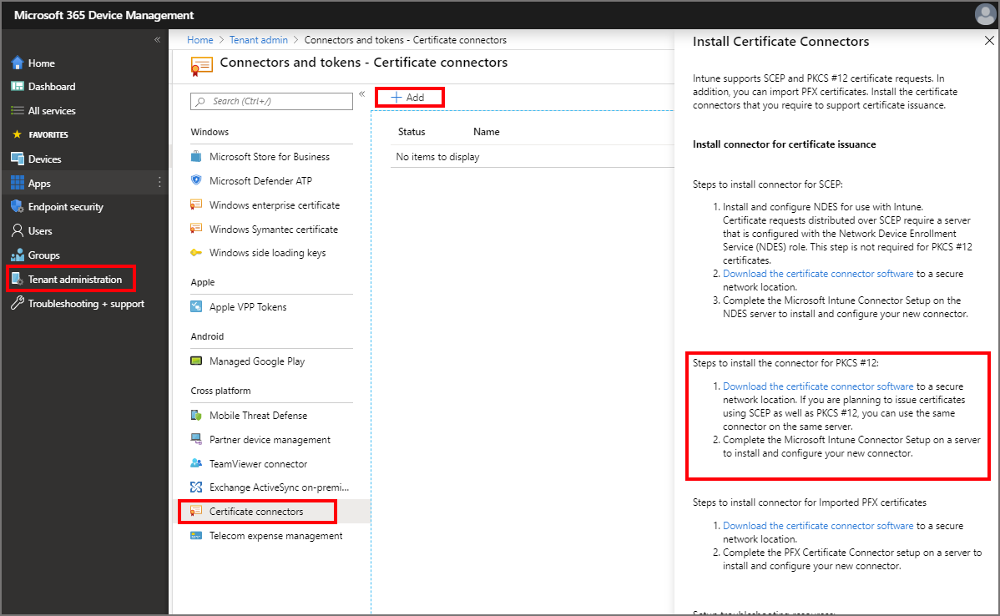
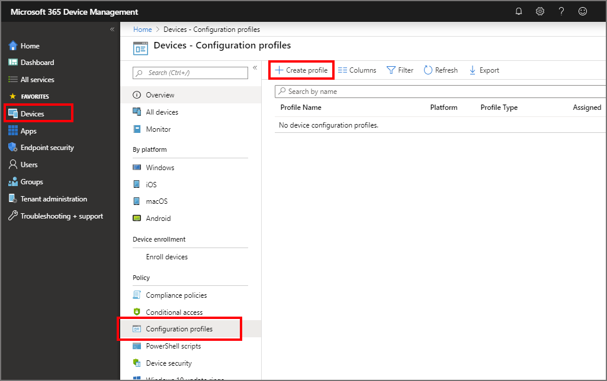
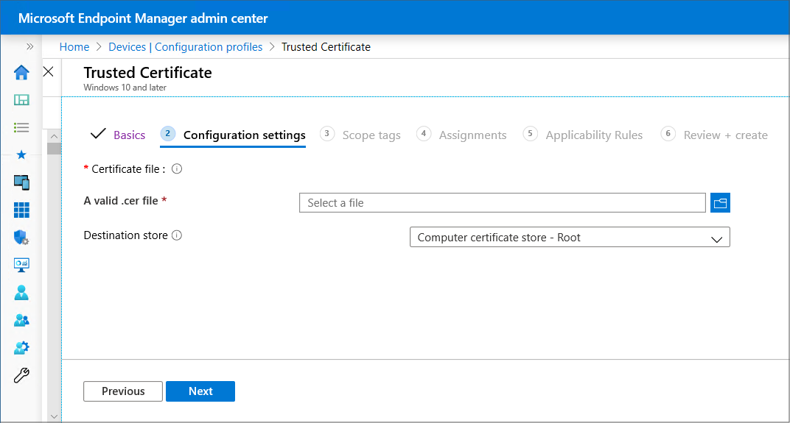

# Configure and use PKCS certificates with Intune

Intune supports the use of private and public key pair (PKCS) certificates. This article can help you configure the required infrastructure like on-premises certificate connectors, export a PKCS certificate, and then add the certificate to an Intune device configuration profile.

Microsoft Intune includes built-in settings to use PKCS certificates for access and authentication to your organizations resources. Certificates authenticate and secure access to your corporate resources like a VPN or a WiFi network. You deploy these settings to devices using device configuration profiles in Intune.

For information about using imported PKCS certificates, see [Imported PFX Certificates](certificates-imported-pfx-configure.md).

## Requirements

To use PKCS certificates with Intune, you'll need the following infrastructure:

- **Active Directory domain**:  
  All servers listed in this section must be joined to your Active Directory domain.

  For more information about installing and configuring Active Directory Domain Services (AD DS), see [AD DS Design and Planning](https://docs.microsoft.com/windows-server/identity/ad-ds/plan/ad-ds-design-and-planning).

- **Certification Authority**:  
   An Enterprise Certification Authority (CA).

  For information on installing and configuring Active Directory Certificate Services (AD CS), see [Active Directory Certificate Services Step-by-Step Guide](https://technet.microsoft.com/library/cc772393).

  > [!WARNING]  
  > Intune requires you to run AD CS with an Enterprise Certification Authority (CA), not a Standalone CA.

- **A client**:  
  To connect to the Enterprise CA.

- **Root certificate**:  
  An exported copy of your root certificate from your Enterprise CA.

- **Microsoft Intune Certificate Connector** (also called the *NDES Certificate Connector*):  
  In the Intune portal, go to **Device configuration** > **Certificate Connectors** > **Add**, and follow the *Steps to install the connector for PKCS #12*. Use the download link in the portal to start download of the certificate connector installer **NDESConnectorSetup.exe**.  

  Intune supports up to 100 instances of this connector per tenant. Each instance of the connecter must be on a separate Windows server. You can install an instance of this connector on the same server as an instance of the PFX Certificate Connector for Microsoft Intune. When you use multiple connectors, the connector infrastructure supports high availability and load balancing as any available connector instance can process your PKCS certificate requests. 

  This connector processes PKCS certificate requests used for authentication or S/MIME email signing.

  The Microsoft Intune Certificate Connector also supports Federal Information Processing Standard (FIPS) mode. FIPS isn't required, but you can issue and revoke certificates when it's enabled.

- **PFX Certificate Connector for Microsoft Intune**:  
  If you plan to use S/MIME email encryption, use the Intune portal to download the *PFX Certificate Connector* that supports import of PFX certificates.  Go to **Device configuration** > **Certificate Connectors** > **Add**, and follow the *Steps to install connector for Imported PFX certificates*. Use the download link in the portal to start download of the installer **PfxCertificateConnectorBootstrapper.exe**.

  Each Intune tenant supports a single instance of this connector. You can install this connector on the same server as an instance of the Microsoft Intune Certificate connector.

  This connector handles requests for PFX files imported to Intune for S/MIME email encryption for a specific user.  

  This connector can automatically update itself when new versions become available. To use the update capability, you must:
  - Install the PFX Certificate Connector for Microsoft Intune on your server.  
  - To automatically receive important updates, ensure firewalls are open that allow the connector to contact **autoupdate.msappproxy.net** on port **443**.   

  For more information, see [Network endpoints for Microsoft Intune](../fundamentals/intune-endpoints.md), and [Intune network configuration requirements and bandwidth](../fundamentals/network-bandwidth-use.md).

- **Windows Server**:  
  Use a Windows Server to host:

  - Microsoft Intune Certificate Connector - for authentication and S/MIME email signing scenarios
  - PFX Certificate Connector for Microsoft Intune - for S/MIME email encryption scenarios.

  The connectors require access to the same ports as detailed for managed devices, as found in our [device endpoint content](https://docs.microsoft.com/intune/fundamentals/intune-endpoints#access-for-managed-devices).

  Intune supports install of the *PFX Certificate Connector* on the same server as the *Microsoft Intune Certificate Connector*.
  
## Export the root certificate from the Enterprise CA

To authenticate a device with VPN, WiFi, or other resources, a device needs a root or intermediate CA certificate. The following steps explain how to get the required certificate from your Enterprise CA.

**Use a command line**:  
1. Log into the Root Certification Authority server with Administrator Account.
 
2. Go to **Start** > **Run**, and then enter **Cmd** to open command prompt. 
    
3. Specify **certutil -ca.cert ca_name.cer** to export the Root certificate as a file named *ca_name.cer*.

## Configure certificate templates on the CA

1. Sign in to your Enterprise CA with an account that has administrative privileges.
2. Open the **Certification Authority** console, right-click **Certificate Templates**, and select **Manage**.
3. Find the **User** certificate template, right-click it, and choose **Duplicate Template** to open **Properties of New Template**.

    > [!NOTE]
    > For S/MIME email signing and encryption scenarios, many administrators use separate certificates for signing and encryption. If you're using Microsoft Active Directory Certificate Services, you can use the **Exchange Signature Only** template for S/MIME email signing certificates, and the **Exchange User** template for S/MIME encryption certificates.  If you're using a 3rd-party certification authority, it's suggested to review their guidance to set up signing and encryption templates.

4. On the **Compatibility** tab:

    - Set **Certification Authority** to **Windows Server 2008 R2**
    - Set **Certificate recipient** to **Windows 7 / Server 2008 R2**

5. On the **General** tab, set **Template display name** to something meaningful to you.

    > [!WARNING]
    > **Template name** by default is the same as **Template display name** with *no spaces*. Note the template name, you need it later.

6. In **Request Handling**, select **Allow private key to be exported**.
7. In **Cryptography**, confirm that the **Minimum key size** is set to 2048.
8. In **Subject Name**, choose **Supply in the request**.
9. In **Extensions**, confirm that you see Encrypting File System, Secure Email, and Client Authentication under **Application Policies**.

    > [!IMPORTANT]
    > For iOS/iPadOS certificate templates, go to the **Extensions** tab, update **Key Usage**, and confirm that **Signature is proof of origin** isn't selected.

10. In **Security**, add the Computer Account for the server where you install the Microsoft Intune Certificate Connector. Allow this account **Read** and **Enroll** permissions.
11. Select **Apply** > **OK** to save the certificate template. Close the **Certificate Templates Console**.
12. In the **Certification Authority** console, right-click **Certificate Templates** > **New** > **Certificate Template to Issue**. Choose the template that you created in the previous steps. Select **OK**.
13. For the server to manage certificates for enrolled devices and users, use the following steps:

    1. Right-click the Certification Authority, choose **Properties**.
    2. On the security tab, add the Computer account of the server where you run the connectors (**Microsoft Intune Certificate Connector** or **PFX Certificate Connector for Microsoft Intune**). 
    3. Grant **Issue and Manage Certificates** and **Request Certificates** Allow permissions to the computer account.

14. Sign out of the Enterprise CA.

## Download, install, and configure the Microsoft Intune Certificate Connector

> [!IMPORTANT]  
> The Microsoft Intune Certificate Connector cannot be installed on the issuing Certificate Authority (CA), and instead must be installed on a separate Windows server.  

1. Sign in to the [Microsoft Endpoint Manager Admin Center](https://go.microsoft.com/fwlink/?linkid=2109431).

2. Select **Tenant administration** > **Connectors and tokens** > **Certificate connectors** > **+ Add**.

3. Click *Download the certificate connector software* for the connector for PKCS #12, and save the file to a location you can access from the server where you're going to install the connector.

   
 
4. After the download completes, sign in to the server. Then:

    1. Be sure .NET 4.5 Framework or higher is installed, as it's required by the NDES Certificate connector. .NET 4.5 Framework is automatically included with Windows Server 2012 R2 and newer versions.
    2. Run the installer (NDESConnectorSetup.exe), and accept the default location. It installs the connector to `\Program Files\Microsoft Intune\NDESConnectorUI`. In Installer Options, select **PFX Distribution**. Continue and complete the installation.
    3. By default, the connector service runs under the local system account. If a proxy is required to access the internet, confirm that the local service account can access the proxy settings on the server.

5. The Microsoft Intune Certificate Connector opens the **Enrollment** tab. To enable the connection to Intune, **Sign In**, and enter an account with global administrative permissions.
6. On the **Advanced** tab, it's recommended to leave **Use this computer's SYSTEM account (default)** selected.
7. **Apply** > **Close**
8. Go back to the Intune portal (**Intune** > **Device Configuration** > **Certification Connectors**). After a few moments, a green check mark is shown, and the **Connection status** is **Active**. Your connector server can now communicate with Intune.
9. If you have a web proxy in your networking environment, you might need additional configurations to enable the connector to work. For more information, see [Work with existing on-premises proxy servers](https://docs.microsoft.com/azure/active-directory/manage-apps/application-proxy-configure-connectors-with-proxy-servers) in the Azure Active Directory documentation.
    - Android Enterprise (*Work Profile*)
    - iOS
    - macOS
    - Windows 10 and later

> [!NOTE]
> The Microsoft Intune Certificate Connector supports TLS 1.2. If TLS 1.2 is installed on the server that hosts the Connector, the connector uses TLS 1.2. Otherwise, TLS 1.1 is used. Currently, TLS 1.1 is used for authentication between the devices and server.

## Create a trusted certificate profile

1. Sign in to the [Microsoft Endpoint Manager Admin Center](https://go.microsoft.com/fwlink/?linkid=2109431).

2. Select **Devices** > **Configuration profiles** > **Create profile**.

   

3. Enter the following properties:

    - **Name** for the profile
    - Optionally set a description
    - **Platform** to deploy the profile to
    - Set **Profile type** to **Trusted certificate**

4. Select **Settings**, and specify the .cer file Root CA Certificate you previously exported.

   > [!NOTE]
   > Depending on the platform you chose in **Step 2**, you may or may not have an option to choose the **Destination store** for the certificate.

   

5. Select **OK** > **Create** to save your profile.

6. To assign the new profile to one or more devices, see [assign Microsoft Intune device profiles](../configuration/device-profile-assign.md).

## Create a PKCS certificate profile

1. Sign in to the [Microsoft Endpoint Manager Admin Center](https://go.microsoft.com/fwlink/?linkid=2109431).

2. Select  and go to **Devices** > **Configuration profiles** > **Create profile**.

3. Enter the following properties:

    - **Name** for the profile
    - Optionally set a description
    - **Platform** to deploy the profile to
    - Set **Profile type** to **PKCS certificate**

4. Select **Settings**, and configure the properties that apply to the platform you selected:
   
   |Setting     | Platform     | Details   |
   |------------|------------|------------|
   |**Renewal threshold (%)**        |<ul><li>All         |Recommended is 20%  | 
   |**Certificate validity period**  |<ul><li>All         |If you didn't change the certificate template, this option may be set to one year. |
   |**Key storage provider (KSP)**   |<ul><li>Windows 10  |For Windows, select where to store the keys on the device. |
   |**Certification authority**      |<ul><li>All         |Displays the internal fully qualified domain name (FQDN) of your Enterprise CA.  |
   |**Certification authority name** |<ul><li>All         |Lists the name of your Enterprise CA, such as "Contoso Certification Authority". |
   |**Certificate template name**    |<ul><li>All         |Lists the name of your certificate template. |
   |**Certificate type**             |<ul><li>Android Enterprise (*Work Profile*)</li><li>iOS</li><li>macOS</li><li>Windows 10 and later|Select a type: <ul><li> **User** certificates can contain both user and device attributes in the subject and SAN of the certificate. </il><li>**Device** certificates can only contain device attributes in the subject and SAN of the certificate.​ Use Device for scenarios such as user-less devices, like kiosks or other shared devices.     This selection affects the Subject name format. |
   |**Subject name format**          |<ul><li>All         |For details on how to configure the subject name format, see [Subject name format](#subject-name-format) later in this article.     For most platforms, use the **Common name** option unless otherwise required.   For the following platforms, the Subject name format is determined by the certificate type: <ul><li>Android Enterprise (*Work Profile*)</li><li>iOS</li><li>macOS</li><li>Windows 10 and later</li></ul>  
  |
   |**Subject alternative name**     |<ul><li>All         |For *Attribute*, select **User principal name (UPN)** unless otherwise required, configure a corresponding *Value*, and then click **Add**.   For more information, see [Subject name format](#subject-name-format) later in this article.|
   |**Extended key usage**           |<ul><li> Android device administrator </li><li>Android Enterprise (*Device Owner*, *Work Profile*) </li><li>Windows 10 |Certificates usually require *Client Authentication* so that the user or device can authenticate to a server. |
   |**Allow all apps access to private key** |<ul><li>macOS  |Set to **Enable** to give apps that are configured for the associated mac device access to the PKCS certificates private key.    For more information on this setting, see *AllowAllAppsAccess* the Certificate Payload section of [Configuration Profile Reference](https://developer.apple.com/business/documentation/Configuration-Profile-Reference.pdf) in the Apple developer documentation. |
   |**Root Certificate**             |<ul><li>Android device administrator </li><li>Android Enterprise (*Device Owner*, *Work Profile*) |Select a root CA certificate profile that was previously assigned. |

5. Select **OK** > **Create** to save your profile.

6. To assign the new profile to one or more devices, see [assign Microsoft Intune device profiles](../configuration/device-profile-assign.md).

   > [!NOTE]
   > On devices with an Android Enterprise profile, certificates installed using a PKCS certificate profile are not visible on the device. To confirm successful certificate deployment, check the status of the profile in the Intune console.

### Subject name format

When you create a PKCS certificate profile for the following platforms, options for the subject name format depend on the Certificate type you select, either **User** or **Device**.  

Platforms:

- Android Enterprise (*Work Profile*)
- iOS
- macOS
- Windows 10 and later

> [!NOTE]
> There is a known issue for using PKCS to get certificates [which is the same issue as seen for SCEP](certificates-profile-scep.md#avoid-certificate-signing-requests-with-escaped-special-characters) when the subject name in the resulting Certificate Signing Request (CSR) includes one of the following characters as an escaped character (proceeded by a backslash \\):
> - \+
> - ;
> - ,
> - =

- **User certificate type**  
  Format options for the *Subject name format* include two variables: **Common Name (CN)** and **Email (E)**. **Common Name (CN)** can be set to any of the following variables:

  - **CN={{UserName}}**: The user principal name of the user, such as janedoe@contoso.com.
  - **CN={{AAD_Device_ID}}**: An ID assigned when you register a device in Azure Active Directory (AD). This ID is typically used to authenticate with Azure AD.
  - **CN={{SERIALNUMBER}}**: The unique serial number (SN) typically used by the manufacturer to identify a device.
  - **CN={{IMEINumber}}**: The International Mobile Equipment Identity (IMEI) unique number used to identify a mobile phone.
  - **CN={{OnPrem_Distinguished_Name}}**: A sequence of relative distinguished names separated by comma, such as *CN=Jane Doe,OU=UserAccounts,DC=corp,DC=contoso,DC=com*.

    To use the *{{OnPrem_Distinguished_Name}}* variable, be sure to sync the *onpremisesdistinguishedname* user attribute using [Azure AD Connect](https://docs.microsoft.com/azure/active-directory/connect/active-directory-aadconnect) to your Azure AD.

  - **CN={{onPremisesSamAccountName}}**: Admins can sync the samAccountName attribute from Active Directory to Azure AD using Azure AD connect into an attribute called *onPremisesSamAccountName*. Intune can substitute that variable as part of a certificate issuance request in the subject of a certificate. The samAccountName attribute is the user sign-in name used to support clients and servers from a previous version of Windows (pre-Windows 2000). The user sign-in name format is: *DomainName\testUser*, or only *testUser*.

    To use the *{{onPremisesSamAccountName}}* variable, be sure to sync the *onPremisesSamAccountName* user attribute using [Azure AD Connect](https://docs.microsoft.com/azure/active-directory/connect/active-directory-aadconnect) to your Azure AD.

  By using a combination of one or many of these variables and static strings, you can create a custom subject name format, such as:  
  - **CN={{UserName}},E={{EmailAddress}},OU=Mobile,O=Finance Group,L=Redmond,ST=Washington,C=US**
  
  That example includes a subject name format that uses the CN and E variables, and strings for Organizational Unit, Organization, Location, State, and Country values. [CertStrToName function](https://msdn.microsoft.com/library/windows/desktop/aa377160.aspx) describes this function, and its supported strings.

- **Device certificate type**  
  Format options for the Subject name format include the following variables: 
  - **{{AAD_Device_ID}}**
  - **{{Device_Serial}}**
  - **{{Device_IMEI}}**
  - **{{SerialNumber}}**
  - **{{IMEINumber}}**
  - **{{AzureADDeviceId​}}**
  - **{{WiFiMacAddress}}**
  - **{{IMEI}}**
  - **{{DeviceName}}**
  - **{{FullyQualifiedDomainName}}** *(Only applicable for Windows and domain-joined devices)*
  - **{{MEID}}**

  You can specify these variables, followed by the text for the variable, in the textbox. For example, the common name for a device named *Device1* can be added as **CN={{DeviceName}}Device1**.

  > [!IMPORTANT]  
  > - When you specify a variable, enclose the variable name in curly brackets { } as seen in the example, to avoid an error.  
  > - Device properties used in the *subject* or *SAN* of a device certificate, like **IMEI**, **SerialNumber**, and **FullyQualifiedDomainName**, are properties that could be spoofed by a person with access to the device.
  > - A device must support all variables specified in a certificate profile for that profile to install on that device.  For example, if **{{IMEI}}** is used in the subject name of a SCEP profile and is assigned to a device that doesn't have an IMEI number, the profile fails to install.  
 
## What's new for Connectors

Updates for the two certificate connectors are released periodically. When we update a connector, you can read about the changes here.

The *PFX Certificate Connector for Microsoft Intune* [supports automatic updates](#requirements), while the *Intune Certificate Connector* is updated manually.

### May 17, 2019

- **PFX Certificate Connector for Microsoft Intune - version 6.1905.0.404**  
  Changes in this release:  
  - Fixed an issue where existing PFX certificates continue to be reprocessed which causes the connector to stop processing new requests. 

### May 6, 2019

- **PFX Certificate Connector for Microsoft Intune - version 6.1905.0.402**  
  Changes in this release:  
  - The polling interval for the connector is reduced from 5 minutes to 30 seconds.

### April 2, 2019

- **Intune Certificate Connector - version 6.1904.1.0**  
  Changes in this release:  
  - Fixed an issue where the connector might fail to enroll to Intune after signing in to the connector with a global administrator account.  
  - Includes reliability fixes to certificate revocation.  
  - Includes performance fixes to increase how quickly PKCS certificate requests are processed.  

- **PFX Certificate Connector for Microsoft Intune - version 6.1904.0.401**
  > [!NOTE]  
  > Automatic update for this version of the PFX connector is not available until April 11th, 2019.  

  Changes in this release:  
  - Fixed an issue where the connector might fail to enroll to Intune after signing in to the connector with a global administrator account.  

## Next steps

The profile is created, but it's not doing anything yet. Next, [assign the profile](../configuration/device-profile-assign.md) and [monitor its status](../configuration/device-profile-monitor.md).

[Use SCEP for certificates](certificates-scep-configure.md), or [issue PKCS certificates from a Symantec PKI manager web service](certificates-digicert-configure.md).
