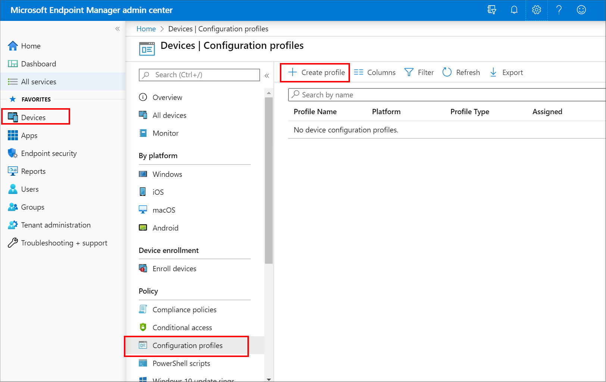
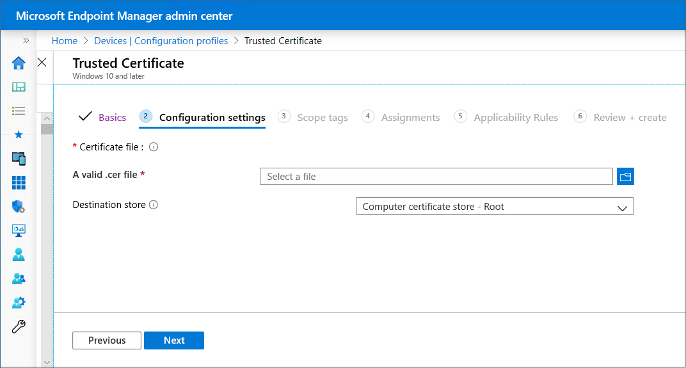

---
# required metadata

title: Create certificates profile in Microsoft Intune - Azure | Microsoft Docs
description: Learn about using Simple Certificate Enrollment Protocol (SCEP) or Public Key Cryptography Standards (PKCS) certificates and certificate profiles with Microsoft Intune.
keywords:
author: brenduns
ms.author: brenduns
manager: dougeby
ms.date: 03/20/2019
ms.topic: conceptual
ms.service: microsoft-intune
ms.subservice: protect
ms.localizationpriority: high
ms.technology:
ms.assetid: 5eccfa11-52ab-49eb-afef-a185b4dccde1

# optional metadata

#ROBOTS:
#audience:

ms.reviewer: lacranda
ms.suite: ems
search.appverid: MET150
#ms.tgt_pltfrm:
ms.custom: intune-azure
ms.collection: M365-identity-device-management
---

# Use certificates for authentication in Microsoft Intune

Use certificates with Intune to authenticate your users to applications and corporate resources through VPN, Wi-Fi, or email profiles. When you use certificates to authenticate these connections, your end users won't need to enter usernames and passwords, which can make their access seamless. Certificates are also used for signing and encryption of email using S/MIME.

## Intune supported certificates and usage

| Type              | Authentication | S/MIME Signing | S/MIME encryption  |
|--|--|--|--|
| Public Key Cryptography Standards (PKCS) imported certificate |  |  | |
| PKCS#12 (or PFX)    |  |  |  |
| Simple Certificate Enrollment Protocol (SCEP)  |  |  | |

To deploy these certificates, you'll create and assign certificate profiles to devices.

Each individual certificate profile you create supports a single platform. For example, if you use PKCS certificates, you'll create PKCS certificate profile for Android and a separate PKCS certificate profile for iOS/iPadOS. If you also use SCEP certificates for those two platforms, you'll create a SCEP certificate profile for Android, and another for iOS/iPadOS.

### General considerations when you use a Microsoft Certification Authority

When you use a Microsoft Certification Authority (CA):

- To use SCEP certificate profiles, you must [set up a Network Device Enrollment Service (NDES) server](certificates-scep-configure.md#set-up-ndes) for use with Intune.
- To use the following certificate profile types, you must [install the Microsoft Intune Certificate Connector](certificates-scep-configure.md#install-the-intune-certificate-connector):
  - SCEP certification profile
  - PKCS certificate profile

- To use PKCS imported certificates:
  - [Install the PFX Certificate Connector for Microsoft Intune](certificates-imported-pfx-configure.md#download-install-and-configure-the-pfx-certificate-connector-for-microsoft-intune).
  - Export certificates from the certification authority and then import them to Microsoft Intune. See [the PFXImport PowerShell project](https://github.com/Microsoft/Intune-Resource-Access/tree/develop/src/PFXImportPowershell).

- Deploy certificates by using the following mechanisms:
  - [Trusted certificate profiles](certificates-configure.md#create-trusted-certificate-profiles) to deploy the Trusted Root CA certificate from your root or intermediate (issuing) CA to devices
  - SCEP certificate profiles
  - PKCS certificate profiles
  - PKCS imported certificate profiles

### General considerations when you use a third-party Certification Authority

When you use a third-party (non-Microsoft) Certification Authority (CA):

- To use SCEP certificate profiles:
  - Set up integration with a third-party CA from [one of our supported partners](certificate-authority-add-scep-overview.md#third-party-certification-authority-partners). Set up includes following the instructions from the third-party CA to complete integration of their CA with Intune.
  - [Create an application in Azure AD](certificate-authority-add-scep-overview.md#set-up-third-party-ca-integration) that delegates rights to Intune to do SCEP certificate challenge validation.

- PKCS imported certificates require you to [install the PFX Certificate Connector for Microsoft Intune](certificates-imported-pfx-configure.md#download-install-and-configure-the-pfx-certificate-connector-for-microsoft-intune).

- Deploy certificates by using the following mechanisms:
  - [Trusted certificate profiles](certificates-configure.md#create-trusted-certificate-profiles) to deploy the Trusted Root CA certificate from your root or intermediate (issuing) CA to devices
  - SCEP certificate profiles
  - PKCS certificate profiles *(only supported with the [Digicert PKI Platform](certificates-digicert-configure.md))*
  - PKCS imported certificate profiles

## Supported platforms and certificate profiles

| Platform              | Trusted certificate profile | PKCS certificate profile | SCEP certificate profile | PKCS imported certificate profile  |
|--|--|--|--|---|
| Android device administrator |  |  | |   |
| Android Enterprise   - Fully Managed (Device Owner)   |  |   |  |   |
| Android Enterprise   - Dedicated (Device Owner)   |   |   |   |   |
| Android Enterprise   - Work Profile    |  |  |  |  |
| iOS/iPadOS                   |  |  |  |  |
| macOS                 |  |   |||
| Windows Phone 8.1     |  |  | |  |
| Windows 8.1 and later |  |  | |   |
| Windows 10 and later  |  |  |  |  |

## Export the trusted root CA certificate

To use PKCS,  SCEP, and PKCS imported certificates, devices must trust your root Certification Authority. To establish trust, export the Trusted Root CA certificate, and any intermediate or issuing Certification Authority certificates, as a public certificate (.cer). You can get these certificates from the issuing CA, or from any device that trusts your issuing CA.

To export the certificate, refer to the documentation for your Certification Authority. You'll need to export the public certificate as a .cer file.  Don't export the private key, a .pfx file.

You'll use this .cer file when you [create trusted certificate profiles](#create-trusted-certificate-profiles) to deploy that certificate to your devices.

## Create trusted certificate profiles

Create a trusted certificate profile before you can create a SCEP, PKCS, or PKCS imported certificate profile. Deploying a trusted certificate profile ensures each device recognizes the legitimacy of your CA. SCEP certificate profiles directly reference a trusted certificate profile. PKCS certificate profiles don't directly reference the trusted certificate profile but do directly reference the server that hosts your CA. PKCS imported certificate profiles don't directly reference the trusted certificate profile but can use it on the device. Deploying a trusted certificate profile to devices ensures this trust is established. When a device doesn't trust the root CA, the SCEP or PKCS certificate profile policy will fail.

Create a separate trusted certificate profile for each device platform you want to support, just as you'll do for SCEP, PKCS, and PKCS imported certificate profiles.

### To create a trusted certificate profile

1. Sign in to the [Microsoft Endpoint Manager Admin Center](https://go.microsoft.com/fwlink/?linkid=2109431).

2. Select  and go to **Devices** > **Configuration profiles** > **Create profile**.

   

3. Enter the following properties:
   - **Platform**: Choose the platform of the devices that will receive this profile.
   - **Profile**: Select **Trusted certificate**
  
4. Select **Create**.

5. In **Basics**, enter the following properties:
   - **Name**: Enter a descriptive name for the profile. Name your profiles so you can easily identify them later. For example, a good profile name is *Trusted certificate profile for entire company*.
   - **Description**: Enter a description for the profile. This setting is optional, but recommended.

6. Select **Next**.

7. In **Configuration settings**, specify the .cer file for the trusted Root CA Certificate you previously exported. 

   For Windows 8.1 and Windows 10 devices only, select the **Destination Store** for the trusted certificate from:

   - **Computer certificate store - Root**
   - **Computer certificate store - Intermediate**
   - **User certificate store - Intermediate**

   

8. Select **Next**.

9. In **Scope tags** (optional), assign a tag to filter the profile to specific IT groups, such as `US-NC IT Team` or `JohnGlenn_ITDepartment`. For more information about scope tags, see [Use RBAC and scope tags for distributed IT](../fundamentals/scope-tags.md).

   Select **Next**.

10. In **Assignments**, select the user or groups that will receive your profile. For more information on assigning profiles, see [Assign user and device profiles](../configuration/device-profile-assign.md).

    Select **Next**.

11. (*Applies to Windows 10 only*) In **Applicability Rules**, specify applicability rules to refine the assignment of this profile. You can choose to assign or not assign the profile based on the OS edition or version of a device.

  For more information, see [Applicability rules](../configuration/device-profile-create.md#applicability-rules) in *Create a device profile in Microsoft Intune*.

12. In **Review + create**, review your settings. When you select Create, your changes are saved, and the profile is assigned. The policy is also shown in the profiles list.

## Additional resources

- [Assign device profiles](../configuration/device-profile-assign.md)  
- [Use S/MIME to sign and encrypt emails](certificates-s-mime-encryption-sign.md)  
- [Use third-party certification authority](certificate-authority-add-scep-overview.md)  

## Next steps

Create SCEP, PKCS, or PKCS imported certificate profiles for each platform you want to use. To continue, see the following articles:

- [Configure infrastructure to support SCEP certificates with Intune](certificates-scep-configure.md)  
- [Configure and manage PKCS certificates with Intune](certficates-pfx-configure.md)  
- [Create a PKCS imported certificate profile](certificates-imported-pfx-configure.md#create-a-pkcs-imported-certificate-profile)
