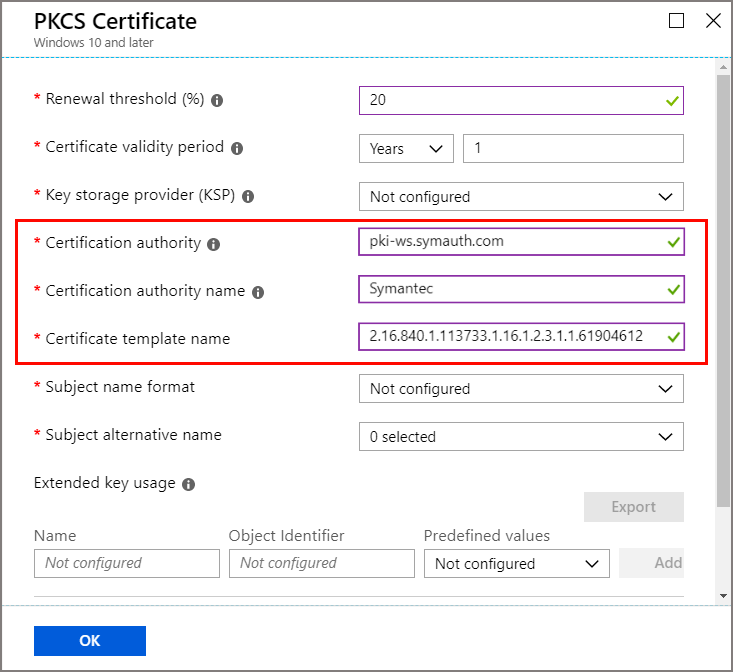

# Set up the Certificate Connector for Microsoft Intune to support the DigiCert PKI Platform

You can use the *Certificate Connector for Microsoft Intune* to issue PKCS certificates from DigiCert PKI Platform to Intune-managed devices. The certificate connector works with either a DigiCert certification authority (CA) only, or with both a DigiCert CA and a Microsoft CA.

> [!TIP]
> DigiCert acquired Symantec's Website Security and related PKI Solutions business. For more information about this change, see the [Symantec technical support article](https://support.symantec.com/en_US/article.INFO4722.html).

If you already use the Certificate Connector for Microsoft Intune to issue certificates from a Microsoft CA by using PKCS or Simple Certificate Enrollment Protocol (SCEP), you can use that same connector to configure and issue PKCS certificates from a DigiCert CA. After you complete the configuration to support the DigiCert CA, the connector can issue the following certificates:

* PKCS certificates from a Microsoft CA
* PKCS certificates from a DigiCert CA
* Endpoint Protection certificates from a Microsoft CA

If you don't have the connector installed but plan to use it for both a Microsoft CA and a DigiCert CA, complete the connector configuration for the Microsoft CA first. Then, return to this article to configure it to also support DigiCert. For more information about certificate profiles and the connector, see [Configure a certificate profile for your devices in Microsoft Intune](certificates-configure.md).  

If you'll use the connector with only the DigiCert CA, you can use the instructions in this article to install and then configure the connector.

## Prerequisites

You'll need the following to support use of a DigiCert CA:

- **An active subscription at the DigiCert CA** - The subscription is required to get a registration authority (RA) certificate from the DigiCert CA.
- **Certificate Connector for Microsoft Intune** - You'll be instructed to install and configure the certificate connector later in this article. To help you plan for the connectors prerequesites in advance, see the following articles:  

  - Overview of the [Certificate Connector for Microsoft Intune](certificate-connector-overview.md).
  - [Prerequisites](certificate-connector-prerequisites.md).
  - [Installation and configuration](certificate-connector-install.md).

## Install the DigiCert RA certificate

1. Save the following code snippet as in a file named **certreq.ini** and update it as required (for example: *Subject name in CN format*).

   ```
   [Version] 
   Signature="$Windows NT$" 

   [NewRequest] 
   ;Change to your,country code, company name and common name 
   Subject = "Subject Name in CN format"

   KeySpec = 1 
   KeyLength = 2048 
   Exportable = TRUE 
   MachineKeySet = TRUE 
   SMIME = False 
   PrivateKeyArchive = FALSE 
   UserProtected = FALSE 
   UseExistingKeySet = FALSE 
   ProviderName = "Microsoft RSA SChannel Cryptographic Provider" 
   ProviderType = 12 
   RequestType = PKCS10 
   KeyUsage = 0xa0 

   [EnhancedKeyUsageExtension] 
   OID=1.3.6.1.5.5.7.3.2 ; Client Authentication  // Uncomment if you need a mutual TLS authentication

   ;----------------------------------------------- 
   ```

2. Open an elevated command prompt and generate a certificate signing request (CSR) by using the following command:

   `Certreq.exe -new certreq.ini request.csr`

3. Open the request.csr file in Notepad and copy the CSR content that's in the following format:

   ```
   -----BEGIN NEW CERTIFICATE REQUEST-----
   MIID8TCCAtkCAQAwbTEMMAoGA1UEBhMDVVNBMQswCQYDVQQIDAJXQTEQMA4GA1UE
   …
   …
   fzpeAWo=
   -----END NEW CERTIFICATE REQUEST-----
   ```

4. Sign in to the DigiCert CA and browse to **Get an RA Cert** from the tasks.

   a. In the text box, provide the CSR content from step 3.

   b. Provide a friendly name for the certificate.

   c. Select **Continue**.

   d. Use the provided link to download the RA certificate to your local computer.

5. Import the RA certificate into the Windows Certificate store:

   a. Open an MMC console.

   b. Select **File** > **Add or Remove Snap-ins** > **Certificate** > **Add**.

   c. Select **Computer Account** > **Next**.

   d. Select **Local Computer** > **Finish**.

   e. Select **OK** in the **Add or Remove Snap-ins** window. Expand **Certificates (Local Computer)** > **Personal** > **Certificates**.

   f. Right-click the **Certificates** node and select **All Tasks** > **Import**.

   g. Select the location of the RA certificate that you downloaded from the DigiCert CA, and then select **Next**.

   h. Select **Personal Certificate Store** > **Next**.

   i. Select **Finish** to import the RA certificate and its private key into the **Local Machine-Personal** store.

6. Export and import the private key certificate:

   a. Expand **Certificates (Local Machine)** > **Personal** > **Certificates**.

   b. Select the certificate that was imported in the previous step.

   c. Right-click the certificate and select **All Tasks** > **Export**.

   d. Select **Next**, and then enter the password.

   e. Select the location to export to, and then select **Finish**.

   f. Use the procedure from step 5 to import the private key certificate into the **Local Computer-Personal** store.

   g. Record a copy the RA certificate thumbprint without any spaces. The following is an example of the thumbprint:

      `RA Cert Thumbprint: "EA7A4E0CD1A4F81CF0740527C31A57F6020C17C5"`
  
      Later, after you install the Certificate Connector for Microsoft Intune, you'll use this value to update three .config files for the connector.

    > [!NOTE]
    > For assistance in getting the RA certificate from the DigiCert CA, contact [DigiCert customer support](mailto:enterprise-pkisupport@digicert.com).

## Configure the certificate connector to support DigiCert

1. Use the information at [Install the Certificate Connector for Microsoft Intune](../protect/certificate-connector-install.md) to first download and then install and configure the Certificate Connector for Microsoft Intune:

   - During installation step **2** of the connector install procedure, select the options for **PKCS** and optionally for **Certificate revocation**.
   - After you complete the connector installation and configuration procedure, return to this procedure to continue.

2. Configure the connector to support DigiCert by modifying three *.config* files for the connector, and then restarting their related services:

   1. On the server where the connector installed, go to *%ProgramFiles%\Microsoft Intune\PFXCertificateConnector\ConnectorSvc*. (By default, the Certificate Connector for Microsoft Intune installs to %ProgramFiles%\Microsoft Intune\PFXCertificateConnector.)

   2. Use a simple text editor like Notepad.exe to update the *RACertThumbprint* key value in the following three files. Replace the value in the files with the value you copied during step **6.g.** of the procedure in the [preceding section](#install-the-digicert-ra-certificate):

      - Microsoft.Intune.ConnectorsPkiCreate.exe.config
      - Microsoft.Intune.ConnectorsPkiRevoke.exe.config
      - Microsoft.Intune.ConnectorsPkiCreateLegacy.exe.config

     For example, locate the entry in each file that is similar to `<add key="RACertThumbprint" value="EA7A4E0CD1A4F81CF0740527C31A57F6020C17C5"/>`, and replace `EA7A4E0CD1A4F81CF0740527C31A57F6020C17C5` with the new *RA Cert Thumbprint* value.

   3. Run **services.msc**  and stop and then restart the following three services:

      - PFX Revoke Certificate Connector for Microsoft Intune (PkiRevokeConnectorSvc)
      - PFX Create Certificate Connector for Microsoft Intune (PkiCreateConnectorSvc)
      - PFX Create Legacy Connector for Microsoft Intune (PfxCreateLegacyConnectorSvc)

## Create a trusted certificate profile

The PKCS certificates you'll deploy for Intune managed devices must be chained with a trusted root certificate. To establish this chain, create an Intune trusted certificate profile with the root certificate from the DigiCert CA, and deploy both the trusted certificate profile and the PKCS certificate profile to the same groups.

1. Get a trusted root certificate from the DigiCert CA:

   a. Sign in to the DigiCert CA admin portal.

   b. Select **Manage CAs** from **Tasks**.

   c. Select the appropriate CA from the list.

   d. Select **Download root certificate** to download the trusted root certificate.

2. Create a trusted certificate profile in the Microsoft Intune admin center. For detailed guidance, see [To create a trusted certificate profile](../protect/certificates-trusted-root.md#to-create-a-trusted-certificate-profile). Be sure to assign this profile to devices that will receive certificates. To assign the profile to groups, see [Assign device profiles](../configuration/device-profile-assign.md).

   After you create the profile, it appears in the list of profiles in the **Device configuration – Profiles** pane, with a profile type of **Trusted certificate**.  

## Get the certificate profile OID  

The certificate profile OID is associated with a certificate profile template in the DigiCert CA. To create a PKCS certificate profile in Intune, the certificate template name must be in the form of a certificate profile OID that is associated with a certificate template in the DigiCert CA.

1. Sign in to the DigiCert CA admin portal.
2. Select **Manage Certificate Profiles**.
3. Select the certificate profile that you want to use.
4. Copy the certificate profile OID. It looks similar to the following example:

   `Certificate Profile OID = 2.16.840.1.113733.1.16.1.2.3.1.1.47196109`

> [!NOTE]
> If you need help to get the certificate profile OID, contact [DigiCert customer support](mailto:enterprise-pkisupport@digicert.com).

## Create a PKCS certificate profile

1. Sign in to the [Microsoft Intune admin center](https://go.microsoft.com/fwlink/?linkid=2109431).

2. Select **Devices** > **Configuration profiles** > **Create profile**.

3. Enter the following properties:

   - **Platform**: Choose the platform of your devices.
   - **Profile**: Select **PKCS certificate**. Or, select **Templates** > **PKCS certificate**.

4. Select **Create**.

5. In **Basics**, enter the following properties:

   - **Name**: Enter a descriptive name for the profile. Name your profiles so you can easily identify them later.
   - **Description**: Enter a description for the profile. This setting is optional, but recommended.

6. In **Configuration settings**, configure parameters with the values from the following table. These values are required to issue PKCS certificates from a DigiCert CA, through the Certificate Connector for Microsoft Intune.

   |PKCS certificate parameter | Value | Description |
   | --- | --- | --- |
   | Certificate authority | pki-ws.symauth.com | This value must be the DigiCert CA base service FQDN without trailing slashes. If you aren't sure whether this is the correct base service FQDN for your DigiCert CA subscription, contact DigiCert customer support. <br><br>*With the change from Symantec to DigiCert, this URL remains unchanged*. <br><br> If this FQDN is incorrect, the certificate connector won't issue PKCS certificates from the DigiCert CA.| 
   | Certificate authority name | Symantec | This value must be the string **Symantec**. <br><br> If there's any change to this value, the certificate connector won't issue PKCS certificates from the DigiCert CA.|
   | Certificate template name | Certificate profile OID from the DigiCert CA. For example: **2.16.840.1.113733.1.16.1.2.3.1.1.61904612**| This value must be a certificate profile OID [obtained in the previous section](#get-the-certificate-profile-oid) from the DigiCert CA certificate profile template. <br><br> If the certificate connector can't find a certificate template associated with this certificate profile OID in the DigiCert CA, it won't issue PKCS certificates from the DigiCert CA.|

   

   > [!NOTE]
   > The PKCS certificate profile for Windows platforms doesn't need to associate with a trusted certificate profile. But it is required for non-Windows platform profiles such as Android.

7. Complete the configuration of the profile to meet your business needs, and then select **Create** to save the profile.

8. On the *Overview* page of the new profile, select **Assignments** and configure an appropriate group that will receive this profile. At least one user or device must be part of the assigned group.

After you complete the previous steps, Certificate Connector for Microsoft Intune will issue PKCS certificates from the DigiCert CA to Intune-managed devices in the assigned group. These certificates will be available in the **Personal** store of the **Current User** certificate store on the Intune-managed device.

### Supported attributes for the PKCS certificate profile

|Attribute | Intune supported formats | DigiCert Cloud CA supported formats | result |
| --- | --- | --- | --- |
| Subject name |Intune supports the subject name in following three formats only: <br><br> 1. Common name <br> 2. Common name that includes email <br> 3. Common name as email <br><br> For example: <br><br> `CN = IWUser0 <br><br> E = IWUser0@samplendes.onmicrosoft.com` | The DigiCert CA supports more attributes.  If you want to select more attributes, they must be defined with fixed values in the DigiCert certificate profile template.| We use common name or email from the PKCS certificate request. <br><br> Any mismatch in attribute selection between the Intune certificate profile and the DigiCert certificate profile template results in no certificates issued from the DigiCert CA.|
| SAN | Intune supports only the following SAN field values: <br><br> **AltNameTypeEmail** <br> **AltNameTypeUpn** <br> **AltNameTypeOtherName** (encoded value) | The DigiCert Cloud CA also supports these parameters. If you want to select more attributes, they must be defined with fixed values in the DigiCert certificate profile template. <br><br> **AltNameTypeEmail**: If this type isn't found in the SAN, the certificate connector uses the value from **AltNameTypeUpn**.  If **AltNameTypeUpn** is also not found in the SAN, then the certificate connector uses the value from the subject name if it's in email format.  If the type is still not found, the certificate connector fails to issue the certificates. <br><br> Example: `RFC822 Name=IWUser0@ndesvenkatb.onmicrosoft.com`  <br><br> **AltNameTypeUpn**: If this type is not found in the SAN, the certificate connector uses the value from **AltNameTypeEmail**. If **AltNameTypeEmail** is also not found in the SAN, then the certificate connector uses the value from subject name if it's in email format. If the type is still not found, the certificate connector fails to issue the certificates.  <br><br> Example: `Other Name: Principal Name=IWUser0@ndesvenkatb.onmicrosoft.com` <br><br> **AltNameTypeOtherName**: If this type isn't found in the SAN, the certificate connector fails to issue the certificates. <br><br> Example: `Other Name: DS Object Guid=04 12 b8 ba 65 41 f2 d4 07 41 a9 f7 47 08 f3 e4 28 5c ef 2c` <br><br>  The value of this field is supported only in encoded format (hexadecimal value) by the DigiCert CA. For any value in this field, the certificate connector converts it to base64 encoding before it submits the certificate request. *Certificate Connector for Microsoft Intune doesn't validate whether this value is already encoded or not.* | None |

## Troubleshooting

Logs for the Certificate Connector for Microsoft Intune are available as Event logs on the server where the connector is installed. These logs provide details about the connectors operation, and can be used to identify problems with the certificate connector and operations.  For more information, see [Logging](../protect/certificate-connector-overview.md#logging).

## Next steps

Use the information in this article with the information in [What are Microsoft Intune device profiles?](../configuration/device-profiles.md) to manage your organization's devices and the certificates on them.
