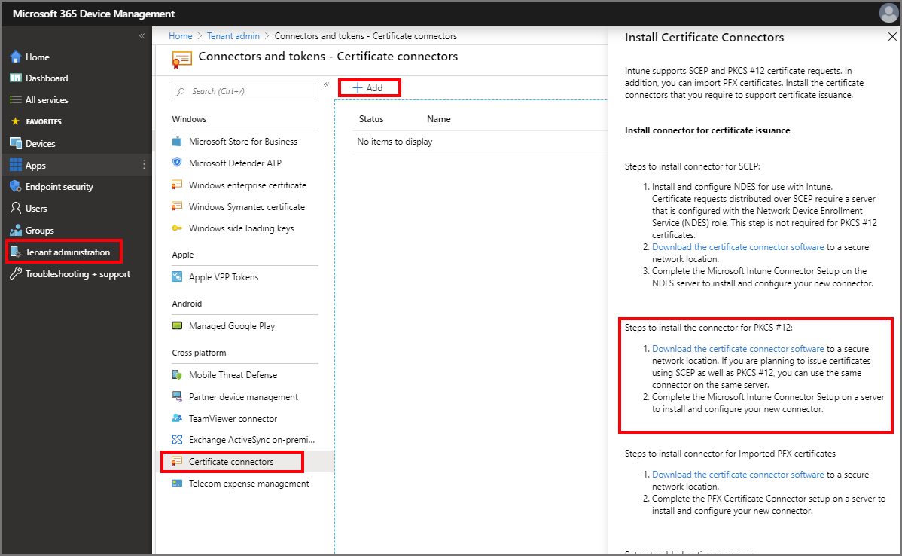
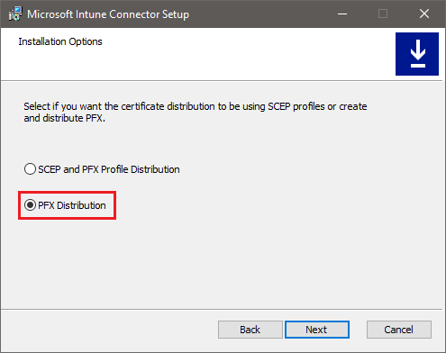
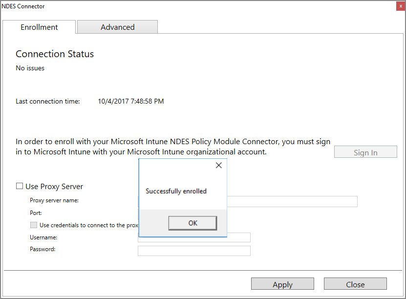

# Set up Intune Certificate Connector for DigiCert PKI Platform

Use Intune Certificate Connector to issue PKCS certificates from DigiCert PKI Platform to Intune-managed devices. You can use the connector with only a DigiCert certification authority (CA), or with both a DigiCert CA and a Microsoft CA.

> [!TIP]
> DigiCert acquired Symantec’s Website Security and related PKI Solutions business. For more information about this change, see the [Symantec technical support article](https://support.symantec.com/en_US/article.INFO4722.html).

If you already use the Intune Certificate Connector to issue certificates from a Microsoft CA by using PKCS or System Center Endpoint Protection, you can use that same connector to configure and issue PKCS certificates from a DigiCert CA. After you complete the configuration to support the DigiCert CA, Intune Certificate Connector can issue the following certificates:

* PKCS certificates from a Microsoft CA
* PKCS certificates from a DigiCert CA
* Endpoint Protection certificates from a Microsoft CA

If you don't have the connector installed but plan to use it for both a Microsoft CA and a DigiCert CA, complete the connector configuration for the Microsoft CA first. Then, return to this article to configure it to also support DigiCert. For more information about certificate profiles and the connector, see [Configure a certificate profile for your devices in Microsoft Intune](certificates-configure.md).  

If you'll use the connector with only the DigiCert CA, you can use the instructions in this article to install and then configure the connector.

## Prerequisites

- **An active subscription at the DigiCert CA**: The subscription is required to get a registration authority (RA) certificate from the DigiCert CA.
- The Microsoft Intune Certificate Connector has the same network requirements as [managed devices](../fundamentals/intune-endpoints.md#access-for-managed-devices).

## Install the DigiCert RA certificate

1. Save the following code snippet as in a file named **certreq.ini** and update it as required (for example: *Subject name in CN format*).

        [Version] 
        Signature="$Windows NT$" 
        
        [NewRequest] 
        ;Change to your,country code, company name and common name 
        Subject = "Subject Name in CN format"
        
        KeySpec = 1 
        KeyLength = 2048 
        Exportable = TRUE 
        MachineKeySet = TRUE 
        SMIME = False 
        PrivateKeyArchive = FALSE 
        UserProtected = FALSE 
        UseExistingKeySet = FALSE 
        ProviderName = "Microsoft RSA SChannel Cryptographic Provider" 
        ProviderType = 12 
        RequestType = PKCS10 
        KeyUsage = 0xa0 
        
        [EnhancedKeyUsageExtension] 
        OID=1.3.6.1.5.5.7.3.2 ; Client Authentication  // Uncomment if you need a mutual TLS authentication
        
        ;----------------------------------------------- 

2. Open an elevated command prompt and generate a certificate signing request (CSR) by using the following command:

   `Certreq.exe -new certreq.ini request.csr`

3. Open the request.csr file in Notepad and copy the CSR content that's in the following format:

        -----BEGIN NEW CERTIFICATE REQUEST-----
        MIID8TCCAtkCAQAwbTEMMAoGA1UEBhMDVVNBMQswCQYDVQQIDAJXQTEQMA4GA1UE
        …
        …
        fzpeAWo=
        -----END NEW CERTIFICATE REQUEST-----

4. Sign in to the DigiCert CA and browse to **Get an RA Cert** from the tasks.

   a. In the text box, provide the CSR content from step 3.

   b. Provide a friendly name for the certificate.

   c. Select **Continue**.

   d. Use the provided link to download the RA certificate to your local computer.

5. Import the RA certificate into the Windows Certificate store:

   a. Open an MMC console.

   b. Select **File** > **Add or Remove Snap-ins** > **Certificate** > **Add**.

   c. Select **Computer Account** > **Next**.

   d. Select **Local Computer** > **Finish**.

   e. Select **OK** in the **Add or Remove Snap-ins** window. Expand **Certificates (Local Computer)** > **Personal** > **Certificates**.

   f. Right-click the **Certificates** node and select **All Tasks** > **Import**.

   g. Select the location of the RA certificate that you downloaded from the DigiCert CA, and then select **Next**.

   h. Select **Personal Certificate Store** > **Next**.

   i. Select **Finish** to import the RA certificate and its private key into the **Local Machine-Personal** store.

6. Export and import the private key certificate:

   a. Expand **Certificates (Local Machine)** > **Personal** > **Certificates**.

   b. Select the certificate that was imported in the previous step.

   c. Right-click the certificate and select **All Tasks** > **Export**.

   d. Select **Next**, and then enter the password.

   e. Select the location to export to, and then select **Finish**.

   f. Use the procedure from step 5 to import the private key certificate into the **Local Computer-Personal** store.

   g. Record a copy the RA certificate thumbprint without any spaces. The following is an example of the thumbprint:

        RA Cert Thumbprint: “EA7A4E0CD1A4F81CF0740527C31A57F6020C17C5”

    > [!NOTE]
    > For assistance in getting the RA certificate from the DigiCert CA, contact [DigiCert customer support](mailto:enterprise-pkisupport@digicert.com).

## Prepare to install Intune Certificate Connector

> [!TIP]
> This section applies if you'll use Intune Certificate Connector with only a DigiCert CA. If you use Intune Certificate Connector with a Microsoft CA and want to add DigiCert CA support, skip ahead to [Configure the connector to support DigiCert](#configure-the-connector-to-support-digicert).

1. Choose one of the Windows operating system versions from the following list and install it on a computer:
   * Windows Server 2012 R2 Datacenter
   * Windows Server 2012 R2 Standard
   * Windows Server 2016 Datacenter
   * Windows Server 2016 Standard

2. Create a user with administrative privileges and use it to complete the following steps.

3. Check for the latest Windows updates and install them if available. After you install Windows updates, restart the computer.

4. Install .NET Framework 3.5:

   a. Open **Control Panel** > **Programs and Features** > **Turn Windows features on or off**.

   b. Select **.NET Framework 3.5** and install it.

## Install Intune Certificate Connector for use with DigiCert

> [!TIP]
> If you use the Intune Certificate Connector with a Microsoft CA and want to add DigiCert CA support, skip ahead to [Configure the connector to support DigiCert](#configure-the-connector-to-support-digicert).

Download the latest Intune Certificate Connector version from the Intune administration portal and follow these instructions.

1. Sign in to the [Microsoft Endpoint Manager admin center](https://go.microsoft.com/fwlink/?linkid=2109431).

2. Select **Tenant administration** > **Connectors and tokens** > **Certificate connectors** > **+ Add**.

3. Click *Download the certificate connector software* for the connector for PKCS #12, and save the file to a location you can access from the server where you're going to install the connector.

   

4. On the server where you want to install the connector, run **NDESConnectorSetup.exe** with elevated privileges.

5. On the **Installation Options** page, select **PFX Distribution**.

   

   > [!IMPORTANT]
   > If you'll use the Intune Certificate Connector to issue certificates from a Microsoft CA and a DigiCert CA, select **SCEP and PFX Profile Distribution**.

6. Use the default selections to finish setting up the connector.

## Configure the connector to support DigiCert

By default, Intune Certificate Connector is installed in **%ProgramFiles%\Microsoft Intune\NDESConnectorSvc**.

1. In the **NDESConnectorSvc** folder, open the **NDESConnector.exe.config** file in Notepad.

   a. Update the `RACertThumbprint` key value with the certificate thumbprint value that you copied in the previous section. For example:

        <add key="RACertThumbprint"
        value="EA7A4E0CD1A4F81CF0740527C31A57F6020C17C5"/>

   b. Save and close the file.

2. Open **services.msc**:

   a. Select **Intune Connector Service**.

   b. Stop the service and then start the service.

   c. Close the service's window.

## Set up the Intune administrator account  

> [!TIP]
> If you use Intune Certificate Connector with a Microsoft CA and want to add DigiCert CA support, skip ahead to [Create a trusted certificate profile](#create-a-trusted-certificate-profile).
 
1. Open the NDES Connector user interface from **%ProgramFiles%\Microsoft Intune\NDESConnectorUI\NDESConnectorUI.exe**.

2. On the **Enrollment** tab, select **Sign In**.

3. Provide your Intune tenant admin credentials.

4. Select **Sign In**, and then select **OK** to confirm a successful enrollment. You can then close the NDES Connector user interface.

   

## Create a trusted certificate profile

The PKCS certificates you'll deploy for Intune managed devices must be chained with a trusted root certificate. To establish this chain, create an Intune trusted certificate profile with the root certificate from the DigiCert CA, and deploy both the trusted certificate profile and the PKCS certificate profile to the same groups.

1. Get a trusted root certificate from the DigiCert CA:

   a. Sign in to the DigiCert CA admin portal.

   b. Select **Manage CAs** from **Tasks**.

   c. Select the appropriate CA from the list.

   d. Select **Download root certificate** to download the trusted root certificate.

2. Create a trusted certificate profile in the Intune portal:

   a. Sign in to the [Microsoft Endpoint Manager admin center](https://go.microsoft.com/fwlink/?linkid=2109431).

   b. Select **Devices** > **Configuration profiles** > **Create profile**.

   c. Enter the following properties:

      - **Name** for the profile
      - Optionally set a **Description**
      - **Platform** to deploy the profile to
      - Set **Profile type** to **Trusted certificate**

   d. Select **Settings**, and then browse to the trusted root CA certificate .cer file you exported for use with this certificate profile, and then select **OK**.

   e. For Windows 8.1 and Windows 10 devices only, select the **Destination Store** for the trusted certificate from:
      - **Computer certificate store - Root**
      - **Computer certificate store - Intermediate**
      - **User certificate store - Intermediate**

   f. When you're done, select **OK**, go back to the **Create profile** pane, and select **Create**.  

  The profile appears in the list of profiles in the **Device configuration – Profiles** pane, with a profile type of **Trusted certificate**.  Be sure to assign this profile to devices that will receive certificates. To assign the profile to groups, see [Assign device profiles](../configuration/device-profile-assign.md).

## Get the certificate profile OID  

The certificate profile OID is associated with a certificate profile template in the DigiCert CA. To create a PKCS certificate profile in Intune, the certificate template name must be in the form of a certificate profile OID that is associated with a certificate template in the DigiCert CA.

1. Sign in to the DigiCert CA admin portal.
2. Select **Manage Certificate Profiles**.
3. Select the certificate profile that you want to use.
4. Copy the certificate profile OID. It looks similar to the following example:

       Certificate Profile OID = 2.16.840.1.113733.1.16.1.2.3.1.1.47196109 

> [!NOTE]
> If you need help to get the certificate profile OID, contact [DigiCert customer support](mailto:enterprise-pkisupport@digicert.com).

## Create a PKCS certificate profile

1. Sign in to the [Microsoft Endpoint Manager admin center](https://go.microsoft.com/fwlink/?linkid=2109431).

2. Select **Devices** > **Configuration profiles** > **Create profile**.

3. Enter the following properties:

   - **Name** for the profile
   - Optionally set a **Description**
   - **Platform** to deploy the profile to
   - Set **Profile type** to **PKCS certificate**

4. In the **PKCS Certificate** pane, configure parameters with the values from the following table. These values are required to issue PKCS certificates from a DigiCert CA, through Intune Certificate Connector.

   |PKCS certificate parameter | Value | Description |
   | --- | --- | --- |
   | Certificate authority | pki-ws.symauth.com | This value must be the DigiCert CA base service FQDN without trailing slashes. If you aren't sure whether this is the correct base service FQDN for your DigiCert CA subscription, contact DigiCert customer support.   *With the change from Symantec to DigiCert, this URL remains unchanged*.    If this FQDN is incorrect, Intune Certificate Connector won't issue PKCS certificates from the DigiCert CA.| 
   | Certificate authority name | Symantec | This value must be the string **Symantec**.    If there's any change to this value, Intune Certificate Connector won't issue PKCS certificates from the DigiCert CA.|
   | Certificate template name | Certificate profile OID from the DigiCert CA. For example: **2.16.840.1.113733.1.16.1.2.3.1.1.61904612**| This value must be a certificate profile OID [obtained in the previous section](#get-the-certificate-profile-oid) from the DigiCert CA certificate profile template.    If Intune Certificate Connector can't find a certificate template associated with this certificate profile OID in the DigiCert CA, it won't issue PKCS certificates from the DigiCert CA.|

   

   > [!NOTE]
   > The PKCS certificate profile for Windows platforms doesn’t need to associate with a trusted certificate profile. But it is required for non-Windows platform profiles such as Android.

5. Complete the configuration of the profile to meet your business needs, and then select **Create** to save the profile.

6. On the *Overview* page of the new profile, select **Assignments** and configure an appropriate group that will receive this profile. At least one user or device must be part of the assigned group.
 
After you complete the previous steps, Intune Certificate Connector will issue PKCS certificates from the DigiCert CA to Intune-managed devices in the assigned group. These certificates will be available in the **Personal** store of the **Current User** certificate store on the Intune-managed device.

### Supported attributes for the PKCS certificate profile

|Attribute | Intune supported formats | DigiCert Cloud CA supported formats | result |
| --- | --- | --- | --- |
| Subject name |Intune supports the subject name in following three formats only:    1. Common name   2. Common name that includes email   3. Common name as email    For example:    `CN = IWUser0    E = IWUser0@samplendes.onmicrosoft.com` | The DigiCert CA supports more attributes.  If you want to select more attributes, they must be defined with fixed values in the DigiCert certificate profile template.| We use common name or email from the PKCS certificate request.    Any mismatch in attribute selection between the Intune certificate profile and the DigiCert certificate profile template results in no certificates issued from the DigiCert CA.|
| SAN | Intune supports only the following SAN field values:    **AltNameTypeEmail**   **AltNameTypeUpn**   **AltNameTypeOtherName** (encoded value) | The DigiCert Cloud CA also supports these parameters. If you want to select more attributes, they must be defined with fixed values in the DigiCert certificate profile template.    **AltNameTypeEmail**: If this type isn't found in the SAN, Intune Certificate Connector uses the value from **AltNameTypeUpn**.  If **AltNameTypeUpn** is also not found in the SAN, then Intune Certificate Connector uses the value from the subject name if it’s in email format.  If the type is still not found, Intune Certificate Connector fails to issue the certificates.    Example: `RFC822 Name=IWUser0@ndesvenkatb.onmicrosoft.com`     **AltNameTypeUpn**: If this type is not found in the SAN, Intune Certificate Connector uses the value from **AltNameTypeEmail**. If **AltNameTypeEmail** is also not found in the SAN, then Intune Certificate Connector uses the value from subject name if it’s in email format. If the type is still not found, Intune Certificate Connector fails to issue the certificates.     Example: `Other Name: Principal Name=IWUser0@ndesvenkatb.onmicrosoft.com`    **AltNameTypeOtherName**: If this type isn't found in the SAN, Intune Certificate Connector fails to issue the certificates.    Example: `Other Name: DS Object Guid=04 12 b8 ba 65 41 f2 d4 07 41 a9 f7 47 08 f3 e4 28 5c ef 2c`     The value of this field is supported only in encoded format (hexadecimal value) by the DigiCert CA. For any value in this field, Intune Certificate Connector converts it to base64 encoding before it submits the certificate request. *Intune Certificate Connector doesn’t validate whether this value is already encoded or not.* | None |

## Troubleshooting

Intune Certificate Connector service logs are available in **%ProgramFiles%\Microsoft Intune\NDESConnectorSvc\Logs\Logs** on the NDES Connector machine. Open the logs in [SvcTraceViewer](https://docs.microsoft.com/dotnet/framework/wcf/service-trace-viewer-tool-svctraceviewer-exe) and search for exceptions or error messages.

| Issue/error message | Resolution steps |
| --- | --- |
| Unable to sign in with the Intune tenant admin account on NDES Connector UI. | This can happen when the on-premises certificate connector isn't enabled in the Microsoft Endpoint Manager admin center. To resolve this issue:    1. Sign in to the [Microsoft Endpoint Manager admin center](https://go.microsoft.com/fwlink/?linkid=2109431).   2. Select **Tenant administration** > **Connectors and tokens** > **Certificate connectors**.   3. Locate the certificate connector and ensure it's enabled.    After you complete the previous steps, try to sign in with the same Intune tenant admin account in the NDES Connector UI. |
| NDES Connector certificate could not be found.    System.ArgumentNullException: Value can't be null. | Intune Certificate Connector shows this error if the Intune tenant administrator account has never signed in to the NDES Connector UI.    If this error persists, restart Intune Service Connector.    1. Open **services.msc**.   2. Select **Intune Connector Service**.   3. Right-click and select **Restart**.|
| NDES Connector - IssuePfx -Generic Exception:   System.NullReferenceException: Object reference not set to an instance of an object. | This error is transient. Restart Intune Service Connector.    1. Open **services.msc**.   2. Select **Intune Connector Service**.   3. Right-click and select **Restart**. |
| DigiCert Provider - Failed to get DigiCert policy.   “The operation has timed out.” | Intune Certificate Connector received an operation time-out error while communicating with the DigiCert CA. If this error continues to occur, increase the connection time-out value and try again.    To increase the connection time-out:   1. Go to the NDES Connector computer.  2. Open the **%ProgramFiles%\Microsoft Intune\NDESConnectorSvc\NDESConnector.exe.config** file in Notepad.   3. Increase the time-out value for the following parameter:    `CloudCAConnTimeoutInMilliseconds`    4. Restart the Intune Certificate Connector service.    If the issue persists, contact DigiCert customer support. |
| DigiCert Provider - Failed to get client certificate. | Intune Certificate Connector failed to retrieve the resource authorization certificate from the Local Machine-Personal certificate store. To resolve this issue, install the resource authorization certificate in the Local Machine-Personal certificate store along with its private key.    The resource authorization certificate must be obtained from the DigiCert CA. For more details, contact DigiCert customer support. | 
| DigiCert Provider - Failed to get DigiCert policy.   “The request was aborted: Could not create SSL/TLS secure channel.” | This error occurs under the following scenarios:    1. The Intune Certificate Connector service doesn’t have permissions to read the resource authorization certificate along with its private key from the Local Machine-Personal certificate store. To resolve this issue, check the connector service's running context account in services.msc. The connector service must run under the NT AUTHORITY\SYSTEM context.    2. The PKCS certificate profile in the Intune admin portal might be configured with an invalid base service FQDN for the DigiCert CA. The FQDN is similar to **pki-ws.symauth.com**. To resolve this issue, check with DigiCert customer support whether the URL is correct for your subscription.    3. Intune Certificate Connector fails to authenticate with the DigiCert CA through the resource authorization certificate because it can't retrieve the private key. To resolve this issue, install the resource authorization certificate along with its private key in the Local Machine-Personal certificate store.    If the issue persists, contact DigiCert customer support. |
| DigiCert Provider - Failed to get DigiCert policy.   “A request element is not understood.” | Intune Certificate Connector failed to get the DigiCert certificate profile template, because the client profile OID doesn't match the Intune certificate profile. In another case, Intune Certificate Connector can't find the certificate profile template that's associated with the client profile OID in the DigiCert CA.    To resolve this issue, obtain the correct Client Profile OID from the DigiCert Certificate template in the DigiCert CA. Then update the PKCS certificate profile in the Intune admin portal.    Obtain the client profile OID from the DigiCert CA:   1. Sign in to the DigiCert CA admin portal.   2. Select **Manage Certificate Profiles**.   3. Select the certificate profile that you want to use.   4. Get the certificate profile OID. It looks similar to the following example:   `Certificate Profile OID = 2.16.840.1.113733.1.16.1.2.3.1.1.47196109`    Update the PKCS certificate profile with the correct certificate Profile OID:  1. Sign in to the Intune admin portal.   2. Go to the PKCS certificate profile and select **Edit**.   3. Update the certificate profile OID in the field for the certificate template name.   4. Save the PKCS certificate profile. |
| DigiCert Provider - Policy verification failed.    The attribute doesn't fall under the DigiCert supported certificate template attributes list. | The DigiCert CA shows this message when there's a discrepancy between the DigiCert certificate profile template and the Intune certificate profile. This issue likely happened due to attribute mismatch in **SubjectName** or **SubjectAltName**.    To resolve this issue, select Intune supported attributes for **SubjectName** and **SubjectAltName** in the DigiCert certificate profile template. For more information, see the Intune supported attributes in the **Certificate Parameters** section. |
| Some user devices are not receiving PKCS certificates from the DigiCert CA. | This issue happens when the user UPN contains special characters like an underscore (example: `global_admin@intune.onmicrosoft.com`).    The DigiCert CA doesn’t support special characters in **mail_firstname** and **mail_lastname**.    The following steps help resolve this issue:    1. Sign in to the DigiCert CA admin portal.   2. Go to **Manage Certificate Profiles**.   3. Select the certificate profile used for Intune.   4. Select the **Customize options** link.   5. Select the **Advanced options** button.   6. Under **Certificate fields – Subject DN**, add a **Common Name (CN)** field and delete the existing **Common Name (CN)** field. Add and delete operations must be performed together.   7. Select **Save**.    With the preceding change, the DigiCert certificate profile requests **“CN=<upn>”** instead of **mail_firstname** and **mail_lastname**. |
| User manually deleted already deployed certificate from the device. | Intune redeploys the same certificate during the next check-in or policy enforcement. In this case, NDES Connector doesn’t receive a PKCS certificate request. |

## Next steps

Use the information in this article in addition to the information in [What are Microsoft Intune device profiles?](../configuration/device-profiles.md) to manage your organization's devices and the certificates on them.
