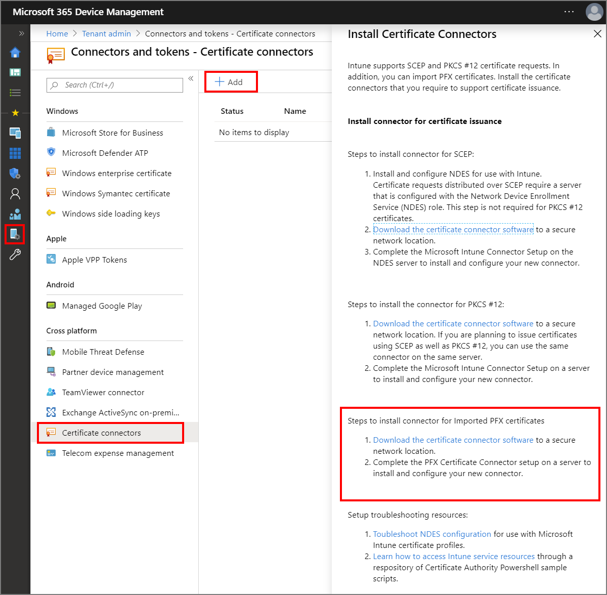
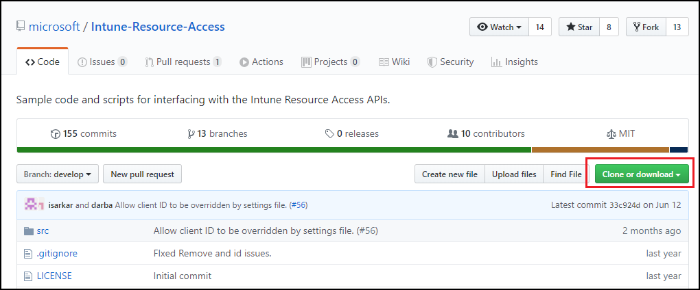
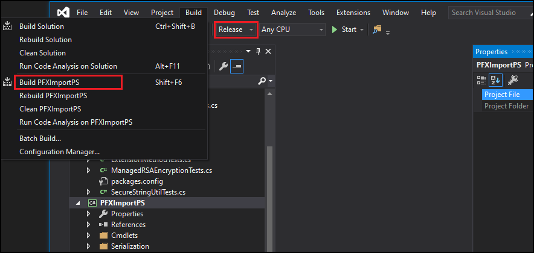

# Configure and use imported PKCS certificates with Intune

Microsoft Intune supports the use of imported public key pair (PKCS) certificates, commonly used for S/MIME encryption with Email profiles. Certain email profiles in Intune support an option to enable S/MIME where you can define an S/MIME signing certificate and S/MIME encryption cert.

S/MIME encryption is challenging because email is encrypted with a specific certificate:

- You must have the private key of the certificate that encrypted the email on the device where you're reading the email so it can be decrypted.
- Before a certificate on a device expires, you should import a new certificate so devices can continue to decrypt new email. Renewal of these certificates isn't supported.
- Encryption certificates are renewed regularly, which means that you might want to keep past certificate on your devices, to ensure that older email can continue to be decrypted.  

Because the same certificate needs to be used across devices, it's not possible to use [SCEP](certificates-scep-configure.md) or [PKCS](certficates-pfx-configure.md) certificate profiles for this purpose as those certificate delivery mechanisms deliver unique certificates per device.

For more information about using S/MIME with Intune, [Use S/MIME to encrypt email](certificates-s-mime-encryption-sign.md).

## Supported platforms

Intune supports import of PFX certificates for the following platforms:

- Android - Device Administrator
- Android Enterprise - Fully Managed
- Android Enterprise - Work profile
- iOS/iPadOS
- macOS
- Windows 10

## Requirements

To use imported PKCS certificates with Intune, you'll need the following infrastructure:

- **PFX Certificate Connector for Microsoft Intune**:

  Each Intune tenant supports a single instance of this connector. You can install this connector on the same server as an instance of the Microsoft Intune Certificate connector.

  This connector handles requests for PFX files imported to Intune for S/MIME email encryption for a specific user.

  This connector can automatically update itself when new versions become available. To use the update capability, you must ensure firewalls are open that allow the connector to contact **autoupdate.msappproxy.net** on port **443**.

  For more information, see [Network endpoints for Microsoft Intune](../fundamentals/intune-endpoints.md), and [Intune network configuration requirements and bandwidth](../fundamentals/network-bandwidth-use.md).

- **Windows Server**:

  You use a Windows Server to host the PFX Certificate Connector for Microsoft Intune.  The connector is used to process requests for certificates imported to Intune.
  
  The connector requires access to the same ports as detailed for managed devices, as found in our [device endpoint content](https://docs.microsoft.com/intune/fundamentals/intune-endpoints#access-for-managed-devices).

  Intune supports install of the *Microsoft Intune Certificate Connector* on the same server as the *PFX Certificate Connector for Microsoft Intune*.

  To support the connector, the server must run .NET 4.6 Framework or higher. If .NET 4.6 Framework isn't installed when you start the installation of the connector, the connector installation will install it automatically.

- **Visual Studio 2015 or above** (optional):

  You use Visual Studio to build the helper PowerShell module with cmdlets for importing PFX certificates to Microsoft Intune. To get the helper PowerShell cmdlets, see [PFXImport PowerShell Project in GitHub](https://github.com/microsoft/Intune-Resource-Access/tree/develop/src/PFXImportPowershell).

## How it works

When you use Intune to deploy an **imported PFX certificate** to a user, there are two components at play in addition to the device:

- **Intune Service**: Stores the PFX certificates in an encrypted state and handles the deployment of the certificate to the user device.  The passwords protecting the private keys of the certificates are encrypted before they're uploaded using either a hardware security module (HSM) or Windows Cryptography, ensuring that Intune can't access the private key at any time.

- **PFX Certificate Connector for Microsoft Intune**: When a device requests a PFX certificate that was imported to Intune, the encrypted password, the certificate, and the device's public key are sent to the connector.  The connector decrypts the password using the on-premises private key, and then re-encrypts the password (and any plist profiles if using iOS) with the device key before sending the certificate back to Intune.  Intune then delivers the certificate to the device and the device is able to decrypt it with the device's private key and install the certificate.

## Download, install, and configure the PFX Certificate Connector for Microsoft Intune

1. Sign in to the [Microsoft Endpoint Manager Admin Center](https://go.microsoft.com/fwlink/?linkid=2109431).

2. Select **Tenant administration** > **Connectors and tokens** > **Certificate connectors** > **Add**.

   

3. Follow the guidance to download the *PFX Certificate Connector for Microsoft Intune* to a location that's accessible from the server where you're going to install the connector.

4. After the download completes, sign in to the server and run the installer (PfxCertificateConnectorBootstrapper.exe).  
   - When you accept the default installation location, the connector installs to `Program Files\Microsoft Intune\PFXCertificateConnector`.
   - The connector service runs under the local system account. If a proxy is required for internet access, confirm that the local service account can access the proxy settings on the server.

5. The PFX Certificate Connector for Microsoft Intune opens the **Enrollment** tab after installation. To enable the connection to Intune, **Sign In**, and enter an account with Azure global administrator or Intune administrator permissions.

   > [!WARNING]
   > By default, in Windows Server **IE Enhanced Security Configuration** is set to **On** which can cause issues with the sign-in to Office 365.

6. Close the window.

7. In the Microsoft Endpoint Manager Admin Center, go back to **Tenant administration** > **Connectors and tokens** > **Certificate connectors**. In a few moments, a green check mark appears and the connection status updates. The connector server can now communicate with Intune.

## Import PFX Certificates to Intune

You use [Microsoft Graph](https://docs.microsoft.com/graph) to import your users PFX certificates into Intune. The helper [PFXImport PowerShell Project at GitHub](https://github.com/microsoft/Intune-Resource-Access/tree/develop/src/PFXImportPowershell) provides you with cmdlets to do the operations with ease.

If you prefer to use your own custom solution using Graph, use the [userPFXCertificate resource type](https://docs.microsoft.com/graph/api/resources/intune-raimportcerts-userpfxcertificate?view=graph-rest-beta).

### Build 'PFXImport PowerShell Project' cmdlets

To make use of the PowerShell cmdlets, you build the project yourself using Visual Studio. The process is straight forward and while it can run on the server, we recommended you run it on your workstation.  

1. Go to the root of the [Intune-Resource-Access](https://github.com/microsoft/Intune-Resource-Access) repository on GitHub, and then either download or clone the repository with Git to your machine.

   

2. Go to `.\Intune-Resource-Access-develop\src\PFXImportPowershell\` and open the project with Visual Studio using the file **PFXImportPS.sln**.

3. On the top, change from **Debug** to **Release**.

4. Go to **Build** and select **Build PFXImportPS**. After a few moments you'll see the **Build succeeded** confirmation appear at the bottom left of Visual Studio.

   

5. The build process creates a new folder with the PowerShell Module at `.\Intune-Resource-Access-develop\src\PFXImportPowershell\PFXImportPS\bin\Release`.

   You'll use this **Release** folder for the next steps.

### Create the encryption Public Key

You import PFX Certificates and their private keys to Intune. The password protecting the private key is encrypted with a public key that is stored on-premises. You can use either Windows cryptography, a hardware security module, or another type of cryptography to generate and store the public/private key pairs.  Depending on the type of cryptography used, the public/private key pair can be exported in a file format for backup purposes.

The PowerShell module provides methods to create a key using Windows cryptography. You can also use other tools to create a key.  

#### To create the encryption key using Windows cryptography

1. Copy the *Release* folder that's created by Visual Studio to the server where you installed the **PFX Certificate Connector for Microsoft Intune**. This folder contains the PowerShell module.

2. On the server, open *PowerShell* as an Administrator and then navigate to the *Release* folder that contains the PowerShell module.

3. To import the module, run `Import-Module .\IntunePfxImport.psd1` to import the module.

4. Next, run `Add-IntuneKspKey "Microsoft Software Key Storage Provider" "PFXEncryptionKey"`

   > [!TIP]
   > The provider you use must be selected again when you import PFX Certificates. You can use the **Microsoft Software Key Storage Provider**, although it is supported to use a different provider. The key name is also provided as an example, and you can use a different key name of your choice.

   If you plan to import the certificate from your workstation, you can export this key to a file with the following command:
    `Export-IntunePublicKey -ProviderName "<ProviderName>" -KeyName "<KeyName>" -FilePath "<File path\Filename.PFX>"`

   The private key must be imported on the server that hosts the PFX Certificate Connector for Microsoft Intune so that imported PFX certificates can be processed successfully.

#### To use a hardware security module (HSM)

You can use a hardware security module (HSM) to generate and store the public/private key pair. For more information, see the HSM provider's documentation.

### Import PFX Certificates

The following process uses the PowerShell cmdlets as an example of how to import the PFX certificates. You can pick different options depending on your requirements.

Options include:

- Intended Purpose (groups certificates together based on a tag):
  - unassigned
  - smimeEncryption
  - smimeSigning

- Padding Scheme:
  - oaepSha256
  - oaepSha384
  - oaepSha512

Select the Key Storage Provider that matches the provider you used to create the key.

#### To import the PFX certificate  

1. Export the certificates from any Certification Authority (CA) by following the documentation from the provider.  For Microsoft Active Directory Certificate Services, you can use [this sample script](https://gallery.technet.microsoft.com/Export-CMPfxCertificatesFro-d55f687b).

2. On the server, open *PowerShell* as an Administrator and then navigate to the *Release* folder that contains the PowerShell module.

3. To import the module, run `Import-Module .\IntunePfxImport.psd1`

4. To authenticate to Intune Graph, run `$authResult = Get-IntuneAuthenticationToken -AdminUserName "<Admin-UPN>"`

   > [!NOTE]
   > As the authentication is run against Graph, you must provide permissions to the AppID. If it's the first time you've used this utility, a *Global administrator* is required. The PowerShell cmdlets use the same AppID as the one used with [PowerShell Intune Samples](https://github.com/microsoftgraph/powershell-intune-samples).

5. Convert the password for each PFX file your are importing to a secure string by running `$SecureFilePassword = ConvertTo-SecureString -String "<PFXPassword>" -AsPlainText -Force`.

6. To create a **UserPFXCertificate** object, run
`$userPFXObject = New-IntuneUserPfxCertificate -PathToPfxFile "<FullPathPFXToCert>" $SecureFilePassword "<UserUPN>" "<ProviderName>" "<KeyName>" "<IntendedPurpose>"`

   For example: `$userPFXObject = New-IntuneUserPfxCertificate -PathToPfxFile "C:\temp\userA.pfx" $SecureFilePassword "userA@contoso.com" "Microsoft Software Key Storage Provider" "PFXEncryptionKey" "smimeEncryption"`

   > [!NOTE]
   > When you import the certificate from a system other than the server where the connector is installed, use must use the following command that includes the key file path: `$userPFXObject = New-IntuneUserPfxCertificate -PathToPfxFile "<FullPathPFXToCert>" $SecureFilePassword "<UserUPN>" "<ProviderName>" "<KeyName>" "<IntendedPurpose>" "<PaddingScheme>" "<File path to public key file>"`

7. Import the **UserPFXCertificate** object to Intune by running `Import-IntuneUserPfxCertificate -AuthenticationResult $authResult -CertificateList $userPFXObject`

8. To validate the certificate was imported, run `Get-IntuneUserPfxCertificate -AuthenticationResult $authResult -UserList "<UserUPN>"`

For more information about other available commands, see the readme file at [PFXImport PowerShell Project at GitHub](https://github.com/microsoft/Intune-Resource-Access/tree/develop/src/PFXImportPowershell).

## Create a PKCS imported certificate profile

After importing the certificates to Intune, create a **PKCS imported certificate** profile, and assign it to Azure Active Directory groups.

1. Sign in to the [Microsoft Endpoint Manager Admin Center](https://go.microsoft.com/fwlink/?linkid=2109431).

2. Select  and go to **Devices** > **Configuration profiles** > **Create profile**.

3. Enter the following properties:
   - **Platform**: Choose the platform of your devices.
   - **Profile**: Select **PKCS imported certificate**

4. Select **Create**.

5. In **Basics**, enter the following properties:
   - **Name**: Enter a descriptive name for the profile. Name your profiles so you can easily identify them later. For example, a good profile name is *PKCS imported certificate profile for entire company*.
   - **Description**: Enter a description for the profile. This setting is optional, but recommended.

6. Select **Next**.

7. In **Configuration settings**, enter the following properties:

   - **Intended purpose**: Specify the intended purpose of the certificates that are imported for this profile. Administrators can import certificates with different intended purposes (like S/MIME signing or S/MIME encryption). The intended purpose selected in the certificate profile matches the certificate profile with the right imported certificates. Intended purpose is a tag to group imported certificates together and doesn't guarantee that certificates imported with that tag will meet the intended purpose.  

   <!-- Not in new UI:
   - **Certificate validity period**: Unless the validity period was changed in the certificate template, this option defaults to one year.
   -->
   - **Key storage provider (KSP)**: For Windows, select where to store the keys on the device.

8. Select **Next**.

9. In **Scope tags** (optional), assign a tag to filter the profile to specific IT groups, such as `US-NC IT Team` or `JohnGlenn_ITDepartment`. For more information about scope tags, see [Use RBAC and scope tags for distributed IT](../fundamentals/scope-tags.md).

   Select **Next**.

10. In **Assignments**, select the user or groups that will receive your profile. For more information on assigning profiles, see [Assign user and device profiles](../configuration/device-profile-assign.md).

    Select **Next**.

11. (*Applies to Windows 10 only*) In **Applicability Rules**, specify applicability rules to refine the assignment of this profile. You can choose to assign or not assign the profile based on the OS edition or version of a device.

    For more information, see [Applicability rules](../configuration/device-profile-create.md#applicability-rules) in *Create a device profile in Microsoft Intune*.

    Select **Next**.

12. In **Review + create**, review your settings. When you select Create, your changes are saved, and the profile is assigned. The policy is also shown in the profiles list.

## Support for third-party partners

The following partners provide supported methods or tools you can use to import PFX certificates to Intune.

### DigiCert

If you use the DigiCert PKI Platform service, you can use the DigiCert **Import Tool for Intune S/MIME Certificates** to import PFX certificates to Intune. Use of this tool replaces the need to follow the instructions in the section [Import PFX Certificates to Intune](#import-pfx-certificates-to-intune) that's detailed earlier in this article.

To learn more about the DigiCert Import tool, including how to obtain the tool, see https://knowledge.digicert.com/tutorials/microsoft-intune.html in the DigiCert knowledge base.

## Next steps

The profile is created, but it's not doing anything yet. [Assign](../configuration/device-profile-assign.md) the new device profile.
