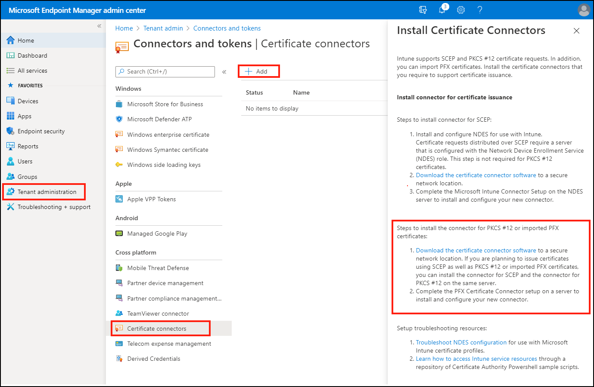

# Configure and use PKCS certificates with Intune

Intune supports the use of private and public key pair (PKCS) certificates. This article can help you configure the required infrastructure like on-premises certificate connectors, export a PKCS certificate, and then add the certificate to an Intune device configuration profile.

Microsoft Intune includes built-in settings to use PKCS certificates for access and authentication to your organizations resources. Certificates authenticate and secure access to your corporate resources like a VPN or a WiFi network. You deploy these settings to devices using device configuration profiles in Intune.

For information about using imported PKCS certificates, see [Imported PFX Certificates](certificates-imported-pfx-configure.md).

## Requirements

To use PKCS certificates with Intune, you'll need the following infrastructure:

- **Active Directory domain**:  
  All servers listed in this section must be joined to your Active Directory domain.

  For more information about installing and configuring Active Directory Domain Services (AD DS), see [AD DS Design and Planning](/windows-server/identity/ad-ds/plan/ad-ds-design-and-planning).

- **Certification Authority**:  
   An Enterprise Certification Authority (CA).

  For information on installing and configuring Active Directory Certificate Services (AD CS), see [Active Directory Certificate Services Step-by-Step Guide](/previous-versions/windows/it-pro/windows-server-2008-R2-and-2008/cc772393(v=ws.10)).

  > [!WARNING]  
  > Intune requires you to run AD CS with an Enterprise Certification Authority (CA), not a Standalone CA.

- **A client**:  
  To connect to the Enterprise CA.

- **Root certificate**:  
  An exported copy of your root certificate from your Enterprise CA.

- **PFX Certificate Connector for Microsoft Intune**:

  For information about the PFX Certificate connector, including prerequisites and release versions, see [Certificate connectors](certificate-connectors.md).

  > [!IMPORTANT]
  > Beginning with the release of the PFX Certificate Connector, version 6.2008.60.607, the *Microsoft Intune Connector* is no longer required for PKCS certificate profiles. The *PFX Certificate Connector* supports issuing PKCS certificates to all device platforms. This includes the following platforms which aren’t supported by the Microsoft Intune Connector:
  >
  > - Android Enterprise – Fully Managed
  > - Android Enterprise – Dedicated
  > - Android Enterprise – Corporate Owned Work Profile

## Export the root certificate from the Enterprise CA

To authenticate a device with VPN, WiFi, or other resources, a device needs a root or intermediate CA certificate. The following steps explain how to get the required certificate from your Enterprise CA.

**Use a command line**:  

1. Log into the Root Certification Authority server with Administrator Account.

2. Go to **Start** > **Run**, and then enter **Cmd** to open command prompt.

3. Specify **certutil -ca.cert ca_name.cer** to export the Root certificate as a file named *ca_name.cer*.

## Configure certificate templates on the CA

1. Sign in to your Enterprise CA with an account that has administrative privileges.
2. Open the **Certification Authority** console, right-click **Certificate Templates**, and select **Manage**.
3. Find the **User** certificate template, right-click it, and choose **Duplicate Template** to open **Properties of New Template**.

    > [!NOTE]
    > For S/MIME email signing and encryption scenarios, many administrators use separate certificates for signing and encryption. If you're using Microsoft Active Directory Certificate Services, you can use the **Exchange Signature Only** template for S/MIME email signing certificates, and the **Exchange User** template for S/MIME encryption certificates.  If you're using a 3rd-party certification authority, it's suggested to review their guidance to set up signing and encryption templates.

4. On the **Compatibility** tab:

    - Set **Certification Authority** to **Windows Server 2008 R2**
    - Set **Certificate recipient** to **Windows 7 / Server 2008 R2**

5. On the **General** tab, set **Template display name** to something meaningful to you.

    > [!WARNING]
    > **Template name** by default is the same as **Template display name** with *no spaces*. Note the template name, you need it later.

6. In **Request Handling**, select **Allow private key to be exported**.

    > [!NOTE]
    > In contrary to SCEP, with PKCS the certificate private key is generated on the server where the connector is installed and not on the device.
    > It is required that the certificate template allows the private key to be exported, so that the certificate connector is able to export the PFX certificate and send it to the device.
    >
    > However, please note that the certificates are installed on the device itself with the private key marked as not exportable.

7. In **Cryptography**, confirm that the **Minimum key size** is set to 2048.
8. In **Subject Name**, choose **Supply in the request**.
9. In **Extensions**, confirm that you see Encrypting File System, Secure Email, and Client Authentication under **Application Policies**.

    > [!IMPORTANT]
    > For iOS/iPadOS certificate templates, go to the **Extensions** tab, update **Key Usage**, and confirm that **Signature is proof of origin** isn't selected.

10. In **Security**, add the Computer Account for the server where you install the Microsoft Intune Connector. Allow this account **Read** and **Enroll** permissions.
11. Select **Apply** > **OK** to save the certificate template. Close the **Certificate Templates Console**.
12. In the **Certification Authority** console, right-click **Certificate Templates** > **New** > **Certificate Template to Issue**. Choose the template that you created in the previous steps. Select **OK**.
13. For the server to manage certificates for enrolled devices and users, use the following steps:

    1. Right-click the Certification Authority, choose **Properties**.
    2. On the security tab, add the Computer account of the server where you run the connectors (**Microsoft Intune Connector** or **PFX Certificate Connector for Microsoft Intune**).
    3. Grant **Issue and Manage Certificates** and **Request Certificates** Allow permissions to the computer account.

14. Sign out of the Enterprise CA.

## Download, install, and configure the PFX Certificate Connector

Before you begin, [review requirements for the connector](certificate-connectors.md) and ensure your environment and your Windows server is ready to support the connector.

1. Sign in to the [Microsoft Endpoint Manager admin center](https://go.microsoft.com/fwlink/?linkid=2109431).

2. Select **Tenant administration** > **Connectors and tokens** > **Certificate connectors** > **+ Add**.

3. Select *Download the certificate connector software* for the connector for PKCS #12, and save the file to a location you can access from the server where you're going to install the connector.

   

4. After the download completes, sign in to the server and run the installer (PfxCertificateConnectorBootstrapper.exe).  
   - When you accept the default installation location, the connector installs to `Program Files\Microsoft Intune\PFXCertificateConnector`.
   - The connector service runs under the local system account. If a proxy is required for internet access, confirm that the local service account can access the proxy settings on the server.

5. The PFX Certificate Connector for Microsoft Intune opens the **Enrollment** tab after installation. To enable the connection to Intune, **Sign In**, and enter an account with Azure global administrator or Intune administrator permissions.

   > [!WARNING]
   > By default, in Windows Server **IE Enhanced Security Configuration** is set to **On** which can cause issues with the sign-in to Office 365.

6. Select the **CA Account** tab, and then enter credentials for an account that has the Issue and Manage Certificates permission on your issuing Certificate Authority. These credentials will be used to perform certificate issuance and certificate revocation on the Certificate Authority. (Prior to the PFX certificate connector version 6.2008.60.612, these credentials were used only for certificate revocation.)

    **Apply** your changes.

7. Close the window.

8. In the Microsoft Endpoint Manager admin center, go back to **Tenant administration** > **Connectors and tokens** > **Certificate connectors**. In a few moments, a green check mark appears and the connection status updates. The connector server can now communicate with Intune.

## Create a trusted certificate profile

1. Sign in to the [Microsoft Endpoint Manager admin center](https://go.microsoft.com/fwlink/?linkid=2109431).

2. Select  and go to **Devices** > **Configuration profiles** > **Create profile**.

3. Enter the following properties:
   - **Platform**: Choose the platform of the devices that will receive this profile.
   - **Profile**: Select **Trusted certificate**

4. Select **Create**.

5. In **Basics**, enter the following properties:
   - **Name**: Enter a descriptive name for the profile. Name your profiles so you can easily identify them later. For example, a good profile name is *Trusted certificate profile for entire company*.
   - **Description**: Enter a description for the profile. This setting is optional, but recommended.

6. Select **Next**.

7. In **Configuration settings**, specify the .cer file Root CA Certificate you previously exported.

   > [!NOTE]
   > Depending on the platform you chose in **Step 3**, you may or may not have an option to choose the **Destination store** for the certificate.

   

8. Select **Next**.

9. In **Scope tags** (optional), assign a tag to filter the profile to specific IT groups, such as `US-NC IT Team` or `JohnGlenn_ITDepartment`. For more information about scope tags, see [Use RBAC and scope tags for distributed IT](../fundamentals/scope-tags.md).

   Select **Next**.

10. In **Assignments**, select the user or groups that will receive your profile. Plan to deploy this certificate profile to the same groups that receive the PKCS certificate profile. For more information on assigning profiles, see [Assign user and device profiles](../configuration/device-profile-assign.md).

    Select **Next**.

11. (*Applies to Windows 10 only*) In **Applicability Rules**, specify applicability rules to refine the assignment of this profile. You can choose to assign or not assign the profile based on the OS edition or version of a device.

    For more information, see [Applicability rules](../configuration/device-profile-create.md#applicability-rules) in *Create a device profile in Microsoft Intune*.

12. In **Review + create**, review your settings. When you select Create, your changes are saved, and the profile is assigned. The policy is also shown in the profiles list.

## Create a PKCS certificate profile

1. Sign in to the [Microsoft Endpoint Manager admin center](https://go.microsoft.com/fwlink/?linkid=2109431).

2. Select  and go to **Devices** > **Configuration profiles** > **Create profile**.

3. Enter the following properties:
   - **Platform**: Choose the platform of your devices. Your options:
     - Android device administrator
     - Android Enterprise > Fully Managed, Dedicated, and Corporate-Owned Work Profile
     - Android Enterprise > Work profile only
     - iOS/iPadOS
     - macOS
     - Windows 10 and later
   - **Profile**: Select **PKCS certificate**

   > [!NOTE]
   > On devices with an Android Enterprise profile, certificates installed using a PKCS certificate profile are not visible on the device. To confirm successful certificate deployment, check the status of the profile in the Intune console.
4. Select **Create**.

5. In **Basics**, enter the following properties:
   - **Name**: Enter a descriptive name for the profile. Name your profiles so you can easily identify them later. For example, a good profile name is *PKCS profile for entire company*.
   - **Description**: Enter a description for the profile. This setting is optional, but recommended.

6. Select **Next**.
7. In **Configuration settings**, depending on the platform you chose, the settings you can configure are different. Select your platform for detailed settings:
   - Android device administrator
   - Android Enterprise
   - iOS/iPadOS
   - Windows 10
   
   |Setting     | Platform     | Details   |
   |------------|------------|------------|
   |**Renewal threshold (%)**        |<ul><li>All         |Recommended is 20%  |
   |**Certificate validity period**  |<ul><li>All         |If you didn't change the certificate template, this option may be set to one year.    Use a validity period of five days or greater. When the validity period is less than five days, there is a high likelihood of the certificate entering a near-expiry or expired state, which can cause the MDM agent on devices to reject the certificate before it’s installed. |
   |**Key storage provider (KSP)**   |<ul><li>Windows 10  |For Windows, select where to store the keys on the device. |
   |**Certification authority**      |<ul><li>All         |Displays the internal fully qualified domain name (FQDN) of your Enterprise CA.  |
   |**Certification authority name** |<ul><li>All         |Lists the name of your Enterprise CA, such as "Contoso Certification Authority". |
   |**Certificate template name**    |<ul><li>All         |Lists the name of your certificate template. |
   |**Certificate type**             |<ul><li>Android Enterprise (*Work Profile*)</li><li>iOS</li><li>macOS</li><li>Windows 10 and later|Select a type: <ul><li> **User** certificates can contain both user and device attributes in the subject and subject alternative name (SAN) of the certificate. </il><li>**Device** certificates can only contain device attributes in the subject and SAN of the certificate.​ Use Device for scenarios such as user-less devices, like kiosks or other shared devices.     This selection affects the Subject name format. |
   |**Subject name format**          |<ul><li>All         |For details on how to configure the subject name format, see [Subject name format](#subject-name-format) later in this article.    For the following platforms, the Subject name format is determined by the certificate type: <ul><li>Android Enterprise (*Work Profile*)</li><li>iOS</li><li>macOS</li><li>Windows 10 and later</li></ul>  
  |
   |**Subject alternative name**     |<ul><li>All         |For *Attribute*, select **User principal name (UPN)** unless otherwise required, configure a corresponding *Value*, and then select **Add**.    You can use variables or static text for the SAN of both certificate types. Use of a variable isn't required.  For more information, see [Subject name format](#subject-name-format) later in this article.|
   |**Extended key usage**           |<ul><li> Android device administrator </li><li>Android Enterprise (*Device Owner*, *Work Profile*) </li><li>Windows 10 |Certificates usually require *Client Authentication* so that the user or device can authenticate to a server. |
   |**Allow all apps access to private key** |<ul><li>macOS  |Set to **Enable** to give apps that are configured for the associated mac device access to the PKCS certificates private key.    For more information on this setting, see *AllowAllAppsAccess* the Certificate Payload section of [Configuration Profile Reference](https://developer.apple.com/business/documentation/Configuration-Profile-Reference.pdf) in the Apple developer documentation. |
   |**Root Certificate**             |<ul><li>Android device administrator </li><li>Android Enterprise (*Device Owner*, *Work Profile*) |Select a root CA certificate profile that was previously assigned. |
 
8. Select **Next**.

9. In **Scope tags** (optional), assign a tag to filter the profile to specific IT groups, such as `US-NC IT Team` or `JohnGlenn_ITDepartment`. For more information about scope tags, see [Use RBAC and scope tags for distributed IT](../fundamentals/scope-tags.md).

   Select **Next**.

10. In **Assignments**, select the user or groups that will receive your profile. Plan to deploy this certificate profile to the same groups that receive the trusted certificate profile. For more information on assigning profiles, see [Assign user and device profiles](../configuration/device-profile-assign.md).

    Select **Next**.

11. In **Review + create**, review your settings. When you select Create, your changes are saved, and the profile is assigned. The policy is also shown in the profiles list.

### Subject name format

When you create a PKCS certificate profile for the following platforms, options for the subject name format depend on the Certificate type you select, either **User** or **Device**.  

Platforms:

- Android Enterprise (*Work Profile*)
- iOS
- macOS
- Windows 10 and later

> [!NOTE]
> There is a known issue for using PKCS to get certificates [which is the same issue as seen for SCEP](certificates-profile-scep.md#avoid-certificate-signing-requests-with-escaped-special-characters) when the subject name in the resulting Certificate Signing Request (CSR) includes one of the following characters as an escaped character (proceeded by a backslash \\):
>
> - \+
> - ;
> - ,
> - =

- **User certificate type**  
  Format options for the *Subject name format* include two variables: **Common Name (CN)** and **Email (E)**. **Common Name (CN)** can be set to any of the following variables:

  - **CN={{UserName}}**: The user principal name of the user, such as janedoe@contoso.com.
  - **CN={{AAD_Device_ID}}**: An ID assigned when you register a device in Azure Active Directory (AD). This ID is typically used to authenticate with Azure AD.
  - **CN={{SERIALNUMBER}}**: The unique serial number (SN) typically used by the manufacturer to identify a device.
  - **CN={{IMEINumber}}**: The International Mobile Equipment Identity (IMEI) unique number used to identify a mobile phone.
  - **CN={{OnPrem_Distinguished_Name}}**: A sequence of relative distinguished names separated by comma, such as *CN=Jane Doe,OU=UserAccounts,DC=corp,DC=contoso,DC=com*.

    To use the *{{OnPrem_Distinguished_Name}}* variable, be sure to sync the *onpremisesdistinguishedname* user attribute using [Azure AD Connect](/azure/active-directory/connect/active-directory-aadconnect) to your Azure AD.

  - **CN={{onPremisesSamAccountName}}**: Admins can sync the samAccountName attribute from Active Directory to Azure AD using Azure AD connect into an attribute called *onPremisesSamAccountName*. Intune can substitute that variable as part of a certificate issuance request in the subject of a certificate. The samAccountName attribute is the user sign-in name used to support clients and servers from a previous version of Windows (pre-Windows 2000). The user sign-in name format is: *DomainName\testUser*, or only *testUser*.

    To use the *{{onPremisesSamAccountName}}* variable, be sure to sync the *onPremisesSamAccountName* user attribute using [Azure AD Connect](/azure/active-directory/connect/active-directory-aadconnect) to your Azure AD.

  By using a combination of one or many of these variables and static strings, you can create a custom subject name format, such as:  
  - **CN={{UserName}},E={{EmailAddress}},OU=Mobile,O=Finance Group,L=Redmond,ST=Washington,C=US**
  
  That example includes a subject name format that uses the CN and E variables, and strings for Organizational Unit, Organization, Location, State, and Country values. [CertStrToName function](/windows/win32/api/wincrypt/nf-wincrypt-certstrtonamea) describes this function, and its supported strings.

- **Device certificate type**  
  Format options for the Subject name format include the following variables:
  - **{{AAD_Device_ID}}**
  - **{{Device_Serial}}**
  - **{{Device_IMEI}}**
  - **{{SerialNumber}}**
  - **{{IMEINumber}}**
  - **{{AzureADDeviceId​}}**
  - **{{WiFiMacAddress}}**
  - **{{IMEI}}**
  - **{{DeviceName}}**
  - **{{FullyQualifiedDomainName}}** *(Only applicable for Windows and domain-joined devices)*
  - **{{MEID}}**

  You can specify these variables, followed by the text for the variable, in the textbox. For example, the common name for a device named *Device1* can be added as **CN={{DeviceName}}Device1**.

  > [!IMPORTANT]  
  >
  > - When you specify a variable, enclose the variable name in curly brackets { } as seen in the example, to avoid an error.
  > - Device properties used in the *subject* or *SAN* of a device certificate, like **IMEI**, **SerialNumber**, and **FullyQualifiedDomainName**, are properties that could be spoofed by a person with access to the device.
  > - A device must support all variables specified in a certificate profile for that profile to install on that device.  For example, if **{{IMEI}}** is used in the subject name of a SCEP profile and is assigned to a device that doesn't have an IMEI number, the profile fails to install.

## Next steps

[Use SCEP for certificates](certificates-scep-configure.md), or [issue PKCS certificates from a Symantec PKI manager web service](certificates-digicert-configure.md).

[Troubleshoot PKCS certificate profiles](../protect/troubleshoot-pkcs-certificate-profiles.md)
