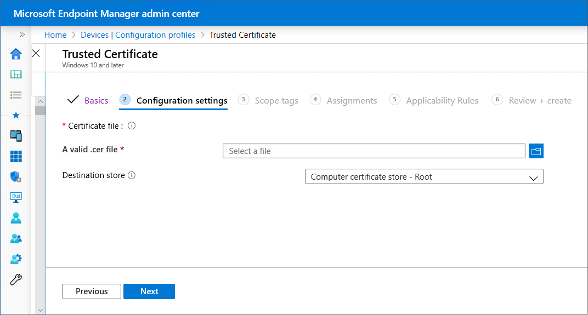

# Configure and use PKCS certificates with Intune

Microsoft Intune supports the use of private and public key pair (PKCS) certificates. This article reviews what's required to use PKCS certificates with Intune, including the export of a PKCS certificate then adding it to an Intune device configuration profile.

Microsoft Intune includes built-in settings to use PKCS certificates for access and authentication to your organizations resources. Certificates authenticate and secure access to your corporate resources like a VPN or a WiFi network. You deploy these settings to devices using device configuration profiles in Intune.

For information about using imported PKCS certificates, see [Imported PFX Certificates](certificates-imported-pfx-configure.md).

> [!TIP]
> *PKCS certificate* profiles are supported for [Windows Enterprise multi-session remote desktops](../fundamentals/azure-virtual-desktop-multi-session.md).

## Requirements

To use PKCS certificates with Intune, you need the following infrastructure:

- Active Directory domain: All servers listed in this section must be joined to your Active Directory domain.

  For more information about installing and configuring Active Directory Domain Services (AD DS), see [AD DS Design and Planning](/windows-server/identity/ad-ds/plan/ad-ds-design-and-planning).  

- Certification Authority: An Enterprise Certification Authority (CA).

  For information on installing and configuring Active Directory Certificate Services (AD CS), see [Active Directory Certificate Services Step-by-Step Guide](/previous-versions/windows/it-pro/windows-server-2008-R2-and-2008/cc772393(v=ws.10)).  

  > [!WARNING]  
  > Intune requires you to run AD CS with an Enterprise Certification Authority (CA), not a Standalone CA.

- A client: To connect to the Enterprise CA.

- Root certificate: An exported copy of your root certificate from your Enterprise CA.

- Certificate Connector for Microsoft Intune: For information about the certificate connector, see:

  - Overview of the [Certificate Connector for Microsoft Intune](certificate-connector-overview.md)  
  - [Prerequisites](certificate-connector-prerequisites.md)  
  - [Installation and configuration](certificate-connector-install.md)  

## Export the root certificate from the Enterprise CA

To authenticate a device with VPN, WiFi, or other resources, a device needs a root or intermediate CA certificate. The following steps explain how to get the required certificate from your Enterprise CA.

Use a command line to complete these steps:  

1. Sign in to the Root Certification Authority server with Administrator Account.

2. Go to **Start** > **Run**, and then enter **Cmd** to open a command prompt.

3. Enter **certutil -ca.cert ca_name.cer** to export the root certificate as a file named *ca_name.cer*.

## Configure certificate templates on the CA

1. Sign in to your Enterprise CA with an account that has administrative privileges.
2. Open the **Certification Authority** console, right-click **Certificate Templates**, and select **Manage**.
3. Find the **User** certificate template, right-click it, and choose **Duplicate Template** to open **Properties of New Template**.

    > [!NOTE]
    > For S/MIME email signing and encryption scenarios, many administrators use separate certificates for signing and encryption. If you're using Microsoft Active Directory Certificate Services, you can use the Exchange Signature Only template for S/MIME email signing certificates, and the Exchange User template for S/MIME encryption certificates.  If you're using a non-Microsoft certification authority, we recommend reviewing their guidance to set up signing and encryption templates.  

4. On the **Compatibility** tab:

    - Set **Certification Authority** to **Windows Server 2008 R2**
    - Set **Certificate recipient** to **Windows 7 / Server 2008 R2**

5. On the **General** tab:
  
     - Set **Template display name** to something meaningful to you.
     - Deselect **Publish certificate in Active Directory**.

    > [!WARNING]
    > **Template name** by default is the same as **Template display name** with *no spaces*. Note the template name, because you need it later.  

8. In **Request Handling**, select **Allow private key to be exported**.  

    > [!NOTE]
    >
    > Unlike SCEP, with PKCS the certificate private key is generated on the server where the certificate connector is installed and not on the device. The certificate template must allow the private key to be exported so that the connector can export the PFX certificate and send it to the device.
    >
    > After the certificates install on the device, the private key is marked as not exportable.

9. In **Cryptography**, confirm that the **Minimum key size** is set to 2048. 

   Windows and Android devices support the use of 4096-bit key size with a PKCS certificate profile. To use this key size, adjust the value to 4096.   

   > [!NOTE]
   >
   > For Windows devices, 4096-bit key storage is supported only in the Software Key Storage Provider (KSP). The following features do not support storage for keys of this size:
   >
   > - The hardware TPM (Trusted Platform Module): As a workaround you can use the Software KSP for key storage.
   > - Windows Hello for Business: There is no workaround for Windows Hello for Business at this time.

10. In **Subject Name**, choose **Supply in the request**.  
11. In **Extensions**, under **Application Policies**, confirm that you see **Encrypting File System**, **Secure Email**, and **Client Authentication**.  

    > [!IMPORTANT]
    > For iOS/iPadOS certificate templates, go to the **Extensions** tab, update **Key Usage**, and then deselect **Signature is proof of origin**.  

12. In **Security**:  
    1. Add the computer account for the server where you install the Certificate Connector for Microsoft Intune. Allow this account **Read** and **Enroll** permissions.
    1. (Optional but recommended) Remove the domain users group from the list of groups or user names allowed permissions on this template. To remove the group:
       1. Select the **Domain Users** group.
       1. Select **Remove**. 
       1. Review the other entries under **Groups or user names** to confirm permissions and applicability to your environment. 

13. Select **Apply** > **OK** to save the certificate template. Close the Certificate Templates Console.
14. In the **Certification Authority** console, right-click **Certificate Templates**.
14. Select **New** > **Certificate Template to Issue**. 
15. Choose the template that you created in the previous steps. Select **OK**.  
16. Permit the server to manage certificates for enrolled devices and users:  

    1. Right-click the Certification Authority, and then choose **Properties**.
    2. On the security tab, add the computer account of the server where you run the connector.
    3. Grant **Issue and Manage Certificates** and **Request Certificates** permissions to the computer account.  

16. Sign out of the Enterprise CA.  

## Download, install, and configure the Certificate Connector for Microsoft Intune

For guidance, see [Install and configure the Certificate Connector for Microsoft Intune](certificate-connector-install.md).

## Create a trusted certificate profile

1. Sign in to the [Microsoft Intune admin center](https://go.microsoft.com/fwlink/?linkid=2109431).

2. Select  and go to **Devices** > **Manage devices** > **Configuration** > **Create**.

3. Enter the following properties:
   - **Platform**: Choose the platform of the devices that will receive this profile.
     - Android device administrator
     - Android Enterprise:
       - Fully Managed
       - Dedicated
       - Corporate-Owned Work Profile
       - Personally-Owned Work Profile
     - iOS/iPadOS
     - macOS
     - Windows 10/11
   - **Profile**: Select **Trusted certificate**. Or, select **Templates** > **Trusted certificate**.

4. Select **Create**.

5. In **Basics**, enter the following properties:
   - **Name**: Enter a descriptive name for the profile. Name your profiles so you can easily identify them later. For example, a good profile name is *Trusted certificate profile for entire company*.
   - **Description**: Enter a description for the profile. This setting is optional, but recommended.

6. Select **Next**.

7. In **Configuration settings**, specify the .cer file for the Root CA Certificate you previously exported.

   > [!NOTE]
   > Depending on the platform you chose in **Step 3**, you may or may not have an option to choose the **Destination store** for the certificate.

   

8. Select **Next**.

9. In **Assignments**, select the user or device group(s) that will be assigned the profile. For more granularity, see [Create filters in Microsoft Intune](https://go.microsoft.com/fwlink/?linkid=2150376) and apply them by selecting *Edit filter*.

   Plan to deploy this certificate profile to the same groups that receive the PKCS certificate profile, and that receive a configuration profile like a Wi-Fi profile that makes use of the certificate. For more information on assigning profiles, see [Assign user and device profiles](../configuration/device-profile-assign.md).

   Select **Next**.

10. (*Applies to Windows 10/11 only*) In **Applicability Rules**, specify applicability rules to refine the assignment of this profile. You can choose to assign or not assign the profile based on the OS edition or version of a device.

    For more information, see [Applicability rules](../configuration/device-profile-create.md#applicability-rules) in *Create a device profile in Microsoft Intune*.

11. In **Review + create**, review your settings. When you select **Create**, your changes are saved, and the profile is assigned. The policy is also shown in the profiles list.

## Create a PKCS certificate profile

 [!INCLUDE [android_device_administrator_support](../includes/android-device-administrator-support.md)]

1. Sign in to the [Microsoft Intune admin center](https://go.microsoft.com/fwlink/?linkid=2109431).

2. Select  and go to **Devices** > **Manage devices** > **Configuration** > **Create**.

3. Enter the following properties:
   - **Platform**: Choose the platform of your devices. Your options:
     - Android device administrator
     - Android Enterprise:
       - Fully Managed
       - Dedicated
       - Corporate-Owned Work Profile
       - Personally-Owned Work Profile
     - iOS/iPadOS
     - macOS
     - Windows 10/11
   - **Profile**: Select **PKCS certificate**. Or, select **Templates** > **PKCS certificate**.

   > [!NOTE]
   > On devices with an Android Enterprise profile, certificates installed using a PKCS certificate profile are not visible on the device. To confirm successful certificate deployment, check the status of the profile in the Intune admin center.

4. Select **Create**.

5. In **Basics**, enter the following properties:
   - **Name**: Enter a descriptive name for the profile. Name your profiles so you can easily identify them later. For example, a good profile name is *PKCS profile for entire company*.
   - **Description**: Enter a description for the profile. This setting is optional, but recommended.

6. Select **Next**.
7. In **Configuration settings**, depending on the platform you chose, the settings you can configure are different. Select your platform for detailed settings:
   - Android device administrator
   - Android Enterprise
   - iOS/iPadOS
   - Windows 10/11
   
   |Setting     | Platform     | Details   |
   |------------|------------|------------|
   |**Renewal threshold (%)**        |<ul><li>All         |Recommended is 20%  |
   |**Certificate validity period**  |<ul><li>All         |If you didn't change the certificate template, this option may be set to one year.    Use a validity period of five days or up to 24 months. When the validity period is less than five days, there's a high likelihood of the certificate entering a near-expiry or expired state, which can cause the MDM agent on devices to reject the certificate before it’s installed. |
   |**Key storage provider (KSP)**   |<ul><li>Windows 10/11  |For Windows, select where to store the keys on the device. |
   |**Certification authority**      |<ul><li>All         |Displays the internal fully qualified domain name (FQDN) of your Enterprise CA.  |
   |**Certification authority name** |<ul><li>All         |Lists the name of your Enterprise CA, such as "Contoso Certification Authority". |
   |**Certificate template name**    |<ul><li>All         |Lists the name of your certificate template. |
   |**Certificate type**             |<ul><li>Android Enterprise (*Corporate-Owned and Personally-Owned Work Profile*)</li><li>iOS</li><li>macOS</li><li>Windows 10/11 |Select a type: <ul><li> **User** certificates can contain both user and device attributes in the subject and subject alternative name (SAN) of the certificate. </li><li>**Device** certificates can only contain device attributes in the subject and SAN of the certificate. Use Device for scenarios such as user-less devices, like kiosks or other shared devices.     This selection affects the Subject name format. |
   |**Subject name format**          |<ul><li>All         |For details on how to configure the subject name format, see [Subject name format](#subject-name-format) later in this article.    For the following platforms, the Subject name format is determined by the certificate type: <ul><li>Android Enterprise (*Work Profile*)</li><li>iOS</li><li>macOS</li><li>Windows 10/11 </li></ul>  
  |
   |**Subject alternative name**     |<ul><li>All         |For *Attribute*, select **User principal name (UPN)** unless otherwise required, configure a corresponding *Value*, and then select **Add**.    You can use variables or static text for the SAN of both certificate types. Use of a variable isn't required.  For more information, see [Subject name format](#subject-name-format) later in this article.|
   |**Extended key usage**           |<ul><li> Android device administrator </li><li>Android Enterprise (*Device Owner*, *Corporate-Owned and Personally-Owned Work Profile*) </li><li>Windows 10/11 |Certificates usually require *Client Authentication* so that the user or device can authenticate to a server. |
   |**Allow all apps access to private key** |<ul><li>macOS  |Set to **Enable** to give apps that are configured for the associated mac device access to the PKCS certificate's private key.    For more information on this setting, see *AllowAllAppsAccess* the Certificate Payload section of [Configuration Profile Reference](https://developer.apple.com/business/documentation/Configuration-Profile-Reference.pdf) in the Apple developer documentation. |
   |**Root Certificate**             |<ul><li>Android device administrator </li><li>Android Enterprise (*Device Owner*, *Corporate-Owned and Personally-Owned Work Profile*) |Select a root CA certificate profile that was previously assigned. |

8. This step applies only to **Android Enterprise** devices profiles for **Fully Managed, Dedicated, and Corporate-Owned work Profile**.  

   In **Apps**, configure **Certificate access** to manage how certificate access is granted to applications. Choose from:

   - **Require user approval for apps** *(default)* – Users must approve use of a certificate by all applications.
   - **Grant silently for specific apps (require user approval for other apps)** – With this option, select **Add apps**, and then select one or more apps that will silently use the certificate without user interaction.

9. Select **Next**.

10. In **Assignments**, select the user or groups that will receive your profile. Plan to deploy this certificate profile to the same groups that receive the trusted certificate profile, and that receive a configuration profile like a Wi-Fi profile that makes use of the certificate. For more information on assigning profiles, see [Assign user and device profiles](../configuration/device-profile-assign.md).

    Select **Next**.

11. In **Review + create**, review your settings. When you select **Create**, your changes are saved, and the profile is assigned. The policy is also shown in the profiles list.

### Subject name format

When you create a PKCS certificate profile for the following platforms, options for the subject name format depend on the Certificate type you select, either **User** or **Device**.  

Platforms:

- Android Enterprise (*Corporate-Owned and Personally-Owned Work Profile*)
- iOS
- macOS
- Windows 10/11

> [!NOTE]
> There is a known issue for using PKCS to get certificates [which is the same issue as seen for SCEP](certificates-profile-scep.md#avoid-certificate-signing-requests-with-escaped-special-characters) when the subject name in the resulting Certificate Signing Request (CSR) includes one of the following characters as an escaped character (proceeded by a backslash \\):
>
> - \+
> - ;
> - ,
> - =

> [!NOTE]
> Beginning with Android 12, Android no longer supports use of the following hardware identifiers for *personally-owned work profile* devices:
>
> - Serial number
> - IMEI
> - MEID
>
> Intune certificate profiles for personally-owned work profile devices that rely on these variables in the subject name or SAN will fail to provision a certificate on devices that run Android 12 or later at the time the device enrolled with Intune. Devices that enrolled prior to upgrade to Android 12 can still receive certificates so long as Intune previously obtained the devices hardware identifiers.
>
>For more information about this and other changes introduced with Android 12, see the [Android Day Zero Support for Microsoft Endpoint Manager](https://techcommunity.microsoft.com/t5/intune-customer-success/android-12-day-zero-support-with-microsoft-endpoint-manager/ba-p/2621665) blog post.

- **User certificate type**  
  Format options for the *Subject name format* include two variables: **Common Name (CN)** and **Email (E)**. Email (E) would usually be set with the {{EmailAddress}} variable.
  For example: E={{EmailAddress}}

  **Common Name (CN)** can be set to any of the following variables:

  - **CN={{UserName}}**: The user name of the user, such as *Jane Doe*.
  - **CN={{UserPrincipalName}}**: The user principal name of the user, such as janedoe@contoso.com.
  - **CN={{AAD_Device_ID}}**: An ID assigned when you register a device in Microsoft Entra ID. This ID is typically used to authenticate with Microsoft Entra ID.
  - **CN={{DeviceId}}**: An ID assigned when you enroll a device in Intune.
  - **CN={{SERIALNUMBER}}**: The unique serial number (SN) typically used by the manufacturer to identify a device.
  - **CN={{IMEINumber}}**: The International Mobile Equipment Identity (IMEI) unique number used to identify a mobile phone.
  - **CN={{OnPrem_Distinguished_Name}}**: A sequence of relative distinguished names separated by comma, such as *CN=Jane Doe,OU=UserAccounts,DC=corp,DC=contoso,DC=com*.

    To use the *{{OnPrem_Distinguished_Name}}* variable, be sure to sync the *onpremisesdistinguishedname* user attribute using [Microsoft Entra Connect](/azure/active-directory/connect/active-directory-aadconnect) to your Microsoft Entra ID.

  - **CN={{onPremisesSamAccountName}}**: Admins can sync the samAccountName attribute from Active Directory to Microsoft Entra ID using Microsoft Entra Connect into an attribute called *onPremisesSamAccountName*. Intune can substitute that variable as part of a certificate issuance request in the subject of a certificate. The samAccountName attribute is the user sign-in name used to support clients and servers from a previous version of Windows (pre-Windows 2000). The user sign-in name format is: *DomainName\testUser*, or only *testUser*.

    To use the *{{onPremisesSamAccountName}}* variable, be sure to sync the *onPremisesSamAccountName* user attribute using [Microsoft Entra Connect](/azure/active-directory/connect/active-directory-aadconnect) to your Microsoft Entra ID.

  All device variables listed in the following *Device certificate type* section can also be used in user certificate subject names.

  By using a combination of one or many of these variables and static text strings, you can create a custom subject name format, such as: **CN={{UserName}},E={{EmailAddress}},OU=Mobile,O=Finance Group,L=Redmond,ST=Washington,C=US**

  That example includes a subject name format that uses the CN and E variables, and strings for Organizational Unit, Organization, Location, State, and Country values. [CertStrToName function](/windows/win32/api/wincrypt/nf-wincrypt-certstrtonamea) describes this function, and its supported strings.

  User attributes aren't supported for devices that don’t have user associations, such as devices that are enrolled as Android Enterprise dedicated. For example, a profile that uses *CN={{UserPrincipalName}}* in the subject or SAN can't get the user principal name when there isn't a user on the device.

- **Device certificate type**  
  Format options for the Subject name format include the following variables:
  - **{{AAD_Device_ID}}**
  - **{{DeviceId}}** - This is the Intune device ID
  - **{{Device_Serial}}**
  - **{{Device_IMEI}}**
  - **{{SerialNumber}}**
  - **{{IMEINumber}}**
  - **{{AzureADDeviceId}}**
  - **{{WiFiMacAddress}}**
  - **{{IMEI}}**
  - **{{DeviceName}}**
  - **{{FullyQualifiedDomainName}}** *(Only applicable for Windows and domain-joined devices)*
  - **{{MEID}}**

  You can specify these variables, followed by the text for the variable, in the textbox. For example, the common name for a device named *Device1* can be added as **CN={{DeviceName}}Device1**.

  > [!IMPORTANT]  
  >
  > - When you specify a variable, enclose the variable name in curly brackets { } as seen in the example, to avoid an error.
  > - Device properties used in the *subject* or *SAN* of a device certificate, like **IMEI**, **SerialNumber**, and **FullyQualifiedDomainName**, are properties that could be spoofed by a person with access to the device.
  > - A device must support all variables specified in a certificate profile for that profile to install on that device.  For example, if **{{IMEI}}** is used in the subject name of a SCEP profile and is assigned to a device that doesn't have an IMEI number, the profile fails to install.  

## Update certificate connector for KB5014754 requirements    

[KB5014754](https://support.microsoft.com/topic/kb5014754-certificate-based-authentication-changes-on-windows-domain-controllers-ad2c23b0-15d8-4340-a468-4d4f3b188f16) requires all SCEP and PFX certificates deployed by Microsoft Intune and used for certificate-based authentication to have specific SID information embedded in them. In Certificate Connector for Microsoft Intune, version 6.2406.0.1001, we released an update that adds the OID attribute containing the user or device SID to the certificate, effectively satisfying the requirements. 

This update applies to users and devices synced from an on-premises Active Directory to Microsoft Entra ID. The update for SID information is available across all platforms, with some differences:  
* SID information appears in *user certificates* for all OS platforms.
* SID information appears in *device certificates* for Windows OS only.  

### Prerequisites  

Before you begin: 

- Get the latest [certificate connector, version 6.2406.0.1001](certificate-connector-overview.md#september-9-2024).  
  
- During this procedure, you must modify the Windows registry. For more information about how to make this change, see the following resources on Microsoft Support:
  
   * [How to back up and restore the registry in Windows - Microsoft Support](https://support.microsoft.com/topic/how-to-back-up-and-restore-the-registry-in-windows-855140ad-e318-2a13-2829-d428a2ab0692)
     
   * [How to add, modify, or delete registry subkeys and values by using a .reg file - Microsoft Support](https://support.microsoft.com/topic/how-to-add-modify-or-delete-registry-subkeys-and-values-by-using-a-reg-file-9c7f37cf-a5e9-e1cd-c4fa-2a26218a1a23)  

### Apply changes    

Complete the following steps to apply the SID information changes to PFX certificates.  

1. In the Windows registry, change the value for `[HKLM\Software\Microsoft\MicrosoftIntune\PFXCertificateConnector](DWORD)EnableSidSecurityExtension` to **1**.   

2. Restart the connector service.  

3. To ensure optimal functionality, we recommend testing all entities where certificate-based authentication could be used, including:   
   - Apps  
   - Intune-integrated certification authorities  
   - NAC solutions  
   - Networking infrastructure  

To roll back changes, restore the original registry settings. Then create a new profile to reissue certificates without the SID attribute. If you use a Digicert CA, you must create a template for users with an SID and another template for those without an SID. For more information, see [the Digicert help documentation]().     

## Next steps

- [Use SCEP for certificates](certificates-scep-configure.md)
- [Issue PKCS certificates from a Symantec PKI manager web service](certificates-digicert-configure.md).
- [Troubleshoot PKCS certificate profiles](/troubleshoot/mem/intune/troubleshoot-pkcs-certificate-profiles)
