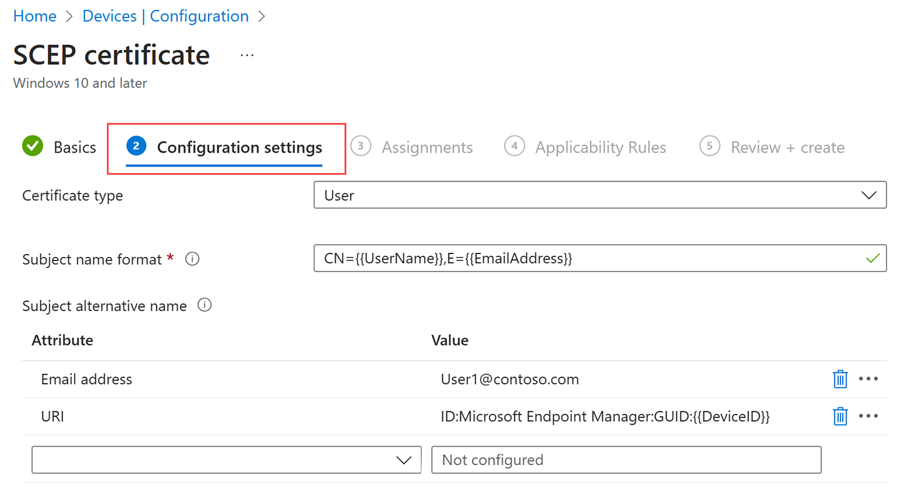
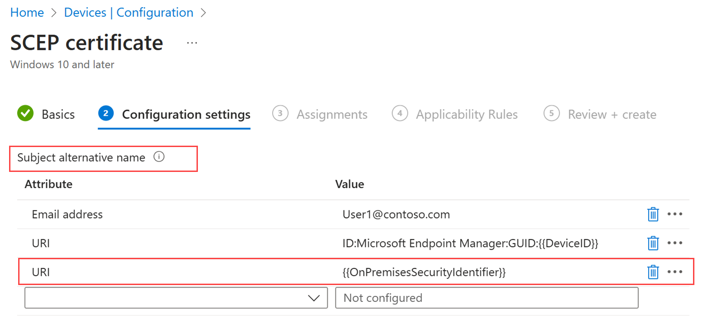

# Create and assign SCEP certificate profiles in Intune 

After you [configure your infrastructure](certificates-scep-configure.md) to support Simple Certificate Enrollment Protocol (SCEP) certificates, you can create and then assign SCEP certificate profiles to users and devices in Intune.

For devices to use a SCEP certificate profile, they must trust your Trusted Root Certification Authority (CA). Trust of the root CA is best established by deploying a [trusted certificate profile](../protect/certificates-trusted-root.md#create-trusted-certificate-profiles) to the same group that receives the SCEP certificate profile. Trusted certificate profiles provision the Trusted Root CA certificate.

Devices that run Android Enterprise might require a PIN before SCEP can provision them with a certificate. For more information, see [PIN requirement for Android Enterprise](../protect/certificates-scep-configure.md#pin-requirement-for-android-enterprise).


 [!INCLUDE [android_device_administrator_support](../includes/android-device-administrator-support.md)]

> [!NOTE]
> Beginning with Android 11, trusted certificate profiles can no longer install the trusted root certificate on devices that are enrolled as *Android device administrator*. This limitation does not apply to Samsung Knox.
>
> For more information about this limitation, see [Trusted certificate profiles for Android device administrator](../protect/certificates-trusted-root.md#trusted-certificate-profiles-for-android-device-administrator).

 [!INCLUDE [windows-phone-81-windows-10-mobile-support](../includes/windows-phone-81-windows-10-mobile-support.md)] 

> [!TIP]
> *SCEP certificate* profiles are supported for [Windows Enterprise multi-session remote desktops](../fundamentals/azure-virtual-desktop-multi-session.md).  

## Strong mapping for SCEP certificates  

**Applies to**:  

- Windows 10  
- Windows 11  
- iOS  
- macOS  

One of the ways the Key Distribution Center (KDC) protects against certificate spoofing is by requiring certificates to have a strong mapping in Active Directory. This requirement applies to certificates issued for a user or device object. Manual and offline certificates must have a subject alternative name (SAN) with the following tag-based URI:   
 
`URI=tag:microsoft.com,2022-09-14:sid:<OnPremisesSecurityIdentifier>`

Microsoft Intune automatically adds the tag-based URI when the *OnPremisesSecurityIdentifier* variable is present in the SAN. Upon deployment, Microsoft Intune replaces the variable with the user or device SID you synced between Active Directory and Microsoft Entra ID.  

To create a SCEP certificate profile that's compliant with the KDC, complete these prerequisites:  

1. Identify the user or device security identifier (SID) in Active Directory. 
   - The SID is supported in device certificates for Microsoft Entra hybrid joined devices only.  
   
   - To add a SID for iOS or macOS, use user certificates.  

2. Sync the user or device SID from Active Directory to Microsoft Entra ID. For more information, see [How objects and credentials are synchronized in a Microsoft Entra Domain Services managed domain](). If you skip this step, the SID won't be in the certificate.   

To configure the SID, [create a SCEP certificate profile](#create-a-scep-certificate-profile) in the Microsoft Intune admin center. Or edit an existing certificate profile and add the URI attribute. Microsoft Intune deploys new certificates to targeted users and devices. 
After you add the URI attribute and value to the certificate profile, Microsoft Intune appends the SAN attribute with the tag and an object ID. Example formatting: `tag.com,2022-09-14:sid:<OnPremisesObjectSIDValue>` 

   > [!div class="mx-imgBorder"]
   >    


   > [!div class="mx-imgBorder"]
   >   

If the certificates in certificate-based authentication scenarios are without a SID by the full enforcement mode date, authentication will be denied. For more information about the KDC's requirements and enforcement date for strong mapping, see [KB5014754: Certificate-based authentication changes on Windows domain controllers ](https://support.microsoft.com/topic/kb5014754-certificate-based-authentication-changes-on-windows-domain-controllers-ad2c23b0-15d8-4340-a468-4d4f3b188f16).  

## Create a SCEP certificate profile

1. Sign in to the [Microsoft Intune admin center](https://go.microsoft.com/fwlink/?linkid=2109431).

2. Select  and go to **Devices** > **Manage devices** > **Configuration** > **Create**.

3. Enter the following properties:
   - **Platform**: Choose the platform of your devices.
   - **Profile**: Select **SCEP certificate**. Or, select **Templates** > **SCEP certificate**.

     For **Android Enterprise**, *Profile type* is divided into two categories, *Fully Managed, Dedicated, and Corporate-Owned Work Profile* and *Personally-Owned Work Profile*. Be sure to select the correct SCEP certificate profile for the devices you manage.  

     SCEP certificate profiles for the *Fully Managed, Dedicated, and Corporate-Owned Work Profile* profile have the following limitations:

     1. Under Monitoring, certificate reporting isn't available for **Device Owner** SCEP certificate profiles.
     1. You can't use Intune to revoke certificates that were provisioned by SCEP certificate profiles for **Device Owner**. You can manage revocation through an external process or directly with the certification authority.
     1. For Android Enterprise dedicated devices, SCEP certificate profiles are supported for Wi-Fi network configuration, VPN, and authentication. SCEP certificate profiles on Android Enterprise dedicated devices aren't supported for app authentication.

     For **Android (AOSP)**, the following limitations apply:

     1. Under Monitoring, certificate reporting isn't available for **Device Owner** SCEP certificate profiles.
     1. You can't use Intune to revoke certificates that were provisioned by SCEP certificate profiles for **Device Owners**. You can manage revocation through an external process or directly with the certification authority.
     1. SCEP certificate profiles are supported for Wi-Fi network configuration.  VPN configuration profile support isn't available. A future update might include support for VPN configuration profiles.  
     1. The following variables aren't available for use on Android (AOSP) SCEP certificate profiles.  Support for these variables will come in a future update.
        - onPremisesSamAccountName
        - OnPrem_Distinguished_Name
        - Department

     > [!NOTE]
     > **Device Owner** is equivalent to Corporate Owned devices. The following are considered as Device Owner:
     > - Android Enterprise - Fully Managed, Dedicated, and Corporate-Owned Work Profile
     > - Android AOSP
     >   - User-affinity
     >   - User-less

4. Select **Create**.

5. In **Basics**, enter the following properties:
   - **Name**: Enter a descriptive name for the profile. Name your profiles so you can easily identify them later. For example, a good profile name is *SCEP profile for entire company*.
   - **Description**: Enter a description for the profile. This setting is optional, but recommended.

6. Select **Next**.

7. In **Configuration settings**, complete the following configurations:

   - **Certificate type**:

     *(Applies to:  Android, Android Enterprise, Android (AOSP), iOS/iPadOS, macOS, Windows 8.1, and Windows 10/11)*

     Select a type, depending on how you plan to use the certificate profile:

     - **User**: *User* certificates can contain both user and device attributes in the subject and SAN of the certificate.

     - **Device**:  *Device* certificates can only contain device attributes in the subject and SAN of the certificate.

       Use **Device** for scenarios such as user-less devices, like kiosks, or for Windows devices. On Windows devices, the certificate is placed in the Local Computer certificate store.

     > [!NOTE]
     > Storage of certificates provisioned by SCEP:
     > - *macOS* - Certificates you provision with SCEP are always placed in the system keychain (System store) of the device.
     >
     > - *Android* - Devices have both a *VPN and apps* certificate store, and a *WIFI* certificate store.  Intune always stores SCEP certificates in the VPN and apps store on a device. Use of the VPN and apps store makes the certificate available for use by any other app.  
     >
     >   However, when a SCEP certificate is also associated with a Wi-Fi profile, Intune also installs the certificate in the Wi-Fi store.
     >   
     >   When configured for VPN apps, user will be prompted to select the correct certificate. Silent certificate approval for Fully Managed (or BYOD scenarios) is not supported. If everything is setup correctly, the correct certificate should already be preselected in the dialog box. 

   - **Subject name format**:

     Enter text to tell Intune how to automatically create the subject name in the certificate request. Options for the subject name format depend on the Certificate type you select, either **User** or **Device**.

     > [!TIP]
     > If your subject name length exceeds 64 characters, you might need to disable name length enforcement on your internal Certification Authority. For more information, see [*Disable DN Length Enforcement*](/previous-versions/windows/it-pro/windows-server-2003/cc784789(v=ws.10)#disable-dn-length-enforcement)

     > [!NOTE]
     > There is a [known issue](#avoid-certificate-signing-requests-with-escaped-special-characters) for using SCEP to get certificates when the subject name in the resulting Certificate Signing Request (CSR) includes one of the following characters as an escaped character (proceeded by a backslash \\):
     >
     > - \+
     > - ;
     > - ,
     > - =

     > [!NOTE]
     > Beginning with Android 12, Android no longer supports use of the following hardware identifiers for *personally owned work profile* devices:
     >
     > - Serial number
     > - IMEI
     > - MEID
     >
     > Intune certificate profiles for personally owned work profile devices that rely on these variables in the subject name or SAN will fail to provision a certificate on devices that run Android 12 or later at the time the device enrolled with Intune. Devices that enrolled prior to upgrade to Android 12 can still receive certificates so long as Intune previously obtained the devices hardware identifiers.
     >
     >For more information about this and other changes introduced with Android 12, see the [Android Day Zero Support for Microsoft Endpoint Manager](https://techcommunity.microsoft.com/t5/intune-customer-success/android-12-day-zero-support-with-microsoft-endpoint-manager/ba-p/2621665) blog post.

     - **User certificate type**

       Use the text box to enter a custom subject name format, including static text and variables. Two variable options are supported: **Common Name (CN)** and **Email (E)**.

       **Email (E)** would usually be set with the {{EmailAddress}} variable. For example: **E={{EmailAddress}}**

       **Common Name (CN)** can be set to any of the following variables:

       - **CN={{UserName}}**: The user name of the user, such as janedoe. 
       - **CN={{UserPrincipalName}}**: The user principal name of the user, such as janedoe@contoso.com.
       - **CN={{AAD_Device_ID}}**: An ID assigned when you register a device in Microsoft Entra ID. This ID is typically used to authenticate with Microsoft Entra ID.
       - **CN={{DeviceId}}**: An ID assigned when you enroll a device in Intune.
        > [!NOTE]
         > Avoid using {{DeviceId}} for subject name on Windows devices. In certain instances, certificate generated with this subject name causes sync with Intune to fail.
       - **CN={{SERIALNUMBER}}**: The unique serial number (SN) typically used by the manufacturer to identify a device.
       - **CN={{IMEINumber}}**: The International Mobile Equipment Identity (IMEI) unique number used to identify a mobile phone.
       - **CN={{OnPrem_Distinguished_Name}}**: A sequence of relative distinguished names separated by comma, such as *CN=Jane Doe,OU=UserAccounts,DC=corp,DC=contoso,DC=com*.

         To use the *{{OnPrem_Distinguished_Name}}* variable:
         - Be sure to sync the *onpremisesdistinguishedname* user attribute using [Microsoft Entra Connect](/azure/active-directory/connect/active-directory-aadconnect) to your Microsoft Entra ID.
         - If the CN value contains a comma, the Subject name format must be in quotes. For example: **CN="{{OnPrem_Distinguished_Name}}"**
        
       - **CN={{OnPremisesSamAccountName}}**: Admins can sync the samAccountName attribute from Active Directory to Microsoft Entra ID using Microsoft Entra Connect into an attribute called *onPremisesSamAccountName*. Intune can substitute that variable as part of a certificate issuance request in the subject of a certificate. The samAccountName attribute is the user sign-in name used to support clients and servers from a previous version of Windows (pre-Windows 2000). The user sign-in name format is: *DomainName\testUser*, or only *testUser*.

         To use the *{{OnPremisesSamAccountName}}* variable, be sure to sync the *OnPremisesSamAccountName* user attribute using [Microsoft Entra Connect](/azure/active-directory/connect/active-directory-aadconnect) to your Microsoft Entra ID.

       All device variables listed in the following *Device certificate type* section can also be used in user certificate subject names.

       By using a combination of one or many of these variables and static text strings, you can create a custom subject name format, such as: **CN={{UserName}},E={{EmailAddress}},OU=Mobile,O=Finance Group,L=Redmond,ST=Washington,C=US**

       That example includes a subject name format that uses the CN and E variables, and strings for Organizational Unit, Organization, Location, State, and Country values. [CertStrToName function](/windows/win32/api/wincrypt/nf-wincrypt-certstrtonamea) describes this function, and its supported strings.

       User attributes aren't supported for devices that don’t have user associations, such as devices that are enrolled as Android Enterprise dedicated. For example, a profile that uses *CN={{UserPrincipalName}}* in the subject or SAN won’t be able to get the user principal name when there's no user on the device.

     - **Device certificate type**

       Format options for the Subject name format include the following variables:

       - **{{AAD_Device_ID}}** or **{{AzureADDeviceId}}** - Either variable can be used to identify a device by its Microsoft Entra ID.
       - **{{DeviceId}}** - The Intune device ID
       - **{{Device_Serial}}**
       - **{{Device_IMEI}}**
       - **{{SerialNumber}}**
       - **{{IMEINumber}}**
       - **{{WiFiMacAddress}}**
       - **{{IMEI}}**
       - **{{DeviceName}}**
       - **{{FullyQualifiedDomainName}}** *(Only applicable for Windows and domain-joined devices)*
       - **{{MEID}}**
      

       You can specify these variables and static text in the textbox. For example, the common name for a device named *Device1* can be added as **CN={{DeviceName}}Device1**.

       > [!IMPORTANT]
       >
       > - When you specify a variable, enclose the variable name in double curly brackets {{ }} as seen in the example, to avoid an error.  
       > - Device properties used in the *subject* or *SAN* of a device certificate, like **IMEI**, **SerialNumber**, and **FullyQualifiedDomainName**, are properties that could be spoofed by a person with access to the device.
       > - A device must support all variables specified in a certificate profile for that profile to install on that device.  For example, if **{{IMEI}}** is used in the subject name of a SCEP profile and is assigned to a device that doesn't have an IMEI number, the profile fails to install.

   - **Subject alternative name**:  
     Configurethe subject alternative name (SAN) in the certificate request. You can enter more than one subject alternative name. The text value can contain variables and static text for the attribute.

     > [!NOTE]
     > The following Android Enterprise profiles don’t support use of the {{UserName}} variable for the SAN:  
     >
     > - Fully Managed, Dedicated, and Corporate-Owned Work Profile


     Select from the available SAN attributes:  

     - **Email address**
     - **User principal name (UPN)**
     - **DNS**
     - **Uniform Resource Identifier (URI)**

     The type of certificate you choose determines the SAN variable.  

     > [!NOTE]
     > Beginning with Android 12, Android no longer supports use of the following hardware identifiers for *personally owned work profile* devices:
     >
     > - Serial number
     > - IMEI
     > - MEID
     >
     > Intune certificate profiles for personally owned work profile devices that rely on these variables in the subject name or SAN will fail to provision a certificate on devices that run Android 12 or later at the time the device enrolled with Intune. Devices that enrolled prior to upgrade to Android 12 can still receive certificates so long as Intune previously obtained the devices hardware identifiers.
     >
     >For more information about this and other changes introduced with Android 12, see the [Android Day Zero Support for Microsoft Endpoint Manager](https://techcommunity.microsoft.com/t5/intune-customer-success/android-12-day-zero-support-with-microsoft-endpoint-manager/ba-p/2621665) blog post.   

     - **User certificate type**

        With the *user* certificate type, you can use any of the user or device certificate variables described above in the Subject Name section. 

        For example, user certificate types can include the user principal name (UPN) in the subject alternative name. If a client certificate is used to authenticate to a Network Policy Server, set the subject alternative name to the UPN.  

        Microsoft Intune also supports *OnPremisesSecurityIdentifier*, a SID variable that's compliant with the KDC's strong mapping requirements for certificate-based authentication. You should add the SID variable to user certificates that  authenticate with the KDC. You can add the variable, formatted as **{{OnPremisesSecurityIdentifier}}**, to new and existing profiles in the Microsoft Intune admin center. This variable is supported in user certificates for macOS, iOS, and Windows 10/11, and only works with the URI attribute.         

     - **Device certificate type**

        With the *device* certificate type, you can use any of the variables described in the *Device certificate type* section for Subject Name. 

        To specify a value for an attribute, include the variable name with curly brackets, followed by the text for that variable. For example, a value for the DNS attribute can be added **{{AzureADDeviceId}}.domain.com** where *.domain.com* is the text. For a user named *User1* an Email address might appear as {{FullyQualifiedDomainName}}User1@Contoso.com.  

        By using a combination of one or many of these variables and static text strings, you can create a custom subject alternative name format, such as **{{UserName}}-Home**.  
        
        Microsoft Intune also supports *OnPremisesSecurityIdentifier*, a variable that's compliant with the KDC's strong mapping requirements for certificate-based authentication. You should add the SID variable to device certificates that  authenticate with the KDC. You can add the variable, formatted as **{{OnPremisesSecurityIdentifier}}**, to new and existing profiles in the Microsoft Intune admin center. This variable is only supported in device certificates for Microsoft Entra hybrid joined devices, and only works with the URI attribute.    


        > [!IMPORTANT]
        >
        > - When using a device certificate variable, enclose the variable name in double curly brackets {{ }}.
        > - Don't use curly brackets **{ }**, pipe symbols **|**, and semicolons **;**, in the text that follows the variable.
        > - Device properties used in the *subject* or *SAN* of a device certificate, like **IMEI**, **SerialNumber**, and **FullyQualifiedDomainName**, are properties that could be spoofed by a person with access to the device.
        > - A device must support all variables specified in a certificate profile for that profile to install on that device.  For example, if **{{IMEI}}** is used in the SAN of a SCEP profile and is assigned to a device that doesn't have an IMEI number, the profile fails to install.  
              
        Microsoft Intune also supports *OnPremisesSecurityIdentifier*, a SID variable you can use to create a strong mapping in the user certificate. This variable is required for certificate-based authentication against the KDC. You can add the variable, formatted as **{{OnPremisesSecurityIdentifier}}**, to new and existing profiles in the Microsoft Intune admin center. 

   - **Certificate validity period**:

     You can enter a value that is lower than the validity period in the certificate template, but not higher. If you configured the certificate template to [support a custom value that can be set from within the Intune admin center](certificates-scep-configure.md#modify-the-validity-period-of-the-certificate-template), use this setting to specify the amount of remaining time before the certificate expires.

     Intune supports a validity period of up to 24 months.

     For example, if the certificate validity period in the certificate template is two years, you can enter a value of one year, but not a value of five years. The value must also be lower than the remaining validity period of the issuing CA's certificate.

     Plan to use a validity period of five days or greater. When the validity period is less than five days, there's a high likelihood of the certificate entering a near-expiry or expired state, which can cause the MDM agent on devices to reject the certificate before it’s installed.

   - **Key storage provider (KSP)**:

     *(Applies to:  Windows 8.1, and Windows 10/11)*

     Specify where the key to the certificate is stored. Choose from the following values:

     - **Enroll to Trusted Platform Module (TPM) KSP if present, otherwise Software KSP**
     - **Enroll to Trusted Platform Module (TPM) KSP, otherwise fail**
     - **Enroll to Windows Hello for Business, otherwise fail (Windows 10 and later)**
     - **Enroll to Software KSP**

   - **Key usage**:

     Select key usage options for the certificate:

     - **Digital signature**: Allow key exchange only when a digital signature helps protect the key.
     - **Key encipherment**: Allow key exchange only when the key is encrypted.

   - **Key size (bits)**:

     Select the number of bits contained in the key:
     - Not configured
     - 1024
     - 2048
     - 4096 - A Key size of 4096 is supported for the following platforms:
       - Android (all)
       - iOS/iPadOS 14 and later
       - macOS 11 and later
       - Windows (all)

       > [!NOTE]
       >
       > For Windows devices, 4096-bit key storage is supported only in the *Software Key Storage Provider* (KSP). The following do not support storing keys of this size:
       >
       > - The hardware TPM (Trusted Platform Module). As a workaround you can use the Software KSP for key storage.
       > - Windows Hello for Business. There is no workaround for Windows Hello for Business at this time.

   - **Hash algorithm**:

     *(Applies to Android, Android (AOSP), Android enterprise, Windows 8.1, and Windows 10/11)*

     Select one of the available hash algorithm types to use with this certificate. Select the strongest level of security that the connecting devices support.
     
     NOTE: Android AOSP and Android Enterprise devices will select the strongest algorithm supported - SHA-1 will be ignored, and SHA-2 will be used instead. 


   - **Root Certificate**:

     Select the *trusted certificate profile* you previously configured and assigned to applicable users and devices for this SCEP certificate profile. The trusted certificate profile is used to provision users and devices with the Trusted Root CA certificate. For information about the trusted certificate profile, see [Export your trusted root CA certificate](certificates-trusted-root.md#export-the-trusted-root-ca-certificate) and [Create trusted certificate profiles](certificates-trusted-root.md#create-trusted-certificate-profiles) in *Use certificates for authentication in Intune*. 
     > [!NOTE]
     > If you have a multiple level PKI Infastructure, such as a Root Certification Authority and an Issuing Certification Authority, select the top level Trusted Root certificate profile that validates the Issuing Certification Authority.

   - **Extended key usage**:

     Add values for the certificate's intended purpose. In most cases, the certificate requires *client authentication* so that the user or device can authenticate to a server. You can add additional key usages as required.

   - **Renewal threshold (%)**:

     Enter the percentage of the certificate lifetime that remains before the device requests renewal of the certificate. For example, if you enter 20, the renewal of the certificate will be attempted when the certificate is 80% expired. Renewal attempts continue until renewal is successful. Renewal generates a new certificate, which results in a new public/private key pair.
     
     > [!NOTE]
     > Renewal behavior on iOS/iPadOS and macOS: Certificates can only be renewed during the renewal threshold phase. In addition, the device has to be unlocked while synching with Intune. If the renewal was not successful, the expired certificate will remain on the device and Intune does not trigger a renewal anymore. Also, Intune does not offer an option to redeploy expired certificates. Affected devices need to be excluded from the SCEP profile temporarily to remove the expired certificate and request a new one.

   - **SCEP Server URLs**:

     Enter one or more URLs for the NDES Servers that issue certificates via SCEP. For example, enter something like `https://ndes.contoso.com/certsrv/mscep/mscep.dll`.

     To allow devices on the internet to get certificates, you must specify the NDES URL external to your corporate network.  
     The URL can be HTTP or HTTPS. However, to support the following devices, the SCEP Server URL must use HTTPS:
     - Android device administrator
     - Android Enterprise device owner
     - Android Enterprise corporate-owned work profile
     - Android Enterprise personally owned work profile

     You can add additional SCEP URLs for load balancing as needed. Devices make three separate calls to the NDES server. The first is to get the servers capabilities, the next to get a public key, and then to submit a signing request. When you use multiple URLs, it's possible that load balancing might result in a different URL being used for subsequent calls to an NDES Server. If a different server is contacted for a subsequent call during the same request, the request will fail.  

     The behavior for managing the NDES server URL is specific to each device platform:

     - **Android**: The device randomizes the list of URLs received in the SCEP policy, and then works through the list until an accessible NDES server is found. The device then continues to use that same URL and server through the entire process. If the device can’t access any of the NDES servers, the process fails.
     - **iOS/iPadOS**: Intune randomizes the URLs and provides a single URL to a device. If the device can’t access the NDES server, the SCEP request fails.
     - **Windows**: The list of NDES URLs is randomized and then passed to the Windows device, which then tries them in the order received, until one that's available is found. If the device can’t access any of the NDES servers, the process fails.

     If a device fails to reach the same NDES server successfully during any of the three calls to the NDES server, the SCEP request fails. For example, this might happen when a load-balancing solution provides a different URL for the second or third call to the NDES server, or provides a different actual NDES server based on a virtualized URL for NDES. After a failed request, a device tries the process again on its next policy cycle, starting with the randomized list of NDES URLs (or a single URL for iOS/iPadOS).  

8. This step applies only to **Android Enterprise** devices profiles for **Fully Managed, Dedicated, and Corporate-Owned work Profile**.  

   In **Apps**, configure **Certificate access** to manage how certificate access is granted to applications. Choose from:

   - **Require user approval for apps** *(default)* – Users must approve use of a certificate by all applications.
   - **Grant silently for specific apps (require user approval for other apps)** – With this option, select **Add apps**, and then select one or more apps that will silently use the certificate without user interaction.

9. Select **Next**.

10. In **Assignments**, select the user or groups that will receive your profile. For more information on assigning profiles, see [Assign user and device profiles](../configuration/device-profile-assign.md).

    Select **Next**.

11. (*Applies to Windows 10/11 only*) In **Applicability Rules**, specify applicability rules to refine the assignment of this profile. You can choose to assign or not assign the profile based on the OS edition or version of a device.

    For more information, see [Applicability rules](../configuration/device-profile-create.md#applicability-rules) in *Create a device profile in Microsoft Intune*.

12. In **Review + create**, review your settings. When you select Create, your changes are saved, and the profile is assigned. The policy is also shown in the profiles list.

### Avoid certificate signing requests with escaped special characters

There's a known issue for SCEP and PKCS certificate requests that include a Subject Name (CN) with one or more of the following special characters as an escaped character. Subject names that include one of the special characters as an escaped character result in a CSR with an incorrect subject name. An incorrect subject name results in the Intune SCEP challenge validation failing and no certificate issued.

The special characters are:
- \+
- ,
- ;
- =

When your subject name includes one of the special characters, use one of the following options to work around this limitation:

- Encapsulate the CN value that contains the special character with quotes.  
- Remove the special character from the CN value.

**For example**, you have a Subject Name that appears as *Test user (TestCompany, LLC)*.  A CSR that includes a CN that has the comma between *TestCompany* and *LLC* presents a problem.  The problem can be avoided by placing quotes around the entire CN, or by removing of the comma from between *TestCompany* and *LLC*:

- **Add quotes**: *CN="Test User (TestCompany, LLC)",OU=UserAccounts,DC=corp,DC=contoso,DC=com*
- **Remove the comma**: *CN=Test User (TestCompany LLC),OU=UserAccounts,DC=corp,DC=contoso,DC=com*

 However, attempts to escape the comma by using a backslash character will fail with an error in the CRP logs:
 
- **Escaped comma**: *CN=Test User (TestCompany\\, LLC),OU=UserAccounts,DC=corp,DC=contoso,DC=com*

The error is similar to the following error:

```
Subject Name in CSR CN="Test User (TESTCOMPANY\, LLC),OU=UserAccounts,DC=corp,DC=contoso,DC=com" and challenge CN=Test User (TESTCOMPANY\, LLC),OU=UserAccounts,DC=corp,DC=contoso,DC=com do not match  

  Exception: System.ArgumentException: Subject Name in CSR and challenge do not match

   at Microsoft.ConfigurationManager.CertRegPoint.ChallengeValidation.ValidationPhase3(PKCSDecodedObject pkcsObj, CertEnrollChallenge challenge, String templateName, Int32 skipSANCheck)

Exception:    at Microsoft.ConfigurationManager.CertRegPoint.ChallengeValidation.ValidationPhase3(PKCSDecodedObject pkcsObj, CertEnrollChallenge challenge, String templateName, Int32 skipSANCheck)

   at Microsoft.ConfigurationManager.CertRegPoint.Controllers.CertificateController.VerifyRequest(VerifyChallengeParams value
```

## Assign the certificate profile

Assign SCEP certificate profiles the same way you [deploy device profiles](../configuration/device-profile-assign.md) for other purposes.

> [!IMPORTANT]
> To use a SCEP certificate profile, a device must have also received the trusted certificate profile that provisions it with your Trusted Root CA certificate. We recommend you deploy both the trusted root certificate profile and SCEP certificate profile to the same groups.

Consider the following before you continue:

- When you assign SCEP certificate profiles to groups, the Trusted Root CA certificate file (as specified in the *trusted certificate profile*) is installed on the device. The device uses the SCEP certificate profile to create a certificate request for that Trusted Root CA certificate.

- The SCEP certificate profile installs only on devices that run the platform you specified when you created the certificate profile.

- You can assign certificate profiles to user collections or to device collections.

- To publish a certificate to a device quickly after the device enrolls, assign the certificate profile to a user group rather than to a device group. If you assign to a device group, a full device registration is required before the device receives policies.

- If you use co-management for Intune and Configuration Manager, in Configuration Manager [set the workload slider](/configmgr/comanage/how-to-switch-workloads) for Resource Access Policies to **Intune** or **Pilot Intune**. This setting allows Windows 10/11 clients to start the process of requesting the certificate.

> [!NOTE]
> - On iOS/iPadOS and macOS devices, when a SCEP certificate profile or a PKCS certificate profile is associated with an additional profile, like a Wi-Fi or VPN profile, the device receives a certificate for each of those additional profiles. This results in the device having multiple certificates delivered by the SCEP or PKCS certificate request.
> - Certificates delivered by SCEP are each unique. Certificates delivered by PKCS are the same certificate, but appear different as each profile instance is represented by a separate line in the management profile.
> - On iOS 13 and macOS 10.15, there are [additional security requirements that are documented by Apple](https://support.apple.com/HT210176) to take into consideration.  

## Next steps

[Assign profiles](../configuration/device-profile-assign.md)

[Troubleshoot deployment of SCEP certificate profiles](/troubleshoot/mem/intune/troubleshoot-scep-certificate-profiles)
