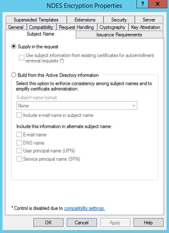
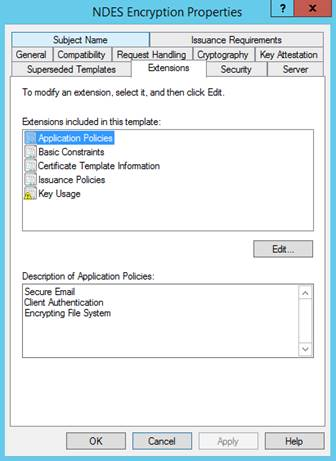
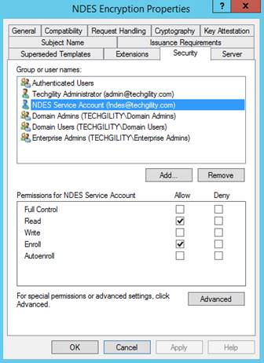
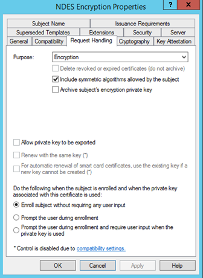
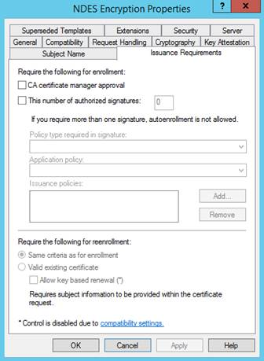
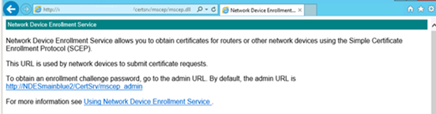
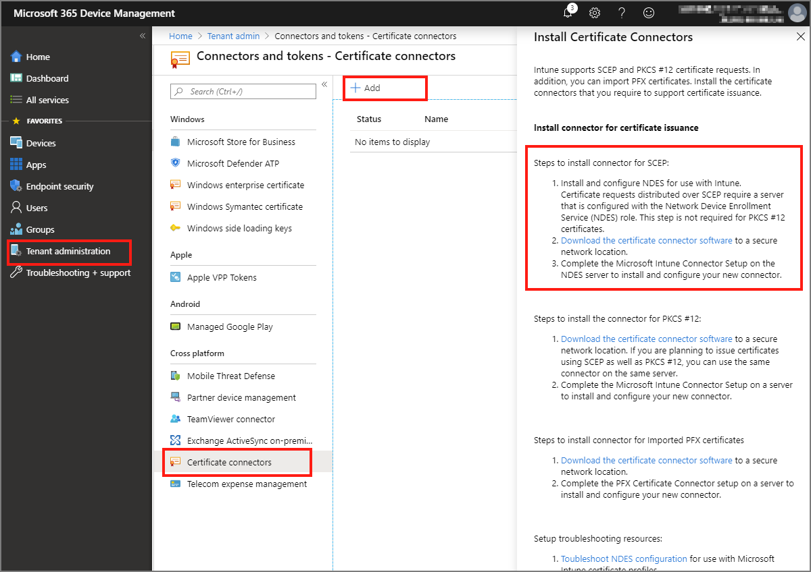

# Configure infrastructure to support SCEP with Intune

Intune supports use of the Simple Certificate Enrollment Protocol (SCEP) to [authenticate connections to your apps and corporate resources](certificates-configure.md). SCEP uses the Certification Authority (CA) certificate to secure the message exchange for the Certificate Signing Request (CSR). When your infrastructure supports SCEP, you can use Intune *SCEP certificate* profiles (a type of device profile in Intune) to deploy the certificates to your devices.

The [Certificate Connector for Microsoft Intune](../protect/certificate-connector-overview.md) is required to use SCEP certificate profiles with Intune when you also use an Active Directory Certificate Services Certification Authority, also called a *Microsoft CA*. The connector isn't supported on the same server as your issuing Certification Authority (CA). The connector isn't required when using [Third-party Certification Authorities](certificate-authority-add-scep-overview.md#set-up-third-party-ca-integration).

The information in this article can help you configure your infrastructure to support SCEP when using Active Directory Certificate Services. After your infrastructure is configured, you can [create and deploy SCEP certificate profiles](certificates-profile-scep.md) with Intune.

> [!TIP]
> Intune also supports use of [Public Key Cryptography Standards #12 certificates](certificates-pfx-configure.md).

## Prerequisites for using SCEP for certificates

Before you continue, ensure you've [created and deployed a *trusted certificate* profile](certificates-trusted-root.md#export-the-trusted-root-ca-certificate) to devices that will use SCEP certificate profiles. SCEP certificate profiles directly reference the trusted certificate profile that you use to provision devices with a Trusted Root CA certificate.

- [Servers and server roles](#servers-and-server-roles)
- [Accounts](#accounts)
- [Network requirements](#network-requirements)
- [Certificates and templates](#certificates-and-templates)
- [PIN requirement for Android Enterprise](#pin-requirement-for-android-enterprise)

### Servers and server roles

To support SCEP, the following on-premises infrastructure must run on servers that are domain-joined to your Active Directory, with the exception of the Web Application Proxy Server.

- **Certificate Connector for Microsoft Intune** – The Certificate Connector for Microsoft Intune is required to use SCEP certificate profiles with Intune when you use a Microsoft CA. It installs on the server that also runs the NDES server role. However, the connector isn't supported on the same server as your issuing Certification Authority (CA).

  For information about the certificate connector, see:

  - Overview of the [Certificate Connector for Microsoft Intune](certificate-connector-overview.md).
  - [Prerequisites](certificate-connector-prerequisites.md).
  - [Installation and configuration](certificate-connector-install.md).

- **Certification Authority** – Use a Microsoft Active Directory Certificate Services Enterprise Certification Authority (CA) that runs on an Enterprise edition of Windows Server 2008 R2 with service pack 1, or later. The version of Windows Server you use must remain in support by Microsoft. A Standalone CA isn't supported. For more information, see [Install the Certification Authority](/previous-versions/windows/it-pro/windows-server-2012-R2-and-2012/jj125375(v=ws.11)).

  If your CA runs Windows Server 2008 R2 SP1, you must [install the hotfix from KB2483564](https://support.microsoft.com/kb/2483564/).

- **NDES server role** – To support using the Certificate Connector for Microsoft Intune with SCEP, you must configure the Windows Server that will host the certificate connector with the Network Device Enrollment Service (NDES) server role. The connector supports installation on Windows Server 2012 R2 or later. In a later section of this article, we guide you through [installing NDES](#set-up-ndes).

  - The server that hosts NDES and the connector must be domain-joined and in the same forest as your Enterprise CA.
  - Do not use NDES that's installed on the server that hosts the Enterprise CA. This configuration represents a security risk when the CA services internet requests, and installation of the connector isn't supported on the same server as your issuing Certification Authority (CA).
  - Internet Explorer Enhanced Security Configuration [must be disabled on the server that hosts NDES](/previous-versions/windows/it-pro/windows-server-2003/cc775800(v=ws.10)) and the Microsoft Intune Connector.

  To learn more about NDES, see [Network Device Enrollment Service Guidance](/previous-versions/windows/it-pro/windows-server-2012-R2-and-2012/hh831498(v=ws.11)) in the Windows Server documentation, and [Using a Policy Module with the Network Device Enrollment Service](/previous-versions/windows/it-pro/windows-server-2012-R2-and-2012/dn473016(v=ws.11)). To learn how to configure high availability for NDES, see [High Availability](/windows/security/identity-protection/hello-for-business/hello-hybrid-aadj-sso-cert#high-availability).

#### Support for NDES on the internet

To allow devices on the internet to get certificates, you must publish your NDES URL external to your corporate network. To do this, you can use a reverse proxy like *Azure AD Application Proxy*, *Microsoft’s Web Application Proxy Server*, or a third-party reverse proxy service or device.

- **Azure AD Application Proxy** – You can use the Azure AD Application Proxy instead of a dedicated Web Application Proxy (WAP) Server to publish your NDES URL to the internet. This solution allows both intranet and internet facing devices to get certificates. For more information, see [Integrate with Azure AD Application Proxy on a Network Device Enrollment Service (NDES) server](/azure/active-directory/manage-apps/active-directory-app-proxy-protect-ndes).

- **Web Application Proxy Server** - Use a server that runs Windows Server 2012 R2 or later as a Web Application Proxy (WAP) server to publish your NDES URL to the internet. This solution allows both intranet and internet facing devices to get certificates.

  The server that hosts WAP [must install an update](/archive/blogs/ems/hotfix-large-uri-request-in-web-application-proxy-on-windows-server-2012-r2) that enables support for the long URLs that are used by the Network Device Enrollment Service. This update is included with the [December 2014 update rollup](https://support.microsoft.com/kb/3013769), or individually from [KB3011135](https://support.microsoft.com/kb/3011135).

  The WAP server must have an SSL certificate that matches the name that's published to external clients and trust the SSL certificate that's used on the computer that hosts the NDES service. These certificates enable the WAP server to terminate the SSL connection from clients and create a new SSL connection to the NDES service.

  For more information, see [Plan certificates for WAP](/previous-versions/windows/it-pro/windows-server-2012-R2-and-2012/dn383650(v=ws.11)#plan-certificates) and [general information about WAP servers](/previous-versions/windows/it-pro/windows-server-2012-R2-and-2012/dn584113(v=ws.11)).

- **Third-party reverse proxy** – When you use a third-party reverse proxy, ensure that the proxy supports a long URI get request. As part of the certificate request flow, the client makes a request with the certificate request in the query string. As a result, the URI length can be large, up to 40 kb in size.

SCEP protocol limitations prevent use of pre-authentication. When you publish the NDES URL via a reverse proxy server you must have *Pre Authentication* set to *Passthrough*. Intune secures the NDES URL when you install the Intune Certificate connector, by installing an Intune-SCEP policy module on the NDES server. The module helps to secure the NDES URL by preventing certificates from being issued to invalid or digitally tampered certificate requests. This limits access to only Intune enrolled devices that you manage with Intune and that have well-formed certificate requests.

When an Intune SCEP certificate profile is delivered to a device, Intune generates a custom challenge blob that it encrypts and signs. The blob isn't readable by the device. Only the policy module and the Intune service can read and verify the challenge blob.  The blob includes details Intune expects will be provided by the device in its certificate signing request (CSR). For example, the expected *Subject* and *Subject Alternative Name* (SAN).

The Intune policy module works to secure NDES in the following ways:

- When attempting to access the published NDES URL directly, the server returns a **403 – Forbidden: Access is denied** response.

- When a well-formed SCEP certificate request is received and the request payload includes both the challenge blob and the device CSR, the policy module compares the details of the device CSR against the challenge blob:

  - If the validation fails, no certificate is issued.

  - Only the certificate requests from an Intune enrolled device that passes the challenge blob validation are issued a certificate.


### Accounts

To configure the connector to support SCEP, you'll need an account that has permissions to configure NDES on the Windows Server and to manage your Certification Authority. For details, see [Accounts](../protect/certificate-connector-prerequisites.md#accounts) in the *Prerequisites for the Certificate Connector for Microsoft Intune* article.

### Network requirements

In addition to the [network requirements](../protect/certificate-connector-prerequisites.md) for the certificate connector, we recommend publishing the NDES service through a reverse proxy, such as the [Azure AD application proxy, Web Access Proxy](/azure/active-directory/app-proxy/application-proxy-add-on-premises-application), or a third-party proxy. If you don't use a reverse proxy, then allow TCP traffic on port 443 from all hosts and IP addresses on the internet to the NDES service.

Allow all ports and protocols necessary for communication between the NDES service and any supporting infrastructure in your environment. For example, the computer that hosts the NDES service needs to communicate with the CA, DNS servers, domain controllers, and possibly other services or servers within your environment, like Configuration Manager.

### Certificates and templates

The following certificates and templates are used when you use SCEP.

|Object    |Details    |
|----------|-----------|
|**SCEP Certificate Template**         |Template you'll configure on your issuing CA used to fullfil the devices SCEP requests. |
|**Server authentication certificate** |Web Server certificate requested from your issuing CA or public CA.<br /> You install and bind this SSL certificate in IIS on the computer that hosts NDES.|
|**Trusted Root CA certificate**       |To use a SCEP certificate profile, devices must trust your Trusted Root Certification Authority (CA). Use a *trusted certificate profile* in Intune to provision the Trusted Root CA certificate to users and devices. <br/><br/> **-**  Use a single Trusted Root CA certificate per operating system platform and associate that certificate with each trusted certificate profile you create. <br /><br /> **-**  You can use additional Trusted Root CA certificates when needed. For example, you might use additional certificates to provide a trust to a CA that signs the server authentication certificates for your Wi-Fi access points. Create additional Trusted Root CA certificates for issuing CAs.  In the SCEP certificate profile you create in Intune, be sure to specify the Trusted Root CA profile for the issuing CA.<br/><br/> For information about the trusted certificate profile, see [Export the trusted root CA certificate](certificates-trusted-root.md#export-the-trusted-root-ca-certificate) and [Create trusted certificate profiles](certificates-trusted-root.md#create-trusted-certificate-profiles) in *Use certificates for authentication in Intune*. |

> [!NOTE]
>The following certificate is not used with the Certificate Connector for Microsoft Intune. This information is provided for those who have not yet replaced the older connector for SCEP (installed by NDESConnectorSetup.exe) with the new connector software.
> 
> |Object    |Details    |
> |----------|-----------|
> |**Client authentication certificate** | Requested from your issuing CA or public CA.<br /> You install this certificate on the computer that hosts the NDES service and it's used by the Certificate Connector for Microsoft Intune.<br /> If the certificate has the *client* and *server authentication* key usages set (**Enhanced Key Usages**) on the CA template that you use to issue this certificate, you can then use the same certificate for server and client authentication. |
### PIN requirement for Android Enterprise

For Android Enterprise, the version of encryption on a device determines whether the device must be configured with a PIN before SCEP can provision that device with a certificate. The available encryption types are:

- **Full-disk encryption**, which requires the device have a PIN configured.

- **File-based encryption**, which is required on devices that are installed by the OEM with Android 10 or later. These devices won’t require a PIN. Devices that upgrade to Android 10 might still require a PIN.

> [!NOTE]
>
> Microsoft Endpoint Manager can’t identify the type of encryption on an Android device.

The version of Android on a device can affect the available encryption type:

- **Android 10 and later:** Devices installed with Android 10 or later by the OEM will use file-based encryption and won't require a PIN for SCEP to provision a certificate. Devices that upgrade to version 10 or later and begin to use file-based encryption might still require a PIN.

- **Android 8 to 9**: These versions of Android support the use of file-based encryption, but it’s not required. Each OEM chooses which encryption type to implement for a device. It’s also possible that OEM modifications will result in a PIN not being required even when full-disk encryption is in use.

For more information, see the following articles in the Android documentation:  

- [File-Based Encryption](https://source.android.com/security/encryption/file-based)  
- [Full-Disk Encryption](https://source.android.com/security/encryption/full-disk)

#### Considerations for devices enrolled as Android Enterprise dedicated

For devices enrolled as Android Enterprise dedicated, password enforcement can present challenges.

For devices that run 9.0 and later and receive a kiosk-mode policy, you can use a device compliance or device configuration policy to enforce the password requirement. View [Support Tip: New Google-based Compliance Screens for Kiosk Mode](https://techcommunity.microsoft.com/t5/intune-customer-success/support-tip-new-google-based-compliance-screens-for-kiosk-mode/ba-p/2129719) from the Intune Support Team, to understand the device experience.

For devices that run 8.x and earlier, you can also use a device compliance or device configuration policy to enforce the password requirement. However, to set up a PIN, you’ll need to manually enter the settings application on the device and configure the PIN.

## Configure the certification authority

In the following sections, you'll:

- Configure and publish the required template for NDES
- Set the required permissions for certificate revocation.

The following sections require knowledge of Windows Server 2012 R2 or later, and of Active Directory Certificate Services (AD CS).

### Access your Issuing CA

1. Sign in to your issuing CA with a domain account with rights sufficient to manage the CA.

2. Open the Certification Authority Microsoft Management Console (MMC). Either **Run** 'certsrv.msc' or in **Server Manager**, click **Tools**, and then click **Certification Authority**.

3. Select the **Certificate Templates** node, click **Action** > **Manage**.

### Create the SCEP certificate template

1. Create a v2 Certificate Template (with Windows 2003 compatibility) for use as the SCEP certificate template. You can:

   - Use the *Certificate Templates* snap-in to create a new custom template.
   - Copy an existing template (like the Web Server template) and then update the copy to use as the NDES template.

2. Configure the following settings on the specified tabs of the template:

   - **General**:

     - Uncheck **Publish certificate in Active Directory**.
     - Specify a friendly **Template display name** so you can identify this template later.

   - **Subject Name**:

     - Select **Supply in the request**. Security is enforced by the Intune policy module for NDES.

       

   - **Extensions**:

     - Ensure that **Description of Application Policies** includes **Client Authentication**.

       > [!IMPORTANT]
       > Only add the application policies that you require. Confirm your choices with your security admins.

     - For iOS/iPadOS and macOS certificate templates, also edit **Key Usage** and make sure **Signature is proof of origin** isn't selected.

       

   - **Security**:

     - Add the **NDES service account**. This account requires **Read** and **Enroll** permissions to this template.

     - Add additional Accounts for Intune administrators who will create SCEP profiles. These accounts require **Read** permissions to the template to enable these admins to browse to this template while creating SCEP profiles.

     

   - **Request Handling**:

     The following image is an example. Your configuration might vary.  

     

   - **Issuance Requirements**:

     The following image is an example. Your configuration might vary.

     

3. Save the certificate template.

### Create the client certificate template

> [!NOTE]
>The following certificate is not used with the Certificate Connector for Microsoft Intune. This information is provided for those who have not yet replaced the older connector for SCEP (installed by NDESConnectorSetup.exe) with the new connector software.

The Microsoft Intune Connector requires a certificate with the *Client Authentication* Enhanced Key Usage and Subject name equal to the FQDN of the machine where the connector is installed. A template with the following properties is required:

- **Extensions** > **Application Policies** must contain **Client Authentication**
- **Subject name** > **Supply in the request**.

If you already have a template that includes these properties, you can reuse it, otherwise create a new template by either duplicating an existing one or creating a custom template.


### Create the server certificate template

Communications between managed devices and IIS on the NDES server use HTTPS, which requires use of a certificate. You can use the **Web Server** certificate template to issue this certificate. Or, if you prefer to have a dedicated template, the following properties are required:

- **Extensions** > **Application Policies** must contain **Server Authentication**.
- **Subject name** > **Supply in the request**.
- On the **Security** tab, the computer account of the NDES server must have **Read** and **Enroll** permissions.

> [!NOTE]
> If you have a certificate that satisfies both requirements from the client and server certificate templates, you can use a single certificate for both IIS and the certificate connector.

### Grant permissions for certificate revocation

For Intune to be able to revoke certificates that are no longer required, you must grant permissions in the Certificate Authority.

On the server that hosts the certificate connector, use either the NDES server **system account** or a specific account such as the **NDES service account**.

1. On your Certificate Authority console, Right-click the CA name and select **Properties**.

2. In **Security** tab, click **Add**.

3. Grant **Issue and Manage Certificates** permission:

   - If you opt to use the NDES server **system account**, provide the permissions to the NDES server.
   - If you opt to use the **NDES service account**, provide permissions for that account instead.

### Modify the validity period of the certificate template

It's optional to modify the validity period of the certificate template.  

After you [create the SCEP certificate template](#create-the-scep-certificate-template), you can edit the template to review the **Validity period** on the **General** tab.

By default, Intune uses the value configured in the template, but you can configure the CA to allow the requester to enter a different value, so that value can be set from within the Microsoft Intune admin center.

Plan to use a validity period of five days or greater. When the validity period is less than five days, there is a high likelihood of the certificate entering a near-expiry or expired state, which can cause the MDM agent on devices to reject the certificate before it’s installed.

> [!IMPORTANT]
> For iOS/iPadOS and macOS, always use a value set in the template.

#### To configure a value that can be set from within the Microsoft Intune admin center

On the CA, run the following commands:

   **certutil -setreg Policy\EditFlags +EDITF_ATTRIBUTEENDDATE**  
   **net stop certsvc**  
   **net start certsvc**  

## Publish certificate templates

1. On the issuing CA, use the Certification Authority snap-in to publish the certificate template. Select the **Certificate Templates** node, select **Action** > **New** > **Certificate Template to Issue**, and then select the certificate template you created in the previous section.

2. Validate that the template has published by viewing it in the **Certificate Templates** folder.

## Set up NDES

The following procedures can help you configure the Network Device Enrollment Service (NDES) for use with Intune. These are provided as examples as the actual configuration might vary depending on your version of Windows Server. Ensure required configurations you add like those for .NET Framework meet the [prerequisites for the Certificate Connector for Microsoft Intune](../protect/certificate-connector-prerequisites.md).

For more information about NDES, see [Network Device Enrollment Service Guidance](/previous-versions/windows/it-pro/windows-server-2012-R2-and-2012/hh831498(v=ws.11)).

### Install the NDES service

1. On the server that will host your NDES service, sign in as an **Enterprise Administrator**, and then use the [Add Roles and Features Wizard](/previous-versions/windows/it-pro/windows-server-2012-R2-and-2012/hh831809(v=ws.11)) to install NDES:

   1. In the Wizard, select **Active Directory Certificate Services** to gain access to the AD CS Role Services. Select **Network Device Enrollment Service**, uncheck **Certification Authority**, and then complete the wizard.

      > [!TIP]
      > In **Installation progress**, don't select **Close**. Instead, select the **Configure Active Directory Certificate Services on the destination server** link. The **AD CS Configuration** wizard opens, which you use for the next procedure in this article, *Configure the NDES service*. After AD CS Configuration opens, you can close the Add Roles and Features wizard.

   2. When NDES is added to the server, the wizard also installs IIS. Confirm that IIS has the following configurations:

      - **Web Server** > **Security** > **Request Filtering**
      - **Web Server** > **Application Development** > **ASP.NET 3.5**

        Installing ASP.NET 3.5 installs .NET Framework 3.5. When installing .NET Framework 3.5, install both the core **.NET Framework 3.5** feature and **HTTP Activation**.

      - **Web Server** > **Application Development** > **ASP.NET 4.7.2**

        Installing ASP.NET 4.7.2 installs .NET Framework 4.7.2. When installing .NET Framework 4.7.2, install the core **.NET Framework 4.7.2** feature, **ASP.NET 4.7.2**, and the **WCF Services** > **HTTP Activation** feature.

      - **Management Tools** > **IIS 6 Management Compatibility** > **IIS 6 Metabase Compatibility**
      - **Management Tools** > **IIS 6 Management Compatibility** > **IIS 6 WMI Compatibility**
      - On the server, add the NDES service account as a member of the local **IIS_IUSR** group.

2. On the computer that hosts the NDES service, run the following command in an elevated command prompt. The following command sets the SPN of the NDES Service account:

   `setspn -s http/<DNS name of the computer that hosts the NDES service> <Domain name>\<NDES Service account name>`

   For example, if the computer that hosts the NDES service is named **Server01**, your domain is **Contoso.com**, and the service account is **NDESService**, use:

   `setspn –s http/Server01.contoso.com contoso\NDESService`  

### Configure the NDES service

To configure the NDES service, use an account that is an *Enterprise Administrator*.
 
1. On the computer that hosts the NDES service, open the **AD CS Configuration** wizard, and then make the following updates:

   > [!TIP]
   > If you're continuing on from the last procedure and clicked the **Configure Active Directory Certificate Services on the destination server** link, this wizard should already be open. Otherwise, open Server Manager to access the post-deployment configuration for Active Directory Certificate Services.

   - In **Role Services**, select the **Network Device Enrollment Service**.
   - In **Service Account for NDES**, specify the NDES Service Account.
   - In **CA for NDES**, click **Select**, and then select the issuing CA where you configured the certificate template.
   - In **Cryptography for NDES**, set the key length to meet your company requirements.
   - In **Confirmation**, select **Configure** to complete the wizard.

2. After the wizard completes, update the following registry key on the computer that hosts the NDES service:

   `HKEY_LOCAL_MACHINE\SOFTWARE\Microsoft\Cryptography\MSCEP\`

   To update this key, identify the certificate templates' **Purpose** (found on its **Request Handling** tab). Then, update the corresponding registry entry by replacing the existing data with the name of the certificate template (not the display name of the template) that you specified when you [created the certificate template](#create-the-scep-certificate-template).

   The following table maps the certificate template purpose to the values in the registry:

   |Certificate template Purpose (On the Request Handling tab)|Registry value to edit|Value seen in the Microsoft Intune admin center for the SCEP profile|
   |------------------------|-------------------------|---|
   |Signature               |SignatureTemplate        |Digital Signature |
   |Encryption              |EncryptionTemplate       |Key Encipherment  |
   |Signature and encryption|GeneralPurposeTemplate   |Key Encipherment <br/> Digital Signature |

   For example, if the Purpose of your certificate template is **Encryption**, then edit the **EncryptionTemplate** value to be the name of your certificate template.

3. Restart the server that hosts the NDES service. Don't use **iisreset**; iireset doesn't complete the required changes.

4. Browse to *http://*Server_FQDN*/certsrv/mscep/mscep.dll*. You should see an NDES page similar to the following image:

   

   If the web address returns a **503 Service unavailable**, check the computers event viewer. This error commonly occurs when the application pool is stopped due to a missing [permission for the NDES service account](#accounts).
  
### Install and bind certificates on the server that hosts NDES

On the NDES server, add a **Server authentication certificate**.


- **Server authentication certificate**

  This certificate is used in IIS. It's a simple Web server certificate that allows the client to trust NDES URL.

  1. Request a **server authentication** certificate from your internal CA or public CA, and then install the certificate on the server.

     Depending how you expose your NDES to the internet, there are different requirements. 

     A good configuration is:

     - A **Subject Name**: Set a CN (Common Name) with a value that must be equal to the FQDN of the server where you're installing the certificate (the NDES Server).
     - A **Subject Alternative Name**: Set DNS entries for every URL your NDES is responding to, such as the internal FQDN and the external URLs.

     > [!NOTE]
     > If you are using Azure AD App Proxy, the AAD App Proxy connector will translate the requests from the external URL to the internal URL.
     > As such, NDES will only respond to requests directed to the internal URL, usually the FQDN of the NDES Server.
     >
     > In this situation, the external URL is not required.

  2. Bind the server authentication certificate in IIS:

     1. After installing the server authentication certificate, open **IIS Manager**, and select the **Default Web Site**. In the **Actions** pane, select **Bindings**.

     2. Select **Add**, set **Type** to **https**, and then confirm the port is **443**.

     3. For **SSL certificate**, specify the server authentication certificate.


> [!NOTE]
> When configuring NDES for the Certificate Connector for Microsoft Intune , only the Server authentication certificate is used. If you're configuring NDES to support the older certificate connector (NDESConnectorSetup.exe), you must also configure a *Client authentication certificate*. You can use a single certificate for both *server authentication* and *client authentication* when that certificate is configured to meet the criteria of both uses. 
> Regarding the Subject Name, it must meet the *client authentication* certificate requirements.
>
> The following information is provided for those who have not yet replaced the older connector for SCEP (installed by NDESConnectorSetup.exe) with the new connector software.
>
> - **Client authentication certificate**
>
>   This certificate is used during install of the Certificate Connector for Microsoft Intune to support SCEP.
>
>   Request and install a **client authentication** certificate from your internal CA, or a public certificate authority.
>
>   The certificate must meet the following requirements:
>
>   - **Enhanced Key Usage**: This value must include **Client Authentication**.
>   - **Subject Name**: Set a CN (Common Name) with a value that must be equal to the FQDN of the server where you're installing the certificate (the NDES Server).
## Download, install, and configure the Certificate Connector for Microsoft Intune

For guidance, see [Install and configure the Certificate Connector for Microsoft Intune](certificate-connector-install.md).

- The certificate connector installs on the server that runs your NDES service.
- The connector isn't supported on the same server as your issuing Certification Authority (CA).

<!-- Deprecated for the new connector and its dedicated install article >

### To install the Certificate Connector

1. Sign in to the [Microsoft Intune admin center](https://go.microsoft.com/fwlink/?linkid=2109431).

2. Select **Tenant administration** > **Connectors and tokens** > **Certificate connectors** > **Add**.

3. Download and save the connector for SCEP file. Save it to a location accessible from the server where you're going to install the connector.

   

4. After the download completes, go to the server hosting the Network Device Enrollment Service (NDES) role. Then:

   1. Confirm that .NET 4.5 Framework is installed, as it's required by the Microsoft Intune Connector. The .NET 4.5 Framework is automatically included with Windows Server 2012 R2 and newer versions.

   2. Use an account with admin permissions to the server to run the installer (**NDESConnectorSetup.exe**). The installer also installs the policy module for NDES and the IIS Certificate Registration Point (CRP) Web Service. The CRP Web Service, *CertificateRegistrationSvc*, runs as an application in IIS.

      When you install NDES for standalone Intune, the CRP service automatically installs with the Certificate Connector.

5. When prompted for the client certificate for the Certificate Connector, choose **Select**, and select the **client authentication** certificate you installed on your NDES Server during step #3 of the procedure [Install and bind certificates on the server that hosts NDES](#install-and-bind-certificates-on-the-server-that-hosts-ndes) from earlier in this article.

   After you select the client authentication certificate, you're returned to the **Client Certificate for Microsoft Intune Connector ** surface. Although the certificate you selected isn't shown, select **Next** to view the properties of that certificate. Select **Next**, and then **Install**.

> [!NOTE]
> The following changes must be made for GCC High tenants prior to launching the Microsoft Intune Connector.
> 
> Make edits to the two config files listed below which will update the service endpoints for the GCC High environment. Notice that these updates change the URIs from **.com** to **.us** suffixes. There are a total of three URI updates, two updates within the NDESConnectorUI.exe.config configuration file, and one update in the NDESConnector.exe.config file.
> 
> - File Name: <install_Path>\Microsoft Intune\NDESConnectorUI\NDESConnectorUI.exe.config
> 
>   Example: (%programfiles%\Microsoft Intune\NDESConnectorUI\NDESConnectorUI.exe.config)
>   ```
>    <appSettings>
>        <add key="SignInURL" value="https://portal.manage.microsoft.us/Home/ClientLogon"/>
>        <add key="LocationServiceEndpoint" value="RestUserAuthLocationService/RestUserAuthLocationService/ServiceAddresses"/>
>        <add key="AccountPortalURL" value="https://manage.microsoft.us"/>
>    </appSettings>
>   ```
> 
> - File Name: <install_Path>\Microsoft Intune\NDESConnectorSvc\NDESConnector.exe.config
>
>   Example: (%programfiles%\Microsoft Intune\NDESConnectorSvc\NDESConnector.exe.config)
>    ```
>    <appSettings>
>        <add key="BaseServiceAddress" value="https://manage.microsoft.us/" />
>    ```
>
> If these edits are not completed, GCC High tenants will get the error: "Access Denied" "You are not authorized to view this page"

6. After the wizard completes, but before closing the wizard, **Launch the Certificate Connector UI**.

   If you close the wizard before you launch the Certificate Connector UI, you can reopen it by running the following command:

   *<install_Path>\NDESConnectorUI\NDESConnectorUI.exe*

7. In the **Certificate Connector** UI:

   1. Select **Sign In**, and enter your Intune service administrator credentials, or credentials for a tenant administrator with the global administration permission.

   2. The account you use must be assigned a valid Intune license.

   3. After you sign in, the Microsoft Intune Connector downloads a certificate from Intune. This certificate is used for authentication between the connector and Intune. If the account you used doesn't have an Intune license, the connector (NDESConnectorUI.exe) fails to get the certificate from Intune.  

      If your organization uses a proxy server and the proxy is needed for the NDES server to access the Internet, select **Use proxy server**. Then enter the proxy server name, port, and account credentials to connect.

   4. Select the **Advanced** tab, and then enter credentials for an account that has the **Issue and Manage Certificates** permission on your issuing Certificate Authority. **Apply** your changes.  

    5. You can now close the Certificate Connector UI.

8. Open a command prompt, enter **services.msc**, and then **Enter**. Right-click the **Intune Connector Service** > **Restart**.

To validate that the service is running, open a browser, and enter the following URL. It should return a **403** error: `https://<FQDN_of_your_NDES_server>/certsrv/mscep/mscep.dll`

> [!NOTE]
> The Microsoft Intune Connector supports TLS 1.2. If the server that hosts the connector supports TLS 1.2, then TLS 1.2 is used. If the server doesn't support TLS 1.2, then TLS 1.1 is used.

-->

## Next steps

[Create a SCEP certificate profile](certificates-profile-scep.md)  
