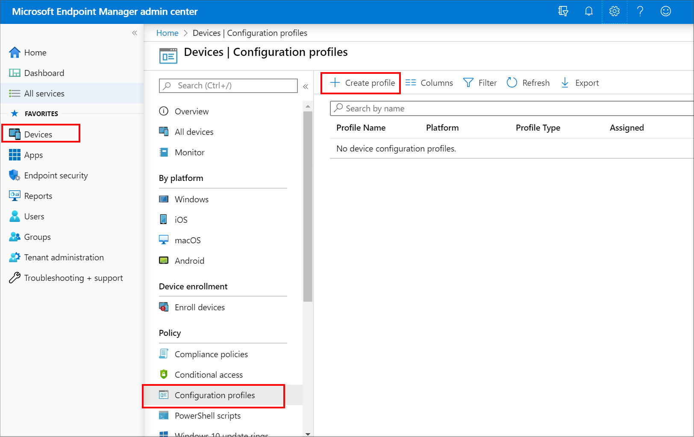
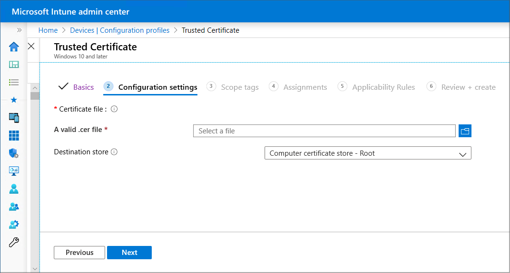

---
# required metadata

title: Create trusted certificate profiles in Microsoft Intune
description: Create and deploy trusted certificate profiles to deploy a trusted root certificate to managed devices in Intune. Trusted certificate profiles support use of Simple Certificate Enrollment Protocol (SCEP) and Public Key Cryptography Standards (PKCS) certificate profiles with Microsoft Intune.
keywords:
author: brenduns
ms.author: brenduns
manager: dougeby
ms.date: 03/29/2022
ms.topic: how-to
ms.service: microsoft-intune
ms.subservice: protect
ms.localizationpriority: high

# optional metadata

#ROBOTS:
#audience:

ms.reviewer: lacranda
ms.suite: ems
search.appverid: MET150
#ms.tgt_pltfrm:
ms.custom: intune-azure
ms.collection: 
  - M365-identity-device-management
  - highpri
---

# Trusted root certificate profiles for Microsoft Intune

When using Intune to provision devices with certificates to access your corporate resources and network, use a *trusted certificate* profile to deploy the trusted root certificate to those devices. Trusted root certificates establish a trust from the device to your root or intermediate (issuing) CA from which the other certificates are issued.

You deploy the trusted certificate profile to the same devices and users that receive the certificate profiles for Simple Certificate Enrollment Protocol (SCEP), Public Key Cryptography Standards (PKCS), and imported PKCS.

> [!TIP]
> *Trusted certificate* profiles are supported for [Windows Enterprise multi-session remote desktops](../fundamentals/azure-virtual-desktop-multi-session.md).

## Export the trusted root CA certificate

To use PKCS,  SCEP, and PKCS imported certificates, devices must trust your root Certification Authority. To establish trust, export the Trusted Root CA certificate, and any intermediate or issuing Certification Authority certificates, as a public certificate (.cer). You can get these certificates from the issuing CA, or from any device that trusts your issuing CA.

To export the certificate, refer to the documentation for your Certification Authority. You'll need to export the public certificate as a DER-encoded .cer file.  Don't export the private key, a .pfx file.

You'll use this .cer file when you [create trusted certificate profiles](#create-trusted-certificate-profiles) to deploy that certificate to your devices.

## Create trusted certificate profiles

Create and deploy a trusted certificate profile before you create a SCEP, PKCS, or PKCS imported certificate profile. Deploying a trusted certificate profile to the same groups that receive the other certificate profile types ensures that each device can recognize the legitimacy of your CA. This includes profiles like those for VPN, Wi-Fi, and email.

SCEP certificate profiles directly reference a trusted certificate profile. PKCS certificate profiles don't directly reference the trusted certificate profile but do directly reference the server that hosts your CA. PKCS imported certificate profiles don't directly reference the trusted certificate profile but can use it on the device. Deploying a trusted certificate profile to devices ensures this trust is established. When a device doesn't trust the root CA, the SCEP or PKCS certificate profile policy will fail.

Create a separate trusted certificate profile for each device platform you want to support, just as you'll do for SCEP, PKCS, and PKCS imported certificate profiles.

> [!IMPORTANT]
> Trusted root profiles that you create for the platform *Windows 10 and later*, display in the Microsoft Endpoint Manager admin center as profiles for the platform *Windows 8.1 and later*.
>
> This is a known issue with the presentation of the platform for Trusted certificate profiles. While the profile displays a platform of Windows 8.1 and later, it is functional for Windows 10/11.

> [!NOTE]
> The *Trusted Certificate* profile in Intune can only be used to deliver either root or intermediate certificates. The purpose of deploying such certificates is to establish a chain of trust. Using the trusted certificate profile to deliver certificates other than root or intermediate certificates is not supported by Microsoft. You might be blocked from importing certificates which are not deemed to be root or intermediate certificates when selecting the trusted certificate profile in the Microsoft Endpoint Manager admin center. Even if you are able to import and deploy a certificate which is neither a root or intermediate certificate using this profile type, you will likely encounter unexpected results between different platforms such as iOS and Android.

### Trusted certificate profiles for Android device administrator

Beginning with Android 11, you can no longer use a trusted certificate profile to deploy a trusted root certificate to devices that are enrolled as *Android device administrator*. This limitation doesn't apply to Samsung Knox.

Because SCEP certificate profiles require both the trusted root certificate be installed on a device, and must reference a trusted certificate profile that in turn references that certificate, use the following steps to work around this limitation:

1. Manually provision the device with the trusted root certificate. For sample guidance, see the following section.

2. Deploy to the device, a trusted root certificate profile that references the trusted root certificate that you’ve installed on the device.

3. Deploy a SCEP certificate profile to the device that references the trusted root certificate profile.

This issue isn’t limited to SCEP certificate profiles. Therefore, plan to manually install the trusted root certificate on applicable devices should your use of PKCS certificate profiles, or PKCS Imported certificate profiles require it.

Learn more about [changes in support for Android device administrator](https://techcommunity.microsoft.com/t5/intune-customer-success/decreasing-support-for-android-device-administrator/ba-p/1441935) from techcommunity.microsoft.com.

#### Manually provision a device with the trusted root certificate

The following guidance can help you manually provision devices with a trusted root certificate.

1. Download or transfer the trusted root certificate to the Android device. For example, you might use email to distribute the certificate to device users, or have users download it from a secure location.  After the certificate is on the device, it must be opened, named, and saved. Saving the certificate adds it to the User certificate store on the device.

   1. To open the certificate on the device, a user must locate and tap (open) the certificate. For example, after sending the certificate by email, a device user can tap on or open the certificate attachment.
   2. When the certificate opens, the user must provide their PIN or otherwise authenticate to the device before they can manage the certificate.

2. After authentication, the certificate opens and must be named before it can be saved to the Users certificate store.  The certificate name must match the certificate name that’s specified in the Trusted Root Certificate profile that will be sent to the device.
After naming the certificate, it can be saved.  

3. After being saved the certificate is ready for use.  A user can confirm the certificate is in the correct location on the device:
   1. Open **Settings** > **Security** > **Trusted credentials**. The actual path to *Trusted credentials* can vary by device.
   2. Open the **User** tab and locate the certificate.
   3. If present in the list of User certificates, the certificate is installed correctly.

4. With a root certificate installed on a device, you must still deploy the following to provision the SCEP or PKCS certificates:
   - A Trusted Certificate profile that references that certificate
   - The SCEP or PKCS profile that references the certificate profile to provision the SCEP or PKCS certificates.

### To create a trusted certificate profile

1. Sign in to the [Microsoft Endpoint Manager admin center](https://go.microsoft.com/fwlink/?linkid=2109431).

2. Select  and go to **Devices** > **Configuration profiles** > **Create profile**.

   

3. Enter the following properties:
   - **Platform**: Choose the platform of the devices that will receive this profile.
   - **Profile**: Select **Trusted certificate**. Or, select **Templates** > **Trusted certificate**.

4. Select **Create**.

5. In **Basics**, enter the following properties:
   - **Name**: Enter a descriptive name for the profile. Name your profiles so you can easily identify them later. For example, a good profile name is *Trusted certificate profile for entire company*.
   - **Description**: Enter a description for the profile. This setting is optional, but recommended.

6. Select **Next**.

7. In **Configuration settings**, specify the .cer file for the trusted Root CA Certificate you previously exported.

   For Windows 8.1 and Windows 10/11 devices only, select the **Destination Store** for the trusted certificate from:

   - **Computer certificate store - Root**
   - **Computer certificate store - Intermediate**
   - **User certificate store - Intermediate**

   

8. Select **Next**.

9. In **Assignments**, select the user or groups that will receive your profile. For more information on assigning profiles, see [Assign user and device profiles](../configuration/device-profile-assign.md).

   Select **Next**.

10. (*Applies to Windows 10/11 only*) In **Applicability Rules**, specify applicability rules to refine the assignment of this profile. You can choose to assign or not assign the profile based on the OS edition or version of a device.

    For more information, see [Applicability rules](../configuration/device-profile-create.md#applicability-rules) in *Create a device profile in Microsoft Intune*.

11. In **Review + create**, review your settings. When you select Create, your changes are saved, and the profile is assigned. The policy is also shown in the profiles list.

## Next steps

Create certificate profiles:  
- [Configure infrastructure to support SCEP certificates with Intune](../protect/certificates-scep-configure.md)
- [Configure and manage PKCS certificates with Intune](../protect/certificates-pfx-configure.md)  
- [Create a PKCS imported certificate profile](../protect/certificates-imported-pfx-configure.md#create-a-pkcs-imported-certificate-profile)
