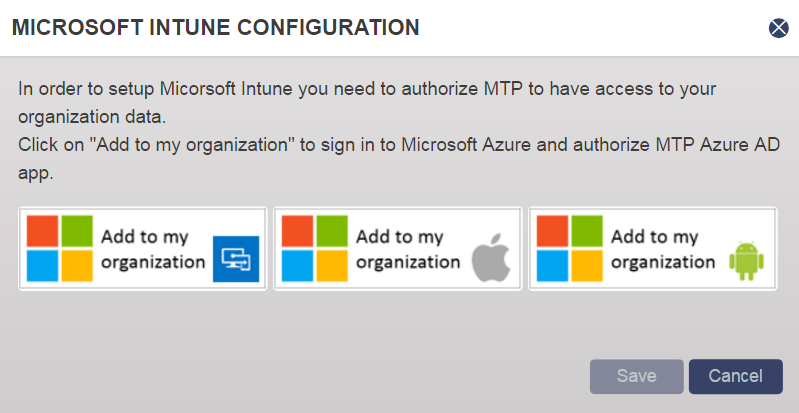

---
# required metadata

title: Integrate Check Point Harmony MTD with Intune

titleSuffix: Microsoft Intune
description: How to set up CheckPoint Harmony Mobile Threat Defense (MTD) with Intune to control mobile device access to your corporate resources.
keywords:
author: brenduns
ms.author: brenduns
manager: dougeby
ms.date: 04/19/2022
ms.topic: how-to
ms.service: microsoft-intune
ms.subservice: protect
ms.localizationpriority: high
ms.technology:
ms.assetid: 1e9b1576-b239-48cc-a672-da6b5fb7be0a

# optional metadata

#ROBOTS:
#audience:

ms.reviewer: aanavath
ms.suite: ems
search.appverid: MET150
#ms.tgt_pltfrm:
ms.custom: intune-azure; seodec18
ms.collection:
- tier3
- M365-identity-device-management
---

# Integrate Check Point Harmony Mobile with Intune

Complete the following steps to integrate the Check Point Harmony Mobile Threat Defense solution with Intune.

> [!NOTE]
> This Mobile Threat Defense vendor is not supported for unenrolled devices.

## Before you begin

The instructions in this article are done in the [Check Point Harmony Mobile console](https://portal.checkpoint.com).

Before starting the process of integrating Check Point Harmony Mobile with Intune, make sure you've the following configurations:

- Microsoft Intune subscription

- Azure Active Directory admin credentials to grant the following permissions:

  - Sign in and read user profile

  - Access the directory as the signed-in user

  - Read directory data

  - Send device information to Intune

- Admin credentials to access Check Point Harmony Mobile MTD console.

### Harmony Mobile Protect app authorization

The Harmony Mobile Protect app authorization process consists of the following steps:

- Allow the Check Point Harmony Mobile service to communicate information related to device health state back to Intune.

- CheckPoint Harmony Mobile syncs with Azure AD Enrollment Group membership to populate its device's database.

- Allow Check Point Harmony admin console to use Azure AD Single Sign On (SSO).

- Allow the Harmony Mobile Protect app to sign in using Azure AD SSO.

## To set up Check Point Harmony Mobile integration

1. Go to [Check Point Harmony Mobile MTD console](https://portal.checkpoint.com) and sign in with your credentials.

2. Select on the **Settings** tab.

3. Choose **Device management**, then **Settings**.

4. Choose **Microsoft Intune** from the **MDM Service** drop-down list.

5. Once you set Microsoft Intune as the MDM Service, the **Microsoft Intune Configuration** window pops up, choose the **Add to my organization** for each device platform: iOS/iPadOS, Android and Windows to authorize Harmony Mobile Protect to communicate with Intune and Azure AD.

    

    > [!IMPORTANT]
    > You must add all device platforms to proceed to the next step.

6. Choose **Accept** to authorize the Harmony Mobile Protect app to communicate with Intune and Azure Active Directory.

7. Once you enabled all device platforms, you need to enter the Azure AD security group.

8. Choose **Verify**, once the Azure AD security group is successfully verified, choose **Save**.

## Next steps

- [Set up Harmony Mobile Protect apps](mtd-apps-ios-app-configuration-policy-add-assign.md)
