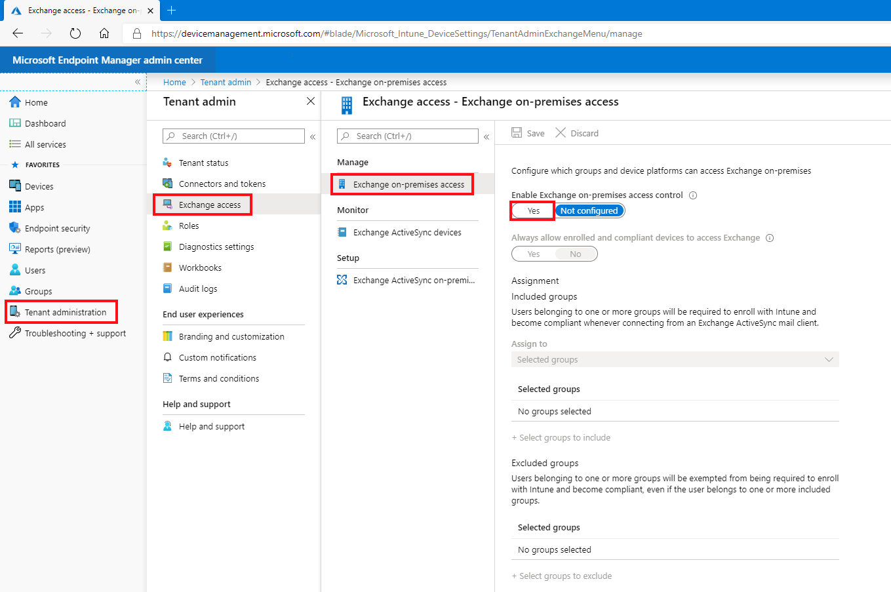
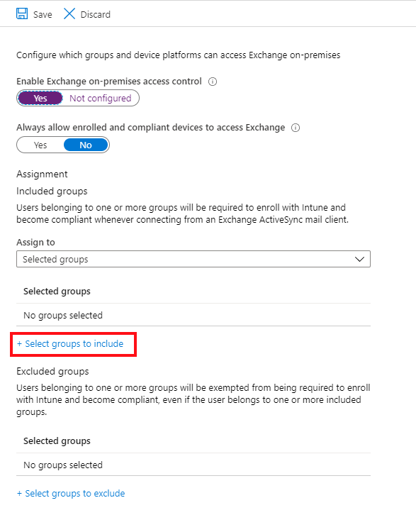
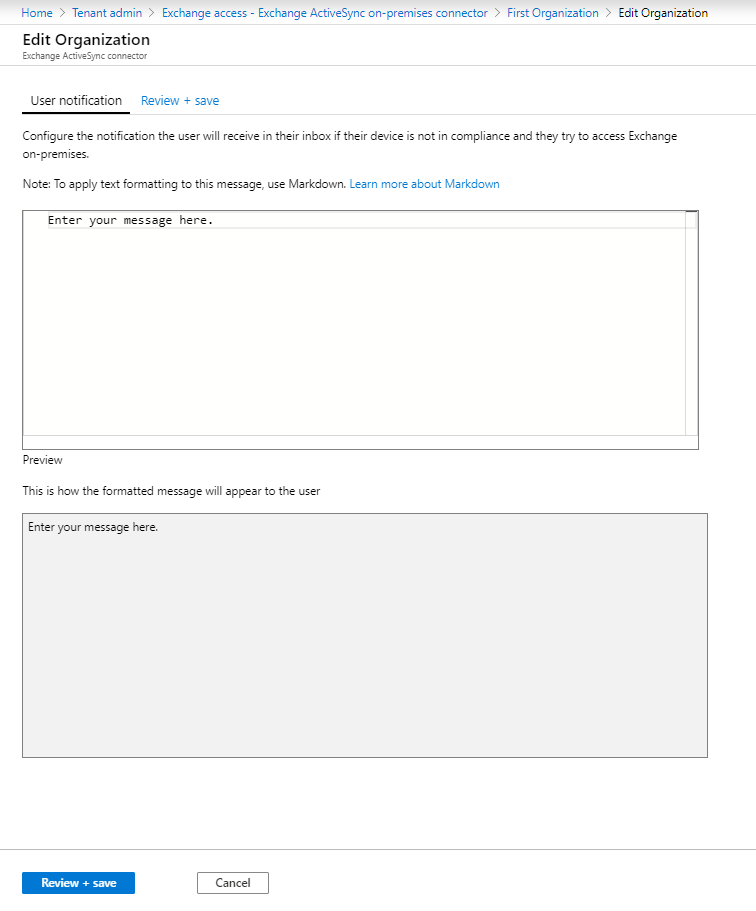
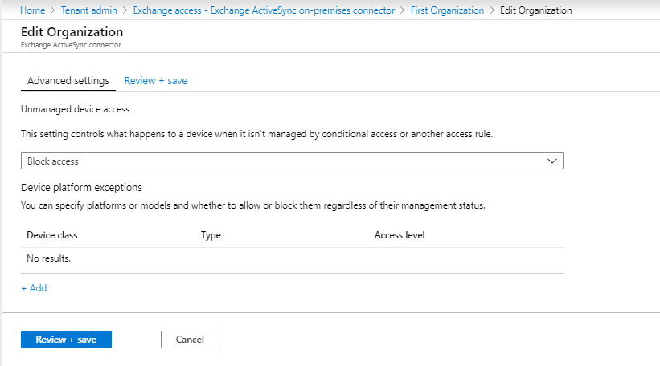

---
# required metadata

title: Create Exchange Conditional Access policy
titleSuffix: Microsoft Intune
description: Configure Conditional Access for Exchange on-premises and legacy Exchange Online Dedicated in Intune.
keywords:
author: brenduns
ms.author: brenduns
manager: dougeby
ms.date: 04/16/2021
ms.topic: how-to
ms.service: microsoft-intune
ms.subservice: protect
ms.localizationpriority: high
ms.technology:
ms.assetid: 127dafcb-3f30-4745-a561-f62c9f095907

# optional metadata

#ROBOTS:
#audience:

ms.reviewer: samyada, demerson
ms.suite: ems
search.appverid: MET150
#ms.tgt_pltfrm:
ms.custom: intune-azure
ms.collection: M365-identity-device-management
---

# Configure Exchange on-premises access for Intune

This article shows you how to configure Conditional Access for Exchange on-premises based on device compliance.

If you have an Exchange Online Dedicated environment and need to find out whether it is in the new or the legacy configuration, contact your account manager. To control email access to Exchange on-premises or to your legacy Exchange Online Dedicated environment, configure Conditional Access to Exchange on-premises in Intune.

> [!IMPORTANT]
> The information in this article applies to customers who are supported to use an Exchange Connector.
>
> Beginning in July of 2020, support for the Exchange connector is deprecated, and replaced by Exchange [hybrid modern authentication](/office365/enterprise/hybrid-modern-auth-overview) (HMA).  If you have an Exchange Connector set up in your environment, you’re Intune tenant remains supported for its use, and you’ll continue to have access to UI that supports its configuration. You can continue to use the connector or configure HMA and then uninstall your connector.
>
> Use of HMA does not require Intune to setup and use the Exchange Connector. With this change, the UI to configure and manage the Exchange Connector for Intune has been removed from the Microsoft Endpoint Manager admin center, unless you already use an Exchange connector with your subscription.

## Before you begin

Before you can configure Conditional Access, verify the following configurations exist:

- Your Exchange version is **Exchange 2010 SP3 or later**. Exchange server Client Access Server (CAS) array is supported.

- You have installed and use the [Exchange ActiveSync on-premises Exchange connector](exchange-connector-install.md), which connects Intune to on-premises Exchange.

    >[!IMPORTANT]  
    >Intune supports multiple on-premises Exchange connectors per subscription.  However, each on-premises Exchange connector is specific to a single Intune tenant and cannot be used with any other tenant.  If you have more than one on-premises Exchange organization, you can set up a separate connector for each Exchange organization.

- The connector for an on-premises Exchange organization can install on any machine as long as that machine can communicate with the Exchange server.

- The connector supports **Exchange CAS environment**. Intune supports installing the connector on the Exchange CAS server directly. We recommend you install it on a separate computer because of the additional load the connector puts on the server. When configuring the connector, you must set it up to communicate to one of the Exchange CAS servers.

- **Exchange ActiveSync** must be configured with certificate-based authentication, or user credential entry.

- When Conditional Access policies are configured and targeted to a user, before a user can connect to their email, the **device** they use must be:
  - Either **enrolled** with Intune or is a domain joined PC.
  - **Registered in Azure Active Directory**. Additionally, the client Exchange ActiveSync ID must be registered with Azure Active Directory.

- Azure AD Device Registration Service (DRS) is activated automatically for Intune and Microsoft 365 customers. Customers who have already deployed the ADFS Device Registration Service don't see registered devices in their on-premises Active Directory. **This does not apply to Windows PCs and devices**.

- **Compliant** with device compliance policies deployed to that device.

- If the device doesn't meet Conditional Access settings, the user is presented with one of the following messages when they sign in:
  - If the device isn't enrolled with Intune, or isn't registered in Azure Active Directory, a message displays with instructions about how to install the Company Portal app, enroll the device, and activate email. This process also associates the device's Exchange ActiveSync ID with the device record in Azure Active Directory.
  - If the device isn't compliant, a message displays that directs the user to the Intune Company Portal website, or the Company Portal app. From the company portal, they can find information about the problem and how to remediate it.

### Support for mobile devices

- **Native email app on iOS/iPadOS** - To create Conditional Access policy, see [Create Conditional Access policies](../protect/create-conditional-access-intune.md)
- **EAS mail clients such as Gmail on Android 4 or later** - To create Conditional Access policy, see [Create Conditional Access policies](../protect/create-conditional-access-intune.md)

- **EAS mail clients on Android device administrator** - To create Conditional Access policy, see [Create Conditional Access policies](../protect/create-conditional-access-intune.md)

- **EAS mail clients on Android Enterprise Personally-Owned Work Profile devices** - Only *Gmail* and *Nine Work for Android Enterprise* are supported on [Android Enterprise personally-owned work profile](../apps/android-deployment-scenarios-app-protection-work-profiles.md#android-enterprise-personally-owned-work-profiles) devices. For Conditional Access to work with Android Enterprise Personally-Owned Work Profiles, you must deploy an email profile for the *Gmail* or *Nine Work for Android Enterprise* app, and also deploy those apps as a required installation. After you deploy the app, you can set up device-based Conditional Access.

#### To set up Conditional Access for Android Enterprise Personally-Owned Work Profile devices

  1. Sign in to the [Microsoft Endpoint Manager admin center](https://go.microsoft.com/fwlink/?linkid=2109431).
  
  2. Deploy the Gmail or Nine Work app as **Required**.

  3. Select **Devices** > **Configuration profiles** > **Create profile**, enter **Name** and **Description** for the profile.

  4. Select **Android enterprise** in **Platform**, select **Email** in **Profile type**.

  5. Configure the [email profile settings](/intune/configuration/email-settings-android-enterprise#android-enterprise).

  6. When you're done, select **OK** > **Create** to save your changes.

  7. After you create the email profile, [assign it to groups](/intune/device-profile-assign).

  8. Set up [device-based conditional access](/intune/protect/conditional-access-intune-common-ways-use#device-based-conditional-access).

> [!NOTE]
> Microsoft Outlook for Android and iOS/iPadOS is not supported via the Exchange on-premises connector. If you want to leverage Azure Active Directory Conditional Access policies and Intune App Protection Policies with Outlook for iOS/iPadOS and Android for your on-premises mailboxes, please see [Using hybrid Modern Authentication with Outlook for iOS/iPadOS and Android](/Exchange/clients/outlook-for-ios-and-android/use-hybrid-modern-auth).

### Support for PCs

The native **Mail** application on Windows 8.1 and later (when enrolled into MDM with Intune)

## Configure Exchange on-premises access

Support for new installations of the Exchange connector was deprecated in July of 2020, and the connector installation package is no longer available for download. Instead, use Exchange [hybrid modern authentication](/office365/enterprise/hybrid-modern-auth-overview) (HMA).

Before you can use the following procedure to set up Exchange on-premises access control, you must install and configure at least one [Intune on-premises Exchange connector](exchange-connector-install.md) for Exchange on-premises.

1. Sign in to the [Microsoft Endpoint Manager admin center](https://go.microsoft.com/fwlink/?linkid=2109431).

2. Go to **Tenant administration** > **Exchange access**, and then select **Exchange On-premises access**.

3. On the **Exchange on-premises access** pane, choose **Yes** to *Enable Exchange on-premises access control*.

   > [!div class="mx-imgBorder"]
   > 

4. Under **Assignment**, choose **Select groups to include**, and then select one or more groups to configure access.

   Members of the groups you select have the Conditional Access policy for Exchange on-premises access applied to them. Users who receive this policy must enroll their devices in Intune and be compliant with the compliance profiles before they can access Exchange on-premises.

   > [!div class="mx-imgBorder"]
   > 

5. To exclude groups, choose **Select groups to exclude**, and then select one or more groups that are exempt from requirements to enroll devices and to be compliant with the compliance profiles before accessing Exchange on-premises.

   Select **Save** to save your configuration, and return to the **Exchange access** pane.

6. Next, configure settings for the Intune on-premises Exchange connector. In the console, select **Tenant administration** > **Exchange Access**> **Exchange ActiveSync on-premises connector** and then select the connector for the Exchange organization that you want to configure.

7. For **User notifications**, select **Edit** to open the **Edit Organization** workflow where you can modify the *User notification* message.

   > [!div class="mx-imgBorder"]
   > 

   Modify the default email message that's sent to users if their device isn't compliant and they want to access Exchange on-premises. The message template uses Markup language. You can also see the preview of how the message looks as you type

   Select **Review + save**, and then **Save** to save your edits to complete configuration of Exchange on-premises access.

   > [!TIP]
   > To learn more about Markup language see this Wikipedia [article](https://en.wikipedia.org/wiki/Markup_language).

8. Next, select **Advanced Exchange ActiveSync access settings** to open the *Advanced Exchange ActiveSync access settings* workflow where you configure device access rules.

   > [!div class="mx-imgBorder"]
   > 

   - For **Unmanaged device access**, set the global default rule for access from devices that are not affected by Conditional Access or other rules:

     - **Allow access** - All devices can access Exchange on-premises immediately. Devices that belong to the users in the groups you configured as included in the previous procedure are blocked if they're later evaluated as not compliant with the compliant policies or not enrolled in Intune.

     - **Block access** and **Quarantine** – All devices are immediately blocked from accessing Exchange on-premises initially. Devices that belong to users in the groups you configured as included in the previous procedure get access after the device enrolls in Intune and is evaluated as compliant.

       Android devices that *do not* run Samsung Knox standard don't support this setting and are always blocked.

   - For **Device platform exceptions**, select **Add**, and then specify details as needed for your environment.

      If the **Unmanaged device access** setting is set to **Blocked**, devices that are enrolled and compliant are allowed even if there's a platform exception to block them.  

9. Select **OK** to save your edits.

10. Select **Review + save**, and then **Save** to save the Exchange Conditional Access policy.

## Next steps

Next, create a compliance policy and assign it to the users for Intune to evaluate their mobile devices, See [Get started with device compliance](device-compliance-get-started.md).

[Troubleshooting Intune on-premises Exchange connector in Microsoft Intune](https://support.microsoft.com/help/4471887)
