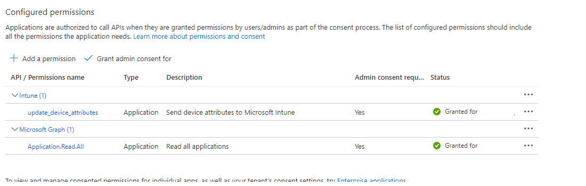

---
# required metadata

title: Manually configure Jamf Pro integration with Microsoft Intune  
titleSuffix: Microsoft Intune
description: Manually configure Jamf Pro integration with Intune when you can't use the Jamf Cloud Connector.
keywords:
author: lenewsad
ms.author: lanewsad
manager: dougeby
ms.date: 09/20/2023
ms.topic: how-to
ms.service: microsoft-intune
ms.subservice: protect
ms.localizationpriority: high
ms.assetid: 4b6dcbcc-4661-4463-9a36-698d673502c6

# optional metadata

#ROBOTS: 
#audience:

ms.reviewer: tycast
ms.suite: ems
search.appverid: MET150
#ms.tgt_pltfrm:
ms.custom: intune-azure
ms.collection:
- tier3
- M365-identity-device-management
- conditional-access
- sub-device-compliance
---

# Manually Integrate Jamf Pro with Intune for compliance

> [!IMPORTANT]
>
> **Jamf macOS device support for Conditional Access is being deprecated**.
>
> Beginning on January 31, 2025, the platform that Jamf Pro’s Conditional Access feature is built on will no longer be supported.
>
> If you use Jamf Pro’s Conditional Access integration for macOS devices, follow Jamf’s documented guidelines to migrate your devices to Device Compliance integration at [***Migrating from macOS Conditional Access to macOS Device Compliance – Jamf Pro Documentation***](https://learn.jamf.com/bundle/jamf-pro-documentation-current/page/Conditional_Access.html#ariaid-title6).
>
> If you need help, contact [***Jamf Customer Success***](https://jamf.service-now.com/csm). For more information, see the blog post at [**https://aka.ms/Intune/Jamf-Device-Compliance**](https://aka.ms/Intune/Jamf-Device-Compliance).

> [!TIP]
> For guidance for integrating Jamf Pro with Intune and Microsoft Entra ID, including how to configure Jamf Pro to deploy the Intune Company Portal app to devices you manage with Jamf Pro, see [Integrate Jamf Pro with Intune to report compliance to Microsoft Entra ID](../protect/jamf-managed-device-compliance-with-entra-id.md).

Microsoft Intune supports integrating your Jamf Pro deployment to bring device compliance and Conditional Access policies to your macOS devices. Through integration, you can require that your macOS devices that are managed by Jamf Pro meet your Intune device compliance requirements before those devices are allowed to access your organization's resources. Resource access is controlled by your Microsoft Entra Conditional Access policies in the same way as for devices managed through Intune.

When Jamf Pro integrates with Intune, you can sync the inventory data from macOS devices with Intune, through Microsoft Entra ID. Intune's compliance engine then analyzes the inventory data to generate a report. Intune's analysis is combined with intelligence about the device user's Microsoft Entra identity to drive enforcement through Conditional Access. Devices that are compliant with the Conditional Access policies can gain access to protected company resources.

This article can help you manually integrate Jamf Pro with Intune.

> [!TIP]
> Instead of manually configuring Jamf Pro integration with Intune, we recommend configuring and using the [Jamf Cloud Connector with Microsoft Intune](../protect/conditional-access-jamf-cloud-connector.md). The Cloud Connector automates many of the steps that are required when you manually configure integration.

After you configure integration, you'll then [configure Jamf and Intune to enforce compliance with Conditional Access](conditional-access-assign-jamf.md) on devices managed by Jamf.

## Prerequisites

### Products and services

You need the following to configure Conditional Access with Jamf Pro:

- Jamf Pro 10.1.0 or later
- Microsoft Intune and Microsoft Entra ID P1 licenses (recommended Microsoft Enterprise Mobility + Security license bundle)
- Global admin role in Microsoft Entra ID.
- A user with Microsoft Intune Integration privileges in Jamf Pro
- [Company Portal app for macOS](https://aka.ms/macoscompanyportal)
- macOS devices with OS X 10.12 Yosemite or later

### Network ports

The following ports should be accessible for Jamf and Intune to integrate correctly:

- **Intune**: Port 443
- **Apple**: Ports 2195, 2196, and 5223 (push notifications to Intune)
- **Jamf**: Ports 80 and 5223

To allow APNS to function correctly on the network, you must also enable outgoing connections to, and redirects from:

- the Apple 17.0.0.0/8 block over TCP ports 5223 and 443 from all client networks.
- ports 2195 and 2196 from Jamf Pro servers.  

For more information about these ports, see the following articles:

- [Intune network configuration requirements and bandwidth](../fundamentals/network-bandwidth-use.md).
- [Network Ports Used by Jamf Pro](https://www.jamf.com/jamf-nation/articles/34/network-ports-used-by-jamf-pro) on jamf.com.
- [TCP and UDP ports used by Apple software products](https://support.apple.com/HT202944) on support.apple.com

## Connect Intune to Jamf Pro

To connect Intune with Jamf Pro:

1. Create a new application in Azure.
2. Enable Intune to integrate with Jamf Pro.
3. Configure Conditional Access in Jamf Pro.

### Create an application in Microsoft Entra ID

1. In the [Azure portal](https://portal.azure.com), go to **Microsoft Entra ID** > **App Registrations**, and then select **New registration**.

2. On the **Register an application** page, specify the following details:

   - In the **Name** section, enter a meaningful application name, for example **Jamf Conditional Access**.
   - For the **Supported account types** section, select **Accounts in any organizational directory**.
   - For **Redirect URI**, leave the default of Web, and then specify the URL for your Jamf Pro instance.

3. Select **Register** to create the application and to open the **Overview** page for the new app.

4. On the app **Overview** page, copy the **Application (client) ID** value and record it for later use. You'll need this value in later procedures.

5. Select **Certificates & secrets** under **Manage**. Select the **New client secret** button. Enter a value in **Description**, select any option for **Expires** and choose **Add**.

   > [!IMPORTANT]
   > Before you leave this page, copy the value for the client secret and record it for later use. You will need this value in later procedures. This value isn't available again, without recreating the app registration.

6. Select **API permissions** under **Manage**. 

7. On the API permissions page, remove all permissions from this app by selecting the **...** icon next to each existing permission. This removal is required; the integration won't succeed if there are any unexpected extra permissions in this app registration.

8. Next, add permissions to update device attributes. At the top left of the **API permissions** page, select **Add a permission** to add a new permission. 

9. On the **Request API permissions** page, select **Intune**, and then select **Application permissions**. Select only the check box for **update_device_attributes** and save the new permission.
10. Under **Microsoft Graph**, select **Application permissions**, then select **Application.Read.All**.

11. Select **Add permissions**.

12. Navigate to **APIs my organization uses**. Search for and select **Windows Azure Active Directory**. Select **Application permissions**, and then select **Application.Read.All**.

13. Select **Add permissions**.

14. Next, grant admin consent for this app by selecting **Grant admin consent for _\<your tenant>_** in the top left of the **API permissions** page. You may need to reauthenticate your account in the new window and grant the application access by following the prompts.  

15. Refresh the page by selecting **Refresh** at the top of the page. Confirm that admin consent has been granted for the **update_device_attributes** permission.

16. After the app is registered successfully, the API permissions should only contain one permission called **update_device_attributes**, and should appear as follows:

   

The app registration process in Microsoft Entra ID is complete.

> [!NOTE]
> If the client secret expires, you must create a new client secret in Azure and then update the Conditional Access data in Jamf Pro. Azure allows you to have both the old secret and new key active to prevent service disruptions.

### Enable Intune to integrate with Jamf Pro

1. Sign in to the [Microsoft Intune admin center](https://go.microsoft.com/fwlink/?linkid=2109431).

2. Select **Tenant administration** > **Connectors and tokens** > **Partner device management**.

3. Enable the *Compliance Connector for Jamf* by pasting the Application ID you saved during the previous procedure into the **Specify the Microsoft Entra App ID for Jamf** field.

4. Select **Save**.

### Configure Microsoft Intune Integration in Jamf Pro

1. Activate the connection in the Jamf Pro console:

   1. Open the Jamf Pro console and navigate to **Global Management** > **Conditional Access**. Select **Edit** on the **macOS Intune Integration** tab.
   2. Select the check box for **Enable Intune Integration for macOS**. When this setting is enabled, Jamf Pro sends inventory updates to Microsoft Intune. Clear the selection if you want to disable the connection but save your configuration.
   3. Select **Manual** under **Connection type**.
   4. From the **Sovereign Cloud** pop-up menu, select the location of your Sovereign Cloud from Microsoft.
   5. Select **Open administrator consent URL** and follow the onscreen instructions to allow the Jamf Native macOS Connector app to be added to your Microsoft Entra tenant.
   6. Add the **Microsoft Entra tenant Name** from Microsoft Azure.
   7. Add the **Application ID** and **Client Secret** (previously called Application Key) for the Jamf Pro application from Microsoft Azure.
   8. Select **Save**. Jamf Pro tests your settings and verifies your success.

   Return to the **Partner device management** page in Intune to complete the configuration.

2. In Intune, go to the **Partner device management** page. Under **Connector Settings** configure groups for assignment:

   - Select **Include** and specify which User groups you want to target for macOS enrollment with Jamf.
   - Use **Exclude** to select groups of Users that won't enroll with Jamf and instead will enroll their Macs directly with Intune.

   *Exclude* overrides *Include*, which means any device that is in both groups is excluded from Jamf and directed to enroll with Intune.

   >[!NOTE]
   > This method of including and excluding user groups affects the enrollment experience of the user. Any user with a macOS device thats already enrolled in either Jamf or Intune who is then targeted to enroll with the other MDM must unenroll their device and then re-enroll it with the new MDM before management of the device works properly.

3. Select **Evaluate** to determine how many devices will be enrolled with Jamf, based on your group configurations.

4. Select **Save** when you're ready to apply the configuration.

5. To proceed, you'll next need to use [Jamf to deploy the Company Portal for Mac](conditional-access-assign-jamf.md#deploy-the-company-portal-app-for-macos-in-jamf-pro) so that users can register their devices to Intune.

## Set up compliance policies and register devices

After you configure integration between Intune and Jamf, you need to [apply compliance policies to Jamf-managed devices](conditional-access-assign-jamf.md).

## Disconnect Jamf Pro and Intune

Should you need to remove integration of Jamf Pro with Intune, use one of the following methods. Both methods apply to integration that is configured manually or by using the Cloud Connector.

### Deprovision Jamf Pro from within the Microsoft Intune admin center

1. In the [Microsoft Intune admin center](https://go.microsoft.com/fwlink/?linkid=2109431), go to **Tenant administration** > **Connectors and tokens** > **Partner device management**.

2. Select the option **Terminate**. Intune displays a message about the action. Review the message and when ready, select **OK**. The option to *Terminate* the integration only appears when the Jamf connection exists.

After you terminate the integration, refresh the view of the admin center to update the view. Your organization's macOS devices are removed from Intune in 90 days.

### Deprovision Jamf Pro from within the Jamf Pro console

Use the following steps to remove the connection from within the Jamf Pro console.

1. In the Jamf Pro console, go to **Global Management** > **Conditional Access**. On the **macOS Intune Integration** tab, select **Edit**.

2. Clear the **Enable Intune Integration for macOS** check box.

3. Select **Save**. Jamf Pro sends your configuration to Intune and the integration will be terminated.

4. Sign in to the [Microsoft Intune admin center](https://go.microsoft.com/fwlink/?linkid=2109431).

5. Select **Tenant administration** > **Connectors and tokens** > **Partner device management** to verify that the status is now **Terminated**.

After you terminate the integration, your organization's macOS devices will be removed at the date shown in your console, which is after three months.

## Next steps

- [Apply compliance policies to Jamf-managed devices](conditional-access-assign-jamf.md)
- [Data Jamf sends to Intune](data-jamf-sends-to-intune.md)
