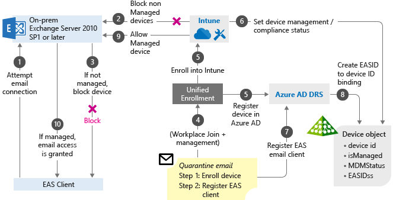

---
# required metadata

title: Conditional Access scenarios 
titleSuffix: Microsoft Intune
description: Learn how Intune Conditional Access is commonly used for device-based and app-based Conditional Access.
keywords:
author: brenduns
ms.author: brenduns
manager: dougeby
ms.date: 03/02/2021
ms.topic: conceptual
ms.service: microsoft-intune
ms.subservice: protect
ms.localizationpriority: high

# optional metadata

#ROBOTS:
#audience:

#ms.reviewer: samyada, demerson
ms.suite: ems
search.appverid: MET150
#ms.tgt_pltfrm:
ms.custom: intune-azure; get-started; seodec18
ms.collection: 
  - M365-identity-device-management
  - highpri
---

# What are common ways to use Conditional Access with Intune?

There are two types of conditional access with Intune: device-based conditional access and app-based conditional access. You need to configure the related compliance policies to drive conditional access compliance at your organization. Conditional access is commonly used to do things like allow or block access to Exchange, control access to the network, or integrate with a Mobile Threat Defense solution.
 
The information in this article can help you understand how to use the Intune mobile *device* compliance capabilities and the Intune mobile *application* management (MAM) capabilities. 

> [!NOTE]
> Conditional Access is an Azure Active Directory capability that is included with an Azure Active Directory Premium license. Intune enhances this capability by adding mobile device compliance and mobile app management to the solution. The Conditional Access node accessed from *Intune* is the same node as accessed from *Azure AD*.  

## Device-based Conditional Access

Intune and Azure Active Directory work together to make sure only managed and compliant devices can access email, Microsoft 365 services, Software as a service (SaaS) apps, and [on-premises apps](/azure/active-directory/active-directory-application-proxy-get-started). Additionally, you can set a policy in Azure Active Directory to only enable domain-joined computers or mobile devices that are enrolled in Intune to access Microsoft 365 services.

Intune provides device compliance policy capabilities that evaluate the compliance status of the devices. The compliance status is reported to Azure Active Directory that uses it to enforce the Conditional Access policy created in Azure Active Directory when the user tries to access company resources.

Device-based Conditional Access policies for Exchange online and other Microsoft 365 products are configured through the [Microsoft Endpoint Manager admin center](../fundamentals/what-is-intune.md).

- Learn more about [Require managed devices with Conditional Access in Azure Active Directory](/azure/active-directory/conditional-access/require-managed-devices).

- Learn more about [Intune device compliance](device-compliance-get-started.md).

- Learn more about [Supported browsers with Conditional Access in Azure Active Directory](/azure/active-directory/conditional-access/technical-reference#supported-browsers).

> [!NOTE]
> When you enable Device Based Access for content that users access from browser apps on their Android personally-owned work profile devices, users that enrolled before January 2021 must enable browser access as follows:
>
> 1. Launch the **Company Portal** app.
> 2. Go to the **Settings** page from the menu.
> 3. In the **Enable Browser Access** section, tap the **ENABLE** button.
> 4. Close and then restart the browser app.
> 
> This enables access in browser apps, but not to browser WebViews that open within apps.

## Applications available in Conditional Access for controlling Microsoft Intune
When you are configuring conditional access in the Azure Active Directory portal, you have two applications available:
1. **Microsoft Intune** - This application controls access to the Microsoft Endpoint Manager console and data sources. Configure grants/controls on this application when you want to target the Microsoft Endpoint Manager console and data sources.
2. **Microsoft Intune Enrollment** - This application controls the enrollment workflow. Configure grants/controls on this application when you want to target the enrollment process. For more information see [Require multi-factor authentication for Intune device enrollments](../enrollment/multi-factor-authentication.md).

## Conditional access based on network access control

Intune integrates with partners like Cisco ISE, Aruba Clear Pass, and Citrix NetScaler to provide access controls based on the Intune enrollment and the device compliance state.

Users can be allowed or denied access to corporate Wi-Fi or VPN resources based on whether the device they're using is managed and compliant with Intune device compliance policies.

- Learn more about the [NAC integration with Intune](network-access-control-integrate.md).

## Conditional access based on device risk

Intune partners with Mobile Threat Defense vendors that provide a security solution to detect malware, Trojans, and other threats on mobile devices.

### How the Intune and Mobile Threat Defense integration works

When mobile devices have the Mobile Threat Defense agent installed, the agent sends compliance state messages back to Intune reporting when a threat is found on the mobile device itself.

The Intune and mobile threat defense integration plays a factor in the conditional access decisions based on device risk.

- Learn more about [Intune mobile threat defense](mobile-threat-defense.md).

## Conditional access for Windows PCs

Conditional access for PCs provides capabilities similar to those available for mobile devices. Let's talk about the ways you can use conditional access when managing PCs with Intune.

### Corporate-owned

- **Hybrid Azure AD joined:** This option is commonly used by organizations that are reasonably comfortable with how they're already managing their PCs through AD group policies or Configuration Manager.

- **Azure AD domain joined and Intune management:** This scenario is for organizations that want to be cloud-first (that is, primarily use cloud services, with a goal to reduce use of an on-premises infrastructure) or cloud-only (no on-premises infrastructure). Azure AD Join works well in a hybrid environment, enabling access to both cloud and on-premises apps and resources. The device joins to the Azure AD and gets enrolled to Intune, which can be used as a conditional access criteria when accessing corporate resources.

### Bring your own device (BYOD)

- **Workplace join and Intune management:** Here the user can join their personal devices to access corporate resources and services. You can use Workplace join and enroll devices into Intune MDM to receive device-level policies, which are another option to evaluate conditional access criteria.

Learn more about [Device Management in Azure Active Directory](/azure/active-directory/devices/overview).

## App-based conditional access

Intune and Azure Active Directory work together to make sure only managed apps can access corporate e-mail or other Microsoft 365 services.

- Learn more about [app-based conditional access with Intune](app-based-conditional-access-intune.md).

## Intune Conditional access for Exchange on-premises

Conditional access can be used to allow or block access to **Exchange on-premises** based on the device compliance policies and enrollment state. When conditional access is used in combination with a device compliance policy, only compliant devices are allowed access to Exchange on-premises.

You can configure advanced settings in conditional access for more granular control such as:

- Allow or block certain platforms.

- Immediately block devices that aren't managed by Intune.

Any device used to access Exchange on-premises is checked for compliance when device compliance and conditional access policies are applied.

When devices don't meet the conditions set, the end user is guided through the process of enrolling the device to fix the issue that is making the device noncompliant.

> [!NOTE]
> Beginning in July of 2020, support for the Exchange connector is deprecated, and replaced by Exchange [hybrid modern authentication](/office365/enterprise/hybrid-modern-auth-overview) (HMA). Use of HMA does not require Intune to setup and use the Exchange Connector. With this change, the UI to configure and manage the Exchange Connector for Intune has been removed from the Microsoft Endpoint Manager admin center, unless you already use an Exchange connector with your subscription.
>
> If you have an Exchange Connector set up in your environment, your Intune tenant remains supported for its use, and you’ll continue to have access to UI that supports its configuration. See [Install Exchange on-premises connector](../protect/exchange-connector-install.md) for more information. You can continue to use the connector or configure HMA and then uninstall your connector.
>
> Hybrid Modern Authentication provides functionality that was previously provided by the Exchange Connector for Intune: Mapping of a device identity to its Exchange record.  This mapping now happens outside of a configuration you make in Intune or the requirement of the Intune connector to bridge Intune and Exchange. With HMA, the requirement to use the ‘Intune' specific configuration (the connector) has been removed.

<!-- Deprecated with change from the connector to Exchange hybrid modern authentication)

### How conditional access for Exchange on-premises works

Conditional access for Exchange on-premises works differently than Azure Conditional Access based policies. You install the Intune Exchange on-premises connector to directly interact with Exchange server. The Intune Exchange connector pulls in all the Exchange Active Sync (EAS) records that exist at the Exchange server so Intune can take these EAS records and map them to Intune device records. These records are devices enrolled and recognized by Intune. This process allows or blocks e-mail access.

If the EAS record is new and Intune isn't aware of it, Intune issues a cmdlet (pronounced "command-let") that directs the Exchange server to block access to e-mail. Following are more details on how this process works:

1. User tries to access corporate email, which is hosted on Exchange on-premises 2010 SP1 or later.

2. If the device is not managed by Intune, access to email will be blocked. Intune sends a block notification to the EAS client.

3. EAS receives the block notification, moves the device to quarantine, and sends the quarantine email with remediation steps that contain links so the users can enroll their devices.

4. The Workplace join process happens, which is the first step to have the device managed by Intune.

5. The device gets enrolled into Intune.

6. Intune maps the EAS record to a device record, and saves the device compliance state.

7. The EAS client ID gets registered by the Azure AD Device Registration process, which creates a relationship between the Intune device record, and the EAS client ID.

8. The Azure AD Device Registration saves the device state information.

9. If the user meets the conditional access policies, Intune issues a cmdlet through the Intune Exchange connector that allows the mailbox to sync.

10. Exchange server sends the notification to EAS client so the user can access e-mail.
-->

### What's the Intune role?

Intune evaluates and manages the device state.

### What's the Exchange server role?

Exchange server provides API and infrastructure to move devices to quarantine.

> [!IMPORTANT]
> Keep in mind that the user who's using the device must have a compliance profile and Intune license assigned to them so the device can be evaluated for compliance. If no compliance policy is deployed to the user, the device is treated as compliant and no access restrictions are applied.

## Next steps

[How to configure Conditional Access in Azure Active Directory](/azure/active-directory/active-directory-conditional-access-azure-portal)

[Set up app-based conditional access policies](app-based-conditional-access-intune-create.md)

[How to create a Conditional Access policy for Exchange on-premises](conditional-access-exchange-create.md)
