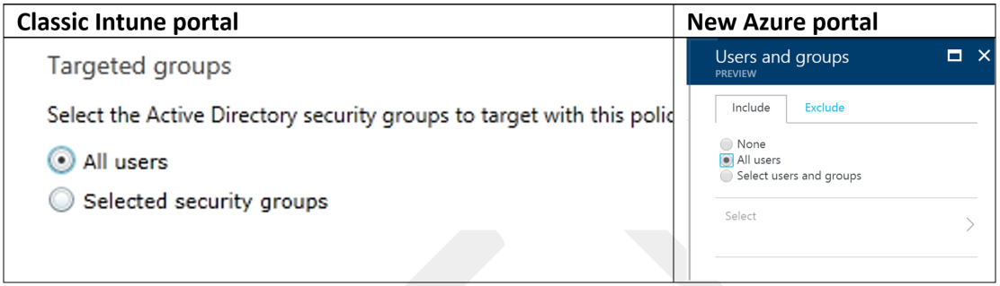
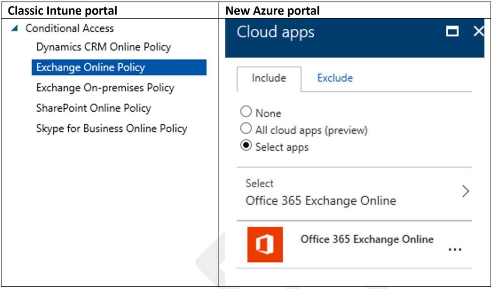
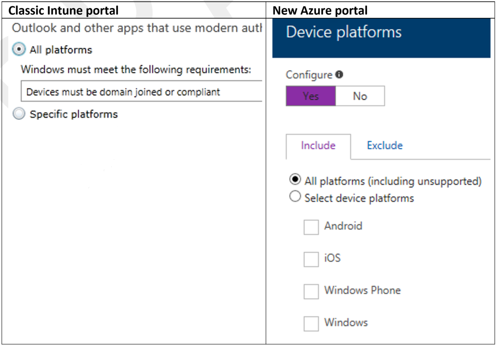
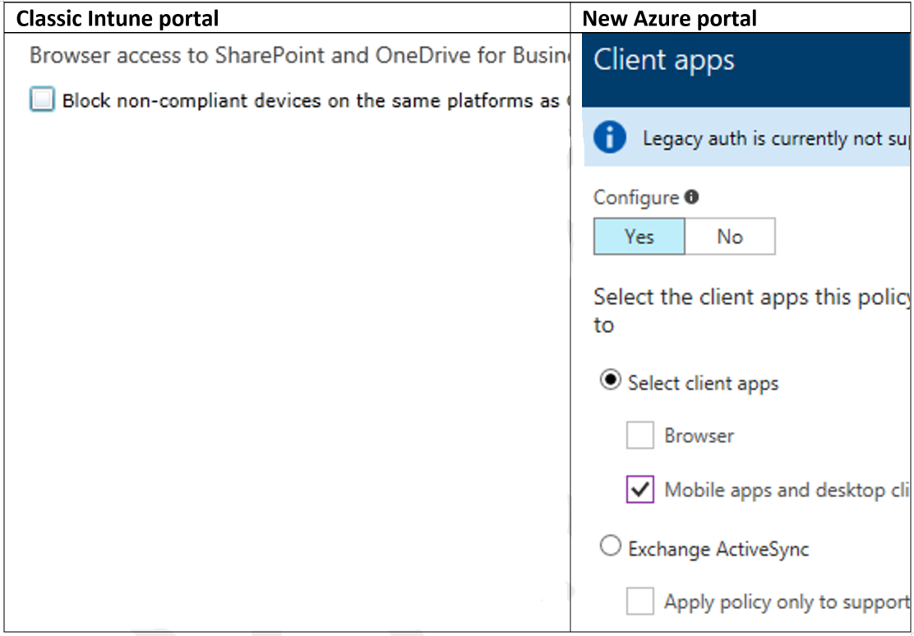
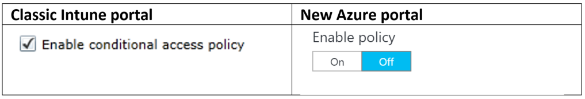
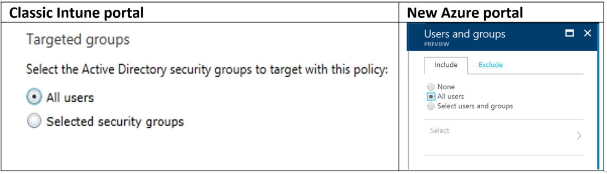
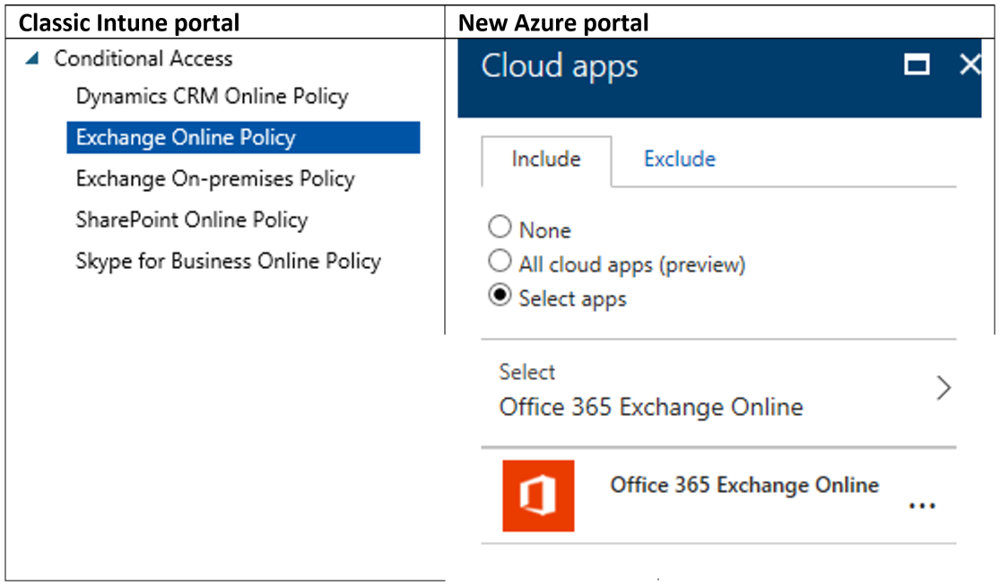
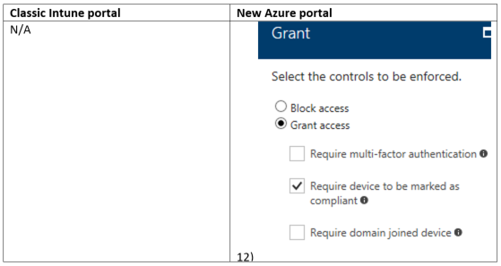
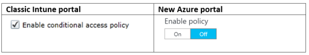

---
# required metadata

title: Migrate Conditional Access to Azure portal
titleSuffix: Microsoft Intune
description: Reassign the Conditional Access policies you previously created in the Intune classic portal to the Azure portal.
keywords:
author: brenduns
ms.author: brenduns
manager: dougeby
ms.date: 01/02/2019
ms.topic: conceptual
ms.service: microsoft-intune
ms.subservice: protect
ms.localizationpriority: high
ms.technology:
ms.assetid: 301159ad-5f7e-4fcc-86c7-f72a71701ff4

# optional metadata

#ROBOTS:
#audience:

ms.reviewer: chrisgree
ms.suite: ems
search.appverid: MET150
#ms.tgt_pltfrm:
ms.custom: intune-azure
ms.collection: M365-identity-device-management
---

# Reassign Conditional Access policies from Intune classic portal to the Azure portal

Starting in the new Azure portal, Conditional Access offers support for multiple policies per application, along with more customizability. If you've previously created Conditional Access policies in the Intune classic portal, you can migrate them to the Azure portal. 

## Before you begin

If you're ready to move to the Azure portal, follow the steps in this topic to reassign the Conditional Access policies you previously created in the Intune classic portal:

- Gather the Conditional Access policies previously created, so you know what settings you need to reassign later.

- Follow the steps in this topic to re-create these policies in the Azure portal.

- Disable the conditional policies in the Intune classic portal, after you have verified that the new policies are working as expected in the Azure portal.
  
  - **Before you disable** the Conditional Access policies in the Intune classic portal, plan how you'll move users over to the new policy. There are two approaches:
  
    - **Use the same inclusion group to apply policies created in the Azure portal, and create a new exemption group to use with the policies applied by the Intune classic portal**.
      - Gradually move some users into the exemption group specified in the classic portal. This prevents the policies targeted by the Intune classic portal from being applied. The policies created and targeted to the same user group in the Azure portal are applied, in addition to the ones applied in the Intune classic portal. 
  
    - **Create a new group to target the Conditional Access policies in the Azure portal**. If you choose this approach, you need to do the following:
      - Gradually remove users from the security groups that have Conditional Access policies targeted to them in the Intune classic portal.
      - After you have confirmed the new policy is working for those users, you can disable the policy in the Intune classic portal. 
  
- If you have your Conditional Access policy settings configured to use Exchange ActiveSync (EAS) in the Intune classic portal, see the [instructions in this topic](#reassign-intune-device-based-conditional-access-policies-for-eas-clients) to **reassign EAS Conditional Access policy settings in the Azure portal**.

### To verify your device-based Conditional Access policies in the Intune classic portal

1. Go to the [Intune classic portal](https://manage.microsoft.com), and sign in with your credentials.

2. Choose **Policy** from the left menu.

3. Choose **Conditional Access**, and then select the Microsoft cloud service (for example, Exchange Online or SharePoint Online) you created a Conditional Access policy for.

4. Take note of your Conditional Access settings, and refer to these when you create the same Conditional Access policies in the Azure portal.

### App and device-based Conditional Access policies working together

The **Intune App Protection** blade in the Azure portal enables admins to set app-based conditional rules so that only apps that support the Intune app protection policies are allowed access to corporate resources. You can choose to overlap these app-based Conditional Access policies by using device-based Conditional Access policies. You can combine the device-based and app-based conditional policies (logical AND), or you can provide either option (logical OR). If your Conditional Access policy requirements are to:

- Require a compliant device **AND** use the approved app.
  - You should set your Conditional Access policy by using the [Azure Active Directory Conditional Access blade](https://portal.azure.com/#blade/Microsoft_AAD_IAM/ConditionalAccessBlade/Policies) and the [Intune App Protection blade](https://portal.azure.com/#blade/Microsoft_Intune/SummaryBlade/0).
  
- Require a compliant device **OR** use the approved app.
  - You should set your Conditional Access policy by using the [Intune classic portal](https://manage.microsoft.com) and the [Intune App Protection blade](https://portal.azure.com/#blade/Microsoft_Intune/SummaryBlade/0).

> [!TIP] 
> This topic provides screenshots comparing the user experience in both the Intune classic portal and the Azure portal.

## Reassign Intune device-based Conditional Access policies

1. Go to [Conditional Access in the Azure portal](https://portal.azure.com/#blade/Microsoft_AAD_IAM/ConditionalAccessBlade/Policies), and sign in with your credentials.

2. Choose **New policy**.

3. Provide a name for the policy.

4. Under the **Assignments section**, choose **Users and groups** to target the new Conditional Access policy.

    

    > [!IMPORTANT] 
    > The selection you make for the Azure portal should correspond to the selection you made for the Classic portal. For example, if you have all users selected in the Intune classic portal, select **All users** in the Azure portal. Additionally, if you've chosen the **Exempt groups** option in the Intune classic portal, also exclude those select groups in the Azure portal.

5. After you choose your group, click **Select**, and then click **Done**.

6. Under the **Assignments** section, choose **Cloud apps**.

7. On the **Cloud apps** blade, choose **Select apps**.

8. Choose the app you want to apply the new Conditional Access policy to, and click **Select**.

9. Click **Done**.

    

    > [!TIP] 
    > If you have multiple apps with the same policy, consider consolidating them into a single policy in the Azure portal.

10. Under the **Assignments** section, choose **Conditions**.

11. On the **Conditions** blade, choose **Device platforms**, and then choose the applicable device platforms.

12. When you are finished choosing the device platforms, click **Done** twice.

    

    > [!TIP] 
    > If you have chosen individual platforms in the Intune classic portal, choose the individual platforms in the Azure portal.

    > [!NOTE] 
    > You can specify the domain join or compliant options for Windows later.

13. Under the **Assignments** section, choose **Conditions**.

14. On the **Conditions** blade, choose **Client apps**, and then choose the applicable client app.

15. When you have finished choosing the client app, click **Done** twice.

    

16. If you have chosen the browser settings in the Intune classic portal, select both **Browser** and **Mobile apps and desktop clients** in the Azure portal. In case you have not chosen the browser settings in the Intune classic portal, choose **Mobile apps and desktop clients** only. 

17. Under the **Access controls** section, choose **Grant**.

18. Under **Grant Access Controls**, choose **Require device to be marked as compliant**, and then click **Select**.

19. If you have a policy to require domain joined Windows devices, and you also allow Intune-enrolled and compliant Windows devices, choose **Require domain joined device** and **Require device to be marked as compliant**, along with **Require one of the selected controls**.

20. If you do not allow Intune enrolled and compliant Windows devices, exempt the Windows policy from the current policy. Then create a separate policy with **Device platforms** set to **Windows**, include the other conditions as set per above, and choose **Require domain joined device** under **Grant Access Controls**.

21. On the **New** Conditional Access policy blade, turn on the **Enable policy** toggle, and then click **Create**.

    

## Reassign Intune device-based Conditional Access policies for EAS clients

If you have configured Exchange ActiveSync settings as part of an Exchange Online policy in the Intune classic portal, you need to create a second Conditional Access policy in the Azure portal.

1. Go to [Conditional Access in the Azure portal](https://portal.azure.com/#blade/Microsoft_AAD_IAM/ConditionalAccessBlade/Policies), and sign in with your credentials.

2. Choose **New policy**.

3. Provide a name for the policy.

4. Under the **Assignments** section, choose **Users and groups** to target the new Conditional Access policy.

    

    > [!IMPORTANT] 
    > The selection you make for the Azure portal should correspond to the selection you made for the Azure portal. For example, if you have all users selected in the Intune classic portal, select **All users** in the Azure portal. Additionally, if you've chosen the **Exempt groups** option in the Intune classic portal, also exclude those select groups in the Azure portal.

5. After you choose your group, click **Select**, and then click **Done**.

6. Under the **Assignments** section, choose **Cloud apps**.

7. On the **Cloud apps** blade, click **Select apps**, and choose **Exchange Online**. Then click **Select** and **Done**.

    

    > [!IMPORTANT] 
    > Conditional Access policies for EAS clients cannot include any other cloud app.

8. On the **Conditions** blade, choose **Client apps**, and then choose the applicable client app. If you have chosen to block clients that aren't supported by Intune, use the **Apply policy only to supported platforms** option.

    

9. When you have finished choosing the client app, click **Done** twice.

10. Under the **Access controls** section, choose **Grant**.

11. Under **Grant Access Controls**, choose **Require device to be marked as compliant**, and then click **Select**.

    

12. On the **New** Conditional Access policy blade, turn on the **Enable policy** toggle, and then click **Create**.

    

> [!NOTE]
> If you configure **Device platforms**, saving the policy will fail with the error "Policy configuration is not supported." Exchange ActiveSync cannot identify the platform being used by the connecting device. Therefore, configuring specific device platforms is unsupported when creating a policy for Exchange ActiveSync devices.

## Disable Conditional Access policies in the Intune classic portal

After you have reassigned your Conditional Access policies in the Azure portal, it's important to gradually disable the Conditional Access policies previously created in the Intune classic portal. Additionally, you might need to use the same security group to apply the Conditional Access policies created in the Azure portal.

> [!NOTE]
> Before disabling your Conditional Access policies in the Intune classic portal, see the [Before you begin](#before-you-begin) section at the beginning of this topic.

### To disable the Conditional Access policies

Since MDM has been removed from the Intune Classic Portal, the following link has been provided to view/disable these classic policies:

[https://portal.azure.com/?microsoft_aad_iam_classicPolicyDontHide=true#blade/Microsoft_AAD_IAM/ConditionalAccessBlade/ClassicPolicies](https://portal.azure.com/?microsoft_aad_iam_classicPolicyDontHide=true#blade/Microsoft_AAD_IAM/ConditionalAccessBlade/ClassicPolicies)

## See also

- [Common ways to use Conditional Access with Intune](conditional-access-intune-common-ways-use.md)
- [app-based Conditional Access with Intune](app-based-conditional-access-intune.md)
- [Conditional Access in Azure Active Directory](https://docs.microsoft.com/azure/active-directory/active-directory-conditional-access-azure-portal-get-started)
