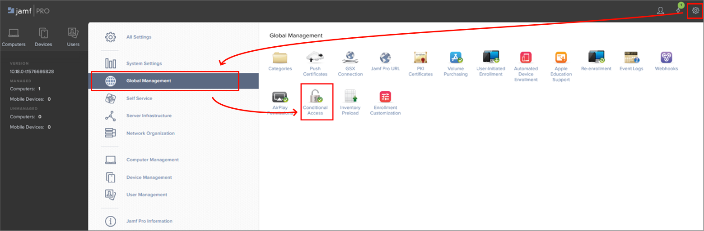
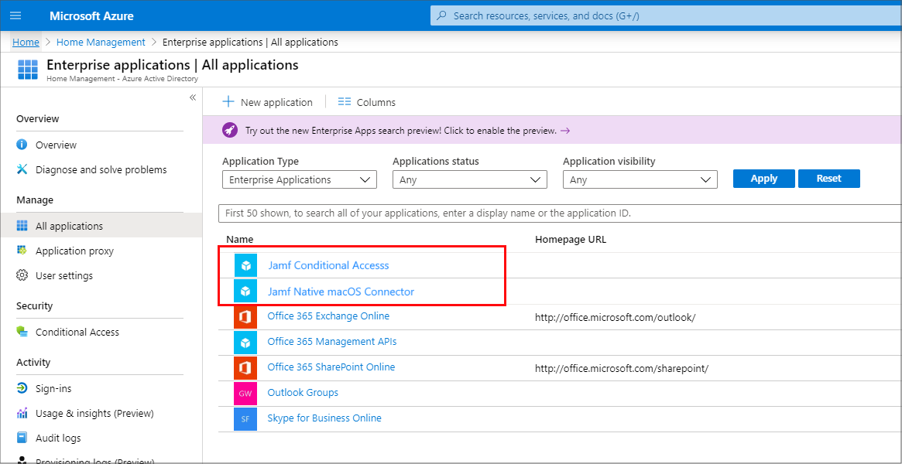
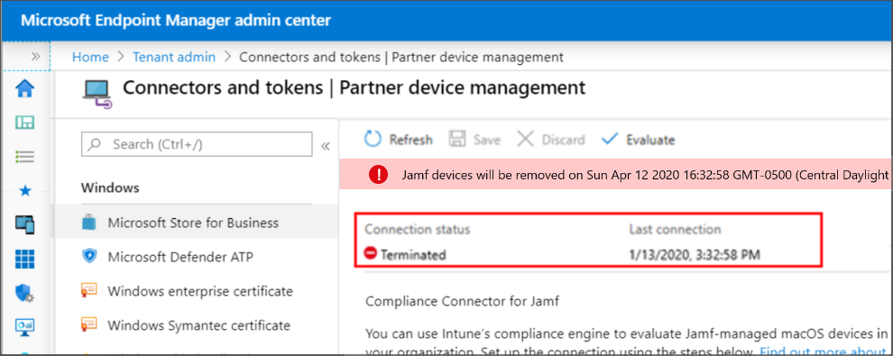
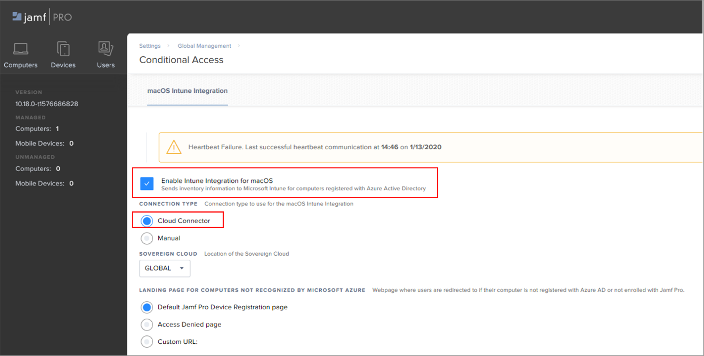
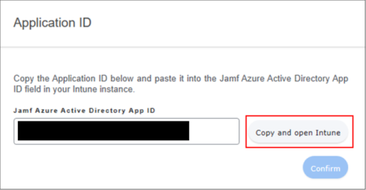
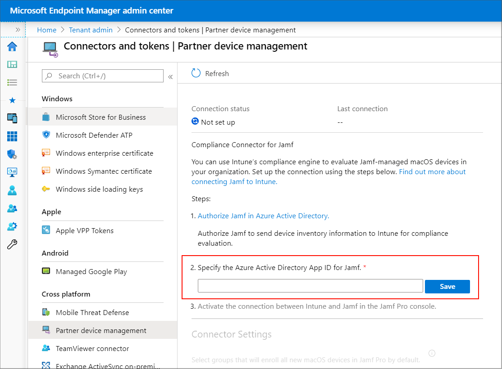
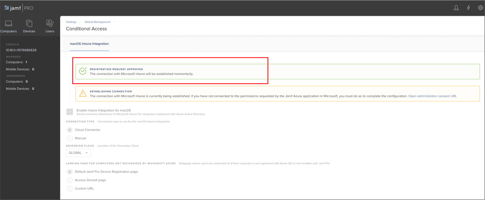
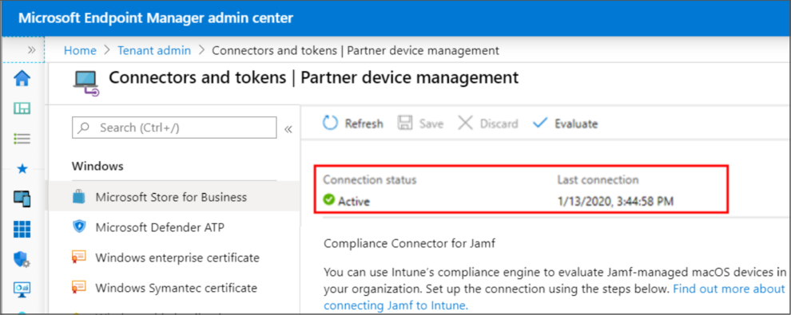

---
# required metadata

title: Configure the Jamf Pro Cloud Connector to integrate Jamf Pro with Microsoft Intune
titleSuffix: Microsoft Intune
description: Use the Jamf Cloud Connector to integrate Jamf Pro with Microsoft Intune.
keywords:
author: lenewsad
ms.author: lanewsad
manager: dougeby
ms.date: 08/30/2023
ms.topic: conceptual
ms.service: microsoft-intune
ms.subservice: protect
ms.localizationpriority: high
ms.assetid: 
# optional metadata

#ROBOTS: 
#audience:

ms.reviewer: tycast
ms.suite: ems
search.appverid: MET150
#ms.tgt_pltfrm:
ms.custom: intune-azure
ms.collection:
- tier3
- M365-identity-device-management
- conditional-access
- sub-device-compliance
---

# Configure the Jamf Cloud Connector to integrate with Microsoft Intune

> [!IMPORTANT]
>
> **Jamf macOS device support for Conditional Access is being deprecated**.
>
> Beginning on September 1, 2024, the platform that Jamf Pro’s Conditional Access feature is built on will no longer be supported.
>
> If you use Jamf Pro’s Conditional Access integration for macOS devices, follow Jamf’s documented guidelines to migrate your devices to Device Compliance integration at [***Migrating from macOS Conditional Access to macOS Device Compliance – Jamf Pro Documentation***](https://learn.jamf.com/bundle/jamf-pro-documentation-current/page/Conditional_Access.html#ariaid-title6).
>
> If you need help, contact [***Jamf Customer Success***](https://jamf.service-now.com/csm). For more information, see the blog post at [**https://aka.ms/Intune/Jamf-Device-Compliance**](https://aka.ms/Intune/Jamf-Device-Compliance).

This article can help you install the Jamf Cloud Connector to integrate Jamf Pro with Microsoft Intune. Through integration, you can require that your macOS devices that are managed by Jamf Pro meet your Intune device compliance requirements before those devices are allowed to access your organization's resources. Resource access is controlled by your Microsoft Entra Conditional Access policies in the same way as for devices managed through Intune.

We recommend use of the Jamf Cloud Connector as it automates many of the steps that are required when you manually configure integration as documented in [Integrate Jamf Pro with Intune for compliance](../protect/conditional-access-integrate-jamf.md).

When you set up the Cloud Connector:

- Set up automatically creates the Jamf Pro applications in Azure, replacing the need to manually configure them.
- You can integrate multiple instances of Jamf Pro with the same Azure tenant that hosts your Intune subscription.

Connecting multiple instances of Jamf Pro with a single Azure tenant is supported only when you use the Cloud Connector. When you use a manually configured connection, only a single instance of Jamf can integrate with an Azure tenant.

Use of the Cloud Connector is optional:

- For new tenants that don't yet integrate with Jamf, you can choose to configure the Cloud Connector as described in this article. Or you can manually configure integration as described in [Integrate Jamf Pro with Intune for compliance](../protect/conditional-access-integrate-jamf.md)
- For tenants that already have a manual configuration, you can choose to remove that integration, and then set up the Cloud Connector. Both the removal of an existing integration and setup of the Cloud Connector are described in this article.

If you plan to replace your previous integration with the Jamf Cloud Connector:

- Use the [procedure to remove your current configuration](#remove-the-jamf-pro-integration-for-a-previously-configured-tenant), which includes deleting the Enterprise apps for Jamf Pro and disabling the manual integration. Then you can use the [procedure to configure the Cloud Connector](#configure-the-cloud-connector-for-a-new-tenant).
- You won't need to re-register devices. Devices that are already registered can use the Cloud Connector without further configuration.
- Be sure to configure the Cloud Connector within 24 hours of removing your manual integration to ensure your registered devices can continue to report their status.

For more information about the Jamf Cloud Connector, see [Configuring the macOS Intune Integration using the Cloud Connector](https://docs.jamf.com/technical-papers/jamf-pro/microsoft-intune/10.17.0/Configuring_the_macOS_Intune_Integration_using_the_Cloud_Connector.html) on docs.jamf.com.

## Prerequisites

**Products and services**:  
- Jamf Pro 10.18 or later
- A Jamf Pro user account with Conditional Access privileges  
- Microsoft Intune
- Microsoft Entra ID P1 or P2
- [Company Portal app for macOS](https://aka.ms/macoscompanyportal)
- macOS devices with OS X 10.12 Yosemite or later

**Network**:  
The following ports and endpoints must be accessible for Jamf and Intune to integrate correctly:

- **Intune**: Port 443
- **Apple**: Ports 2195, 2196, and 5223 (push notifications to Intune)
- **Jamf**: Ports 80 and 5223

- Endpoints:
  - login.microsoftonline.com
  - graph.windows.net  
  - *.manage.microsoft.com  

For APNS to function correctly on the network, you must enable outgoing connections to, and redirects from the following ports:

- The Apple 17.0.0.0/8 block over TCP ports 5223 and 443 from all client networks.
- Ports 2195 and 2196 from Jamf Pro servers.

For more information about these ports, see the following articles:

- [Network endpoints for Microsoft Intune](../fundamentals/intune-endpoints.md).
- [Network Ports Used by Jamf Pro](https://www.jamf.com/jamf-nation/articles/34/network-ports-used-by-jamf-pro) on jamf.com.
- [TCP and UDP ports used by Apple software products](https://support.apple.com/HT202944) on support.apple.com

**Accounts**:  
Procedures in this article require use of accounts with the following permissions:

- **Jamf Pro console**: An account with permissions to manage Jamf Pro
- **Microsoft Intune admin center**: Global Administrator
- **Azure portal**: Global Administrator

## Remove the Jamf Pro integration for a previously configured tenant

Use the following procedure to remove a manually configured integration of Jamf Pro from your Azure tenant *before* you can configure the Cloud Connector.

If you have not previously set up a connection between Jamf Pro and Intune, or if you've one or more connections that already use the Cloud Connector, skip this procedure and begin with  [Configure the Cloud Connector for a new tenant](#configure-the-cloud-connector-for-a-new-tenant).

### Remove a manually configured Jamf Pro integration

1. Sign in to the Jamf Pro console.

2. Select **Settings** (the gear icon in the upper right corner), and then go to **Global Management** > **Conditional Access**.

   

3. Select **Edit**.

4. De-select the checkbox for **Enable Intune Integration for macOS**.

   When you deselect this setting, you disable the connection but save your configuration.

5. Sign in to the [Microsoft Intune admin center](https://go.microsoft.com/fwlink/?linkid=2109431) and go **Tenant administration** > **Partner device management**.

   On the **Partner device management** node, delete the **Application ID** in the **Specify the Microsoft Entra App ID for Jamf** field, and then select **Save**.

   The Application ID is the ID of the Azure Enterprise app that is created in Azure when you set up a manual integration if Jamf Pro.

6. Sign in to the [Azure portal](https://portal.azure.com/) with an account that has Global Admin permissions, and go to **Microsoft Entra ID** > **Enterprise applications**.

   Locate the two Jamf apps and delete them. New applications will be automatically created when you configure the Jamf Cloud Connector in the next procedure.

   

   After you've disabled integration in Jamf Pro, and deleted the Enterprise applications, the **Partner device management** node displays the connection status of **Terminated**.

   

Now that you've successfully removed the manual configuration for Jamf Pro integration, you can set up integration using the Cloud Connector. To do so, see [Configure the Cloud Connector for a new tenant](#configure-the-cloud-connector-for-a-new-tenant) in this article.

## Configure the Cloud Connector for a new tenant

Use the following procedure to configure the Jamf Cloud Connector to integrate Jamf Pro and Microsoft Intune when:

- You don't have any integration between Jamf Pro and Intune configured for your Azure tenant.
- You already have a Cloud Connector set up between Jamf Pro and Intune in your Azure tenant and want to integrate another Jamf instance with your subscription.

If you currently have a manually configured integration between Intune and Jamf Pro, see [Remove the Jamf Pro integration for a previously configured tenant](#remove-the-jamf-pro-integration-for-a-previously-configured-tenant) in this article to remove that integration before proceeding. Removal of a manually configured integration is required before you can successfully set up the Jamf the Cloud Connector.

### Create a new connection

1. Sign in to the Jamf Pro console.

2. Select **Settings** (the gear icon in the upper right corner0, and then go to **Global Management** > **Conditional Access**.

   

3. Select **Edit**.

4. Select the checkbox for **Enable Intune Integration for macOS**.
   - Select this setting to have Jamf Pro send inventory updates to Microsoft Intune.
   - You can deselect this setting to disable the connection but save your configuration.

   > [!IMPORTANT]
   > If **Enable Intune Integration for macOS** is already selected and the *Connection Type* is set to **Manual**, you must remove that integration before continuing. See [Remove the Jamf Pro integration for a previously configured tenant](#remove-the-jamf-pro-integration-for-a-previously-configured-tenant) in this article before continuing.

5. Under *Connection Type*, select **Cloud Connector**.

   

6. From the **Sovereign Cloud** pop-up menu, select the location of your Sovereign Cloud from Microsoft. If you're replacing your previous integration with the Jamf Cloud Connector, you can skip this step if the location has been specified.

7. Select one of the following landing page options for computers that aren't recognized by Microsoft Azure:
   - **The Default Jamf Pro Device Registration page** - Depending on the state of the macOS device, this option redirects users to either the Jamf Pro device enrollment portal (to enroll with Jamf Pro) or the Intune Company Portal app (to register with Microsoft Entra ID).
   - **The Access Denied page**
   - **Custom URL**
  
   If you're replacing your previous integration with the Jamf Cloud Connector, you can skip this step if the landing page has been specified.
  
8. Select **Connect**. You're redirected to register the Jamf Pro applications in Azure.

   When prompted, specify your Microsoft Azure credentials and follow the onscreen instructions to grant the requested permissions. You'll grant permissions for the **Cloud Connector**, and then again for the **Cloud Connector user registration app**. Both apps are registered in Azure as Enterprise Applications.

   After permissions are granted for both apps, the **Application ID** page opens.

9. On the **Application ID** page, select **Copy and open Intune**.

   

   The *Application ID* is copied to your system clipboard for use in the next step, and the **Partner device management** node in the *Microsoft Intune admin center* opens. (**Tenant administration** > **Partner device management**).

10. On the **Partner device management** node, *Paste* the **Application ID** in to the **Specify the Microsoft Entra App ID for Jamf** field, and then select **Save**.

    

11. Return to the Application ID page in Jamf Pro and select **Confirm**.

12. Jamf Pro completes and tests the configuration and displays the success or failure of the connection on the Conditional Access settings page. The following image is an example of success:

    

13. In the Microsoft Intune admin center, refresh the **Partner device management** node. The connection should now show as **Active**:

    

When the connection between Jamf Pro and Microsoft Intune is successfully established, Jamf Pro sends inventory information to Microsoft Intune for each computer that is registered with Microsoft Entra ID (registering with Microsoft Entra ID is an end-user workflow). You can view the Conditional Access Inventory State for a user and a computer in the Local User Account category of a computer's inventory information in Jamf Pro.

After you integrate one instance of Jamf Pro by using the Jamf Cloud Connector, you can use this same procedure to configure more instances of Jamf Pro with the same Intune subscription in your Azure tenant.  

## Set up compliance policies and register devices

After you configure integration between Intune and Jamf, you need to [apply compliance policies to Jamf-managed devices](../protect/conditional-access-assign-jamf.md).

## Disconnect Jamf Pro and Intune

To remove integration of Jamf Pro with Intune, use the following steps to remove the connection from within the Jamf Pro console. This information applies to both the Cloud Connector and for a manually configured integration.

### Deprovision Jamf Pro from within the Microsoft Intune admin center

1. In the [Microsoft Intune admin center](https://go.microsoft.com/fwlink/?linkid=2109431), go to **Tenant administration** > **Connectors and tokens** > **Partner device management**.

2. Select the option **Terminate**. Intune displays a message about the action. Review the message and when ready, select **OK**. The option to *Terminate* the integration only appears when the Jamf connection exists.

After you terminate the integration, refresh the view of the admin center to update the view. Your organization's macOS devices are removed from Intune in 90 days.
### Deprovision Jamf Pro from within the Jamf Pro console

Use the following steps to remove the connection from within the Jamf Pro console.

1. In the Jamf Pro console, go to **Global Management** > **Conditional Access**. On the **macOS Intune Integration** tab, select **Edit**.

2. Clear the **Enable Intune Integration for macOS** check box.

3. Select **Save**. Jamf Pro sends your configuration to Intune and the integration will be terminated.

4. Sign in to the [Microsoft Intune admin center](https://go.microsoft.com/fwlink/?linkid=2109431).

5. Select **Tenant administration** > **Connectors and tokens** > **Partner device management** to verify that the status is now **Terminated**.

After you terminate the integration, your organization's macOS devices will be removed at the date shown in your console, which is after three months.

## Get support for the Cloud Connector

Because the cloud connector automatically creates the Azure Enterprise apps necessary for integration, your first point of contact for support should be **Jamf**. Options include:

- Email support at `support@jamf.com`
- Use the support portal at Jamf Nation: https://www.jamf.com/support/ 

Prior to contacting support:

- Review the Prerequisites such as ports and product version you use.
- Confirm that permissions for the following two Jamf Pro apps created in Azure haven't been modified. Changes to the app permissions aren't supported by Intune and can cause integration to fail.

  **Cloud Connector user registration app**:
  - API Name: Microsoft Graph
    - Permission: Sign in and read user profile
    - Type: Delegated
    - Granted through: Admin consent
    - Granted by: An administrator

  **Cloud Connector app**:
  - API Name: Microsoft Graph (instance 1)
    - Permission: Sign in and read user profile
    - Type: Delegated
    - Granted through: Admin consent
    - Granted by: An administrator

  - API Name: Microsoft Graph (instance 2)
    - Permission: Read directory data
    - Type: Application
    - Granted through: Admin consent
    - Granted by: An administrator

  - API Name: Intune API
    - Permission: Send device attribute to Microsoft Intune
    - Type: Application
    - Granted through: Admin consent
    - Granted by: An administrator

## Common questions about the Jamf Cloud Connector

### What data is shared via the Cloud Connector?

The Cloud Connector authenticates with Microsoft Azure and sends device inventory data from Jamf Pro to Azure. In addition, the Cloud Connector manages service discovery in Azure, token exchange, communication errors, and disaster recovery.

### Where is device inventory data stored?

Device inventory data is stored in the Jamf Pro database.

### What credentials are stored?

No credentials are stored. When you configure the Cloud Connector, you must consent to adding the Jamf multi-tenant app and the native macOS connector app to their Microsoft Entra tenant. Once the multi-tenant application is added, the Cloud Connector requests access tokens to interact with the Azure API. Application access can be revoked in Microsoft Azure at any time to restrict access.

### How is data encrypted?

The Cloud Connector uses Transport Layer Security (TLS) for data sent between Jamf Pro and Microsoft Azure.

### How does Jamf know which device is associated with which instance of Jamf Pro?

Jamf Pro uses microservices in AWS to correctly route the device information to the correct instance.

### Can I switch from using the Cloud Connector to the Manual connection type?

Yes. You can change the connection type back to manual and follow the steps for manual setup. If you have questions, they should be directed to Jamf for assistance.

### Permissions were modified on one or both required apps (*Cloud Connector* and *Cloud Connector user registration app*) and registration isn't working. Is the permissions change supported?

Modifying the permissions on the apps isn't supported.

### Is there a log file in Jamf Pro that shows if the Connection Type has been changed?

Yes, the changes are logged to the JAMFChangeManagement.log file. To view the Change Management logs, sign in to Jamf Pro, go to **Settings** > **System Settings** > **Change Management** > **Logs**, search **Object type** for **Conditional Access**, and then select **Details** to view the changes.

## Next steps

- [Apply compliance policies to Jamf-managed devices](../protect/conditional-access-assign-jamf.md)
- [Data Jamf sends to Intune](../protect/data-jamf-sends-to-intune.md)
- [Integrate Jamf Pro with Intune to report compliance to Microsoft Entra ID](../protect/jamf-managed-device-compliance-with-entra-id.md).
