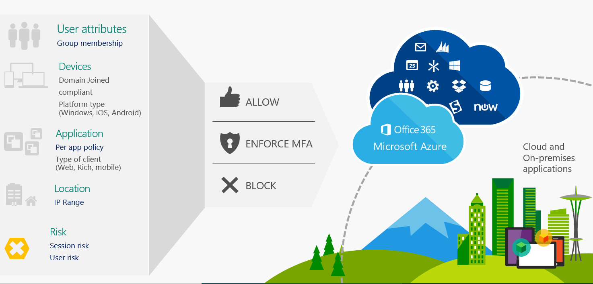

---
# required metadata

title: Conditional Access with Microsoft Intune
titleSuffix: Microsoft Intune
description: Learn how to define the conditions that users, devices, and apps must meet to access company resources in Microsoft Intune.
keywords:
author: brenduns
ms.author: brenduns
manager: dougeby    
ms.date: 03/06/2018
ms.topic: conceptual
ms.service: microsoft-intune
ms.subservice: protect
ms.localizationpriority: high
ms.technology:
ms.assetid: a1973f38-ea55-43eb-a151-505fb34a8afb

# optional metadata

#ROBOTS:
#audience:
#ms.devlang:
#ms.reviewer:
ms.suite: ems
search.appverid: MET150
#ms.tgt_pltfrm:
ms.custom: intune-azure; get-started
ms.collection: M365-identity-device-management
---

# Learn about Conditional Access and Intune

With Conditional Access, you can control the devices and apps that can connect to your email and company resources. 

Enterprise Mobility + Security (EMS)  is not a standalone product. It's a solution that takes part on all services and products that are part of EMS. Conditional Access provides granular access control to keep your corporate data secure, while giving users an experience that allows them to do their best work from any device, and from any location.

You can define conditions that gate access to your corporate data based on location, device, user state, and application sensitivity.

> [!NOTE]
> Conditional Access also extends its capabilities to [Office 365 services](https://docs.microsoft.com/office365/enterprise/office-365-client-support-conditional-access).

## Use Conditional Access with Intune

Conditional Access is an Azure Active Directory capability that is included with an Azure Active Directory Premium license. Intune enhances this capability by adding mobile device compliance and mobile app management to the solution. 

Ways to use Conditional Access with Intune:

- **Device-based Conditional Access**

  - Conditional Access for Exchange on-premises

  - Conditional Access based on network access control

  - Conditional Access based on device risk

  - Conditional Access for Windows PCs

    - Corporate-owned

    - Bring your own device (BYOD)

- **App-based Conditional Access**

## Next steps

[Common ways to use Conditional Access with Intune](conditional-access-intune-common-ways-use.md)
