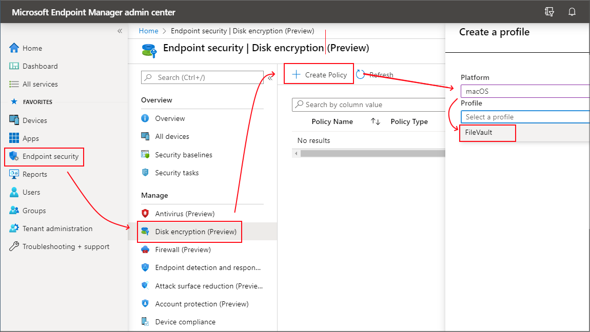
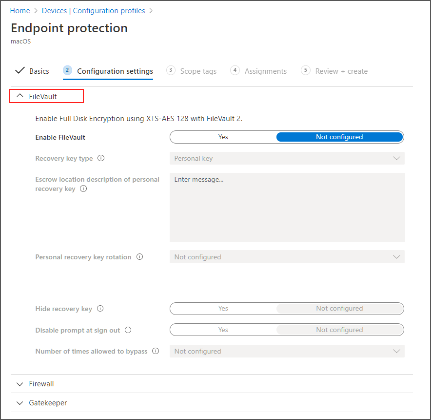

---
# required metadata
title: Encrypt macOS devices with FileVault disk encryption with Intune 
titleSuffix: Microsoft Intune
description: Encrypt macOS devices with the built-in encryption method FileVault, and manage the recovery keys for those encrypted devices from within the Intune portal. 
keywords:
author: brenduns
ms.author: brenduns
manager: dougeby
ms.date: 04/17/2020
ms.topic: conceptual
ms.service: microsoft-intune
ms.subservice: protect
ms.localizationpriority: high
ms.technology:
ms.assetid:  

# optional metadata

#audience:

ms.reviewer: annovich
ms.suite: ems
search.appverid: MET150
#ms.tgt_pltfrm:
ms.custom: intune-azure

---

# Use FileVault disk encryption for  macOS with Intune

Intune supports macOS FileVault disk encryption. FileVault is a whole-disk encryption program that is included with macOS. You can use Intune to configure FileVault on devices that run **macOS 10.13 or later**.

Use one of the following policy types to configure FileVault on your managed devices:

- **[Endpoint security policy for macOS FileVault](#create-an-endpoint-security-policy-for-filevault)**. The FileVault profile in *Endpoint security* is a focused group of settings that is dedicated to configuring FileVault.

  View details about the [FileVault settings](../protect/endpoint-security-disk-encryption-profile-settings.md) you can manage through disk encryption policy.

- **[Device configuration profile for endpoint protection for macOS FileVault](#create-an-endpoint-security-policy-for-filevault)**. FileVault settings are one of the available settings categories for macOS endpoint protection. For more information about using a device configuration profile, see [Create a device profile in Inunte](../configuration/device-profile-create.md).

  View details about the [FileVault settings](../protect/endpoint-protection-macos.md#filevault) you can manage with Intune through device configuration policy.

To manage BitLocker for Windows 10, see [Manage BitLocker policy](../protect/encrypt-devices.md).

> [!TIP]
> [encryption report](encryption-monitor.md) that presents details about the encryption status of devices, across all your managed devices.

After you create a policy to encrypt devices with FileVault, the policy is applied to devices in two stages. First, the device is prepared to enable Intune to retrieve and back up the recovery key. This action is referred to as escrow. After the key is escrowed, the disk encryption can start.

User-approved device enrollment is required for FileVault to work on a device. The user must manually approve of the management profile from system preferences for enrollment to be considered user-approved.

## Permissions to manage FileVault

To manage FileVault in Intune, your account must have the applicable Intune [role-based access control](../fundamentals/role-based-access-control.md) (RBAC) permissions.

Following are the FileVault permissions, which are part of the **Remote tasks** category, and the built-in RBAC roles that grant the permission:

- **Get FileVault key**:
  - Help Desk Operator
  - Endpoint security manager

- **Rotate FileVault key**
  - Help Desk Operator

## Create and deploy policy

### Create an endpoint security policy for FileVault

1. Sign in to the [Microsoft Endpoint Manager admin center](https://go.microsoft.com/fwlink/?linkid=2109431).

2. Select **Endpoint security** > **Disk encryption** > **Create Policy**.

3. On the **Basics** page, enter the following properties, and then choose **Next**.
   1. **Platform**: macOS
   2. **Profile**: FileVault

   

4. On the **Configuration settings** page:
   1. Set *Enable FileVault* to **Yes**.
   2. For *Recovery key type*, only **Personal Recovery Key** is supported.
   3. Configure additional settings to meet your requirements.

   Consider adding a message to help guide users on how to retrieve the recovery key for their device. This information can be useful for your users when you use the setting for Personal recovery key rotation, which can automatically generate a new recovery key for a device periodically.

   For example: To retrieve a lost or recently rotated recovery key, sign in to the Intune Company Portal website from any device. In the portal, go to Devices and select the device that has FileVault enabled, and then select *Get recovery key*. The current recovery key is displayed.

5. When your done configuring settings, select **Next**.

6. On the **Scope (Tags)** page, choose **Select scope tags** to open the Select tags pane to assign scope tags to the profile.

   Select **Next** to continue.

7. On the **Assignments** page, select the groups that will receive this profile. For more information on assigning profiles, see Assign user and device profiles.
Select **Next**.

8. On the **Review + create** page, when you're done, choose **Create**. The new profile is displayed in the list when you select the policy type for the profile you created.

### Create a device configuration policy for FileVault

1. Sign in to the [Microsoft Endpoint Manager admin center](https://go.microsoft.com/fwlink/?linkid=2109431).

2. Select **Devices** > **Configuration profiles** > **Create profile**.

3. Set the following options:
   1. **Platform**: macOS
   2. **Profile**: Endpoint protection

   

4. Select **Settings** > **FileVault**.

   

5. For *FileVault*, select **Enable**.

6. For *Recovery key type*, only **Personal key** is supported.

   Consider adding a message to help guide users on how to retrieve the recovery key for their device. This information can be useful for your users when you use the setting for Personal recovery key rotation, which can automatically generate a new recovery key for a device periodically.

   For example: To retrieve a lost or recently rotated recovery key, sign in to the Intune Company Portal website from any device. In the portal, go to *Devices* and select the device that has FileVault enabled, and then select *Get recovery key*. The current recovery key is displayed.

7. Configure the remaining [FileVault settings](endpoint-protection-macos.md#filevault) to meet your business needs, and then select **OK**.

8. Complete configuration of additional settings, and then save the profile.

## Manage FileVault

To view information about devices that receive FileVault policy, see [Monitor disk encryption](../protect/encryption-monitor.md).

When Intune first encrypts a macOS device with FileVault, a personal recovery key is created. Upon encryption, the device displays the personal key a single time to the device user.

For managed devices, Intune can escrow a copy of the personal recovery key. Escrow of keys enables Intune administrators to rotate keys to help protect devices, and users to recover a lost or rotated personal recovery key.

After Intune encrypts a macOS device with FileVault:

- Admins can view and manage the FileVault recovery keys by using the Intune encryption report.
- Users can view a device's personal recovery key from the web Company Portal on the device. From within the web Company Portal, choose the encrypted macOS device, and then choose to "Get recovery key" as a remote device action.

> [!IMPORTANT]
> Devices that are encrypted by users, and not by Intune, cannot be managed by Intune. This means that Intune can't escrow the personal recovery of these devices, nor manage the rotation of the recovery key. Before Intune can manage FileVault and recovery keys for the device, the user must decrypt their device, and then let Intune encrypt the device.

### Retrieve personal recovery key

For a macOS device that was encrypted by Intune, end users can retrieve their personal recovery key (FileVault key) using the iOS Company Portal app, the Android Company Portal app, or through the Android Intune app.

The device that has the personal recovery key must be enrolled with Intune and encrypted with FileVault through Intune. Using the iOS Company Portal app, Android Company Portal app, the Android Intune app, or the Company Portal website, the user can see the **FileVault** recovery key needed to access their Mac devices.

Device users can select **Devices** > *the encrypted and enrolled macOS device* > **Get recovery key**. The browser will show the Web Company Portal and display the recovery key.

### Rotate recovery keys

Intune supports multiple options to rotate and recover personal recovery keys. One reason to rotate a key is if the current personal key is lost or thought to be at risk.

- **Automatic rotation**: As an admin, you can configure the FileVault setting Personal recovery key rotation to automatically generate new recovery key's periodically. When a new key is generated for a device, the key isn't displayed to the user. Instead, the user must get the key either from an admin, or by using the company portal app.

- **Manual rotation**: As an admin, you can view information for a device that you manage with Intune and that's encrypted with FileVault. You can then choose to manually rotate the recovery key for corporate devices. You can't rotate recovery keys for personal devices.

  To rotate a recovery key:

  1. Sign in to the [Microsoft Endpoint Manager admin center](https://go.microsoft.com/fwlink/?linkid=2109431).

  2. Select **Devices** > **All devices**.

  3. From the list of devices, select the device that is encrypted and for which you want to rotate its key. Then under Monitor, select **Recovery keys**.
  
  4. On the Recovery keys pane, select **Rotate FileVault recovery key**.

     The next time the device checks in with Intune, the personal key is rotated. When needed, the new key can be obtained by the user through the company portal.

### Recover recovery keys

- **Administrator**: Administrators can't view personal recovery keys for devices that are encrypted with FileVault.

- **End-user**: End-users use the Company Portal website from any device to view the current personal recovery key for any of their managed devices. You can't view recovery keys from the Company Portal app.

  To view a recovery key:
  
  1. Sign in to the *Intune Company Portal* website from any device.

  2. In the portal, go to **Devices** and select the macOS device that is encrypted with FileVault.

  3. Select **Get recovery key**. The current recovery key is displayed.

## Next steps

[Manage BitLocker policy](../protect/encrypt-devices.md)

[Monitor disk encryption](../protect/encryption-monitor.md)
