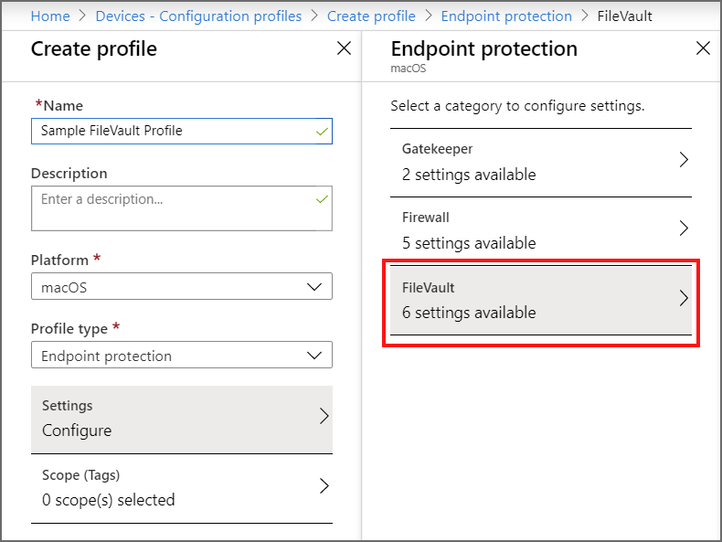
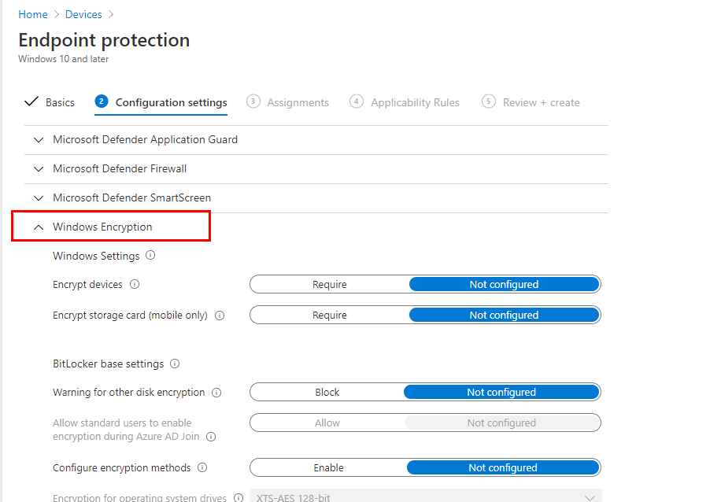

---
# required metadata
title: Encrypt devices with the platforms supported encryption method 
titleSuffix: Microsoft Intune
description: Encrypt devices with built-in encryption methods like BitLocker or FileVault, and manage the recovery keys for those encrypted devices from within the Intune portal. 
keywords:
author: brenduns
ms.author: brenduns
manager: dougeby
ms.date: 03/03/2020
ms.topic: conceptual
ms.service: microsoft-intune
ms.subservice: protect
ms.localizationpriority: high
ms.technology:
ms.assetid:  

# optional metadata

#audience:

ms.reviewer: annovich
ms.suite: ems
search.appverid: MET150
#ms.tgt_pltfrm:
ms.custom: intune-azure

---

# Use device Encryption with Intune

Use Intune to manage a devices built-in disk or drive encryption to protect data on your devices.

Configure disk encryption as part of a device configuration profile for endpoint protection. The following platforms and encryption technologies are supported by Intune:

- macOS: FileVault
- Windows 10 and later: BitLocker

Intune also provides a built-in [encryption report](encryption-monitor.md) that presents details about the encryption status of devices, across all your managed devices.

## FileVault encryption for macOS

Use Intune to configure FileVault disk encryption on devices that run macOS. Then, use the Intune encryption report to view encryption details for those devices and to manage recovery keys for FileVault encrypted devices.

User-approved device enrollment is required for FileVault to work on the device. The user must manually approve of the management profile from system preferences for enrollment to be considered user-approved.

FileVault is a whole-disk encryption program that is included with macOS. You can use Intune to configure FileVault on devices that run **macOS 10.13 or later**.

To configure FileVault, create a [device configuration profile](../configuration/device-profile-create.md) for endpoint protection for the macOS platform. FileVault settings are one of the available settings categories for macOS endpoint protection.

After you create a policy to encrypt devices with FileVault, the policy is applied to devices in two stages. First, the device is prepared to enable Intune to retrieve and back up the recovery key. This action is referred to as escrow. After the key is escrowed, the disk encryption can start.

For details about the FileVault setting you can manage with Intune, see [FileVault](endpoint-protection-macos.md#filevault) in the Intune article for macOS endpoint protection settings.

### Permissions to manage FileVault

To manage FileVault in Intune, your account must have the applicable Intune [role-based access control](../fundamentals/role-based-access-control.md) (RBAC) permissions.

Following are the FileVault permissions, which are part of the **Remote tasks** category, and the built-in RBAC roles that grant the permission:
 
- **Get FileVault key**:
  - Help Desk Operator
  - Endpoint security manager

- **Rotate FileVault key**
  - Help Desk Operator

### How to configure macOS FileVault

1. Sign in to the [Microsoft Endpoint Manager admin center](https://go.microsoft.com/fwlink/?linkid=2109431).

2. Select **Devices** > **Configuration profiles** > **Create profile**.

3. Set the following options:

   - Platform: macOS
   - Profile type: Endpoint protection

4. Select **Settings** > **FileVault**.

5. For *FileVault*, select **Enable**.

6. For *Recovery key type*, only **Personal key** is supported.

   Consider adding a message to help guide end-users on how to retrieve the recovery key for their device. This information can be useful for your end-users when you use the setting for Personal recovery key rotation, which can automatically generate a new recovery key for a device periodically.

   For example: To retrieve a lost or recently rotated recovery key, sign in to the Intune Company Portal website from any device. In the portal, go to *Devices* and select the device that has FileVault enabled, and then select *Get recovery key*. The current recovery key is displayed.

7. Configure the remaining [FileVault settings](endpoint-protection-macos.md#filevault) to meet your business needs, and then select **OK**.

  8. Complete configuration of additional settings, and then save the profile.  

### Manage FileVault

After Intune encrypts a macOS device with FileVault, you can view and manage the FileVault recovery keys when you view the Intune [encryption report](encryption-monitor.md).

After Intune encrypts a macOS device with FileVault, you can view that device's personal recovery key from the web Company Portal on any device. Once in the web Company Portal, choose the encrypted macOS device, and then choose to "Get recovery key" as a remote device action.

### Retrieve personal recovery key from MEM encrypted macOS devices

End users can retrieve their personal recovery key (FileVault key) using the iOS Company Portal app, the Android Company Portal app, or through the Android Intune app. The device that has the personal recovery key must be enrolled with Intune and encrypted with FileVault through Intune. Using the iOS Company Portal app, Android Company Portal app, the Android Intune app, or the Company Portal website, the end-user can see the **FileVault** recovery key needed to access their Mac devices. End-users can select **Devices** > *the encrypted and enrolled macOS device* > **Get recovery key**. The browser will show the Web Company Portal and display the recovery key. 

## BitLocker encryption for Windows 10

Use Intune to configure BitLocker Drive Encryption on devices that run Windows 10. Then, use the Intune encryption report to view encryption details for those devices. You can also access important information for BitLocker from your devices, as found in Azure Active Directory (Azure AD).

BitLocker is available on devices that run **Windows 10 or later**.

Configure BitLocker when you create a [device configuration profile](../configuration/device-profile-create.md) for endpoint protection for the Windows 10 or later platform. BitLocker settings are in the Windows Encryption settings category for Windows 10 endpoint protection.

### How to configure Windows 10 BitLocker

1. Sign in to the [Microsoft Endpoint Manager admin center](https://go.microsoft.com/fwlink/?linkid=2109431).

2. Select **Devices** > **Configuration profiles** > **Create profile**.

3. Set the following options:

   - Platform: Windows 10 and later
   - Profile type: Endpoint protection

4. Select **Settings** > **Windows Encryption**.

5. Configure settings for BitLocker to meet your business needs, and then select **OK**.

6. Complete configuration of additional settings, and then save the profile.

### Silently enable BitLocker on devices

You can configure a BitLocker policy that automatically and silently enables BitLocker on a device. That means that BitLocker enables successfully without presenting any UI to the end user, even when that user isn’t a local Administrator on the device.

**Device Prerequisites**:

A device must meet the following conditions to be eligible for silently enabling BitLocker:

- The device must run Windows 10 version 1809 or later
- The device must be Azure AD Joined  

**BitLocker policy configuration**:

The following two settings for [BitLocker base settings](../protect/endpoint-protection-windows-10.md#bitlocker-base-settings) must be configured in the BitLocker policy:

- **Warning for other disk encryption** = *Block*.
- **Allow standard users to enable encryption during Azure AD Join** = *Allow*

The BitLocker policy **must not require** use of a startup PIN or startup key. When a TPM startup PIN or startup key is *required*, BitLocker cannot silently enable and requires interaction from the end user.  This requirement is met through the following three [BitLocker OS drive settings](../protect/endpoint-protection-windows-10.md#bitlocker-os-drive-settings) in the same policy:

- **Compatible TPM startup PIN** must not be set to *Require startup PIN with TPM*
- **Compatible TPM startup key** must not set to *Require startup key with TPM*
- **Compatible TPM startup key and PIN** must not set to *Require startup key and PIN with TPM*

### Manage BitLocker

After Intune encrypts a Windows 10 device with BitLocker, you can view and retrieve BitLocker recovery keys when you view the Intune [encryption report](encryption-monitor.md).

### Rotate BitLocker recovery keys

You can use an Intune device action to remotely rotate the BitLocker recovery key of a device that runs Windows 10 version 1909 or later.

#### Prerequisites

Devices must meet the following prerequisites to support rotation of the BitLocker recovery key:

- Devices must run Windows 10 version 1909 or later

- Azure AD-joined and Hybrid-joined devices must have support for key rotation enabled:

  - **Client-driven recovery password rotation**

  This setting is under *Windows Encryption* as part of a device configuration policy for Windows 10 Endpoint Protection.
  
#### To rotate the BitLocker recovery key

1. Sign in to the [Microsoft Endpoint Manager admin center](https://go.microsoft.com/fwlink/?linkid=2109431).

2. Select **Devices** > **All devices**.

3. In the list of devices that you manage, select a device, select **More**, and then select the **BitLocker key rotation** device remote action.

## Next steps

Create [a device compliance](compliance-policy-create-windows.md) policy.

Use the encryption report, to manage:

- [BitLocker recovery keys](encryption-monitor.md#bitlocker-recovery-keys)
- [FileVault recovery keys](encryption-monitor.md#filevault-recovery-keys)

Review the encryption settings you can configure with Intune for:

- [BitLocker](endpoint-protection-windows-10.md#windows-encryption)
- [FileVault](endpoint-protection-macos.md#filevault)
