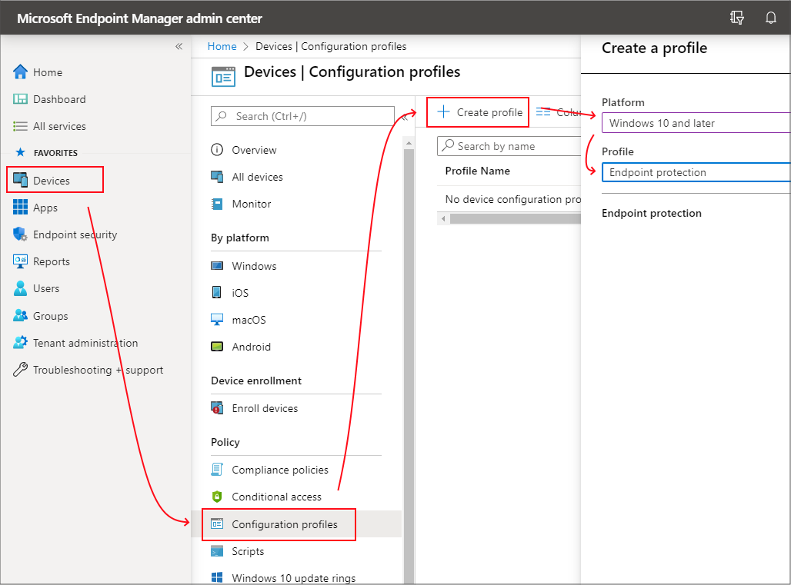
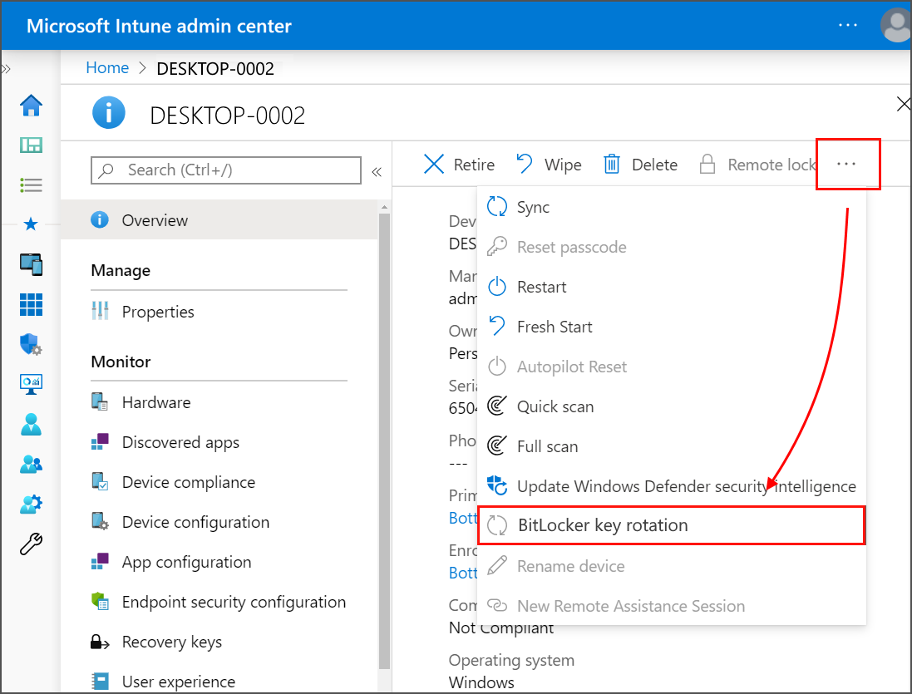

---
# required metadata
title: Encrypt Windows devices with BitLocker in Intune 
titleSuffix: Microsoft Intune
description: Use policy from Microsoft Intune admin center to encrypt devices with the BitLocker built-in encryption method, and manage the recovery keys for those encrypted devices.
keywords:
author: brenduns
ms.author: brenduns
manager: dougeby
ms.date: 09/23/2024
ms.topic: how-to
ms.service: microsoft-intune
ms.subservice: protect
ms.localizationpriority: high

# optional metadata
#audience:
ms.reviewer: annovich; aanavath
ms.suite: ems
search.appverid: MET150
#ms.tgt_pltfrm:
ms.custom: intune-azure
ms.collection:
- tier1
- M365-identity-device-management
- highpri
- highseo
- sub-secure-endpoints
---

# Manage Disk Encryption policy for Windows devices with Intune

Use Intune to configure BitLocker encryption on devices that run Windows 10 or later, and Personal Data Encryption (PDE) on devices that run Windows 11 Version 22H2 or later.

> [!TIP]
>
> Some settings for BitLocker require the device have a supported TPM.

Use one of the following policy types to configure encryption on your managed devices:

- **[Endpoint security > Windows  encryption policy](#create-an-endpoint-security-policy-for-windows)**. Choose from the following profiles:

  - *BitLocker* - A focused group of settings that are dedicated to configuring BitLocker. For more information, see the [BitLocker CSP](/windows/client-management/mdm/bitlocker-csp).

  - *Personal Data Encryption* - Personal Data Encryption (PDE) encrypts data at the folder level and can be used with other encryption methods, like BitLocker. For more information, see the [PDE CSP](/windows/client-management/mdm/personaldataencryption-csp).

- **[Device configuration profile for endpoint protection for BitLocker](#create-an-endpoint-security-policy-for-windows)**. BitLocker settings are one of the available settings categories for Windows 10/11 endpoint protection.

  View the BitLocker settings that are available for [BitLocker in endpoint protection profiles from device configuration policy](../protect/endpoint-protection-windows-10.md#windows-settings).

> [!TIP]
> Intune provides a built-in [encryption report](encryption-monitor.md) that presents details about the encryption status of devices, across all your managed devices. After Intune encrypts a Windows device with BitLocker, you can view and manage BitLocker recovery keys when you view the encryption report.
>
> You can also access important information for BitLocker from your devices, as found in Microsoft Entra ID.

> [!IMPORTANT]
>
> Before enabling BitLocker, understand and plan for *recovery options* that meet your organizations needs. For more information, start with  [**BitLocker recovery overview**](/windows/security/operating-system-security/data-protection/bitlocker/recovery-overview) in the Windows security documentation.

## Role-based access controls to manage BitLocker

To manage BitLocker in Intune, an account must be assigned an Intune [role-based access control](../fundamentals/role-based-access-control.md) (RBAC) role that includes the **Remote tasks** permission with the **Rotate BitLockerKeys (preview)** right set to **Yes**.

You can add this permission and right to your own [custom RBAC roles](../fundamentals/create-custom-role.md) or use one of the following [built-in RBAC roles](../fundamentals/role-based-access-control-reference.md) that include this right:

- Help Desk Operator
- Endpoint Security Administrator

## Create and deploy policy

Use one of the following procedures to create the policy type you prefer.

### Create an endpoint security policy for Windows

1. Sign in to the [Microsoft Intune admin center](https://go.microsoft.com/fwlink/?linkid=2109431).

2. Select **Endpoint security** > **Disk encryption** > **Create Policy**.

3. Set the following options:
   1. **Platform**: Windows
   2. **Profile**: Choose either *BitLocker* or *Personal Data Encryption*

   :::image type="content" source="./media/encrypt-devices/select-windows-encpryption-profile.png" alt-text="Screen capture of the Windows encryption profile selection surface.":::

4. On the **Configuration settings** page, configure settings for BitLocker to meet your business needs.  

   Select **Next**.

5. On the **Scope (Tags)** page, choose **Select scope tags** to open the Select tags pane to assign scope tags to the profile.

   Select **Next** to continue.

6. On the **Assignments** page, select the groups that will receive this profile. For more information on assigning profiles, see Assign user and device profiles.

   Select **Next**.

7. On the **Review + create** page, when you're done, choose **Create**. The new profile is displayed in the list when you select the policy type for the profile you created.

### Create a device configuration profile for Windows encryption

> [!TIP]
>
> The following procedure configures BitLocker through a device configuration template for Endpoint protection. To configure Personal Data Encryption, use the device configuration [settings catalog](../configuration/settings-catalog.md) and the *PDE* category.

1. Sign in to the [Microsoft Intune admin center](https://go.microsoft.com/fwlink/?linkid=2109431).

2. Select **Devices** > **Manage devices** > **Configuration** > On the *Policies* tab, select **Create**.

3. Set the following options:
   1. **Platform**: **Windows 10 and later**
   2. **Profile type**: Select **Templates** > **Endpoint protection**, and then select **Create**.

   

4. On the **Configuration settings** page, expand **Windows Encryption**.

   :::image type="content" source="./media/encrypt-devices/bitlocker-settings.png" alt-text="Select Windows encryption settings":::

5. Configure settings for BitLocker to meet your business needs.

   If you want to enable BitLocker silently, see [Silently enable BitLocker on devices](#silently-enable-bitlocker-on-devices), in this article for extra prerequisites and the specific setting configurations you must use.

6. Select **Next** to continue.

7. Complete configuration of additional settings, and then save the profile.

## Manage BitLocker

The following subjects can help you manage specific tasks through BitLocker policy, and manage recovery keys:

- [Silently enable BitLocker on devices](#silently-enable-bitlocker-on-devices)
- [Full disk vs Used Space only encryption](#full-disk-vs-used-space-only-encryption)
- [View details for recovery keys](#view-details-for-recovery-keys)
- [View recovery keys for tenant-attached devices](#view-recovery-keys-for-tenant-attached-devices)
- [Rotate BitLocker recovery keys](#rotate-bitlocker-recovery-keys)
- [End user self service recovery key experiences](#self-service-recovery-keys)

To view information about devices that receive BitLocker policy, see [Monitor disk encryption](../protect/encryption-monitor.md). 

### Silently enable BitLocker on devices

You can configure a policy for BitLocker to automatically and silently encrypt a device without presenting any UI to the end user, even when that user isn't a local Administrator on the device.

To be successful, devices must meet the following [device prerequisites](#device-prerequisites), receive the applicable settings to silently enable BitLocker, and must not have settings that require use of a TPM startup PIN or key. Use of a startup PIN or key is incompatible with silent encryption as it requires user interaction.

#### Device Prerequisites

A device must meet the following conditions to be eligible for silently enabling BitLocker:

- If end users sign in to the devices as Administrators, the device must run Windows 10 version 1803 or later, or Windows 11.
- If end users sign in to the devices as Standard Users, the device must run Windows 10 version 1809 or later, or Windows 11.
- The device must be Microsoft Entra joined or Microsoft Entra hybrid joined.
- Device must contain at least TPM (Trusted Platform Module) 1.2.
- The BIOS mode must be set to Native UEFI only.

#### Required settings to silently enable BitLocker

Depending on the type of policy that you use to silently enable BitLocker, configure the following settings. Both methods manage BitLocker through Windows encryption CSPs on Windows devices.

- **Endpoint security [Disk encryption](../protect/endpoint-security-disk-encryption-policy.md) policy** - Configure the following settings in the BitLocker profile:

  - **Require Device Encryption** = *Enabled*
  - **Allow Warning For Other Disk Encryption** = *Disabled*

  :::image type="content" source="./media/encrypt-devices/silent-encryption-configuration.png" alt-text="Two BitLocker settings required to enable silent encryption.":::

  In addition to the two required settings, consider use of *[Configure Recovery Password Rotation](/windows/client-management/mdm/bitlocker-csp?WT.mc_id=Portal-fx#configurerecoverypasswordrotation)*.

- **Device configuration [Endpoint protection](../protect/endpoint-protection-configure.md) policy** - Configure the following settings in the *Endpoint protection* template or a *custom settings* profile:

  - **Warning for other disk encryption** = *Block*.
  - **Allow standard users to enable encryption during Microsoft Entra join** = *Allow*
  - **User creation of recovery key** = *Allow or Do not allow 256-bit recovery key*
  - **User creation of recovery password** = *Allow or Require 48-digit recovery password*

#### TPM startup PIN or key

A device **must not be set to require** a startup PIN or startup key.

When a TPM startup PIN or startup key is required on a device, BitLocker can't silently enable on the device, and instead requires interaction from the end user. Settings to configure the TPM startup PIN or key are available in both the endpoint protection template and the BitLocker policy. By default, these policies don't configure these settings.

Following are the relevant settings for each profile type:

<!-- The following for Endpoint security has changed, and these options for TPM are no longer available in the BitLocker policy -->

**Endpoint security disk encryption policy** - TPM settings are only visible after you expand the *Administrative Templates* category and then in the *Windows Components > BitLocker Drive Encryption > Operating System Drives* section set *Require additional authentication at startup* to *Enabled*. When configured, the following TPM settings are then available:

- **Configure TPM startup key and PIN** - Configure this as *Do not allow startup key and PIN with TPM*
- **Configure TPM startup PIN** - Configure this as *Do not allow startup PIN with TPM*

- **Configure TPM startup** - Configure this as *Allow TPM* or *Require TPM*

- **Configure TPM startup key** - Configure this as *Do not allow startup key with TPM*

**Device configuration policy** - In the endpoint protection template you'l find the following settings in the *Windows Encryption* category:

- **Compatible TPM startup** - Configure this as *Allow TPM* or *Require TPM*
- **Compatible TPM startup PIN** - Configure this as *Do not allow startup PIN with TPM*
- **Compatible TPM startup key** - Configure this as *Do not allow startup Key with TPM*
- **Compatible TPM startup key and PIN** - Configure this as *Do not allow startup Key and PIN with TPM*

> [!WARNING]  
> While neither the endpoint security or device configuration policies configure the TPM settings by default, some versions of the [security baseline for Microsoft Defender for Endpoint](../protect/security-baselines.md#available-security-baselines) will configure both *Compatible TPM startup PIN* and *Compatible TPM startup key* by default. These configurations might block silent enablement of BitLocker.
>
> If you deploy this baseline to devices on which you want to silently enable BitLocker, review your baseline configurations for possible conflicts. To remove conflicts, either reconfigure the settings in the baselines to remove the conflict, or remove applicable devices from receiving the baseline instances that configure TPM settings that block silent enablement of BitLocker.

### Full disk vs Used Space only encryption

Three settings determine whether an OS drive will be encrypted by encrypting the used space only, or by full disk encryption:
- Whether the hardware of the device is [modern standby](/windows-hardware/design/device-experiences/modern-standby) capable
- Whether silent enablement has been configured for BitLocker
  - ('Warning for other disk encryption' = Block or 'Hide prompt about third-party encryption' = Yes)
- Configuration of the [SystemDrivesEncryptionType](/windows/client-management/mdm/bitlocker-csp)
  - (Enforce drive encryption type on operating system drives)

Assuming that SystemDrivesEncryptionType isn't configured, the following behavior is expected. When silent enablement is configured on a modern standby device, the OS drive is encrypted using the used space only encryption. When silent enablement is configured on a device that isn't capable of modern standby, the OS drive is encrypted using full disk encryption. The result is the same whether you're using an [Endpoint Security disk encryption policy for BitLocker](#create-an-endpoint-security-policy-for-windows) or a [Device Configuration profile for endpoint protection for BitLocker](#create-a-device-configuration-profile-for-windows-encryption). If a different end state is required, the encryption type can be controlled by configuring the SystemDrivesEncryptionType using settings catalog.

To verify whether the hardware is modern standby capable, run the following command from a command prompt:

```console
powercfg /a
```
If the device supports modern standby, it shows that Standby (S0 Low Power Idle) Network Connected is available

:::image type="content" source="./media/encrypt-devices/docs_bl_powercfg_surface_s0_possible.png" alt-text="Screenshot of command prompt displaying output of powercfg command with Standby state S0 available.":::

If the device doesn't support modern standby, such as a virtual machine, it shows that Standby (S0 Low Power Idle) Network Connected isn't supported

:::image type="content" source="./media/encrypt-devices/docs_bl_powercfg_surface_nos0possible.png" alt-text="Screenshot of command prompt displaying output of powercfg command with Standby state S0 unavailable.":::

To verify the encryption type, run the following command from an elevated (admin) command prompt:

```console
manage-bde -status c:
```
The 'Conversion Status' field reflects the encryption type as either Used Space Only encrypted or Fully Encrypted.

:::image type="content" source="./media/encrypt-devices/docs_bl_usedspaceonly.png" alt-text="Screenshot of administrative command prompt showing output of manage-bde with conversion status reflecting fully encrypted.":::

:::image type="content" source="./media/encrypt-devices/docs_bl_fullyencrypted.png" alt-text="Screenshot of administrative command prompt showing output of manage-bde with conversion status reflecting used space only encryption.":::

To change the disk encryption type between full disk encryption and used space only encryption, use the'Enforce drive encryption type on operating system drives' setting within settings catalog.

:::image type="content" source="./media/encrypt-devices/docs_bl_settingscatalog_control_encryption.png" alt-text="Screenshot of Intune settings catalog displaying Enforce drive encryption type on operating system drives setting and drop-down list to select from full or used space only encryption types.":::

### View details for recovery keys

Intune provides access to the Microsoft Entra node for BitLocker so you can view BitLocker Key IDs and recovery keys for your Windows 10/11 devices, from within the Microsoft Intune admin center. Support to view recovery keys can also [extend to your tenant-attached devices](#view-recovery-keys-for-tenant-attached-devices).

To be accessible, the device must have its keys escrowed to Microsoft Entra.

1. Sign in to the [Microsoft Intune admin center](https://go.microsoft.com/fwlink/?linkid=2109431).

2. Select **Devices** > **All devices**.

3. Select a device from the list, and then under *Monitor*, select **Recovery keys**.

4. Hit **Show Recovery Key**. Selecting this option generates an audit log entry under 'KeyManagement' activity.
  
   When keys are available in Microsoft Entra, the following information is available:
   - BitLocker Key ID
   - BitLocker Recovery Key
   - Drive Type

   When keys aren't in Microsoft Entra, Intune will display *No BitLocker key found for this device*.

> [!NOTE]
> Currently, Microsoft Entra ID supports a maximum of 200 BitLocker recovery keys per device. If you reach this limit, silent encryption will fail due to the failing backup of recovery keys before starting encryption on the device.

Information for BitLocker is obtained using the [BitLocker configuration service provider](/windows/client-management/mdm/bitlocker-csp) (CSP). BitLocker CSP is supported on Windows 10 version 1703 and later, Windows 10 Pro version 1809 and later, and Windows 11.

IT admins need to have a specific permission within Microsoft Entra ID to be able to see device BitLocker recovery keys: `microsoft.directory/bitlockerKeys/key/read`. There are some roles within Microsoft Entra ID that come with this permission, including Cloud Device Administrator, Helpdesk Administrator, etc. For more information on which Microsoft Entra roles have which permissions, see [Microsoft Entra built-in roles](/azure/active-directory/roles/permissions-reference).

All BitLocker recovery key accesses are audited. For more information on Audit Log entries, see [Azure portal audit logs](/azure/active-directory/devices/device-management-azure-portal#audit-logs).

> [!NOTE]
> If you delete the Intune object for a Microsoft Entra joined device protected by BitLocker, the deletion triggers an Intune device sync and removes the key protectors for the operating system volume. Removing the key protector leaves BitLocker in a suspended state on that volume. This is necessary because BitLocker recovery information for Microsoft Entra joined devices is attached to the Microsoft Entra computer object and deleting it may leave you unable to recover from a BitLocker recovery event.

### View recovery keys for tenant-attached devices

When you've configured the tenant attach scenario, Microsoft Intune can display recovery key data for tenant attached devices.

- To support the display of recovery keys for tenant attached devices, your Configuration Manager sites must run version 2107 or later. For sites that run 2107, you must install an update rollup to support Microsoft Entra joined devices: See [KB11121541](../../configmgr/hotfix/2107/11121541.md).

- To view the recovery keys, your Intune account must have the Intune RBAC permissions to view BitLocker keys, and must be associated with an on-premises user that has the related permissions for Configuration Manager of Collection Role, with Read Permission > Read BitLocker Recovery Key Permission. For more information, see [Configure role-based administration for Configuration Manager](/configmgr/core/servers/deploy/configure/configure-role-based-administration).

### Rotate BitLocker recovery keys

You can use an Intune device action to remotely rotate the BitLocker recovery key of a device that runs Windows 10 version 1909 or later, and Windows 11.

#### Prerequisites

Devices must meet the following prerequisites to support rotation of the BitLocker recovery key:

- Devices must run Windows 10 version 1909 or later, or Windows 11

- Microsoft Entra joined and Microsoft Entra hybrid joined devices must have support for key rotation enabled via BitLocker policy configuration:

  - **Client-driven recovery password rotation** to *Enable rotation on Microsoft Entra joined devices* or *Enable rotation on Microsoft Entra ID and Microsoft Entra joined hybrid joined devices*
  - **Save BitLocker recovery information to Microsoft Entra ID** to *Enabled*
  - **Store recovery information in Microsoft Entra ID before enabling BitLocker** to *Required*

For information about BitLocker deployments and requirements, see the [BitLocker deployment comparison chart](/windows/security/information-protection/bitlocker/bitlocker-deployment-comparison).

#### To rotate the BitLocker recovery key

1. Sign in to the [Microsoft Intune admin center](https://go.microsoft.com/fwlink/?linkid=2109431).

2. Select **Devices** > **All devices**.

3. In the list of devices that you manage, select a device, and then select the **BitLocker key rotation** device remote action. If this option should be available but isn't visible, select the ellipsis (...) and then *BitLocker key rotation*.

4. On the **Overview** page of the device, select the **BitLocker key rotation**. If you don't see this option, select the ellipsis (**…**) to show all options, and then select the **BitLocker key rotation** device remote action.

   

### Self service recovery keys

To help end users get their recovery keys without calling the company helpdesk, Intune has enabled [self service scenarios for the end user through the Company Portal app](../user-help/get-recovery-key-windows.md). 

While Intune helps configure policy to define the escrow of BitLocker recovery keys, these keys are stored within Entra ID. These are the capabilities within Entra ID that are helpful to use in conjunction with self-service BitLocker recovery key access for end users.

1. **Tenant-wide toggle to prevent recovery key access for non-admin users**: This setting determines if users can self-service to recover their BitLocker key(s). The default value is 'No' which allows all users to recover their BitLocker key(s). 'Yes' restricts non-admin users from being able to see the BitLocker key(s) for their own devices if there are any. [Learn more about this control in Entra ID](/entra/identity/devices/manage-device-identities#configure-device-settings).

3. **Auditing for recovery key access**: Audit Logs within the Entra ID portal show the history of activities within the tenant. Any user recovery key accesses made through the Company Portal website will be logged in Audit Logs under the Key Management category as a “Read BitLocker key” activity type. The user’s User Principal Name and additional info such as key ID is also logged. [Learn more about audit logs in Entra ID](/entra/identity/monitoring-health/concept-audit-logs).

4. **Entra Conditional Access policy requiring a compliant device to access BitLocker Recovery Key**: With Conditional Access policy (CA), you can restrict the access to certain corporate resources if a device is not compliant with the “Require compliant device” setting. If this is set up within your organization, and a device fails to meet the Compliance requirements configured in the Intune Compliance policy, that device cannot be used to access the BitLocker Recovery Key as it is considered a corporate resource which is access controlled by CA.

## Next steps

- [Manage FileVault policy](../protect/encrypt-devices-filevault.md)  
- [Monitor disk encryption](../protect/encryption-monitor.md)
- [Troubleshooting BitLocker policy](/troubleshoot/mem/intune/troubleshoot-bitlocker-policies)
- [Known issues for Enforcing BitLocker policies with Intune](/windows/security/information-protection/bitlocker/ts-bitlocker-intune-issues)
- [BitLocker management for enterprises](/windows/security/information-protection/bitlocker/bitlocker-management-for-enterprises), in the Windows security documentation
- [Self service scenarios for the end user through the Company Portal app](../user-help/get-recovery-key-windows.md)
