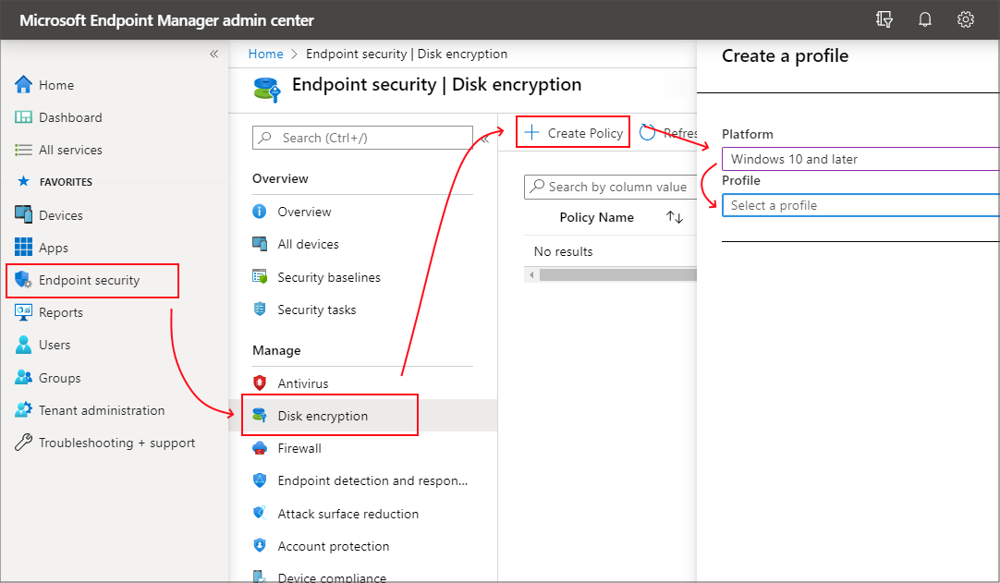

---
# required metadata
title: Encrypt Windows 10 devices with BitLocker in Intune 
titleSuffix: Microsoft Intune
description: Encrypt devices with the BitLocker built-in encryption method, and manage the recovery keys for those encrypted devices from within the Microsoft Endpoint Manager admin center.
keywords:
author: brenduns
ms.author: brenduns
manager: dougeby
ms.date: 08/09/2021
ms.topic: how-to
ms.service: microsoft-intune
ms.subservice: protect
ms.localizationpriority: high
ms.technology:
ms.assetid:

# optional metadata
#audience:
ms.reviewer: annovich
ms.suite: ems
search.appverid: MET150
#ms.tgt_pltfrm:
ms.custom: intune-azure

---

# Manage BitLocker policy for Windows 10 in Intune

Use Intune to configure BitLocker Drive Encryption on devices that run Windows 10.

BitLocker is available on devices that run Windows 10 or later. Some settings for BitLocker require the device have a supported TPM.

Use one of the following policy types to configure BitLocker on your managed devices

- **[Endpoint security disk encryption policy for Windows 10 BitLocker](#create-an-endpoint-security-policy-for-bitlocker)**. The BitLocker profile in *Endpoint security* is a focused group of settings that is dedicated to configuring BitLocker.

  View the BitLocker settings that are available in [BitLocker profiles from disk encryption policy](../protect/endpoint-security-disk-encryption-profile-settings.md#bitlocker).

- **[Device configuration profile for endpoint protection for Windows 10 BitLocker](#create-an-endpoint-security-policy-for-bitlocker)**. BitLocker settings are one of the available settings categories for Windows 10 endpoint protection.

  View the BitLocker settings that are available for [BitLocker in endpoint protection profiles form device configuration policy](../protect/endpoint-protection-windows-10.md#windows-settings).

> [!TIP]
> Intune provides a built-in [encryption report](encryption-monitor.md) that presents details about the encryption status of devices, across all your managed devices. After Intune encrypts a Windows 10 device with BitLocker, you can view and manage BitLocker recovery keys when you view the encryption report.
>
> You can also access important information for BitLocker from your devices, as found in Azure Active Directory (Azure AD).
[encryption report](encryption-monitor.md) that presents details about the encryption status of devices, across all your managed devices.

## Permissions to manage BitLocker

To manage BitLocker in Intune, your account must have the applicable Intune [role-based access control](../fundamentals/role-based-access-control.md) (RBAC) permissions.

Following are the BitLocker permissions, which are part of the Remote tasks category, and the built-in RBAC roles that grant the permission:

- **Rotate BitLocker Keys**
  - Help Desk Operator

## Create and deploy policy

Use one of the following procedures to create the policy type you prefer.

### Create an endpoint security policy for BitLocker

1. Sign in to the [Microsoft Endpoint Manager admin center](https://go.microsoft.com/fwlink/?linkid=2109431).

2. Select **Endpoint security** > **Disk encryption** > **Create Policy**.

3. Set the following options:
   1. **Platform**: Windows 10 or later
   2. **Profile**: BitLocker

   

4. On the **Configuration settings** page, configure settings for BitLocker to meet your business needs.  

   If you want to enable BitLocker silently, see [Silently enable BitLocker on devices](#silently-enable-bitlocker-on-devices), in this article for additional prerequisites and the specific setting configurations you must use.

   Select **Next**.

5. On the **Scope (Tags)** page, choose **Select scope tags** to open the Select tags pane to assign scope tags to the profile.

   Select **Next** to continue.

6. On the **Assignments** page, select the groups that will receive this profile. For more information on assigning profiles, see Assign user and device profiles.

   Select **Next**.

7. On the **Review + create** page, when you're done, choose **Create**. The new profile is displayed in the list when you select the policy type for the profile you created.

### Create a device configuration profile for BitLocker

1. Sign in to the [Microsoft Endpoint Manager admin center](https://go.microsoft.com/fwlink/?linkid=2109431).

2. Select **Devices** > **Configuration profiles** > **Create profile**.

3. Set the following options:
   1. **Platform**: Windows 10 and later
   2. **Profile type**: Endpoint protection

   

4. On the **Configuration settings** page, expand **Windows Encryption**.

   :::image type="content" source="./media/encrypt-devices/bitlocker-settings.png" alt-text="Select Windows encryption settings":::

5. Configure settings for BitLocker to meet your business needs.

   If you want to enable BitLocker silently, see [Silently enable BitLocker on devices](#silently-enable-bitlocker-on-devices), in this article for additional prerequisites and the specific setting configurations you must use.

6. Select **Next** to continue.

7. Complete configuration of additional settings, and then save the profile.

## Manage BitLocker

To view information about devices that receive BitLocker policy, see [Monitor disk encryption](../protect/encryption-monitor.md). 

### Silently enable BitLocker on devices

You can configure a BitLocker policy that automatically and silently enables BitLocker on a device. That means that BitLocker enables successfully without presenting any UI to the end user, even when that user isn't a local Administrator on the device.

**Device Prerequisites**:

A device must meet the following conditions to be eligible for silently enabling BitLocker:

- If end users log in to the devices as Administrators, the device must run Windows 10 version 1803 or later.
- If end users log in to the the devices as Standard Users, the device must run Windows 10 version 1809 or later.
- The device must be Azure AD Joined or Hybrid Azure AD Joined.
- Device must contain TPM (Trusted Platform Module) 2.0
- The BIOS mode must be set to Native UEFI only. 

**BitLocker policy configuration**:

The following two settings for *BitLocker base settings* must be configured in the BitLocker policy:

- **Warning for other disk encryption** = *Block*.
- **Allow standard users to enable encryption during Azure AD Join** = *Allow*

The BitLocker policy **must not require** use of a startup PIN or startup key. When a TPM startup PIN or startup key is *required*, BitLocker can not silently enable and requires interaction from the end user.  This requirement is met through the following four *BitLocker OS drive settings* in the same policy:

- **Compatible TPM startup** must be set to *Allowed* or *Required*
- **Compatible TPM startup PIN** must not be set to *Require startup PIN with TPM*
- **Compatible TPM startup key** must not set to *Require startup key with TPM*
- **Compatible TPM startup key and PIN** must not set to *Require startup key and PIN with TPM*

### View details for recovery keys

Intune provides access to the Azure AD blade for BitLocker so you can view BitLocker Key IDs and recovery keys for your Windows 10 devices, from within the Microsoft Endpoint Manager admin center. To be accessible, the device must have its keys escrowed to Azure AD.

1. Sign in to the [Microsoft Endpoint Manager admin center](https://go.microsoft.com/fwlink/?linkid=2109431).

2. Select **Devices** > **All devices**.

3. Select a device from the list, and then under *Monitor*, select **Recovery keys**.

4. Hit **Show Recovery Key**. Selecting this will generate an audit log entry under 'KeyManagement' activity.
  
   When keys are available in Azure AD, the following information is available:
   - BitLocker Key ID
   - BitLocker Recovery Key
   - Drive Type

   When keys aren't in Azure AD, Intune will display *No BitLocker key found for this device*.

Information for BitLocker is obtained using the [BitLocker configuration service provider](/windows/client-management/mdm/bitlocker-csp) (CSP). BitLocker CSP is supported on Windows 10 version 1703 and later, and for Windows 10 Pro version 1809 and later.

IT admins need to have a specific permission within Azure Active Directory to be able to see device BitLocker recovery keys: `microsoft.directory/bitlockerKeys/key/read`. There are some roles within Azure AD that come with this permission, including Cloud Device Administrator, Helpdesk Administrator, etc. For more information on which Azure AD roles have which permissions, see [Azure AD role descriptions](/azure/active-directory/roles/permissions-reference). 

All BitLocker recovery key accesses are audited. For more information on Audit Log entries, see [Azure portal audit logs](/azure/active-directory/devices/device-management-azure-portal#audit-logs).

### Rotate BitLocker recovery keys

You can use an Intune device action to remotely rotate the BitLocker recovery key of a device that runs Windows 10 version 1909 or later.

#### Prerequisites

Devices must meet the following prerequisites to support rotation of the BitLocker recovery key:

- Devices must run Windows 10 version 1909 or later

- Azure AD-joined and Hybrid-joined devices must have support for key rotation enabled via BitLocker policy configuration:

  - **Client-driven recovery password rotation** to *Enable rotation on Azure AD-joined devices* or *Enable rotation on Azure AD and Hybrid-joined devices*
  - **Save BitLocker recovery information to Azure Active Directory** to *Enabled*
  - **Store recovery information in Azure Active Directory before enabling BitLocker** to *Required*

For information about BitLocker deployments and requirements, see the [BitLocker deployment comparison chart](/windows/security/information-protection/bitlocker/bitlocker-deployment-comparison).

#### To rotate the BitLocker recovery key

1. Sign in to the [Microsoft Endpoint Manager admin center](https://go.microsoft.com/fwlink/?linkid=2109431).

2. Select **Devices** > **All devices**.

3. In the list of devices that you manage, select a device, select **More**, and then select the **BitLocker key rotation** device remote action.

4. On the **Overview** page of the device, select the **BitLocker key rotation**. If you don’t see this option, select the ellipsis (**…**) to show additional options, and then select the **BitLocker key rotation** device remote action.

   

## Next steps

- [Manage FileVault policy](../protect/encrypt-devices-filevault.md)  
- [Monitor disk encryption](../protect/encryption-monitor.md)
- [Troubleshooting BitLocker policy](/troubleshoot/mem/intune/troubleshoot-bitlocker-policies)
- [Known issues for Enforcing BitLocker policies with Intune](/windows/security/information-protection/bitlocker/ts-bitlocker-intune-issues)

