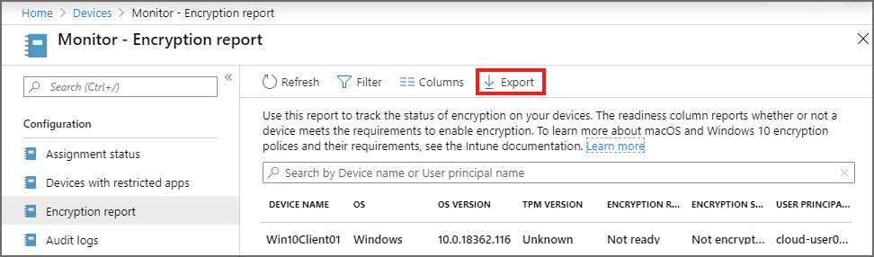

---
# required metadata
title: Encryption report for encrypted devices in Microsoft Intune
titleSuffix: Microsoft Intune
description: View a report on your iOS/iPadOS or Windows device encryption status, and access FileVault and BitLocker recovery keys from within the Microsoft Intune portal.
keywords:
author: brenduns
ms.author: brenduns
manager: dougeby
ms.date: 11/18/2019
ms.topic: how-to
ms.service: microsoft-intune
ms.subservice: protect
ms.localizationpriority: high
ms.technology:
ms.assetid:  

# optional metadata

#audience:

ms.reviewer: shpate
ms.suite: ems
search.appverid: MET150
#ms.tgt_pltfrm:
ms.custom: intune-azure

---

# Monitor device encryption with Intune

The Microsoft Intune encryption report is a centralized location to view details about a device's encryption status and find options to manage device recovery keys. The recovery key options that are available depend on the type of device you're viewing.

To find the report, Sign in to the [Microsoft Endpoint Manager admin center](https://go.microsoft.com/fwlink/?linkid=2109431). Select **Devices** > **Monitor**, and then under *Configuration*, select **Encryption report**.

## View encryption details

The encryption report shows common details across the supported devices you manage. The following sections provide details about the information that Intune presents in the report.

### Prerequisites

The encryption report supports reporting on devices that run the following operating system versions:

- macOS 10.13 or later
- Windows version 1607 or later

### Report details

The Encryption report pane displays a list of the devices you manage with high-level details about those devices. You can select a device from the list to drill-in and view additional details from the devices [Device encryption status](#device-encryption-status) pane.

- **Device name** - The name of the device.
- **OS** – The device platform, such as Windows or macOS.
- **OS version** – The version of Windows or macOS on the device.
- **TPM version** *(Applies to Windows 10 only)* – The version of the Trusted Platform Module (TPM) chip on the Windows 10 device.
- **Encryption readiness** – An evaluation of the devices readiness to support an applicable encryption technology, like BitLocker or FileVault encryption. Devices are identified as:
  - **Ready**: The device can be encrypted by using MDM policy, which requires the device meet the following requirements:

    **For macOS devices**:
    - macOS version 10.13 or later

    **For Windows 10 devices**:
    - Version 1709 or later, of *Business*, *Enterprise*, *Education*, or version 1809 or later of *Pro*
    - The device must have a TPM chip

    For more information, see the [BitLocker configuration service provider (CSP)](https://docs.microsoft.com/windows/client-management/mdm/bitlocker-csp) in the Windows documentation.

  - **Not ready**: The device doesn't have full encryption capabilities, but still supports encryption. For example, a Windows device might be encrypted manually by a user, or through Group Policy that can be set to allow encrypting without a TPM.
  - **Not applicable**: There isn't enough information to classify this device.

- **Encryption status** – Whether the OS drive is encrypted.

- **User Principal Name** - The primary user of the device.

### Device encryption status

When you select a device from the Encryption report, Intune displays the **Device encryption status** pane. This pane provides the following details:

- **Device name** – The name of the device you're viewing.

- **Encryption readiness** - An evaluation of the devices readiness to support encryption through the MDM policy.

  For example: When a Windows 10 device has a readiness of *Not ready*, it might still support encryption. To have the *Ready* designation, the Windows 10 device must have a TPM chip. TPM chips aren't required to support encryption. (For more information, see *Encryption readiness* in the preceding section.)

- **Encryption status** - Whether the OS drive is encrypted. It can take up to 24 hours for Intune to report on a device's encryption status or a change to that status. This time includes time for the OS to encrypt, plus time for the device to report back to Intune.

  To speed up the reporting of FileVault encryption status before device check-in normally occurs, have users sync their devices after encryption completes.

- **Profiles** – A list of the *Device configuration* profiles that apply to this device and are configured with the following values:

  - macOS:
    - Profile type = *Endpoint protection*
    - Settings > FileVault > FileVault = *Enable*

  - Windows 10:
    - Profile type = *Endpoint protection*
    - Settings > Windows Encryption > Encrypt devices = *Require*

  You can use the list of profiles to identify individual policies for review should the *Profile state summary* indicate problems.

- **Profile state summary** – A summary of the profiles that apply to this device. The summary represents the least favorable condition across the applicable profiles. For example, if only one out of several applicable profiles results in an error, the *Profile state summary* will display *Error*.

  To view more details of a status, go to **Intune** > **Device configuration** > **Profiles**, and select the profile. Optionally, select **Device status** and then select a device.

- **Status details** – Advanced details about the device's encryption state.

  > [!IMPORTANT]
  > For Windows 10 devices, Intune only shows *Status details* for devices that run the *Windows 10 April 2019 Update* or later.

  This field displays information for each applicable error that can be detected. You can use this information to understand why a device might not be encryption ready.

  The following are examples of the status details Intune can report:

  **macOS**:
  - The recovery key hasn't been retrieved and stored yet. Most likely, the device hasn't been unlocked, or it hasn't checked in.

    *Consider: This result doesn't necessarily represent an error condition but a temporary state that could be because of timing on the device where escrow for recovery keys must be set up before the encryption request is sent to the device. This status might also indicate the device remains locked or hasn't checked in with Intune recently. Finally, because FileVault encryption doesn't start until a device is plugged in (charging), it's possible for a user to receive a recovery key for a device that isn't yet encrypted*.

  - The user is deferring encryption or is currently in the process of encryption.

    *Consider: Either the user hasn't yet logged out after receiving the encryption request, which is necessary before FileVault can encrypt the device, or the user has manually decrypted the device. Intune can't prevent a user from decrypting their device.*

  - The device is already encrypted. Device user must decrypt the device to continue.

    *Consider: Intune can't set up FileVault on a device that is already encrypted. Instead, the user needs to manually decrypt their device before it can be managed by a device configuration policy and Intune*.

  - FileVault needs the user to approve their management profile in macOS Catalina and higher.

    *Consider: Beginning with macOS version 10.15 (Catalina), user approved enrollment settings can result in the requirement that users manually approve FileVault encryption. For more information, see [User Approved enrollment](../enrollment/macos-enroll.md) in the Intune documentation*.

  - Unknown.

    *Consider: One possible cause for an unknown status is that the device is locked and Intune can't start the escrow or encryption process. After the device is unlocked, progress can continue*.

  **Windows 10**:
  - The BitLocker policy requires user consent to launch the BitLocker Drive Encryption Wizard to start encryption of the OS volume but the user didn't consent.

  - The encryption method of the OS volume doesn't match the BitLocker policy.

  - The policy BitLocker requires a TPM protector to protect the OS volume, but a TPM isn't used.

  - The BitLocker policy requires a TPM-only protector for the OS volume, but TPM protection isn't used.

  - The BitLocker policy requires TPM+PIN protection for the OS volume, but a TPM+PIN protector isn't used.

  - The BitLocker policy requires TPM+startup key protection for the OS volume, but a TPM+startup key protector isn't used.

  - The BitLocker policy requires TPM+PIN+startup key protection for the OS volume, but a TPM+PIN+startup key protector isn't used.

  - The OS volume is unprotected.

  - Recovery key backup failed.

  - A fixed drive is unprotected.

  - The encryption method of the fixed drive doesn't match the BitLocker policy.

  - To encrypt drives, the BitLocker policy requires either the user to sign in as an Administrator or, if the device is joined to Azure AD, the AllowStandardUserEncryption policy must be set to 1.

  - Windows Recovery Environment (WinRE) isn't configured.

  - A TPM isn't available for BitLocker, either because it isn't present, it's been made unavailable in the Registry, or the OS is on a removable drive.

  - The TPM isn't ready for BitLocker.

  - The network isn't available, which is required for recovery key backup.

## Export report details

While viewing the Encryption report pane, you can select **Export** to create a *.csv* file download of the report details. This report includes the high-level details from the *Encryption report* pane and *Device encryption status* details for each device you manage.

This report can be of use in identifying problems for groups of devices. For example, you might use the report to identify a list of macOS devices that all report *FileVault is already enabled by the user*, which indicates devices that must be manually decrypted before Intune can manage their FileVault settings.

## Manage recovery keys

For details on managing recovery keys, see the following in the Intune documentation:

macOS FileVault:
- [Retrieve personal recovery key](../protect/encrypt-devices-filevault.md#retrieve-personal-recovery-key)
- [Rotate recovery keys](../protect/encrypt-devices-filevault.md#rotate-recovery-keys)
- [Recover recovery keys](../protect/encrypt-devices-filevault.md#recover-recovery-keys)

Windows 10 BitLocker:
- [Rotate BitLocker recovery keys](../protect/encrypt-devices.md#rotate-bitlocker-recovery-keys)

## Next steps

[Manage BitLocker policy](../protect/encrypt-devices.md)

[Manage FileVault policy](encrypt-devices-filevault.md)
