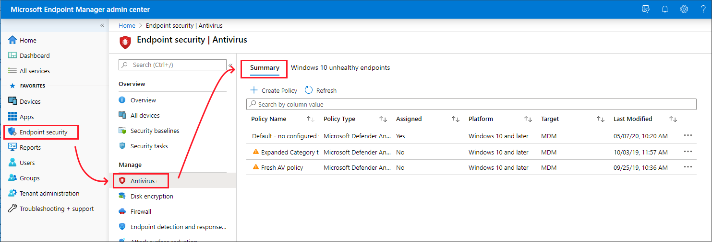
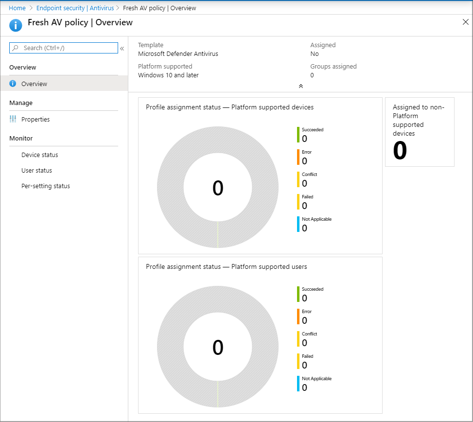

---
# required metadata

title: Manage antivirus settings with endpoint security policies in Microsoft Intune | Microsoft Docs
description: Configure and deploy policies and use reports for devices you manage with endpoint security antivirus policy in Microsoft Intune. 
keywords:
author: brenduns
ms.author: brenduns
manager: dougeby
ms.date: 02/17/2023
ms.topic: reference
ms.service: microsoft-intune
ms.subservice: protect
ms.localizationpriority: medium
ms.technology:

# optional metadata

#ROBOTS:
#audience:
#ms.devlang:
ms.suite: ems
search.appverid: MET150
#ms.tgt_pltfrm:
ms.custom: intune-azure
ms.collection:
- tier1
- M365-identity-device-management
- highpri
ms.reviewer: mattcall

---

# Antivirus policy for endpoint security in Intune

Intune Endpoint security Antivirus policies can help security admins focus on managing the discrete group of antivirus settings for managed devices.

Antivirus policy includes several profiles. Each profile contains only the settings that are relevant for Microsoft Defender for Endpoint antivirus for macOS and Windows devices, or for the user experience in the Windows Security app on Windows devices.

You'll find the antivirus policies under **Manage** in the Endpoint security node of the [Microsoft Intune admin center](https://go.microsoft.com/fwlink/?linkid=2109431).

Antivirus policies include the same settings as found *endpoint protection* or *device restriction* templates for [device configuration](../configuration/device-profile-create.md) policy. However, those policy types include additional categories of settings that are unrelated to Antivirus. The additional settings can complicate the task of configuring Antivirus workload. Additionally, the settings found in the Antivirus policy for macOS aren't available through the other policy types. The macOS Antivirus profile replaces the need to configure the settings by using `.plist` files.

## Prerequisites for antivirus policy

**Support for Microsoft Intune (MDM) enrolled devices**:

- **macOS**
  - Any supported version of macOS
  - For Intune to manage antivirus settings on a device, Microsoft Defender for Endpoint must be installed on that device. See. [Microsoft Defender for Endpoint for macOS](/windows/security/threat-protection/microsoft-defender-atp/microsoft-defender-atp-mac) (In the Microsoft Defender for Endpoint documentation)

- **Windows 10, Windows 11, and Windows Server** 
  - No additional prerequisites are required.  

**Support for Configuration Manager clients**:

*This scenario is in preview and requires use of Configuration Manager current branch version 2006 or later*.

- **Set up tenant attach for Configuration Manager devices** - To support deploying antivirus policy to devices managed by Configuration Manager, configure *tenant attach*. Set up of tenant attach includes configuring Configuration Manager device collections to support endpoint security policies from Intune.

  To set up tenant attach, see [Configure tenant attach to support endpoint protection policies](../protect/tenant-attach-intune.md).

**Support for Microsoft Defender for Endpoint clients:**

- **Set up Defender for Endpoint Security Configuration Management** - To support deploying antivirus policy to devices communicating with Intune via Defender for Endpoint, configure *Security Management for Microsoft Defender for Endpoint*.
  
  To set up security management for MDE, see [Manage Microsoft Defender for Endpoint on devices with Microsoft Intune](../protect/mde-security-integration.md).

### Prerequisites for tamper protection

Tamper protection is available for devices that are running one of the following versions of Windows:

- Windows 10 and 11 (including Enterprise multi-session)
- Windows Server version 1803 or later, Windows Server 2019, Windows Server 2022
- Windows Server 2012 R2 and Windows Server 2016 ([using the modern, unified solution](/microsoft-365/security/defender-endpoint/configure-server-endpoints#new-windows-server-2012-r2-and-2016-functionality-in-the-modern-unified-solution))

> [!NOTE]
> Devices are required to be onboarded to Microsoft Defender for Endpoint (P1 or P2). Devices may see a delay enabling tamper protection if previously not onboarded to Microsoft Defender for Endpoint. Tamper protection will enable on the first device check-in after onboarding to Microsoft Defender for Endpoint.

You can use Intune to manage tamper protection on Windows devices as part of Windows Security Experience profile (an Antivirus policy). This includes both devices you manage with Intune, and devices you manage with Configuration Manager through the tenant attach scenario.

#### Intune managed devices

Prerequisites to support tamper protection for devices managed by Intune:

- Your environment must meet the [prerequisites for managing  tamper protection with Intune](/windows/security/threat-protection/microsoft-defender-antivirus/prevent-changes-to-security-settings-with-tamper-protection#turn-tamper-protection-on-or-off-for-your-organization-using-intune)
- Devices are onboarded to Microsoft Defender for Endpoint (P1 or P2)

Profiles for *Antivirus* policy that support tamper protection for [devices managed by Microsoft Intune](#devices-managed-by-microsoft-intune):

- Platform: **Windows 10, Windows 11, and Windows Server**
  - Profile: **Windows Security experience**  

  > [!NOTE]  
  > Beginning on April 5, 2022, the *Windows 10 and later* platform was replaced by the *Windows 10, Windows 11, and Windows Server* platform.
  >
  > The *Windows 10, Windows 11, and Windows Server* platform supports devices communicating with Intune through Microsoft Intune or Microsoft Defender for Endpoint. These profiles also add support for the Windows Server platform which is not supported through Microsoft Intune natively.
  >
  > Profiles for this new platform use the settings format as found in the Settings Catalog. Each new profile template for this new platform includes the same settings as the older profile template it replaces. With this change you can no longer create new versions of the old profiles. Your existing instances of the old profile remain available to use and edit.

You can also use the [Endpoint protection](../protect/endpoint-protection-configure.md) profile for *Device configuration* policy to configure tamper protection for devices managed by Intune.

#### Configuration Manager clients managed through the tenant attach scenario

Prerequisites to support managing tamper protection with these profiles:

- Your environment must meet the [prerequisites for managing  tamper protection with Intune](/windows/security/threat-protection/microsoft-defender-antivirus/prevent-changes-to-security-settings-with-tamper-protection#turn-tamper-protection-on-or-off-for-your-organization-using-intune) as detailed in the Windows documentation.
- You must use Configuration Manager current branch 2006 or later.
- You must configure tenant attach to support endpoint protection policies. This includes configuring Configuration Manager device collections for synchronization with Intune.
- Devices are onboarded to Microsoft Defender for Endpoint (P1 or P2)

 Profiles for *Antivirus* policy that support tamper protection for [devices managed by Configuration Manager](#devices-managed-by-configuration-manager):

- Platform: **Windows 10, Windows 11, and Windows Server (ConfigMgr)**
  - Profile: **Windows Security experience (preview)**

## Antivirus profiles

### Devices managed by Microsoft Intune

The following profiles are supported for devices you manage with Intune:

**macOS**:

- Platform: **macOS**

  - Profile: **Antivirus** - Manage [Antivirus policy settings](../protect/antivirus-microsoft-defender-settings-macos.md) for macOS.

    When you use [Microsoft Defender for Endpoint for Mac](/windows/security/threat-protection/microsoft-defender-atp/microsoft-defender-atp-mac), you can configure and deploy Antivirus settings to your managed macOS devices through Intune instead of configuring those settings by use of `.plist` files.

**Windows**:

- Platform: **Windows 10, Windows 11, and Windows Server**  
  Profiles for this platform can be used with devices enrolled with Intune, and devices managed through [Security Management for Microsoft Defender for Endpoint](../protect/mde-security-integration.md).

  > [!NOTE]  
  > Beginning on April 5, 2022, the *Windows 10 and later* platform was replaced by the *Windows 10, Windows 11, and Windows Server* platform. 
  >
  > The *Windows 10, Windows 11, and Windows Server* platform supports devices communicating with Intune through Microsoft Intune or Microsoft Defender for Endpoint. These profiles also add support for the Windows Server platform which is not supported through Microsoft Intune natively.
  >
  > Profiles for this new platform use the settings format as found in the Settings Catalog. Each new profile template for this new platform includes the same settings as the older profile template it replaces. With this change you can no longer create new versions of the old profiles. Your existing instances of the old profile remain available to use and edit.
  
  - Profile: **Microsoft Defender Antivirus** - Manage Antivirus policy settings for Windows devices.

    Defender Antivirus is the next-generation protection component of Microsoft Defender for Endpoint. Next-generation protection brings together technologies like machine learning and cloud infrastructure to protect devices in your enterprise organization.

    The *Microsoft Defender Antivirus* profile is a separate instance of the antivirus settings that are found in the *Device Restriction profile* for Device Configuration policy.
  
    Unlike the antivirus settings in a *Device Restriction profile*, you can use these settings with devices that are co-managed. To use these settings, the [co-management workload slider](/configmgr/comanage/how-to-switch-workloads) for Endpoint Protection must be set to Intune.

  - Profile: **Microsoft Defender Antivirus exclusions** - Manage policy settings for only Antivirus exclusion.
  
    With this policy, you can manage settings for the following Microsoft Defender Antivirus configuration service providers (CSPs) that define Antivirus exclusions:

    - Defender/ExcludedPaths
    - Defender/ExcludedExtensions
    - Defender/ExcludedProcesses

    These CSPs for antivirus exclusion are also managed by *Microsoft Defender Antivirus* policy, which includes identical settings for exclusions. Settings from both policy types  (*Antivirus* and *Antivirus exclusions*) are subject to [policy merge](#policy-merge-for-settings), and create a super set of exclusions for applicable devices and users.

  - Profile: **Windows Security experience** - Manage the Windows Security app settings that end users can view in the Microsoft Defender Security center and the notifications they receive.

    The Windows security app is used by a number of Windows security features to provide notifications about the health and security of the machine. Security app notifications include firewalls, antivirus products, Windows Defender SmartScreen, and others.

- Platform: **Windows 10 and later**:

  > [!NOTE]  
  > The *Windows 10 and later* platform is available to create new profiles as part of a public preview for the following profile.

  - Profile: **Defender Updates controls** (public preview) - Manage update settings for Microsoft Defender, including the following settings that are taken directly from the [Defender CSP - Windows Client Management](/windows/client-management/mdm/policy-csp-Defender):

    - Engine Updates Channel
    - Platform Updates Channel
    - Security Intelligence Updates Channel

### Devices managed by Configuration Manager

[!INCLUDE [antivirus policy prerequisites](../includes/tenant-attach-antivirus-prerequisites.md)]

## Policy merge for settings

Some Antivirus policy settings support *policy merge*. Policy merge helps avoid conflicts when multiple policies apply to the same devices and configure the same setting. Intune evaluates the settings that policy merge supports, for each user or device as taken from all applicable policies. Those settings are then merged into a single superset of policy.

For example, you create three separate antivirus policies that define different antivirus file path exclusions. Eventually, all three policies are assigned to the same user. Because the Microsoft Defender file path exclusion CSP supports policy merge, Intune evaluates and combines the file exclusions from all applicable policies for the user. The exclusions are added to a superset and the single list of exclusions is delivered to the users’ device.

When policy merge isn’t supported for a setting, a conflict can occur. Conflicts can result in the user or device not receiving any policy for the setting. For example, policy merge doesn't support the CSP for preventing installation of matching device IDs (*PreventInstallationOfMatchingDeviceIDs*). Configurations for this CSP don’t merge, and are processed separately.

When processed separately, policy conflicts are resolved as follows:

1. The most secure policy applies.
2. If two policies are equally secure, the last modified policy applies.
3. If the last modified policy can’t resolve the conflict, no policy is delivered to the device.

### Settings and CSPs that support policy merge

The following settings support policy merge:

- **Excluded Processes** - CSP: [Defender/ExcludedProcesses](/windows/client-management/mdm/policy-csp-defender#defender-excludedprocesses)
- **Excluded Extensions** - CSP: [Defender/ExcludedExtensions](/windows/client-management/mdm/policy-csp-defender#defender-excludedextensions)
- **Excluded Paths** - CSP: [Defender/ExcludedPaths](/windows/client-management/mdm/policy-csp-defender#defender-excludedpaths)

## Antivirus policy reports

Antivirus policy reports display status details about your endpoint security Antivirus policies and device status. These reports are available in the Endpoint security node of the Microsoft Intune admin center.

To view the reports, in the [Microsoft Intune admin center](https://go.microsoft.com/fwlink/?linkid=2109431), go to  Endpoint security and select **Antivirus**. Selecting Antivirus opens the Summary page. Additional report and status views are available as additional pages.

In addition to reports detailed in the following sections, additional reports for Microsoft Defender Antivirus are found in the Reports node of the Microsoft Intune admin center, as documented in the Intune Reports article:

- [Antivirus agent status report (Organizational)](../fundamentals/reports.md#antivirus-agent-status-report-organizational)
- [Detected malware report (Organizational)](../fundamentals/reports.md#detected-malware-report-organizational)

### Summary

On the **Summary** page, you can [create new policies](../protect/endpoint-security-policy.md#create-an-endpoint-security-policy) and view a list of the policies that were previously created. The list includes high-level details about the profile that policy includes (Policy Type), and if the policy is assigned.

When you select a policy from the list, the *Overview* page for that policy instance opens and displays more information. After selecting a tile from this view, Intune displays additional details for that profile if they’re available.

### Unhealthy endpoints

On the **Unhealthy endpoints** page, you can view information about the antivirus status of your MDM-managed Windows devices. This information is returned from Windows Defender Antivirus that runs on the device, as *Threat agent status*. On this page, select **Columns** to view the full list of details that are available in the report.

Only devices with detected issues appear in this view. This view doesn't display details for devices that are identified as clean.

The information for this report is based on details available from the following CSPs, which are documented in the Windows client-management documentation:

- [Defender CSP](/windows/client-management/mdm/defender-csp)
- [WindowsAdvancedThreatProtection CSP](/windows/client-management/mdm/windowsadvancedthreatprotection-csp).

:::image type="content" source="./media/endpoint-security-antivirus-policy/antivirus-unhealthy-endpoints.png" alt-text="Screenshot of the Unhealthy endpoints report.":::

## Next steps

[Configure Endpoint security policies](../protect/endpoint-security-policy.md#create-an-endpoint-security-policy)

View details for the Windows settings in the deprecated profiles for the *Windows 10 and later* platform:

- [Antivirus policy settings](../protect/antivirus-microsoft-defender-settings-windows.md)
- [Antivirus exclusions](../protect/antivirus-microsoft-defender-settings-windows.md#microsoft-defender-antivirus-exclusions)
- [Windows Security app settings](../protect/antivirus-security-experience-windows-settings.md)
