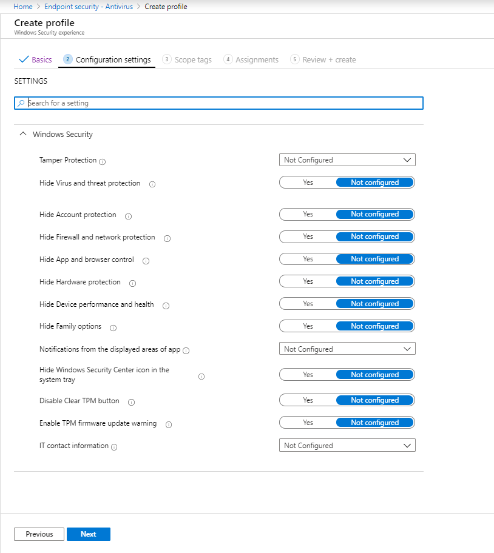

---
# required metadata

title: Configure antivirus policy Intune | Microsoft Docs
description: Configure settings for antivirus policy that applies to endpoints you manage with in Microsoft Intune.
keywords:
author: brenduns
ms.author: brenduns
manager: dougeby
ms.date: 03/20/2020
ms.topic: reference
ms.service: microsoft-intune
ms.subservice: protect
ms.localizationpriority: medium
ms.technology:

# optional metadata

#ROBOTS:
#audience:
#ms.devlang:
ms.suite: ems
search.appverid: MET150
#ms.tgt_pltfrm:
ms.custom: intune-azure
ms.collection: M365-identity-device-management
ms.reviewer: mattsha

---
# Use Antivirus setting to manage common Antivirus

*The Antivirus settings are in Public Preview*

Security Admins can use the Antivirus node of Endpoint security to manage logical groupings of common antivirus and related settings for managed devices. 

In the Antivirus node, the settings are logically grouped into profiles (categories) like *Microsoft Defender Antivirus* or *Windows Security experience*. These logical groups provide a focused method to manage related settings that otherwise require different device configuration or restriction policies.

The following profiles are available for Antivirus:

- **Microsoft Defender Antivirus** - Manage device settings for Microsoft Defender Antivirus. You can enable cloud protection, Microsoft defender Antivirus exclusions, remediation actions, scan settings, and more.

  The [settings in this profile](antivirus-microsoft-defender-antivirus-settings.md) are a new and separate instance of the settings that are found in [device restriction profiles](../configuration/device-restrictions-configure.md), and:
  
  - Support a third option for configuration that's not available when configured as a device restriction.
  - Apply to devices that you co-manage with Configuration Manager when you've configured the [Endpoint Protection workload](https://docs.microsoft.com/configmgr/comanage/how-to-switch-workloads) slider in Configuration Manager to support *Pilot Intune* or *Intune*.

  Plan to use the new *Antivirus* >  *Microsoft Defender Antivirus* profile in place of configuring these settings through a device restriction profile.

- **Windows Security experience** - Manage the user experience on Windows 10 devices for the Windows Security app. With these settings you can control what the user can see in the app, and how notifications display on the device.

  The settings in this profile are the same settings as in the Device configuration profile for [Windows 10 Endpoint Protection](../protect/endpoint-protection-windows-10.md).

## About settings conflicts

As with other settings you can configure with Intune, the settings you apply using an Antivirus profile can conflict with settings you define with device configuration or device restriction profiles. Intune manages conflicts the same way as other conflicts. For more information, see [Troubleshoot policies and profiles in Intune](../configuration/troubleshoot-policies-in-microsoft-intune.md).

## Create an Antivirus policy

To manage Antivirus settings, your account must have the Intune [role-based access control](../fundamentals/role-based-access-control.md) (RBAC) permissions for **Security baselines**. These permissions are included with the built-in **Endpoint security manager** role.

1. Sign in to the Microsoft Endpoint Manager Admin Center.

2. Select **Endpoint security** > **Antivirus** > **Create Policy**.

3. From the **Platform** drop-down list, select the device platform to which you want to apply settings. Currently, you can choose only **Windows 10 and later**.

4. From the **Profile** drop-down list, select the profile type you want to configure:

   - Microsoft Defender Antivirus
   - Windows Security experience

   Select **Create** to continue.

   > [!NOTE]
   > Subsequent screen shots show examples from the Windows Security experience profile.

5. On the **Basics** tab, specify the following properties:

   - **Name**: Enter a name for your security profile. For example, *Default Windows Security experience profile*
   - **Description** (optional): Enter a description to help you identify the intent of this profile.

   Select Next to go to the next tab. After you advanced to a new tab, you can select the tab name to return to a previously viewed tab.

6. On the **Configuration settings** tab, view the groups of **Settings** that are available in the profile you selected. You can expand a group to view the settings in that group, and the default values for those settings in the profile.

   > [!div class="mx-imgBorder"]
   > 

7. On the **Scope tags** tab, choose **Select scope tags** to open the *Select tags* pane to assign scope tags to the profile.

8. On the **Assignments** tab, choose **Select groups to include** and then assign the baseline to one or more groups. Use **Select groups to exclude** to fine-tune the assignment.

9. When you're ready to deploy the baseline, advance to the **Review + create** tab and review the details for the baseline. Select **Create** to save and deploy the profile.

   As soon as you create the profile, it's pushed to the assigned group and might apply immediately.

   > [!TIP]
   > If you save a profile without first assigning it to groups, you can later edit the profile to do so.

10. After you create a profile, edit it by going to **Endpoint security** > **Antivirus**, select the policy that you configured, and then select **Properties**. You can edit settings from all the available configuration tabs, and select **Review + save** to commit your changes.

## Next steps

View settings for the available antivirus profiles:

- [Microsoft Defender Antivirus](antivirus-microsoft-defender-antivirus-settings.md)
- [Windows Security experience](antivirus-windows-security-experience-settings.md)
