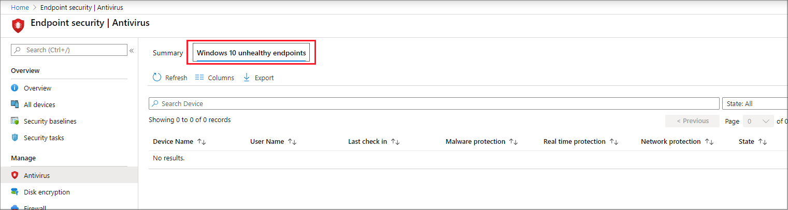

---
# required metadata

title: Manage antivirus settings with endpoint security policies in Microsoft Intune | Microsoft Docs
description: Configure and deploy policies and use reports for devices you manage with endpoint security antivirus policy in Microsoft Endpoint Manager. 
keywords:
author: brenduns
ms.author: brenduns
manager: dougeby
ms.date: 05/15/2020
ms.topic: reference
ms.service: microsoft-intune
ms.subservice: protect
ms.localizationpriority: medium
ms.technology:

# optional metadata

#ROBOTS:
#audience:
#ms.devlang:
ms.suite: ems
search.appverid: MET150
#ms.tgt_pltfrm:
ms.custom: intune-azure
ms.collection: M365-identity-device-management
ms.reviewer: mattsha

---

# Antivirus policy for endpoint security in Intune

The Intune Endpoint security Antivirus policies can help security admins focus on managing the discrete group of antivirus settings for managed devices. To use Antivirus policy, integrate Intune with Microsoft Defender Advanced Threat Protection (Microsoft Defender ATP) as a Mobile Threat Defense solution.

Antivirus policy includes several profiles. Each profile contains only the settings that are relevant for Microsoft Defender ATP antivirus for macOS, Windows 10, or for the user experience in the Windows Security app on Windows 10 devices.

You'll find the antivirus policies under **Manage** in the Endpoint security node of the [Microsoft Endpoint Manager admin center](https://go.microsoft.com/fwlink/?linkid=2109431).

Antivirus policies include the same settings found in *endpoint protection* or *device restriction* profiles for [device configuration](../configuration/device-profile-create.md) policy and are similar to settings from [device compliance](../protect/device-compliance-get-started.md) policy. However, those policy types include additional categories of settings that are unrelated to Antivirus. The additional settings can complicate the task of configuring Antivirus. Additionally, the settings found in the Antivirus policy for macOS aren't available through the other policy types. The macOS Antivirus profile replaces the need to configure the settings by using `.plist` files.

## Prerequisites for antivirus policy

- **macOS**
  - Any supported version of macOS
  - For Intune to manage antivirus settings on a device, Microsoft Defender ATP must be installed on that device. See. [Microsoft Defender ATP for macOS](https://docs.microsoft.com/windows/security/threat-protection/microsoft-defender-atp/microsoft-defender-atp-mac) (In the Microsoft Defender ATP documentation)

- **Windows 10 and later**
  - For Intune to manage antivirus settings on a device, Microsoft Defender ATP must be installed on that device. See, [Microsoft Defender ATP for Windows](../protect/advanced-threat-protection.md), in the Intune documentation.
  - The Windows Security app is installed on all devices that run Window 10, and no additional prerequisites are required.

## Antivirus profiles

**macOS profiles**:

- **Antivirus** - Manage [Antivirus policy settings](../protect/antivirus-microsoft-defender-settings-macos.md) for macOS.

  When you use [Microsoft Defender ATP for Mac](https://docs.microsoft.com/windows/security/threat-protection/microsoft-defender-atp/microsoft-defender-atp-mac), you can configure and deploy Antivirus settings to your managed macOS devices through Intune instead of configuring those settings by use of `.plist` files.

**Windows 10 profiles**:

- **Microsoft Defender Antivirus** - Manage [Antivirus policy settings](../protect/antivirus-microsoft-defender-settings-windows.md) for Windows 10.

  Defender Antivirus is the next-generation protection component of Microsoft Defender Advanced Threat Protection (Microsoft Defender ATP). Next-generation protection brings together machine learning, big-data analysis, in-depth threat resistance research, and cloud infrastructure to protect devices in your enterprise organization.

  The *Microsoft Defender Antivirus* profile is a separate instance of the antivirus settings that are found in the *Device Restriction profile* for Device Configuration policy.
  
  Unlike the antivirus settings in a *Device Restriction profile*, you can use these settings to with devices that are co-managed. To use these settings, the [co-management workload slider](https://docs.microsoft.com/configmgr/comanage/how-to-switch-workloads) for Endpoint Protection must be set to Intune.

- **Windows Security experience** – Manage the [Windows Security app settings](../protect/antivirus-security-experience-windows-settings.md) that end users can view in the Microsoft Defender Security center and the notifications they receive. The Windows security app is used by a number of Windows security features to provide notifications about the health and security of the machine. Security app notifications include firewalls, antivirus products, Windows Defender SmartScreen, and others.

## Antivirus policy reports

Antivirus policy reports display status details about your endpoint security Antivirus policies and device status. These reports are available in the Endpoint security node of the Microsoft Endpoint Manager admin center.

To view the reports, in the [Microsoft Endpoint Manager admin center](https://go.microsoft.com/fwlink/?linkid=2109431), go to  Endpoint security and select **Antivirus**. Selecting Antivirus opens the Summary page. Additional report and status views are available as additional pages.

### Summary

On the **Summary** page, you can [create new policies](../protect/endpoint-security-policy.md#create-an-endpoint-security-policy) and view a list of the policies that were previously created. The list includes high-level details about the profile that policy includes (Policy Type), and if the policy is assigned.

When you select a policy from the list, the *Overview* page for that policy instance opens and displays more information. When you select a tile from this view, Intune displays additional details for that profile if they’re available.

### Windows 10 unhealthy endpoints

On the **Windows 10 unhealthy endpoints** page, you can view information about the antivirus status of your MDM-managed Windows 10 devices. This information is returned from Windows Defender Antivirus that runs on the device, as *Threat agent status*.

Only devices with detected issues appear in this view. This view doesn't display details for devices that are identified as clean.

## Next steps

[Configure Endpoint security policies](../protect/endpoint-security-policy.md#create-an-endpoint-security-policy)
