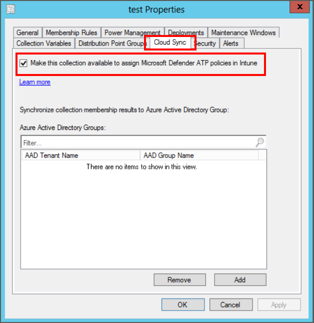

---
# required metadata

title: Manage endpoint detection and response settings with endpoint security policies in Microsoft Intune | Microsoft Docs
description: Configure and deploy policies for devices you manage with endpoint security endpoint detection and response policy in Microsoft Endpoint Manager. 
keywords:
author: brenduns
ms.author: brenduns
manager: dougeby
ms.date: 05/22/2020
ms.topic: reference
ms.service: microsoft-intune
ms.subservice: protect
ms.localizationpriority: medium
ms.technology:

# optional metadata

#ROBOTS:
#audience:
#ms.devlang:
ms.suite: ems
search.appverid: MET150
#ms.tgt_pltfrm:
ms.custom: intune-azure
ms.collection: M365-identity-device-management
ms.reviewer: mattsha

---

# Endpoint detection and response policy for endpoint security in Intune

When you integrate Microsoft Defender Advanced Threat Protection (Defender ATP) with Intune, you can use endpoint security policies for endpoint detection and response (EDR) to manage the EDR settings and onboard devices to Defender ATP.

The capabilities of Defender ATP endpoint detection and response provide advanced attack detections that are near real-time and actionable. Security analysts can prioritize alerts effectively, gain visibility into the full scope of a breach, and take response actions to remediate threats.

EDR policies include platform-specific profiles to manage settings for EDR. The profiles automatically include an *onboarding package* for Defender ATP. Onboarding packages are how devices are configured to work with Defender ATP. After a device onboards, you can start to use threat data from that device.

EDR policies deploy to groups of devices in Azure Active Directory (Azure AD) that you manage with Intune, and to collections of on-premises devices that you manage with Configuration Manager, including Windows servers. The EDR policies for the different management paths require different onboarding packages. Therefore, you’ll create separate EDR policies for the different types of devices you manage.

> [!TIP]
> Support for devices you manage with Configuration Manager is in *public preview*.

Find the endpoint security policies for EDR under *Manage* in the **Endpoint security** node of the [Microsoft Endpoint Manager admin center](https://go.microsoft.com/fwlink/?linkid=2109431).

View [settings for Endpoint detection and response profiles](../protect/endpoint-security-edr-profile-settings.md).

## Prerequisites for EDR policies

**General**:

- **Tenant for Microsoft Defender Advanced Threat Protection** – Your Defender ATP tenant must be integrated with your Microsoft Endpoint Manager tenant (Intune subscription) before you can create EDR policies. See [Use Microsoft Defender ATP](../protect/advanced-threat-protection.md) in the Intune documentation.

**To support devices from Configuration Manager**:

To support using EDR policies with Configuration Manager devices, your Configuration Manager environment requires the following additional configurations. [Configuration guidance](#set-up-configuration-manager-to-support-edr-policy) is provided in this article:

- **Configuration Manager with version 2002 or later** – Your site must run Configuration Manager 2002 or later.

- **Install the Configuration Manager update** - To enable support in Configuration Manager 2002 for using EDR policy you create in the Microsoft Endpoint Manager admin center, install the following update from within the Configuration Manager console:
  - **Configuration Manager 2002 Hotfix (KB4563473)**

- **Configure Tenant attach** - Tenant attach lets you synchronize collections of devices from Configuration Manager to the Microsoft Endpoint Manager admin center. You can then use the admin center to deploy EDR policies to those collections.

  Tenant attach is often configured with co-management, but you can configure tenant attach on its own.

- **Synchronize Configuration Manager collections** – When you configure tenant attach, you can select the Configuration Manager device collections to synchronize with Microsoft Endpoint Manager admin center. You can also return later to modify the device collections you sync. EDR policy for Configuration Manager devices can only be assigned to collections you’ve synchronized.

  After selecting collections to synchronize, you must enable them for use with Microsoft Defender ATP.

- **Permissions to Azure AD** - To complete setup of tenant attach, and to configure the Configuration Manager collections you’ll synchronize with Microsoft Endpoint Manager admin center, you’ll need an account with Global Administrator permissions to your Azure subscription.

## EDR profiles

[View the settings](../protect/endpoint-security-edr-profile-settings.md) you can configure for the following platforms and profiles.

**Intune** – The following are supported for devices you manage with Intune:

- Platform: **Windows 10 and later** - Intune deploys the policy to devices in your Azure AD groups.
- Profile: **Endpoint detection and response (MDM)**

**Configuration Manager** *(In preview)* - The following are supported for devices you manage with Configuration Manager:

- Platform: **Windows 10 and windows Server** - Configuration Manager deploys the policy to devices in your Configuration Manager collections.
- Profile: **Endpoint detection and response (ConfigMgr) (Preview)**

## Set up Configuration Manager to support EDR policy

Before you can deploy EDR policies to Configuration Manager devices, complete the configurations detailed in the following sections.

These configurations are made within the Configuration Manager console and to your Configuration Manager deployment. If you’re not familiar with Configuration Manager, plan to work with a Configuration Manager admin to complete these tasks.  

The following sections cover the required tasks:

1. [Install the update for Configuration Manager](#task-1-install-the-update-for-configuration-manager)
2. [Enable tenant attach](#task-2-configure-tenant-attach-and-synchronize-collections)  
3. [Select collections to synchronize](#task-3-select-collections-to-synchronize)
4. [Enable collections for Microsoft Defender ATP](#task-4-enable-collections-for-microsoft-defender-atp)

> [!TIP]
> To learn more about using Microsoft Defender ATP with Configuration Manager, see the following articles in the Configuration Manager content:
>
> - [Onboard Configuration Manager clients to Microsoft Defender ATP via the Microsoft Endpoint Manager admin center](../../configmgr/core/get-started/2020/technical-preview-2003.md#bkmk_atp)
> - [Microsoft Endpoint Manager tenant attach: Device sync and device actions](../../configmgr/core/get-started/2020/technical-preview-2002-2.md#bkmk_attach)

### Task 1: Install the update for Configuration Manager

Configuration Manager version 2002 requires an update to support use with Endpoint detection and response policies you deploy from the Microsoft Endpoint Manager admin center.

**Update details**:

- **Configuration Manager 2002 Hotfix (KB4563473)**

You’ll find this update as an *in-console update* for Configuration Manager 2002.

To install this update, follow the guidance from [Install in-console updates](../../configmgr/core/servers/manage/install-in-console-updates.md) in the Configuration Manager documentation.

After installing the update, return here to continue configuring your environment to support EDR policy from the Microsoft Endpoint Manager admin center.

### Task 2: Configure tenant attach and synchronize collections

If co-management was previously enabled, then tenant attach is already set up and you can skip ahead to [Task 3](#task-3-select-collections-to-synchronize).

With Tenant attach you specify collections of devices from your Configuration Manager deployment to synchronize with the Microsoft Endpoint Manager admin center. After collections synchronize, use the admin center to view information about those devices and to deploy EDR policy from Intune to them.  

For more information about the Tenant attach scenario, see [Enable tenant attach](../../configmgr/tenant-attach/device-sync-actions.md) in the Configuration Manager content.

#### Enable tenant attach when co-management hasn’t been enabled

> [!TIP]
> You use the **Co-management Configuration Wizard** in the Configuration Manager console to enable tenant attach, but you don’t need to enable co-management.

If you're planning to enable co-management, be familiar with co-management, its prerequisites, and how to manage workloads before you continue. See [What is co-management?](../../configmgr/comanage/overview.md) in the Configuration Manager documentation.

1. In the Configuration Manager admin console, go to **Administration** > **Overview** > **Cloud Services** > **Co-management**.
2. In the ribbon, click **Configure co-management** to open the wizard.
3. On the **Tenant onboarding** page, select **AzurePublicCloud** for your environment. Azure Government cloud isn't supported.
   1. Click **Sign In**. Use your *Global Administrator* account to sign in.

   2. Ensure the option **Upload to Microsoft Endpoint Manager admin center** is selected on the **Tenant onboarding** page.

   3. Remove the check from **Enable automatic client enrollment for co-management**.

      When this option is selected, the Wizard presents additional pages to complete the setup of co-management. For more information, see [Enable co-management](../../configmgr/comanage/how-to-enable.md) in the Configuration Manager content.

     

4. Click **Next** and then **Yes** to accept the **Create AAD Application** notification. This action provisions a service principal and creates an Azure AD application registration to facilitate the sync of collections to the Microsoft Endpoint Manager admin center.

5. On the **Configure upload** page, configure which collections you want to sync.
   You can limit your configuration to one or  few device collections or use the recommended device upload setting for **All my devices managed by Microsoft Endpoint Configuration Manager**.

6. Click **Summary** to review your selection, then click **Next**.

7. When the wizard is complete, click **Close**.

   Tenant attach is now configured, and selected collections sync to Microsoft Endpoint Manager admin center.

#### Enable tenant attach when you use co-management

1. In the Configuration Manager admin console, go to **Administration** > **Overview** > **Cloud Services** > **Co-management**.

2. Right-click your co-management settings and select **Properties**.

3. In the **Configure upload** tab, select **Upload to Microsoft Endpoint Manager admin center**. Click **Apply**.
   - The default setting for device upload is **All my devices managed by Microsoft Endpoint Configuration Manager**. You can also choose to limit your configuration to one or few device collections.

     

4. Sign in with your *Global Administrator* account when prompted.

5. Click **Yes** to accept the **Create AAD Application** notification. This action provisions a service principal and creates an Azure AD application registration to facilitate the sync.

6. Click **OK** to exit the co-management properties once you've done making changes.

   Tenant attach is now configured, and selected collections sync to Microsoft Endpoint Manager admin center.

### Task 3: Select collections to synchronize

When tenant attach is configured, you can select collections to sync. If you haven't already synchronize collections or need to reconfigure which ones you do sync, you can edit the properties of co-management in the Configuration Manager console to do so.

#### Select collections

1. In the Configuration Manager admin console, go to **Administration** > **Overview** > **Cloud Services** > **Co-management**.

2. Right-click your co-management settings and select **Properties**.

3. In the **Configure upload** tab, select **Upload to Microsoft Endpoint Manager admin center**. Click **Apply**.

   The default setting for device upload is **All my devices managed by Microsoft Endpoint Configuration Manager**. You can also choose to limit your configuration to one or few device collections.

### Task 4: Enable collections for Microsoft Defender ATP

After you configure collections to sync to Microsoft Endpoint Manager admin center, you must still enable those collections to be eligible for onboarding and Microsoft Defender ATP policies.  To do so, you edit the properties of each collection in the Configuration Manager console.

#### Enable collections for use with Advanced Threat Protection

1. From a Configuration Manager console connected to your top-level site, right-click on a device collection that you synchronize to Microsoft Endpoint Manager admin center and select **Properties**.

2. On the **Cloud Sync** tab, enable the option to **Make this collection available to assign Microsoft Defender ATP policies in Intune**.

   - You can't select this option if your Configuration Manager hierarchy isn't tenant attached.
  
   

3. Select **OK** to save the configuration.

   Devices in this collection can now receive Microsoft Defender ATP policy.

## Create and deploy EDR policies

When your Microsoft Defender ATP subscription is integrated with Intune, you can create and deploy EDR policies. There are two distinct types of EDR policy you can create. One policy type for devices you manage with Intune through MDM. The second type is for devices you manage with Configuration Manager.

You’ll choose the type of policy your creating while creating a new EDR policy when you choose the platform for the policy.

Before you can deploy policy to devices managed by Configuration Manager, [set up Configuration Manager to support EDR policy](#set-up-configuration-manager-to-support-edr-policy) from the Microsoft Endpoint Manager admin center.

### Create EDR policies

1. Sign in to the [Microsoft Endpoint Manager admin center](https://go.microsoft.com/fwlink/?linkid=2109431).

2. Select **Endpoint security** > **Endpoint detection and response** > **Create Policy**.

3. Select the platform and profile for your policy. The following information identifies your options:

   - Intune - Intune deploys the policy to devices in your Azure AD groups. When you create the policy, select:
     - Platform: **Windows 10 and later**
     - Profile: **Endpoint detection and response (MDM)**

   - Configuration Manager - Configuration Manager deploys the policy to devices in your Configuration Manager collections. When you create the policy, select:
     - Platform: **Windows 10 and windows Server**
     - Profile: **Endpoint detection and response (ConfigMgr) (Preview)**

4. Select **Create**.

5. On the **Basics** page, enter a name and description for the profile, then choose **Next**.

6. On the **Configuration settings** page, configure the settings you want to manage with this profile. The onboarding package is automatically included and isn’t something you can configure.

   When your done configuring settings, select **Next**.

7. *This step only applies for the **Endpoint detection and response (MDM)** profile*:  

   On the **Scope tags** page, choose **Select scope tags** to open the *Select tags* pane to assign scope tags to the profile.
  
   Select **Next** to continue.

8. On the **Assignments** page, select the groups or collections that will receive this policy. The choice depends on the platform and profile you selected:

   - For Intune, you’ll select groups from Azure AD.
   - For Configuration Manager, you'll select collections from Configuration Manager that you’ve synced to Microsoft Endpoint Manager admin center and enabled for Microsoft Defender ATP policy.

   You can choose not to assign groups or collections at this time, and later edit the policy to add an assignment.

   When ready to continue, select **Next**.

9. On the **Review + create** page, when you're done, choose **Create**.

   The new profile is displayed in the list when you select the policy type for the profile you created.

## EDR policy reports

You can view details about the EDR policies you deploy in the Microsoft Endpoint Manager admin center. To view details, go to **Endpoint security** > **Endpoint deployment and response**, and select a policy for which you want to view compliance details:

- For policies that target the **Windows 10 and later** platform (Intune), you’ll see an overview of compliance to the policy. You can also select the chart to view a list of devices that received the policy, and drill-in to individual devices for more details.

- For policies that target the **Windows 10 and Windows Server** platform (Configuration Manager), you’ll see an overview of compliance to the policy but can't drill-in to view additional details. The view is limited because the admin center receives limited status details from Configuration Manager, which manages the deployment of the policy to Configuration Manager devices.

[View the settings](../protect/endpoint-security-edr-profile-settings.md) you can configure for both platforms and profiles.

## Next steps

- [Configure Endpoint security policies](../protect/endpoint-security-policy.md#create-an-endpoint-security-policy)
- Learn more about [endpoint detection and response](https://docs.microsoft.com/windows/security/threat-protection/microsoft-defender-atp/overview-endpoint-detection-response) in the Microsoft Defender ATP documentation.
