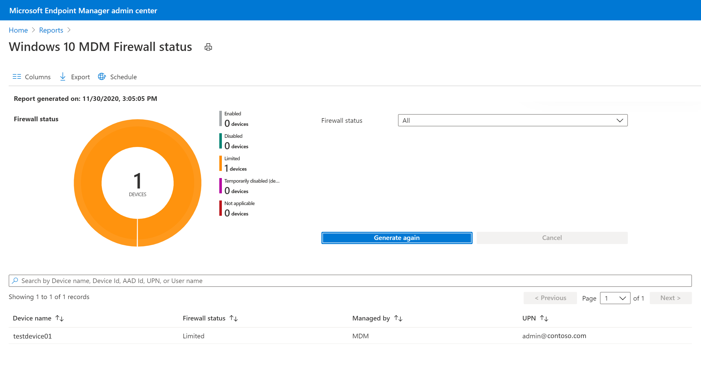

---
# required metadata

title: Manage firewall settings with endpoint security policies in Microsoft Intune | Microsoft Docs
description: Configure and deploy policies for devices you manage with endpoint security firewall policy in Microsoft Intune. 
keywords:
author: brenduns
ms.author: brenduns
manager: dougeby
ms.date: 04/18/2023
ms.topic: reference
ms.service: microsoft-intune
ms.subservice: protect
ms.localizationpriority: medium
ms.technology:

# optional metadata

#ROBOTS:
#audience:
#ms.devlang:
ms.suite: ems
search.appverid: MET150
#ms.tgt_pltfrm:
ms.custom: intune-azure
ms.collection:
- tier1
- M365-identity-device-management
- highpri
ms.reviewer: mattcall

---

# Firewall policy for endpoint security in Intune

Use the endpoint security Firewall policy in Intune to configure a devices built-in firewall for devices that run macOS and Windows devices.

While you can configure the same firewall settings by using Endpoint Protection profiles for device configuration, the device configuration profiles include additional categories of settings. These additional settings are unrelated to firewalls and can complicate the task of configuring only firewall settings for your environment.

Find the endpoint security policies for firewalls under *Manage* in the **Endpoint security** node of the [Microsoft Intune admin center](https://go.microsoft.com/fwlink/?linkid=2109431).

## Prerequisites for Firewall profiles

- Windows 10
- Windows 11
- Windows Server 2012 R2 or later
- Any supported version of macOS

## Firewall profiles

### Devices managed by Intune

**Platform: macOS**:

- **macOS firewall** – Enable and configure settings for the built-in firewall on macOS.

**Platform: Windows 10, Windows 11, and Windows Server**:

> [!NOTE]  
> Beginning on April 5, 2022, the *Windows 10 and later* platform was replaced by the *Windows 10, Windows 11, and Windows Server* platform.
>
> The *Windows 10, Windows 11, and Windows Server* platform supports devices communicating through Microsoft Intune or Microsoft Defender for Endpoint. These profiles also add support for the Windows Server platform which is not supported through Microsoft Intune natively.
>
> Profiles for this new platform use the settings format as found in the Settings Catalog. Each new profile template for this new platform includes the same settings as the older profile template it replaces. With this change you can no longer create new versions of the old profiles. Your existing instances of the old profile remain available to use and edit.

For information about configuring settings in the following profiles, see the [Firewall configuration service provider (CSP)](/windows/client-management/mdm/firewall-csp).

- **Microsoft Defender Firewall** – Configure settings for Windows Defender Firewall with Advanced Security. Windows Defender Firewall provides host-based, two-way network traffic filtering for a device and can block unauthorized network traffic flowing into or out of the local device.

- **Microsoft Defender Firewall rules** - Define granular Firewall rules, including specific ports, protocols, applications and networks, and to allow or block network traffic. Each instance of this profile supports up to 150 custom rules.

  > [!TIP]  
  > Use  of the **Policy App Id** setting, which is described in the [*MdmStore/FirewallRules/{FirewallRuleName}/PolicyAppId*](https://learn.microsoft.com/en-us/windows/client-management/mdm/Firewall-csp?WT.mc_id=Portal-fx#mdmstorefirewallrulesfirewallrulenamepolicyappid) CSP, requires that your environment use *Windows Defender Application Control* (WDAC) tagging. For more information see the following Windows Defender articles:  
  > - [About application control for Windows](/windows/security/threat-protection/windows-defender-application-control/windows-defender-application-control)
  > - [WDAC Application ID (AppId) Tagging guide](/windows/security/threat-protection/windows-defender-application-control/appidtagging/windows-defender-application-control-appid-tagging-guide)

#### Add reusable settings groups to profiles for Firewall rules

In public preview, Microsoft Defender Firewall rule profiles support use of [reusable settings groups](../protect/reusable-settings-groups.md) for the following platforms:

- *Windows 10, Windows 11, and Windows Server platform*

The following firewall rule profile settings are available in reusable settings groups:

- Remote IP address ranges
- FQDN definitions and auto-resolution

When you configure a firewall rule to add one or more reusable settings groups, you’ll also configure the rules Action to define how the settings in those groups are used.

Each rule you add to the profile can include both reusable settings groups and individual settings that are added directly to the rule.  However, consider using each rule for either reusable settings groups or to manage settings you add directly to the rule. This separation can help simplify future configurations or changes you might make.  

For guidance on configuring reusable groups, and then adding them to this profile, see [Use reusable groups of settings with Intune policies](../protect/reusable-settings-groups.md).

### Devices managed by Configuration Manager

[!INCLUDE [Firewall policy prerequisites](../includes/tenant-attach-firewall-prerequisites.md)]

## Firewall rule mergers and policy conflicts

Plan for Firewall policies to be applied to a device using only one policy. Use of a single policy instance and policy type helps avoid having two separate policies apply different configurations to the same setting, which creates conflicts. When a conflict exists between two policy instances or types of policy that manage the same setting with different values, the setting isn't sent to the device.

- That form of policy conflict applies to the **Microsoft Defender Firewall** profile, which can conflict with other Microsoft Defender Firewall profiles, or a firewall configuration that’s delivered by a different policy type, like device configuration.

  *Microsoft Defender Firewall profiles* don't conflict with *Microsoft Defender Firewall rules* profiles.

When you use **Microsoft Defender Firewall rules** profiles, you can apply multiple rules profiles to the same device. However, when different rules exist for the same thing with different configurations, both are sent to the device and create a conflict, on that device.

- For example, if one rule blocks *Teams.exe* through the firewall and a second rule allows *Teams.exe*, both rules are delivered to the client. This result is different from conflicts created through other policies for  Firewall settings.

When rules from multiple rules profiles don't conflict with each other, devices merge the rules from each profile to create a combined firewall rule configuration on the device. This behavior enables you to deploy more than the 150 rules that each individual profile supports to a device.

- For example, you have two Microsoft Defender Firewall rules profiles. The first profile allows *Teams.exe* through the firewall. The second profile allows *Outlook.exe* through the firewall. When a device receives both profiles, the device is configured to allow both apps through the firewall.

## Firewall policy reports

The reports for Firewall policy display status details about the firewall status for your managed devices.  Firewall reports support managed devices that run the following operating systems.

- Windows 10/11

### Summary

Summary is the default view when you open the Firewall node. Open the [Microsoft Intune admin center](https://go.microsoft.com/fwlink/?linkid=2109431), and then go to **Endpoint security** > **Firewall** > **Summary**.

This view provides:

- An aggregate count of devices that have the firewall turned off.
- A list of your Firewall policies, including the name, type, if it's assigned, and when it was last modified.

### MDM devices running Windows 10 or later with firewall off

This report is located in the Endpoint security node.  Open the [Microsoft Intune admin center](https://go.microsoft.com/fwlink/?linkid=2109431), and then go to **Endpoint security** > **Firewall** >  **MDM devices running Windows 10 or later with firewall off**.

Data is reported through the Windows [DeviceStatus CSP](/windows/client-management/mdm/devicestatus-csp), and identifies each device where the Firewall is off. By default, visible details include:

- Device name
- Firewall status
- User principal name
- Target (The method of device management)
- Last check in time

> [!div class="mx-imgBorder"]
> 

### MDM Firewall status for Windows 10 and later

*This organizational report is also described in [Intune Reports](../fundamentals/reports.md#mdm-firewall-status-for-windows-10-and-later-organizational)*.

As an organizational report, this report is available from the **Reports** node.  Open the [Microsoft Intune admin center](https://go.microsoft.com/fwlink/?linkid=2109431), and then go to **Reports** > **Firewall** >  **MDM Firewall status for Windows 10 and later**.

> [!div class="mx-imgBorder"]
> 

Data is reported through the Windows [DeviceStatus CSP](/windows/client-management/mdm/devicestatus-csp), and reports on the status of the firewall on your managed devices. You can filter returns for this report by using one or more of the status detail categories.

Status details include:

- **Enabled** – The firewall on, and successfully reporting.
- **Disabled** - The firewall is turned off.
- **Limited** – The firewall isn’t monitoring all networks, or some rules are turned off.
- **Temporarily Disabled (default)** – The firewall is temporarily not monitoring all networks
- **Not applicable** – The device doesn’t support firewall reporting.

You can filter returns for this report by using one or more of the status detail categories.

> [!div class="mx-imgBorder"]
> 

## Investigate issues for Firewall rules

To learn more about Firewall rules in Intune, and how to troubleshoot common problems, see the following *Intune Customer Success* blog:

- [How to trace and troubleshoot the Intune Endpoint Security Firewall rule creation process](https://techcommunity.microsoft.com/t5/intune-customer-success/how-to-trace-and-troubleshoot-the-intune-endpoint-security/ba-p/3261452)

Additional common firewall rule issues:

**Event Viewer: RemotePortRanges or LocalPortRanges "The parameter is incorrect"**
> [!div class="mx-imgBorder"]
> 
- Verify configured ranges are ascending (Example: 1-5 is correct, 5-1 will cause this error)
- Verify configured ranges are within the overall port range of 0-65535 
- If either remote port ranges or local port ranges are configured in a rule, protocol **must** also be configured with 6 (TCP) **or** 17 (UDP)

**Event Viewer: "...Name), Result: (The parameter is incorrect)"**
> [!div class="mx-imgBorder"]
> 
- If edge traversal is enabled in a rule, the rule direction **must** be set to "This rule applies to inbound traffic".

**Event Viewer: "...InterfaceTypes), Result: (The parameter is incorrect)"**
> [!div class="mx-imgBorder"]
> 
- If "All" interface type is enabled in a rule, the other interface types **must not** be selected.

## Next steps

[Configure Endpoint security policies](../protect/endpoint-security-policy.md#create-an-endpoint-security-policy)

View details for the settings in the deprecated Firewall profiles for the *Windows 10 and later* platform:  

- [Firewall profile settings](../protect/endpoint-security-Firewall-profile-settings.md).
