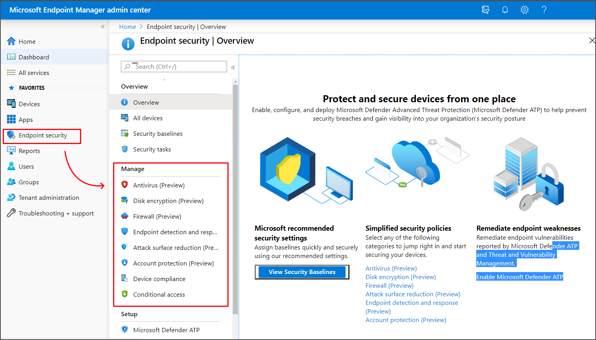

---
# required metadata

title: Manage endpoint security policies in Microft Intune | Microsoft Docs
description: Learn how Security Administrators can use the Endpoint Security policies and profiles to focus on security configuration of devices in Microsoft Endpoint Manager. 
keywords:
author: brenduns
ms.author: brenduns
manager: dougeby
ms.date: 04/17/2020
ms.topic: reference
ms.service: microsoft-intune
ms.subservice: protect
ms.localizationpriority: medium
ms.technology:

# optional metadata

#ROBOTS:
#audience:
#ms.devlang:
ms.suite: ems
search.appverid: MET150
#ms.tgt_pltfrm:
ms.custom: intune-azure
ms.collection: M365-identity-device-management
ms.reviewer: mattsha

---

# Manage device security with endpoint security policies in Microsoft Intune

As a security admin, use the security policies from the *Endpoint security* of Intune to configure device security without the overhead of navigating the larger body and range of settings found in device configuration profiles and security baselines.

You'll find these policies under *Manage* in the **Endpoint security** node of the [Microsoft Endpoint Manager admin center](https://go.microsoft.com/fwlink/?linkid=2109431).

Unless noted otherwise, the settings found in these policies can also be managed through endpoint protection profiles in *device configuration* policy, and by *security baselines*. Therefore, it's important to understand how to identify and resolve policy conflicts should a device not adhere to the configurations you expect.

The information at the following links can help you identify and resolve conflicts:

- [Troubleshoot policies and profiles in Intune](../configuration/troubleshoot-policies-in-microsoft-intune.md)
- [Monitor your security baselines](../protect/security-baselines-monitor.md#troubleshoot-using-per-setting-status)

The following sections introduce the policy groups and the profiles available for each group.

## Antivirus

Use Antivirus profiles to manage Defender ATP antivirus settings on devices that run Windows 10 or macOS.

See [Configure antivirus profiles](../protect/endpoint-security-configure-antivirus.md) for prerequisites and additional information about this profile.

### Prerequisites for antivirus policy

- Windows 10 or later
- Any supported version of macOS
- For Intune to manage antivirus settings on a device, Defender ATP must be installed on that device.
- The Windows Security app is installed on all devices that run Window 10, and no additional prerequisites are required.

### Antivirus profiles

**macOS profiles**:

- **Antivirus** - Manage Antivirus policy settings for macOS when you use Microsoft Defender ATP for Mac.

**Windows 10 profiles**:

- **Microsoft Defender Antivirus** - Manage Antivirus policy settings for cloud protection, Antivirus exclusions, remediation, scan options, and more.

  The *Microsoft Defender Antivirus* profile includes a new instance of settings that are otherwise found as part of a device restriction profile.

  Unlike settings that are part of a device restriction profile, these Antivirus settings support improved options. These settings can be used to manage Antivirus on co-managed devices when the [co-management workload slider](https://docs.microsoft.com/configmgr/comanage/how-to-switch-workloads) for Endpoint Protection is set to Intune. The Antivirus setting from device restriction profiles can’t be used with co-management.

- **Windows Security experience** – Manage [settings for the Windows Security app](../protect/antivirus-security-experience-windows-settings.md). The Windows security app is used by a number of Windows security features to provide notifications about the health and security of the machine. Security app notifications include firewalls, antivirus products, Windows Defender SmartScreen, and others.

To configure antivirus policy, see 

## Disk encryption

Disk encryption profiles focus on settings that manage a devices built-in encryption method, like BitLocker and FileVault.

See [Configure disk encryption profiles](../protect/endpoint-security-configure-disk-encryption.md) for prerequisites and additional information about this profile.

### Prerequisites for Disk encryption profiles

- Windows 10 or later
- macOS 10.13 or later

Because the encryption methods are part of the platforms, there are no additional general prerequisites. However, some settings for BitLocker can require a TPM.

### Disk encryption profiles

- **macOS profiles**:
  - **FileVault** – FileVault provides built-in Full Disk Encryption for macOS devices. Manage [settings for FileVault](../protect/endpoint-security-disk-encryption-profile-settings.md#filevault) on devices that run macOS.

- **Windows 10 profiles**:
  - **BitLocker** – BitLocker Drive Encryption is a data protection feature that integrates with the operating system and addresses the threats of data theft or exposure from lost, stolen, or inappropriately decommissioned computers. Manage [settings for BitLocker](../protect/endpoint-security-disk-encryption-profile-settings.md#bitlocker).

## Firewall

Use Firewall policy to configure a devices built-in firewall on devices that run macOS and Windows 10.

### Prerequisites for Firewall profiles

- Windows 10 or later
- Any supported version of macOS

### Firewall profiles

**macOS profiles**:

- **macOS firewall** – Enable and configure settings for the built-in firewall on macOS.

**Windows 10 profiles**:

- **Microsoft Defender Firewall** – Configure settings for Windows Defender Firewall with Advanced Security. Windows Defender Firewall provides host-based, two-way network traffic filtering for a device and can block unauthorized network traffic flowing into or out of the local device.

## Endpoint detection and response

When you integrate Defender ATP with Intune, you can use policy for endpoint detection and response (EDR.

The capabilities of Microsoft Defender ATP endpoint detection and response provide advanced attack detections that are near real-time and actionable. Security analysts can prioritize alerts effectively, gain visibility into the full scope of a breach, and take response actions to remediate threats.

### Prerequisites for EDR profiles

- Windows 10 or later
- For Intune to manage endpoint detection and response settings on a device, Defender ATP must be installed on that device.

### EDR profiles

**Windows 10 profiles**:

- **Endpoint detection and response** – Manage settings for Microsoft Defender ATP endpoint detection and response.

  The capabilities of Microsoft Defender ATP endpoint detection and response provide advanced attack detections that are near real-time and actionable. Security analysts can prioritize alerts effectively, gain visibility into the full scope of a breach, and take response actions to remediate threats.

  To learn more, see [endpoint detection and response](https://docs.microsoft.com/windows/security/threat-protection/microsoft-defender-atp/overview-endpoint-detection-response) in the Microsoft Defender ATP documentation.

## Attack surface reduction

Each attack surface reduction profile manages settings for a specific area of a Windows 10 device.

### Prerequisites for Attack surface reduction profiles

- Windows 10 or later
- For Intune to manage attack surface reduction settings on a device, Defender ATP must be installed on that device.

### Attack surface reduction profiles

**Windows 10 profiles**:

- **App and browser isolation** – Manage settings for Windows Defender Application Guard (Application Guard), as part of Defender ATP. Application Guard helps to prevent old and newly emerging attacks and can isolate enterprise-defined sites as untrusted while defining what sites, cloud resources, and internal networks are trusted.

  To learn more, see [Application Guard](https://docs.microsoft.com/windows/security/threat-protection/windows-defender-application-guard/wd-app-guard-overview) in the Microsoft Defender ATP documentation.

- **Web protection** – Settings you can manage for Web protection in Microsoft Defender ATP configure network protection to secure your machines against web threats. By integrating with Microsoft Edge and popular third-party browsers like Chrome and Firefox, web protection stops web threats without a web proxy and can protect machines while they're away or on-premises. Web protection stops access to phishing sites, malware vectors, exploit sites, untrusted or low-reputation sites, and sites that you have blocked in your custom indicator list.

  To learn more, see [Web protection](https://docs.microsoft.com/windows/security/threat-protection/microsoft-defender-atp/web-protection-overview) in the Microsoft Defender ATP documentation.

- **Application control** - Application control settings can help mitigate security threats by restricting the applications that users can run and the code that runs in the System Core (kernel). Manage settings that can block unsigned scripts and MSIs, and restrict Windows PowerShell to run in Constrained Language Mode.

  To learn more, see [Application Control](https://docs.microsoft.com/windows/security/threat-protection/windows-defender-application-control/windows-defender-application-control) in the Microsoft Defender ATP documentation.

- **Attack surface reduction rules** – Configure settings for attack surface reduction rules that target behaviors that malware and malicious apps typically use to infect computers, including:
  - Executable files and scripts used in Office apps or web mail that attempt to download or run files
  - Obfuscated or otherwise suspicious scripts
  - Behaviors that apps don't usually start during normal day-to-day work
Reducing your attack surface means offering attackers fewer ways to perform attacks.

  To learn more, see [Attack surface reduction rules](https://docs.microsoft.com/windows/security/threat-protection/microsoft-defender-atp/attack-surface-reduction) in the Microsoft Defender ATP documentation.

- **Device control** – With settings for device control, you can configure devices for a layered approach to secure removable media. Microsoft Defender ATP provides multiple monitoring and control features to help prevent threats in unauthorized peripherals from compromising your devices.

  To learn more, see [How to control USB devices and other removable media using Microsoft Defender ATP](https://docs.microsoft.com/windows/security/threat-protection/device-control/control-usb-devices-using-intune) in the Microsoft Defender ATP documentation.

- Exploit protection - Exploit protection settings can help protect against malware that uses exploits to infect devices and spread. Exploit protection consists of a number of mitigations that can be applied to either the operating system or individual apps.

  To learn more, see [Enable exploit protection](https://docs.microsoft.com/windows/security/threat-protection/microsoft-defender-atp/enable-exploit-protection) in the Microsoft Defender ATP documentation.

## Account protection

Protect the identity and accounts of your users by configuring Windows Hello and credential guard.

### Prerequisites for Account protection profiles

- Windows 10 or later

### Account protection profiles

**Windows 10 profiles**:

- **Account protection** – Settings for account protection policies help you protect user credentials.

  To learn more, see [Identity and access management](https://docs.microsoft.com/windows/security/identity-protection/) in the Windows identity and access management documentation.

## Next steps

[Manage endpoint security in Intune](../protect/endpoint-security.md)
