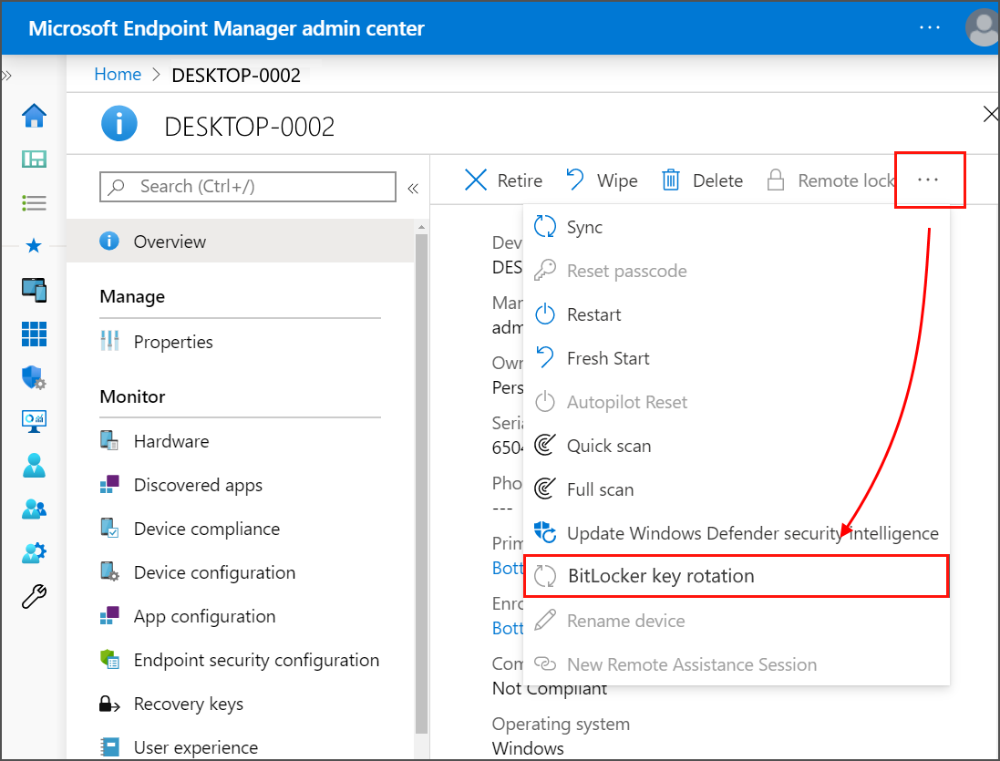

---
# required metadata

title: Manage endpoint security policies in Microft Intune | Microsoft Docs
description: Learn how Security Administrators can use the Endpoint Security policies and profiles to focus on security configuration of devices in Microsoft Endpoint Manager. 
keywords:
author: brenduns
ms.author: brenduns
manager: dougeby
ms.date: 04/23/2020
ms.topic: reference
ms.service: microsoft-intune
ms.subservice: protect
ms.localizationpriority: medium
ms.technology:

# optional metadata

#ROBOTS:
#audience:
#ms.devlang:
ms.suite: ems
search.appverid: MET150
#ms.tgt_pltfrm:
ms.custom: intune-azure
ms.collection: M365-identity-device-management
ms.reviewer: mattsha

---

# Manage device security with endpoint security policies in Microsoft Intune

As a security admin, use the security policies from the *Endpoint security* of Intune to configure device security without the overhead of navigating the larger body and range of settings found in device configuration profiles and security baselines.

You'll find these policies under *Manage* in the **Endpoint security** node of the [Microsoft Endpoint Manager admin center](https://go.microsoft.com/fwlink/?linkid=2109431).

## Policy types and defaults

Intune includes multiple methods to deploy and manage settings on your devices.  To avoid creating conflicts and to help you predict the outcome and compliance to your policies, the following information describes the behaviors of policy types and setting configurations.

### Defaults for settings in different policy types

All Intune policy types include groups of settings with each setting have a default value. When you create a new instance of a policy type, that new instance has all its settings set to the default values for that policy type. You can then edit the policy to configure the settings you want to actively manage.  

For most policy types, like [device configuration](../configuration/device-profile-create.md) or endpoint security profiles, the default value of each setting is *Not configured*, or an equivalent value. The exception to this is for [security baselines](../protect/security-baselines.md), which include values for many settings that are other than *Not configured*. Security baselines are an exception because they are pre-configured groups to help you apply a known group of settings and default values that are recommended by the relevant security teams.

The use of Not configured as a default value for most policy types helps to avoid conflicts prior to your customizations.  However, the value of Not configured has more complex results, which are worth understanding, especially when the same setting appears in multiple policy types or multiple instances of the same policy type.

**General rules**:

- When Intune policy applies a setting other than not configured, the policy sets the configuration on the device, and manages that setting.

- When multiple policies configure the same setting with a value other than Not configured, a conflict can occur if the configurations are different from each other. To resolve conflicts, you might need to edit one or more policies so only one policy manages the setting, or to align all policies to agree on the settings configuration.

- When Intune policy applies the value of Not configured, special rules apply.

**Use of Not configured**

In the following, a policy instance is an individual policy for any policy type. Using BitLocker settings as an example, if you create two profiles for BitLocker as an Endpoint Security Disk Encryption policy, each of the profiles is a separate policy instance. If you also have an endpoint configuration profile for device configuration that also manages BitLocker settings, that is a third instance of policy.

- By default, each policy type (other than security baselines) applies a value of Not configured to each setting the policy includes. A value of Not configured results in the policy ignoring that setting on the device, leaving the settings configuration unchanged. This could be the device or app default, or it might be a configuration made by the device user, or by another method outside of Intune like Group Policy.

- When you modify Intune policy to use a value other than Not configured and then deploy that policy, that policy becomes responsible for managing the setting. On devices that receive the policy, Intune applies the configuration.

- Later, if a separate Intune policy instance attempts to manage a setting that’s been set by a different Intune policy, a conflict can occur:
  - If both policies set the same value, there is no conflict.
  - If the two policies set different values, a conflict occurs. 
  - If the second policy sets a value of Not configured, the second policy doesn’t attempt to manage the setting on the device. Instead, the device retains the original configuration from the first policy.

- To restore a setting on a device to its original value, which is the operating system or application default, you can modify a  policy that is already managing that value and have it apply the value of Not configured. 

  If the original policy instance isn’t available, you will need to use a policy to actively manage the setting, and then edit that policy to set the setting to not configured.

### Manage conflicts

Most settings that are included in the different Endpoint security policies (security policies) can also be managed through endpoint protection profiles in *device configuration* policy, and by *security baselines*.

Because the same setting can be managed by multiple Intune policies, be prepared to identify and resolve policy conflicts should a device not adhere to the configurations you expect.

The information at the following links can help you identify and resolve conflicts:

- [Troubleshoot policies and profiles in Intune](../configuration/troubleshoot-policies-in-microsoft-intune.md)
- [Monitor your security baselines](../protect/security-baselines-monitor.md#troubleshoot-using-per-setting-status)

## Antivirus policy

Antivirus policies make it easy for security admins to focus on managing the discrete group of antivirus settings for your managed devices. To use Antivirus policy, integrate Intune with Microsoft Defender Advanced Threat Protection (Defender ATP) as a Mobile Threat Defense solution.

Antivirus profiles contain only the settings that are relevant for Defender ATP antivirus for macOS and Windows 10, and for the user experience in the Windows Security app on Windows 10 devices.

While you can configure some of the same settings as part of *Endpoint Protection* profiles for [device configuration](../configuration/device-profile-create.md) or *device restriction* profiles for [device compliance](../protect/device-compliance-get-started.md), those other profiles include additional categories of settings that are unrelated to Antivirus, which can complicate the task of configuring Antivirus. Additionally, for macOS devices, the Antivirus settings aren't available through other profiles. The macOS Antivirus profile replaces the need to configure the settings by using `.plist` files.

### Prerequisites for antivirus policy

- **macOS**
  - Any supported version of macOS
  - For Intune to manage antivirus settings on a device, Defender ATP must be installed on that device. See. [Defender ATP for macOS](https://docs.microsoft.com/windows/security/threat-protection/microsoft-defender-atp/microsoft-defender-atp-mac) (In the Defender ATP documentation)

- **Windows 10 and later**
  - For Intune to manage antivirus settings on a device, Defender ATP must be installed on that device. See, [Microsoft Defender ATP for Windows](../protect/advanced-threat-protection.md), in the Intune documentation.
  - The Windows Security app is installed on all devices that run Window 10, and no additional prerequisites are required.
  - The Windows Security app is installed on all devices that run Window 10, and no additional prerequisites are required.

### Antivirus profiles

**macOS profiles**:

- **Antivirus** - Manage [Antivirus policy settings](../protect/antivirus-microsoft-defender-settings-macos.md) for macOS.

  When you use [Microsoft Defender ATP for Mac](https://docs.microsoft.com/windows/security/threat-protection/microsoft-defender-atp/microsoft-defender-atp-mac), you can configure and deploy Antivirus settings to your managed macOS devices through Intune instead of configuring those settings by use of `.plist` files.

**Windows 10 profiles**:

- **Microsoft Defender Antivirus** - Manage [Antivirus policy settings](../protect/antivirus-microsoft-defender-settings-windows.md) for Windows 10.

  Defender Antivirus is the next-generation protection component of Microsoft Defender Advanced Threat Protection (Microsoft Defender ATP). Next-generation protection brings together machine learning, big-data analysis, in-depth threat resistance research, and cloud infrastructure to protect devices in your enterprise organization.

  The *Microsoft Defender Antivirus* profile is a separate instance of the antivirus settings found in the *Device Restriction profile* for Device Compliance policy. 
  
  Unlike the antivirus settings in a *Device Restriction profile*, you can use these settings to with devices that are co-managed. To use these settings, the [co-management workload slider](https://docs.microsoft.com/configmgr/comanage/how-to-switch-workloads) for Endpoint Protection must be set to Intune.

- **Windows Security experience** – Manage the [Windows Security app settings](../protect/antivirus-security-experience-windows-settings.md) that end users can view in the Microsoft Defender Security center and the notifications they receive. The Windows security app is used by a number of Windows security features to provide notifications about the health and security of the machine. Security app notifications include firewalls, antivirus products, Windows Defender SmartScreen, and others.

## Disk encryption policy

Disk encryption profiles focus on only the settings that are relevant for a devices built-in encryption methods, like FileVault or BitLocker.

While you can configure the same device settings by using *Endpoint Protection profiles* for device configuration, the device configuration profiles include additional categories of settings that are unrelated to disk encryption, which can complicate the task of configuring only disk encryption.

Use one of the following profiles for disk encryption:
- [macOS FileVault](#manage-filevault-for-macos) - FileVault provides built-in Full Disk Encryption for macOS devices. Manage [settings for FileVault](../protect/endpoint-security-disk-encryption-profile-settings.md#filevault) on devices that run macOS.
- [Windows 10 BitLocker](#manage-bitlocker-for-windows-10) - BitLocker Drive Encryption is a data protection feature that integrates with the operating system and addresses the threats of data theft or exposure from lost, stolen, or inappropriately decommissioned computers. Manage [settings for BitLocker](../protect/endpoint-security-disk-encryption-profile-settings.md#bitlocker).

### Manage FileVault for macOS

**Prerequisites**

- **macOS** - macOS 10.13 or later

#### Create the FileVault profile

Use the procedure to [Configure endpoint security policy]() to create a Disk Encryption profile for FileVault. 

- For **Platform** select **macOS**.
- For **Profile**, select **FileVault**
- For more information about the FileVault settings, see [settings for FileVault](../protect/endpoint-security-disk-encryption-profile-settings.md#filevault).

#### Manage FileVault

After Intune encrypts a macOS device with FileVault, you can view and manage the FileVault recovery keys when you view the Intune [encryption report](../protect/encryption-monitor.md).

After Intune encrypts a macOS device with FileVault, you can view that device's personal recovery key from the web Company Portal on any device. Once in the web Company Portal, choose the encrypted macOS device, and then choose to "Get recovery key" as a remote device action.

#### Retrieve personal recovery key from MEM encrypted macOS devices

End users can retrieve their personal recovery key (FileVault key) using the iOS Company Portal app, the Android Company Portal app, or through the Android Intune app.

The device that has the personal recovery key must be enrolled with Intune and encrypted with FileVault through Intune. Using the iOS Company Portal app, Android Company Portal app, the Android Intune app, or the Company Portal website, the end-user can see the **FileVault** recovery key needed to access their Mac devices. 

End-users can select **Devices** > *the encrypted and enrolled macOS device* > **Get recovery key**. The browser will show the Web Company Portal and display the recovery key.

### Manage BitLocker for Windows 10

**Prerequisites**

- **Windows 10 or later** - Windows 10 or later
  - Some settings for BitLocker can require a TPM.

#### Create a BitLocker profile

Use the procedure to [Configure endpoint security policy]() to create a Disk Encryption profile for BitLocker:

- For **Platform** select **macOS**.
- For **Profile**, select **FileVault**
- For more information about the BitLocker settings, see [settings for BitLocker](../protect/endpoint-security-disk-encryption-profile-settings.md#bitlocker).

### Silently enable BitLocker on devices

You can configure a BitLocker policy that automatically and silently enables BitLocker on a device. That means that BitLocker enables successfully without presenting any UI to the end user, even when that user isn't a local Administrator on the device.

**Prerequisites to silently enable BitLocker**  
Devices must meet the following conditions to be eligible for silently enabling BitLocker:

- The device must run Windows 10 version 1809 or later
- The device must be Azure AD Joined

**BitLocker policy configuration**  
The following two settings for BitLocker – Base Settings must be configured in the BitLocker profile:

- **Hide prompt about third-party encryption** = **Yes**

- **Allow standard users to enable encryption during Autopilot** = **Yes**

   Devices must not require use of a *startup PIN* or *startup key.* When a TPM startup PIN or startup key is required, BitLocker cannot silently enable and requires interaction from the end user.

   To meet this requirement, in the BitLocker profile ensure the following three settings under BitLocker OS Drive Settings are not set to Required. They can be set to either Blocked or Allowed.

- **Compatible TPM startup PIN** = *Blocked* or *Allowed*

- **Compatible TPM startup key and PIN** = *Blocked* or *Allowed*

### Manage BitLocker recovery keys

After Intune encrypts a Windows 10 device with BitLocker, you can view and retrieve BitLocker recovery keys when you view the Intune encryption report.
You can use an Intune device action to remotely rotate the BitLocker recovery key of a device that runs Windows 10 version 1909 or later.

#### Prerequisites to rotate BitLocker recovery keys

Devices must meet the following prerequisites to support rotation of the BitLocker recovery key:

- Devices must run Windows 10 version 1909 or later
- Azure AD-joined and Hybrid-joined devices must have support for key rotation enabled:
  - **Enable client-driven recovery password for**

#### To rotate the BitLocker recovery key

1. Sign in to the Microsoft Endpoint Manager admin center.

2. Select **Endpoint security** > **All devices**.

3. In the list of devices that you manage, select a device.

4. On the **Overview** page of the device, select the **BitLocker key rotation**. If you don’t see this option, select the ellipsis (**…**) to show additional options, and then select the **BitLocker key rotation** device remote action.

   

## Firewall policy

Use Firewall policy to configure a devices built-in firewall on devices that run macOS and Windows 10.

View [settings for Firewall profiles](../protect/endpoint-security-Firewall-profile-settings.md).

### Prerequisites for Firewall profiles

- Windows 10 or later
- Any supported version of macOS

### Firewall profiles

**macOS profiles**:

- **macOS firewall** – Enable and configure settings for the built-in firewall on macOS.

**Windows 10 profiles**:

- **Microsoft Defender Firewall** – Configure settings for Windows Defender Firewall with Advanced Security. Windows Defender Firewall provides host-based, two-way network traffic filtering for a device and can block unauthorized network traffic flowing into or out of the local device.

## Endpoint detection and response policy

When you integrate Defender ATP with Intune, you can use policy for endpoint detection and response (EDR.

The capabilities of Microsoft Defender ATP endpoint detection and response provide advanced attack detections that are near real-time and actionable. Security analysts can prioritize alerts effectively, gain visibility into the full scope of a breach, and take response actions to remediate threats.

View [settings for Endpoint detection and response profiles](../protect/endpoint-security-edr-profile-settings.md).

### Prerequisites for EDR profiles

- Windows 10 or later
- For Intune to manage endpoint detection and response settings on a device, Defender ATP must be installed on that device.

### EDR profiles

**Windows 10 profiles**:

- **Endpoint detection and response** – Manage settings for Microsoft Defender ATP endpoint detection and response.
endpoint-security-edr-profile-settings.md
  The capabilities of Microsoft Defender ATP endpoint detection and response provide advanced attack detections that are near real-time and actionable. Security analysts can prioritize alerts effectively, gain visibility into the full scope of a breach, and take response actions to remediate threats.

  To learn more, see [endpoint detection and response](https://docs.microsoft.com/windows/security/threat-protection/microsoft-defender-atp/overview-endpoint-detection-response) in the Microsoft Defender ATP documentation.

## Attack surface reduction policy

Each attack surface reduction profile manages settings for a specific area of a Windows 10 device.

View [settings for Attack surface reduction profiles](../protect/endpoint-security-asr-profile-settings.md)].

### Prerequisites for Attack surface reduction profiles

- Windows 10 or later
- For Intune to manage attack surface reduction settings on a device, Defender ATP must be installed on that device.

### Attack surface reduction profiles

**Windows 10 profiles**:

- **App and browser isolation** – Manage settings for Windows Defender Application Guard (Application Guard), as part of Defender ATP. Application Guard helps to prevent old and newly emerging attacks and can isolate enterprise-defined sites as untrusted while defining what sites, cloud resources, and internal networks are trusted.

  To learn more, see [Application Guard](https://docs.microsoft.com/windows/security/threat-protection/windows-defender-application-guard/wd-app-guard-overview) in the Microsoft Defender ATP documentation.

- **Web protection** – Settings you can manage for Web protection in Microsoft Defender ATP configure network protection to secure your machines against web threats. By integrating with Microsoft Edge and popular third-party browsers like Chrome and Firefox, web protection stops web threats without a web proxy and can protect machines while they're away or on-premises. Web protection stops access to phishing sites, malware vectors, exploit sites, untrusted or low-reputation sites, and sites that you've blocked in your custom indicator list.

  To learn more, see [Web protection](https://docs.microsoft.com/windows/security/threat-protection/microsoft-defender-atp/web-protection-overview) in the Microsoft Defender ATP documentation.

- **Application control** - Application control settings can help mitigate security threats by restricting the applications that users can run and the code that runs in the System Core (kernel). Manage settings that can block unsigned scripts and MSIs, and restrict Windows PowerShell to run in Constrained Language Mode.

  To learn more, see [Application Control](https://docs.microsoft.com/windows/security/threat-protection/windows-defender-application-control/windows-defender-application-control) in the Microsoft Defender ATP documentation.

- **Attack surface reduction rules** – Configure settings for attack surface reduction rules that target behaviors that malware and malicious apps typically use to infect computers, including:
  - Executable files and scripts used in Office apps or web mail that attempt to download or run files
  - Obfuscated or otherwise suspicious scripts
  - Behaviors that apps don't usually start during normal day-to-day work
Reducing your attack surface means offering attackers fewer ways to perform attacks.

  To learn more, see [Attack surface reduction rules](https://docs.microsoft.com/windows/security/threat-protection/microsoft-defender-atp/attack-surface-reduction) in the Microsoft Defender ATP documentation.

- **Device control** – With settings for device control, you can configure devices for a layered approach to secure removable media. Microsoft Defender ATP provides multiple monitoring and control features to help prevent threats in unauthorized peripherals from compromising your devices.

  To learn more, see [How to control USB devices and other removable media using Microsoft Defender ATP](https://docs.microsoft.com/windows/security/threat-protection/device-control/control-usb-devices-using-intune) in the Microsoft Defender ATP documentation.

- Exploit protection - Exploit protection settings can help protect against malware that uses exploits to infect devices and spread. Exploit protection consists of a number of mitigations that can be applied to either the operating system or individual apps.

  To learn more, see [Enable exploit protection](https://docs.microsoft.com/windows/security/threat-protection/microsoft-defender-atp/enable-exploit-protection) in the Microsoft Defender ATP documentation.

## Account protection policy

Protect the identity and accounts of your users by configuring Windows Hello and credential guard.

View [settings for account protection profiles](../protect/endpoint-security-asr-profile-settings.md).

### Prerequisites for Account protection profiles

- Windows 10 or later

### Account protection profiles

**Windows 10 profiles**:

- **Account protection** – Settings for account protection policies help you protect user credentials.

  To learn more, see [Identity and access management](https://docs.microsoft.com/windows/security/identity-protection/) in the Windows identity and access management documentation.

## Next steps

[Manage endpoint security in Intune](../protect/endpoint-security.md)
