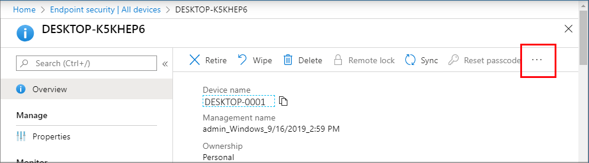

---
# required metadata

title: Manage endpoint security in Microft Intune | Microsoft Docs
description: Learn how Security Administrators can use the Endpoint Security node to manage device security and remediate issues for devices in Microsoft Endpoint Manager. 
keywords:
author: brenduns
ms.author: brenduns
manager: dougeby
ms.date: 04/17/2020
ms.topic: reference
ms.service: microsoft-intune
ms.subservice: protect
ms.localizationpriority: medium
ms.technology:

# optional metadata

#ROBOTS:
#audience:
#ms.devlang:
ms.suite: ems
search.appverid: MET150
#ms.tgt_pltfrm:
ms.custom: intune-azure
ms.collection: M365-identity-device-management
ms.reviewer: mattsha

---

# Manage endpoint security in Microsoft Intune

As a Security Admin, use the *Endpoint security* node in Intune to configure device security and to manage security tasks for devices when those devices are at risk. The Endpoint security policies are designed to help you focus on the security of your devices and mitigate risk. The tasks that are available help you identify devices that are at risk, to remediate those devices, and restore them to a compliant or more secure state.

The Endpoint security node groups the tools that are available through Intune that you’ll use to keep devices secure:

- **Review the status of all your managed devices**. Use the [All devices](#manage-devices) view where you can view device compliance from a high level and then drill into specific devices to understand which compliance policies weren't met so you can act to resolve them.

- **Deploy security baselines that establish best practice security configurations for devices**. Intune includes [security baselines](#manage-security-baselines) for Windows devices and a growing list of applications, like Defender ATP and Microsoft Edge.

- **Manage security configurations on devices through tightly focused policies**.  Each [Endpoint security policy](#use-policies-to-manage-device-security) focuses on specific aspects of device security like antivirus, disk encryption, firewalls, and several areas made available through integration with Defender ATP.

- **Establish device and user requirements through compliance policy**. With [compliance policies](../protect/device-compliance-get-started.md), you set the rules that devices and users must meet to be considered compliant. Rules can include OS versions, password requirements, device threat-levels, and more. When you integrate with Azure AD [conditional access policies](#configure-conditional-access) to enforce compliance policies, you can gate access to corporate resources for both managed devices, and devices that aren’t managed yet.

- **Integrate Intune with your Microsoft Defender Advanced Threat Protection (Defender ATP) team**. By [integrating with Defender ATP](#set-up-integration-with-defender-atp) you gain access to [security tasks](#review-security-tasks-from-defender-atp) that closely tie Defender ATP and Intune together to help identify and remediate devices that are at risk.

The following sections of this article discuss the different tasks you can do from the endpoint security node of the admin center. 

## Manage devices

The Endpoint security node includes the *All devices* view, which lets you view a list of your devices from your Azure Active Directory (Azure AD) that are available in Microsoft Endpoint Manager. To find it, open the [Microsoft Endpoint Manager admin center](https://go.microsoft.com/fwlink/?linkid=2109431) and select **Endpoint security** > **All devices**. This list includes devices managed by Intune, Configuration Manager, and by [co-management](https://docs.microsoft.com/configmgr/comanage/overview) by both Intune and Configuration Manager. Devices can be in the cloud and from your on-premises infrastructure when integrated with your Azure AD.

The initial *All devices* view displays your devices and includes key information about each:

- How the device is managed
- Compliance status
- Operating system details
- When the device last checked in
- And more

When viewing devices in the Microsoft Endpoint Manager admin center, consider how the device is managed. The management source affects the information that’s presented in the admin center and which actions are available to manage the device from the admin center.

Consider the following fields:

- **Managed by** – This column identifies how the device is managed. Managed by options include:

  - **MDM**  - These devices are managed by Intune. Compliance data is collected and reported by Intune to the admin center.

  - **ConfigMgr** – These devices appear when you use *tenant attach* to add your devices that are managed by Configuration Manager to the Microsoft Endpoint Manager admin center. Devices that are added from Configuration Manager include the devices that are identified by Configuration Manager as **Client** = **Yes** and include:

    - Workgroup (AAD joined and otherwise)
    - Domain Joined
    - Hybrid AAD Joined (joined to the AD and AAD)

    Compliance status is managed in Configuration Manager and might not be visible in the Microsoft Endpoint Manager admin center.

    <!-- Tenant attached devices can receive your endpoint security policies. The following policy types are supported, with additional policy types being added in future updates to Intune: 
    -->

    For more information, see [Enable tenant attach](https://docs.microsoft.com/configmgr/tenant-attach/device-sync-actions) in the Configuration Manager documentation.

  - **MDM/ConfigMgr Agent** – These devices are under co-management between Intune and Configuration Manager.

    With co-management, you [choose different co-management workloads](https://docs.microsoft.com/configmgr/comanage/how-to-switch-workloads) to determine which aspects are managed by Configuration Manager or by Intune. These choices will affect which policies the device applies, and how compliance data is reported to the admin center.

    For example, you can use Intune to configure policy for Antivirus, Firewall, and Encryption. These policy types are considered policy for *Endpoint Protection*. To have a co-managed device use the Intune policies and not the Configuration Manager policies, set the co-management slider for Endpoint Protection to either *Intune* or *Pilot Intune*. If the slider is set to Configuration Manager, the device uses the policies and settings from Configuration Manager instead.

- **Compliance**: Compliance is evaluated against the compliance policies that are assigned to the device. The source of these policies and what information is in the console depends on how the device is managed; Intune, Configuration Manager, or co-management. For co-managed devices to report compliance, set the co-management slider for Device Compliance to either Intune or Pilot Intune.  

  After compliance is reported to the admin center for a device, you can drill into the details to view additional details. When a device isn’t compliant, drill into its details to information about which policies aren't compliant.  That information can help you investigate and help you bring the device into compliance.

- **Last check-in**: If a device hasn’t checked in for some time, its details, including its Compliance status, can be out of date.

### Remote actions for devices

Remote actions are actions you can start or apply to a device from the Microsoft Endpoint Manager admin center. When you view details for a device, you can access remote actions that apply to the device.

Remote actions display across the top of the devices *Overview* page. Actions that can’t display because of limited space on your screen are available by selecting the ellipsis on the right side:

The remote actions that are available depend on how the device is managed:

- **Intune**: All [Intune remote actions](../remote-actions/device-management.md) that apply to the device platform are available.  
- **Configuration Manager**: You can use the following Configuration Manager actions:

  - Sync Machine Policy
  - Sync User Policy
  - App Evaluation Cycle

- **Co-management**: You can access both Intune remote actions and Configuration Manager actions.

Some of the Intune remote actions can help secure devices or safeguard data that might be on the device. With remote actions you can lock a device, reset a device, remove company data, scan for malware outside of a scheduled run, and rotate BitLocker keys.

The following Intune remote actions are of interest to the security admin, and are a subset of the [full list](../remote-actions/device-inventory.md#view-the-device-details). Not all actions are available for all device platforms. The links go to content that provides in-depth details for each action.

- [Synchronize device](../remote-actions/device-sync.md) – For the device to immediately check in with Intune. When a device checks in, it immediately receives any pending actions or policies that have been assigned to it.  

- [Restart](../remote-actions/device-restart.md) – Force a Windows 10 device to restart, within five minutes. THe device owner won't automatically be notified of the restart and might lose work.

- [Quick Scan](../configuration/device-restrictions-windows-10.md) – Have Defender run a quick scan of the device for malware and then submit the results to Intune. A quick scan looks at common locations where there could be malware registered, such as registry keys and known Windows startup folders.

- [Full scan](../configuration/device-restrictions-windows-10.md) – Have Defender run a scan of the device for malware and then submit the results to Intune. A full scan looks at common locations where there could be malware registered, and also scans every file and folder on the device.

- Update Windows Defender security intelligence – Have the device update its malware definitions for Microsoft Defender Antivirus. This action doesn’t start a scan. 

- [BitLocker key rotation](../protect/encrypt-devices.md#to-rotate-the-bitlocker-recovery-key) – Remotely rotate the BitLocker recovery key of a device that runs Windows 10 version 1909 or later.

You can also use **Bulk Device Actions** to manage some actions like *Retire* and *Wipe* for multiple devices at the same time. [Bulk actions](../remote-actions/bulk-device-actions.md) are available from the *All devices* view. You’ll select the platform, action, and then specify up to 100 devices.

Options you manage for devices don’t take effect until the device checks in with Intune.

## Manage Security baselines

Security baselines in Intune are pre-configured groups of settings that are best practice recommendations from the relevant Microsoft security teams for the applicable product. Intune supports security baselines for Windows 10 device settings, Microsoft Edge, Microsoft Defender Advanced Threat Protection, and more.

You can use security baselines to rapidly deploy a *best practice* configuration of device and application settings to protect your users and devices. Security baselines are supported for devices that run Windows 10 version 1809 and later.

For more information, see [Use security baselines to configure Windows 10 devices in Intune](../protect/security-baselines.md)

<!-- original - being reduced to minimize this section, as its all in the Security Baseline article: 

Use security baselines to rapidly deploy a *best practice* configuration of device and application settings to protect your users and devices. Security baselines are supported for devices that run Windows 10 version 1809 and later.

The baselines are pre-configured groups of settings that are best practice recommendations from the relevant Microsoft security teams for the applicable product. Intune supports security baselines for Windows 10 device settings, Microsoft Edge, Microsoft Defender Advanced Threat Protection, and more.

When you deploy a security baseline, you can deploy the baseline in its default (recommended) configuration, or customize it to meet the needs of your unique environment.

For more information, see [Use security baselines to configure Windows 10 devices in Intune](../protect/security-baselines.md).
-->

## Review Security tasks from Defender ATP

When you integrate Intune with Microsoft Defender Advanced Threat Protection (Defender ATP), you can review *Security tasks* in Intune that identify at-risk devices and provide steps to mitigate that risk. You can then use the tasks to report back to Defender ATP when those risks are successfully mitigated.

- Your Defender ATP team determine what devices are at risk and pass that information to your Intune team as a security task. With one click they create a security task for Intune that identifies the devices at risk, the vulnerability, and that provides guidance on how to mitigate that risk.

- The Intune Admins review security tasks and then act within Intune to remediate those tasks. Once mitigated, they set the task to complete, which communicates that status back to the Defender ATP team.

Through Security tasks both teams remain in synch as to which devices are at risk, and how and when those risks are remediated.

To learn more about using Security tasks, see [Use Intune to remediate vulnerabilities identified by Microsoft Defender ATP](../protect/atp-manage-vulnerabilities.md).

## Use policies to manage device security

As a security admin, use the policies found under *Manage* in the Endpoint security node to configure device security without the overhead of navigating the larger body and range of settings found in device configuration profiles and security baselines.

Endpoint security also provides easy access to *Device compliance* and *Conditional access* policies, which are not focused security policies but important tools for managing devices and access to corporate resources.

To start using security policies, see [Manage device security with endpoint security](../protect/endpoint-security-policy.md)

### About policy conflicts

Many of the settings you can configure in the policies for Endpoint security are settings that can also be managed through *endpoint protection* profiles in device configuration policy, and by security baselines. Therefore, it's important to understand how to identify and resolve policy conflicts should a device not adhere to the configurations you expect.

The information at the following links can help you identify and resolve conflicts:

- [Troubleshoot policies and profiles in Intune](../configuration/troubleshoot-policies-in-microsoft-intune.md)
- [Monitor your security baselines](../protect/security-baselines-monitor.md#troubleshoot-using-per-setting-status)

The following sections introduce the policy groups and the profiles available for each group.

## Use device compliance policy

Use device compliance policy to establish the conditions by which devices and users are allowed to access your network and company resources.

The [available compliance settings](../protect/device-compliance-get-started.md#next-steps) depend on the platform you use, but common policy rules include:

- Requiring devices run a minimum or specific OS version
- Setting password requirements
- Specifying a maximum allowed device threat-level, as determined by Defender ATP or another Mobile Threat Defense partner
- Use of network locations

In addition to setting conditions for compliance, you can configure automatic actions to take when a device is not compliant. Actions include sending email or notifications to alert device users about non-compliance, remotely locking devices, or even retiring non-compliant devices and removing any company data that might be on it.

When you integrate Intune with Azure AD [conditional access policies](#configure-conditional-access) to enforce compliance policies, Conditional access can use the compliance data to gate access to corporate resources for both managed devices, and devices that aren’t managed yet.

To learn more, see [Set rules on devices to allow access to resources in your organization using Intune](../protect/device-compliance-get-started.md).

## Configure conditional access

To protect your devices and corporate resources, you can use Azure Active Directory (Azure AD) Conditional Access policies with Intune.

Intune passes the results of your device compliance policies to Azure AD, which then uses conditional access policies enforce which devices and apps can access your corporate resources. Conditional access policies can also be configured to gate access for devices that aren’t managed by Intune. You can even use compliance details from [Mobile Threat Defense partners](../protect/mobile-threat-defense.md) you integrate with Intune.

The following are two common methods of using conditional access with Intune include:

- Device-based Conditional Access
- App-based conditional access

When you select *Conditional Access* from within the Microsoft Endpoint Manager admin center, the Conditional Access node that opens in the admin center is the node from Azure AD, and the policies you create are created in Azure.

To learn more about using conditional access with Intune, see [Learn about Conditional Access and Intune](../protect/conditional-access.md).

## Set up Integration with Defender ATP

When you integrate Microsoft Defender Advanced Threat Protection (Defender ATP) with Intune, you improve your ability to identify and respond to risks.

While Intune can integrate with several [Mobile Threat Defense partners](../protect/mobile-threat-defense.md), when you use Defender ATP you gain a tight integration between Defender ATP and Intune with access to deep device protection options, including:

- Security tasks – Seamless communication between ATP and Intune admins about devices at risk, how to remediate them, and confirmation when those risks are mitigated.
- Streamlined onboarding for *Endpoint detection and response* on clients
- Use of ATP device risk signals in Intune compliance policies
- Access to *Tamper protection* capabilities

 To learn more about using Defender ATP with Intune, see [Enforce compliance for Microsoft Defender ATP with Conditional Access in Intune](../protect/advanced-threat-protection.md)

## Next steps

Configure:

- [Security baselines](../protect/security-baselines.md)
- [Compliance policies](../protect/device-compliance-get-started.md)
- [Conditional access policies](#configure-conditional-access)
- [Integration with Defender ATP](../protect/advanced-threat-protection.md)
