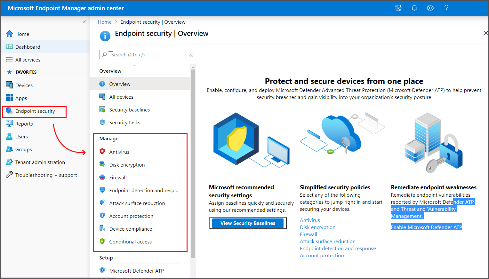

---
# required metadata

title: Manage endpoint security in Microsoft Intune | Microsoft Docs
description: Learn how Security Administrators can use the Endpoint Security node to manage device security and remediate issues for devices in Microsoft Endpoint Manager. 
keywords:
author: brenduns
ms.author: brenduns
manager: dougeby
ms.date: 11/16/2021
ms.topic: overview
ms.service: microsoft-intune
ms.subservice: protect
ms.localizationpriority: medium
ms.technology:

# optional metadata

#ROBOTS:
#audience:
#ms.devlang:
ms.suite: ems
search.appverid: MET150
#ms.tgt_pltfrm:
ms.custom: intune-azure
ms.collection: 
  - M365-identity-device-management
  - highpri
ms.reviewer: mattcall
---

# Manage endpoint security in Microsoft Intune

As a Security Admin, use the *Endpoint security* node in Intune to configure device security and to manage security tasks for devices when those devices are at risk. The Endpoint security policies are designed to help you focus on the security of your devices and mitigate risk. The available tasks can help you identify at-risk devices, to remediate those devices, and restore them to a compliant or more secure state.

The Endpoint security node groups the tools that are available through Intune that you’ll use to keep devices secure:

- **Review the status of all your managed devices**. Use the [All devices](#manage-devices) view where you can view device compliance from a high level. Then, drill-in to specific devices to understand which compliance policies aren't met so you can resolve them.

- **Deploy security baselines that establish best practice security configurations for devices**. Intune includes [security baselines](#manage-security-baselines) for Windows devices and a growing list of applications, like Microsoft Defender for Endpoint and Microsoft Edge. Security baselines are pre-configured groups of Windows settings that help you apply a configuration that's recommended by the relevant security teams.

- **Manage security configurations on devices through tightly focused policies**.  Each [Endpoint security policy](#use-policies-to-manage-device-security) focuses on aspects of device security like antivirus, disk encryption, firewalls, and several areas made available through integration with Microsoft Defender for Endpoint.

- **Establish device and user requirements through compliance policy**. With [compliance policies](../protect/device-compliance-get-started.md), you set the rules that devices and users must meet to be considered compliant. Rules can include OS versions, password requirements, device threat-levels, and more.

  When you integrate with Azure Active Directory (Azure AD) [conditional access policies](#configure-conditional-access) to enforce compliance policies, you can gate access to corporate resources for both managed devices, and devices that aren’t managed yet.

- **Integrate Intune with your Microsoft Defender for Endpoint team**. By [integrating with Microsoft Defender for Endpoint](#set-up-integration-with-microsoft-defender-for-endpoint) you gain access to [security tasks](#review-security-tasks-from-microsoft-defender-for-endpoint). Security tasks closely tie Microsoft Defender for Endpoint and Intune together to help your security team identify devices that are at risk and hand-off detailed remediation steps to Intune admins who can then act.

> [!NOTE]
> For additional reporting information about device configuration profiles, see [Intune reports](../fundamentals/reports.md).

The following sections of this article discuss the different tasks you can do from the endpoint security node of the admin center, and the role-based access control (RBAC) permissions that are required to use them.

## Manage devices

The Endpoint security node includes the *All devices* view, where you can view a list of all devices from your Azure AD that are available in Microsoft Endpoint Manager.

From this view, you can select devices to drill in for more information like which policies a device isn't compliant with. You can also use access from this view to remediate issues for a device, including, restarting a device, start a scan for malware, or rotate BitLocker keys on a Window 10 device.

For more information, see [Manage devices with endpoint security in Microsoft Intune](../protect/endpoint-security-manage-devices.md).

## Manage Security baselines

Security baselines in Intune are pre-configured groups of settings that are best practice recommendations from the relevant Microsoft security teams for the product. Intune supports security baselines for Windows 10/11 device settings, Microsoft Edge, Microsoft Defender for Endpoint Protection, and more.

You can use security baselines to rapidly deploy a *best practice* configuration of device and application settings to protect your users and devices. Security baselines are supported for devices that run Windows 10 version 1809 and later, and Windows 11.

For more information, see [Use security baselines to configure Windows devices in Intune](../protect/security-baselines.md).

Security baselines are one of several methods in Intune to configure settings on devices. When managing settings, it's important to understand what other methods are in use in your environment that can configure your devices so you can avoid conflicts. See [Avoid policy conflicts](#avoid-policy-conflicts) later in this article.

## Review Security tasks from Microsoft Defender for Endpoint

When you integrate Intune with Microsoft Defender for Endpoint, you can review *Security tasks* in Intune that identify at-risk devices and provide steps to mitigate that risk. You can then use the tasks to report back to Microsoft Defender for Endpoint when those risks are successfully mitigated.

- Your Microsoft Defender for Endpoint team determines what devices are at risk and pass that information to your Intune team as a security task. With a few clicks, they create a security task for Intune that identifies the devices at risk, the vulnerability, and provides guidance on how to mitigate that risk.

- The Intune Admins review security tasks and then act within Intune to remediate those tasks. Once mitigated, they set the task to complete, which communicates that status back to the Microsoft Defender for Endpoint team.

Through Security tasks both teams remain in synch as to which devices are at risk, and how and when those risks are remediated.

To learn more about using Security tasks, see [Use Intune to remediate vulnerabilities identified by Microsoft Defender for Endpoint](../protect/atp-manage-vulnerabilities.md).

## Use policies to manage device security

As a security admin, use the security policies that are found under *Manage* in the Endpoint security node. With these policies, you can configure device security without the overhead of navigating the larger body and range of settings from device configuration profiles and security baselines.

To learn more about using these security policies, see [Manage device security with endpoint security policies](../protect/endpoint-security-policy.md).

Endpoint security policies are one of several methods in Intune to configure settings on devices. When managing settings, it's important to understand what other methods are in use in your environment that can configure your devices, and avoid conflicts. See [Avoid policy conflicts](#avoid-policy-conflicts) later in this article.

Also found under *Manage* are *Device compliance* and *Conditional access* policies. These policies types aren't focused security policies for configuring endpoints, but are important tools for managing devices and access to your corporate resources.

## Use device compliance policy

Use device compliance policy to establish the conditions by which devices and users are allowed to access your network and company resources.

The [available compliance settings](../protect/device-compliance-get-started.md#next-steps) depend on the platform you use, but common policy rules include:

- Requiring devices run a minimum or specific OS version
- Setting password requirements
- Specifying a maximum allowed device threat-level, as determined by Microsoft Defender for Endpoint or another Mobile Threat Defense partner

In addition to the policy rules, compliance policies support [Actions for non-compliance](../protect/actions-for-noncompliance.md). These actions are a time-ordered sequence of actions to apply to non-compliant devices. Actions include sending email or notifications to alert device users about non-compliance, remotely locking devices, or even retiring non-compliant devices and removing any company data that might be on it.

When you integrate Intune with Azure AD [conditional access policies](#configure-conditional-access) to enforce compliance policies, Conditional access can use the compliance data to gate access to corporate resources for both managed devices, and from devices that you don't manage.

To learn more, see [Set rules on devices to allow access to resources in your organization using Intune](../protect/device-compliance-get-started.md).

Device compliance policies are one of several methods in Intune to configure settings on devices. When managing settings, it's important to understand what other methods are in use in your environment that can configure your devices, and to avoid conflicts. See [Avoid policy conflicts](#avoid-policy-conflicts) later in this article.

## Configure conditional access

To protect your devices and corporate resources, you can use Azure Active Directory (Azure AD) Conditional Access policies with Intune.

Intune passes the results of your device compliance policies to Azure AD, which then uses conditional access policies to enforce which devices and apps can access your corporate resources. Conditional access policies also help to gate access for devices that aren’t managed by Intune and  can use compliance details from [Mobile Threat Defense partners](../protect/mobile-threat-defense.md) you integrate with Intune.

The following are two common methods of using conditional access with Intune:

- **Device-based conditional access**, to ensure only managed and compliant devices can access network resources.
- **App-based conditional access**, which uses app-protection policies to manage access to network resources by users on devices that you don't manage with Intune.

To learn more about using conditional access with Intune, see [Learn about Conditional Access and Intune](../protect/conditional-access.md).

## Set up Integration with Microsoft Defender for Endpoint

When you integrate Microsoft Defender for Endpoint with Intune, you improve your ability to identify and respond to risks.

While Intune can integrate with several [Mobile Threat Defense partners](../protect/mobile-threat-defense.md), when you use Microsoft Defender for Endpoint you gain a tight integration between Microsoft Defender for Endpoint and Intune with access to deep device protection options, including:

- Security tasks – Seamless communication between Defender for Endpoint and Intune admins about devices at risk, how to remediate them, and confirmation when those risks are mitigated.
- Streamlined onboarding for Microsoft Defender for Endpoint on clients.
- Use of Defender for Endpoint device risk signals in Intune compliance policies and app protection policies.
- Access to *Tamper protection* capabilities.

 To learn more about using Microsoft Defender for Endpoint with Intune, see [Enforce compliance for Microsoft Defender for Endpoint with Conditional Access in Intune](../protect/advanced-threat-protection.md).

## Role-based access control requirements

To manage tasks in the Endpoint security node of the Microsoft Endpoint Manager admin center, an account must:

- Be assigned a license for Intune.
- Have role-based access control (RBAC) permissions equal to the permissions provided by the built-in Intune role of  **Endpoint Security Manager**. The *Endpoint Security Manager* role grants access to the Microsoft Endpoint Manager admin center. This role can be used by individuals who manage security and compliance features, including security baselines, device compliance, conditional access, and Microsoft Defender for Endpoint.

For more information, see [Role-based access control (RBAC) with Microsoft Intune](../fundamentals/role-based-access-control.md)

### Permissions granted by the *Endpoint Security Manager* role

You can view the following list of permissions in the Microsoft Endpoint Manager admin center by going to **Tenant administration** > **Roles** > **All Roles**, select **Endpoint Security Manager** > **Properties**.

**Permissions:**

- **Android for work**
  - Read
- **Audit data**
  - Read
- **Corporate device identifiers**
  - Read
- **Device compliance policies**
  - Assign
  - Create
  - Delete
  - Read
  - Update
  - View reports
- **Device configurations**
  - Read
- **Device enrollment managers**
  - Read
- **Endpoint protection reports**
  - Read
- **Enrollment programs**
  - Read device
  - Read profile
  - Read token
- **Intune data warehouse**
  - Read
- **Managed apps**
  - Read
- **Managed devices**
  - Delete
  - Read
  - Set primary user
  - Update
- **Mobile apps**
  - Read
- **Organization**
  - Read
- **PolicySets**
  - Read
- **Remote assistance**
  - Read
- **Remote tasks**
  - Get FileVault key
  - Initiate Configuration Manger action
  - Microsoft Defender
  - Reboot now
  - Remote lock
  - Rotate BitLockerKeys (Preview)
  - Rotate FileVault key
  - Sync devices
- **Roles**
  - Read
- **Security baselines**
  - Assign
  - Create
  - Delete
  - Read
  - Update
- **Security tasks**
  - Read
  - Update
- **Telecom expenses**
  - Read
- **Terms and conditions**
  - Read

## Avoid policy conflicts

Many of the settings you can configure for devices can be managed by different features in Intune. These features include but aren't limited to:

- Endpoint security policies
- Security baselines
- Device configuration policies
- Windows enrollment policies

For example, the settings found in Endpoint security policies are a subset of the settings that are found in *endpoint protection* and *device restriction* profiles in device configuration policy, and which are also managed through various security baselines.

One way to avoid conflicts is to not use different baselines, instances of the same baseline, or different policy types and instances to manage the same settings on a device. This requires planning which methods you'll use to deploy configurations to different devices. When you use multiple methods or instances of the same method to configure the same setting, ensure your different methods either agree or aren't deployed to the same devices.

If conflicts happen, you can use Intune's built-in tools to identify and resolve the source of those conflicts. For more information, see:

- [Troubleshoot policies and profiles in Intune](/troubleshoot/mem/intune/troubleshoot-policies-in-microsoft-intune)
- [Monitor your security baselines](../protect/security-baselines-monitor.md#troubleshoot-using-per-setting-status)

## Next steps

Configure:

- [Security baselines](../protect/security-baselines.md)
- [Compliance policies](../protect/device-compliance-get-started.md)
- [Conditional access policies](#configure-conditional-access)
- [Integration with Microsoft Defender for Endpoint](../protect/advanced-threat-protection.md)
