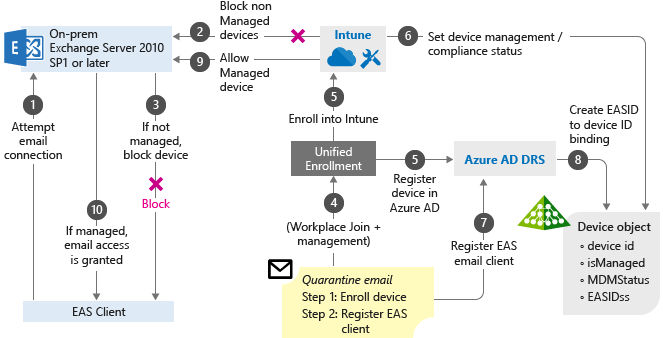
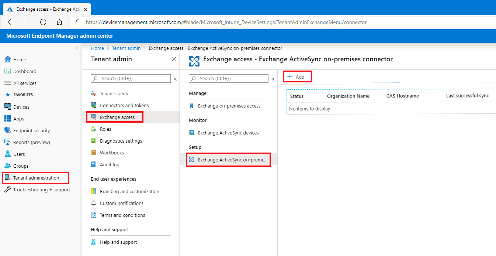
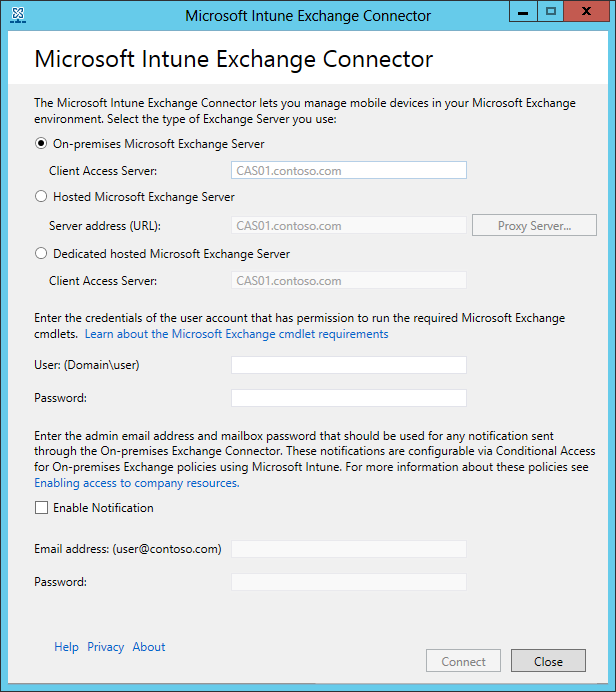
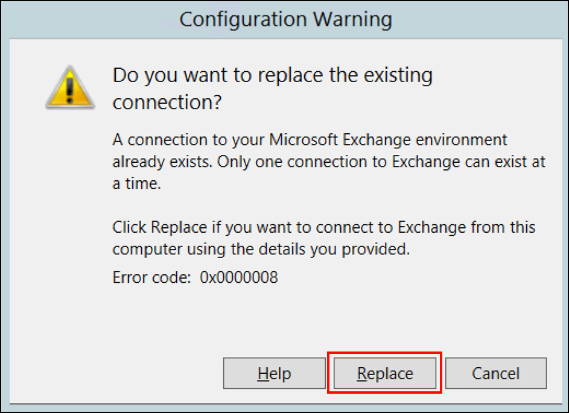
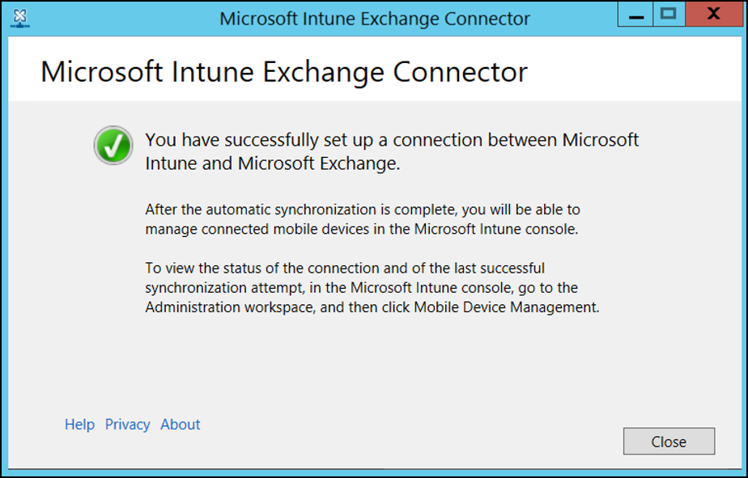
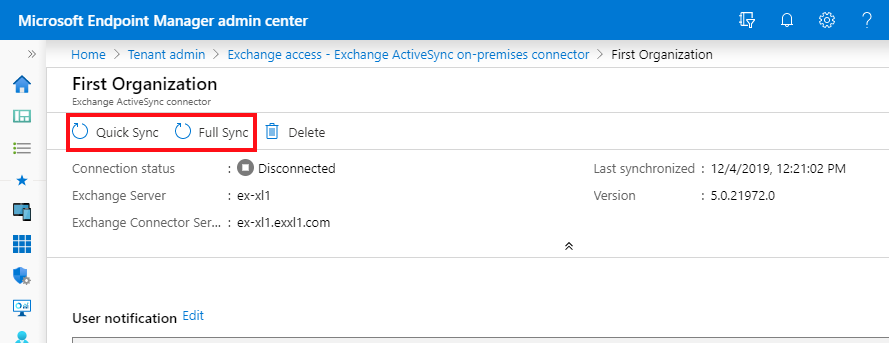

---
# required metadata

title: Set up a Microsoft Intune Exchange connector
titleSuffix: Microsoft Intune
description: Use the on-premises Intune Exchange connector to manage device access to Exchange mailboxes based on Intune enrollment and Exchange ActiveSync (EAS).
keywords:
author: brenduns
ms.author: brenduns
manager: dougeby
ms.date: 04/15/2021

ms.topic: how-to
ms.service: microsoft-intune
ms.subservice: protect
ms.localizationpriority: high
ms.technology:
ms.assetid: a0376ea1-eb13-4f13-84da-7fd92d8cd63c

# optional metadata

#ROBOTS:
#audience:

ms.reviewer: demerson
ms.suite: ems
search.appverid: MET150
#ms.tgt_pltfrm:
ms.custom: intune-azure
ms.collection:
- tier3
- M365-identity-device-management
---

# Set up the on-premises Intune Exchange connector

> [!IMPORTANT]
> The information in this article applies to customers who are supported to use an Exchange Connector.
>
> Beginning in July of 2020, support for the Exchange connector is deprecated, and replaced by Exchange [hybrid modern authentication](/office365/enterprise/hybrid-modern-auth-overview) (HMA).  If you have an Exchange Connector set up in your environment, your Intune tenant remains supported for its use, and you’ll continue to have access to UI that supports its configuration. You can continue to use the connector or configure HMA and then uninstall your connector.
>
>Use of HMA does not require Intune to setup and use the Exchange Connector. With this change, the UI to configure and manage the Exchange Connector for Intune has been removed from the Microsoft Endpoint Manager admin center, unless you already use an Exchange connector with your subscription.

To help protect access to Exchange, Intune relies on an on-premises component that's known as the Microsoft Intune Exchange connector. This connector is also called the *Exchange ActiveSync on-premises connector* in some locations of the Intune console.

> [!IMPORTANT]
> Intune will be removing support for the Exchange On-Premises Connector feature from the Intune service beginning in the 2007 (July) release. Existing customers with an active connector will be able to continue with the current functionality at this time. New customers and existing customers that do not have an active connector will no longer be able to create new connectors or manage Exchange ActiveSync (EAS) devices from Intune. For those tenants, Microsoft recommends the use of Exchange [hybrid modern authentication (HMA)](/office365/enterprise/hybrid-modern-auth-overview) to protect access to Exchange on-premises. HMA enables both Intune App Protection Policies (also known as MAM) and Conditional Access through Outlook Mobile for Exchange on-premises.

The information in this article can help you install and monitor the Intune Exchange connector. You can use the connector with your [conditional access policies](conditional-access-exchange-create.md) to allow or block access to your Exchange on-premises mailboxes.

The connector is installed and runs on your on-premises hardware. It discovers devices that connect to Exchange, communicating device information to the Intune service. The connector allows or blocks devices based on whether the devices are enrolled and compliant. These communications use the HTTPS protocol.

When a device tries to access your on-premises Exchange server, the Exchange connector maps Exchange ActiveSync (EAS) records in Exchange Server to Intune records to make sure the device enrolls with Intune and complies with your device's policies. Depending on your conditional access policies, the device can be allowed or blocked. For more information, see [What are common ways to use conditional access with Intune?](conditional-access-intune-common-ways-use.md)

Both *discovery* and *allow and block* operations are done by using standard Exchange PowerShell cmdlets. These operations use the service account that's provided when the Exchange connector is initially installed.

Intune supports the installation of multiple Intune Exchange connectors per subscription. If you've more than one on-premises Exchange organization, you can set up a separate connector for each. However, only one connector can be installed for each Exchange organization.  

Follow these general steps to set up a connection that enables Intune to communicate with the on-premises Exchange server:

1. Download the on-premises connector from the Microsoft Endpoint Manager admin center.
2. Install and configure the Exchange connector on a computer in the on-premises Exchange organization.
3. Validate the Exchange connection.
4. Repeat these steps for each additional Exchange organization you want to connect to Intune.

## How conditional access for Exchange on-premises works

Conditional access for Exchange on-premises works differently than Azure Conditional Access based policies. You install the Intune Exchange on-premises connector to directly interact with Exchange server. The Intune Exchange connector pulls in all the Exchange Active Sync (EAS) records that exist at the Exchange server so Intune can take these EAS records and map them to Intune device records. These records are devices enrolled and recognized by Intune. This process allows or blocks e-mail access.

If the EAS record is new and Intune isn't aware of it, Intune issues a cmdlet (pronounced "command-let") that directs the Exchange server to block access to e-mail. Following are more details on how this process works:

> [!div class="mx-imgBorder"]
> 

1. User tries to access corporate email, which is hosted on Exchange on-premises 2010 SP1 or later.

2. If the device is not managed by Intune, access to email will be blocked. Intune sends a block notification to the EAS client.

3. EAS receives the block notification, moves the device to quarantine, and sends the quarantine email with remediation steps that contain links so the users can enroll their devices.

4. The Workplace join process happens, which is the first step to have the device managed by Intune.

5. The device gets enrolled into Intune.

6. Intune maps the EAS record to a device record, and saves the device compliance state.

7. The EAS client ID gets registered by the Azure AD Device Registration process, which creates a relationship between the Intune device record, and the EAS client ID.

8. The Azure AD Device Registration saves the device state information.

9. If the user meets the conditional access policies, Intune issues a cmdlet through the Intune Exchange connector that allows the mailbox to sync.

10. Exchange server sends the notification to EAS client so the user can access e-mail.

## Intune Exchange connector requirements

To connect to Exchange, you need an account that has an Intune license that the connector can use. You specify the account when you install the connector.  

The following table lists the requirements for the computer on which you install the Intune Exchange connector.  

|  Requirement  |   More information     |
|---------------|------------------------|
|  Operating systems        | Intune supports the Intune Exchange connector on a computer that runs any edition of Windows Server 2008 SP2 64-bit, Windows Server 2008 R2, Windows Server 2012, Windows Server 2012 R2, or Windows Server 2016.  The connector isn't supported on any Server Core installation.  |
| Microsoft Exchange          | On-premises connectors require Microsoft Exchange 2010 SP3 or later or legacy Exchange Online Dedicated. To determine if your Exchange Online Dedicated environment is in the *new* or *legacy* configuration, contact your account manager. |
| Mobile device management authority           | [Set the mobile device management authority to Intune](../fundamentals/mdm-authority-set.md). |
| Hardware              | The computer on which you install the connector requires a 1.6 GHz CPU with 2 GB of RAM and 10 GB of free disk space. |
|  Active Directory synchronization             | Before you use the connector to connect Intune to your Exchange server, [set up Active Directory synchronization](../fundamentals/users-add.md). Your local users and security groups must be synced with your instance of Azure Active Directory. |
| Additional software         | The computer that hosts the connector must have a full installation of Microsoft .NET Framework 4.5 and Windows PowerShell 2.0. |
| Network               | The computer on which you install the connector must be in a domain that has a trust relationship with the domain that hosts your Exchange server.  Configure the computer to allow it to access the Intune service through firewalls and proxy servers over ports 80 and 443. Intune uses these domains:   - manage.microsoft.com   - \*manage.microsoft.com  - \*.manage.microsoft.com    The Intune Exchange connector communicates with the following services:   - Intune service: HTTPS port 443   - Exchange Client Access server (CAS): WinRM service port 443  - Exchange Autodiscover 443  - Exchange Web Services (EWS) 443  |

### Exchange cmdlet requirements

Create an Active Directory user account for the Intune Exchange connector. The account must have permission to run the following Windows PowerShell Exchange cmdlets:  

- `Get-ActiveSyncOrganizationSettings`, `Set-ActiveSyncOrganizationSettings`
- `Get-CasMailbox`, `Set-CasMailbox`
- `Get-ActiveSyncMailboxPolicy`, `Set-ActiveSyncMailboxPolicy`, `New-ActiveSyncMailboxPolicy`, `Remove-ActiveSyncMailboxPolicy`
- `Get-ActiveSyncDeviceAccessRule`, `Set-ActiveSyncDeviceAccessRule`, `New-ActiveSyncDeviceAccessRule`, `Remove-ActiveSyncDeviceAccessRule`
- `Get-ActiveSyncDeviceStatistics`
- `Get-ActiveSyncDevice`
- `Get-ExchangeServer`
- `Get-ActiveSyncDeviceClass`
- `Get-Recipient`
- `Clear-ActiveSyncDevice`, `Remove-ActiveSyncDevice`
- `Set-ADServerSettings`
- `Get-Command`

## Download the installation package

*Support for new installations of the Exchange connector was deprecated in July of 2020, and the connector installation package is no longer available for download. Instead, use Exchange [hybrid modern authentication](/office365/enterprise/hybrid-modern-auth-overview) (HMA).*

<!-- 
On a Windows server that can support the Intune Exchange connector:

1. Sign in to the [Microsoft Endpoint Manager admin center](https://go.microsoft.com/fwlink/?linkid=2109431).  Use an account that's an administrator in the on-premises Exchange server and that has a license to use Exchange Server.

2. Select **Tenant administration** > **Exchange access**.

3. Under **Setup**, choose **Exchange ActiveSync on-premises connector** and then select **Add**.

   > [!div class="mx-imgBorder"]
   > 

4. On the **Add Connector** page, select **Download the on-premises connector**. The Intune Exchange connector is in a compressed (.zip) folder that can be opened or saved. In the **File Download** dialog box, choose **Save** to store the compressed folder in a secure location.

--> 
## Install and configure the Intune Exchange connector

*Support for new installations of the Exchange connector was deprecated in July of 2020, and the connector installation package is no longer available for download. Instead, use Exchange [hybrid modern authentication](/office365/enterprise/hybrid-modern-auth-overview) (HMA). The following instructions are maintained for the use of [reinstalling the connector](#reinstall-the-intune-exchange-connector).*

Follow these steps to install the Intune Exchange connector. If you have multiple Exchange organizations, repeat the steps for each Exchange connector you want to set up.

1. On a supported operating system for the Intune Exchange connector, extract the files in **Exchange_Connector_Setup.zip** to a secure location.
   > [!IMPORTANT]
   > Don't rename or move the files that are in the *Exchange_Connector_Setup* folder. These changes would cause the connector installation to fail.

2. After the files are extracted, open the extracted folder and double-click **Exchange_Connector_Setup.exe** to install the connector.

   > [!IMPORTANT]
   > If the destination folder isn't a secure location, delete the certificate file *MicrosoftIntune.accountcert* when you finish installing your on-premises connectors.

3. In the **Microsoft Intune Exchange Connector** dialog box, select either **On-premises Microsoft Exchange Server** or **Hosted Microsoft Exchange Server**.

   

   For an on-premises Exchange server, provide either the server name or the fully qualified domain name of the Exchange server that hosts the **Client Access Server** role.

   For a hosted Exchange server, provide the Exchange server address. To find the hosted Exchange server URL:

   1. Open Outlook for Microsoft 365.

   2. Choose the **?** icon in the upper-left corner, and then select **About**.

   3. Locate the **POP External Server** value.

   4. Choose **Proxy Server** to specify proxy server settings for your hosted Exchange server.

       1. Select **Use a proxy server when synchronizing mobile device information**.

       1. Enter the **proxy server name** and the **port number** to be used to access the server.

       1. If user credentials are required to access the proxy server, select **Use credentials to connect to the proxy server**. Then enter the **domain\user** and the **password**.

       1. Choose **OK**.

4. In the **User (domain\user)** and **Password** fields, enter credentials to connect to your Exchange server. The account you specify must have a license to use Intune.

5. Provide credentials to send notifications to a user's Exchange Server mailbox. This user can be dedicated to just notifications. The notifications user needs an Exchange mailbox to send notifications by email. You can configure these notifications by using conditional access policies in Intune.

   Make sure the Autodiscover service and Exchange Web Services are configured on the Exchange CAS. For more information, see [Client Access server](/Exchange/architecture/client-access/client-access?view=exchserver-2019&preserve-view=true).

6. In the **Password** field, provide the password for this account to enable Intune to access the Exchange server.

   > [!NOTE]
   > The account you use to sign in to the tenant needs to be at least an Intune service administrator. Without this administrator account, you'll get a failed connection with the error "The remote server returned an error: (400) Bad Request".

7. Choose **Connect**.

   > [!NOTE]
   > It might take a few minutes to configure the connection.

During configuration, the Exchange connector stores your proxy settings to enable access to the internet. If your proxy settings change, reconfigure the Exchange connector to apply the updated proxy settings to the Exchange connector.

After the Exchange connector sets up the connection, mobile devices that are associated with Exchange-managed users are automatically synchronized and added to the Exchange connector. This synchronization might take some time to complete.

> [!NOTE]
> If you install the Intune Exchange connector and later need to delete the Exchange connection, you must uninstall the connector from the computer where it was installed.
-->

## Install connectors for multiple Exchange organizations

*Support for new installations of the Exchange connector was deprecated in July of 2020. Instead, use Exchange [hybrid modern authentication](/office365/enterprise/hybrid-modern-auth-overview) (HMA). The information in the following sections is provided to support customers who might still use the on-premises Intune Exchange connector.*

<!--
Intune supports multiple Intune Exchange connectors per subscription. For a tenant that has multiple Exchange organizations, you can set up only one connector for each Exchange organization.

To install connectors to connect to multiple Exchange organizations, download the .zip folder one time. Reuse that same download for each connector you install. For each additional connector, follow the steps in the previous section to extract and run the setup program on a server in the Exchange organization.

Each Exchange organization that connects to Intune supports high availability, monitoring, and manual sync. The following sections describe these features.

-->
### On-premises Intune Exchange connector high availability support

For the on-premises connector, high availability means that if the Exchange CAS that the connector uses becomes unavailable, the connector can switch to a different CAS for that Exchange organization. The Exchange connector itself doesn't support high availability. If the connector fails, there's no automatic failover and you must [install a new connector](#reinstall-the-intune-exchange-connector) to replace the failed connector.

To fail over, the connector uses the specified CAS to create a successful connection to Exchange. It then discovers additional CASs for that Exchange organization. This discovery enables the connector to fail over to another CAS if one is available, until the primary CAS becomes available.

By default, discovery of additional CASs is enabled. If you need to turn off failover:

1. On the server where the Exchange connector is installed, go to **%*ProgramData*%\Microsoft\Windows Intune Exchange Connector**.

2. Using a text editor, open **OnPremisesExchangeConnectorServiceConfiguration.xml**.

3. Change **\<IsCasFailoverEnabled>*true*\</IsCasFailoverEnabled>** to **\<IsCasFailoverEnabled>*false*\</IsCasFailoverEnabled>**.

### Performance-tune the Exchange connector (optional)

When Exchange ActiveSync supports 5,000 or more devices, you can configure an optional setting to improve the performance of the connector. You improve performance by enabling Exchange to use multiple instances of a PowerShell command run space.

Before you make this change, ensure the account you use to run the Exchange connector isn't used for other Exchange management purposes. An Exchange account has a limited number of run spaces, and the connector will use most of them.

Performance tuning isn't suitable for connectors that run on older or slower hardware.

To improve the Exchange connector performance:

1. On the server where the connector installed, open the connector's installation directory.  The default location is *C:\ProgramData\Microsoft\Windows Intune Exchange Connector*.

2. Edit the file *OnPremisesExchangeConnectorServiceConfiguration.xml*.

3. Locate **EnableParallelCommandSupport** and set the value to **true**:

   \<EnableParallelCommandSupport>true\</EnableParallelCommandSupport>

4. Save the file, and then restart the Microsoft Intune Exchange connector service.

#### Reinstall the Intune Exchange connector

*Support for new installations of the Exchange connector was deprecated in July of 2020, and the connector installation package is no longer available for download. Instead, use Exchange [hybrid modern authentication](/office365/enterprise/hybrid-modern-auth-overview) (HMA). The following information is provided to support customers who might still use the on-premises Intune Exchange connector.*

You might need to reinstall an Intune Exchange connector. Because only a single connector can connect to each Exchange organization, if you install a second connector for the organization, the new connector you install replaces the original connector.

1. To reinstall the new connector, follow the steps in the [Install and configure the Exchange connector](#install-and-configure-the-intune-exchange-connector) section.

2. When prompted, select **Replace** to install the new connector.
   

3. Continue the steps from the [Install and configure the Intune Exchange connector](#install-and-configure-the-intune-exchange-connector) section, and sign in to Intune again.

4. In the final window, select **Close** to complete the installation.
   

### Monitor an Exchange connector

After you successfully configure the Exchange connector, you can view the status of the connections and the last successful synchronization attempt:

1. Sign in to the [Microsoft Endpoint Manager admin center](https://go.microsoft.com/fwlink/?linkid=2109431).

2. Select **Tenant administration** > **Exchange access**.

3. Select **Exchange ActiveSync on-premises connector**, and then select the connector you want to view.

4. The console displays details for the connector you select, where you can view the **Status** and the date and time of the last successful synchronization.

In addition to the in-console status, you can use the [System Center Operations Manager management pack for Exchange connector and Intune](https://www.microsoft.com/download/details.aspx?id=55990&751be11f-ede8-5a0c-058c-2ee190a24fa6=True&e6b34bbe-475b-1abd-2c51-b5034bcdd6d2=True&fa43d42b-25b5-4a42-fe9b-1634f450f5ee=True). The management pack offers different ways to monitor the Exchange connector when you need to troubleshoot issues.

## Manually force a quick sync or full sync

*Support for new installations of the Exchange connector was deprecated in July of 2020. Instead, use Exchange [hybrid modern authentication](/office365/enterprise/hybrid-modern-auth-overview) (HMA). The information in the following sections is provided to support customers who might still use the on-premises Intune Exchange connector.*

An Intune Exchange connector automatically synchronizes EAS and Intune device records regularly. If the compliance status of a device changes, the automatic sync process regularly updates records so that device access can be blocked or allowed.

- A **quick sync** occurs regularly, several times a day. A quick sync retrieves device information for Intune-licensed and on-premises Exchange users that are targeted for conditional access and that have changed since the last sync.

- A **full sync** occurs once daily by default. A full sync retrieves device information for all Intune-licensed and on-premises Exchange users that are targeted for conditional access. A full sync also retrieves Exchange Server information and ensures that the configuration that Intune specifies is updated on the Exchange server.

You can force a connector to run a sync by using the **Quick Sync** or **Full Sync** options on the Intune dashboard:

   1. Sign in to the [Microsoft Endpoint Manager admin center](https://go.microsoft.com/fwlink/?linkid=2109431).

   2. Select **Tenant administration** > **Exchange access** >  **Exchange ActiveSync on-premises connector**.

   3. Select the connector you want to sync, and then choose Quick Sync or Full Sync.

   > [!div class="mx-imgBorder"]
   > 

## Next steps

Create a [conditional access policy for on-premises Exchange servers](conditional-access-exchange-create.md).