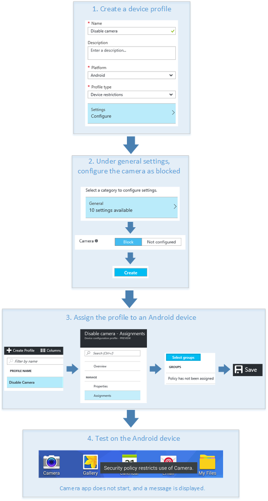

---
# required metadata

title: Use a PIN to sign in to Windows 10 devices using Microsoft Intune - Azure | Microsoft Docs
description: Use Windows Hello for Business to allow users to sign in to devices using a PIN, a fingerprint, and more. Create an identity protection configuration profile in Intune for Windows 10 devices with these settings, and assign the profile to user groups and device groups.
keywords:
author: brenduns
ms.author: brenduns
manager: dougeby
ms.date: 11/18/2019
ms.topic: conceptual
ms.service: microsoft-intune
ms.subservice: protect
ms.localizationpriority: high
ms.technology:

# optional metadata

#ROBOTS:
#audience:
#ms.devlang:
ms.suite: ems
search.appverid: MET150
#ms.tgt_pltfrm:
ms.custom: intune-azure
ms.collection: M365-identity-device-management
---

# Use Windows Hello for Business on Windows 10 devices with Microsoft Intune

Windows Hello for Business is a method for signing in to Windows devices by replacing passwords, smart cards, and virtual smart cards. Intune includes built-in settings so Administrators can configure and use Windows Hello for Business. For example, you can use these settings to:

- Enable Windows Hello for Business for devices and users
- Set device PIN requirements, including a minimum or maximum PIN length
- Allow gestures, such as a fingerprint, that users can (or can't use) to sign in to devices

This feature applies to device running:

- Windows 10 and later
- Windows 10 Mobile
- Windows Holographic for Business

Intune uses "configuration profiles" to create and customize these settings for your organization's needs. After you add these features in a profile, push or deploy these settings to user and device groups in your organization.

This article shows you how to create a device configuration profile. For a list of all the settings, and what they do, see [Windows 10 device settings to enable Windows Hello for Business](identity-protection-windows-settings.md).

## Create the device profile

1. Sign in to the [Microsoft Endpoint Manager Admin Center](https://go.microsoft.com/fwlink/?linkid=2109431).

2. Select **Devices** > **Configuration profiles** > **Create profile**.

3. Enter the following properties:

   - **Name**: Enter a descriptive name for the new profile.
   - **Description**: Enter a description for the profile. This setting is optional, but recommended.
   - **Platform**: Select **Windows 10 and later**. Windows Hello for Business is only supported on devices running Windows 10 and later.
   - **Profile type**: Select **Identity protection**.

4. On the *Windows Hello for Business* pane, configure the following options:

   - **Configure Windows Hello for Business**: Choose how you want to configure Windows Hello for Business:

     - **Not configured** (default): [Provisions Windows Hello for Business](https://docs.microsoft.com/windows/security/identity-protection/hello-for-business/hello-how-it-works-provisioning) on the device. When assigning identity protection profiles to users only, the device context defaults to **Not configured**.

     - **Disabled**: If you don't want to use Windows Hello for Business, select this option. This option disables Windows Hello for Business for all users.

     - **Enabled**: Choose this option to [provision](https://docs.microsoft.com/windows/security/identity-protection/hello-for-business/hello-how-it-works-provisioning), and configure Windows Hello for Business settings in Intune. Enter the settings you want to configure. For a list of all settings, and what they do, see - [Windows 10 device settings to enable Windows Hello for Business](identity-protection-windows-settings.md).

   - **Use security keys for sign-in**: Enable Windows Hello security key as a logon credential for all PCs in the tenant.

     - **Enable**
     - **Not configured**  (default)

5. When you're done, select **OK** > **Create** to save your changes.

The profile is created and appears in the profiles list. Next, [assign](../configuration/device-profile-assign.md) this profile to user and device groups to meet your needs.

> [!IMPORTANT]
> To allow multiple users to be provisioned to a device, specify that the Windows Hello for Business policy be applied to the devices. If the policy is applied only to users, only one user can be provisioned to a device.

<!--  Removing image as part of design review; retaining source until we known the disposition.

## Example of device restriction settings

In this high-level example, you'll create a device restriction policy that blocks the use of the built-in camera app on Android devices.

-->

## Next steps

- See a list of all [the settings, and what they do](identity-protection-windows-settings.md).
- [Assign the profile](../configuration/device-profile-assign.md) and [monitor its status](../configuration/device-profile-monitor.md).
