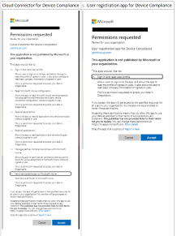
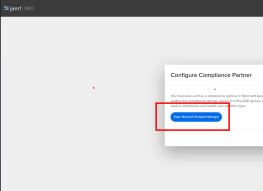
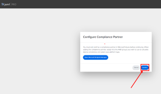
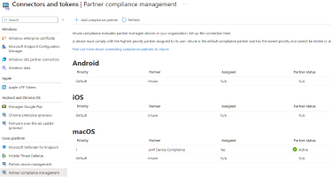

---
# Required metadata
# For more information, see https://review.learn.microsoft.com/en-us/help/platform/learn-editor-add-metadata?branch=main
# For valid values of ms.service, ms.prod, and ms.topic, see https://review.learn.microsoft.com/en-us/help/platform/metadata-taxonomies?branch=main

title:       # Add a title for the browser tab
description: # Add a meaningful description for search results
author:      jeffducasse # GitHub alias
ms.author:   jeffducasse # Microsoft alias
ms.service:  # Add the ms.service or ms.prod value
# ms.prod:   # To use ms.prod, uncomment it and delete ms.service
ms.topic:    # Add the ms.topic value
ms.date:     09/09/2023
---

# Integrating Jamf Pro with Intune to report device compliance to Entra ID

> [!IMPORTANT]
>
> **Jamf macOS device support for Conditional Access is being deprecated**.
>
> Beginning on September 1, 2024, the platform that Jamf Pro’s Conditional Access feature is built on will no longer be supported.
>
> If you use Jamf Pro’s Conditional Access integration for macOS devices, follow Jamf’s documented guidelines to migrate your devices to Device Compliance integration at [***Migrating from macOS Conditional Access to macOS Device Compliance – Jamf Pro Documentation***](https://learn.jamf.com/bundle/jamf-pro-documentation-current/page/Conditional_Access.html#ariaid-title6).
>
> If you need help, contact [***Jamf Customer Success***](https://jamf.service-now.com/csm). For more information, see the blog post at [**https://aka.ms/Intune/Jamf-Device-Compliance**](https://aka.ms/Intune/Jamf-Device-Compliance).

The process to establish integration between Jamf Pro and Intune is evolving.  The reporting of the compliance status of Jamf managed devices is now able to allow the Jamf Pro environment to determine the status of compliance with Jamf managed policies and report the state of device compliance to Entra through a connector in Intune. Once the compliance status for devices managed by Jamf are reported to Entra ID, those devices are able to meet the Zero-Trust principles that Entra conditional access policies establish.  

## Why would this benefit our Jamf Pro managed devices?

Microsoft Entra conditional access policies are able to require devices to not only meet compliance standards, but also register with Entra ID.  Organizations are seeking to continually improve their security posture through the use of Entra conditional access policies to ensure the following example scenarios:

- Devices are registered with Entra ID.
- Devices are using a known trusted location or IP address range.
- Devices are meeting the standards of compliance in order to access corporate resources using M365 desktop applications as well as the browser.

## What is different about this configuration process from Conditional Access method Jamf previously offered?

For organizations that utilize Jamf Pro but have yet established a connection to Intune, the previous method that utilized the configuration in the Jamf Pro portal's **Settings > Global > Conditional Access** path is no longer able to accept new configurations.  New integrations will require configurations under **Settings > Global > Device Compliance** and will provide a wizard-based process to walk you through the connection to Intune.  The wizard will provide a method to create the required Entra ID registered applications.  These registered applications cannot be pre-created in this current design as they were previously.

### This article can help you with the following tasks:

- Configure the required components and configurations in Jamf Pro.
- Configure Jamf Pro to deploy the Intune Company Portal app to devices you manage with Jamf.
- Configure a policy to deploy to users through the Jamf self-service portal app to register devices with Entra ID.  
- Configure the Intune Connector.
- Prepare Entra required components.

The procedures in this article require the following:

- **Jamf Pro Administrator** or a **Jamf Pro user account** with **Device Compliance Priveleges**
- **Intune administrator**
- **Entra Global Administrator**

### Jamf Pro administrative configurations

Jamf Pro configurations will require the following components to be precreated before establishing the connection to Intune.

One **Applicable** computer smart group containing criteria to determine devices that will need access to company resources in the Microsoft tenant.

> **Example:** Under Jamf Pro > Computers > Smart Computer Groups create a new group 
> - Display Name Jamf-Intune Applicable Group.  
> - Criteria - Application Title , Operator = is, Value = CompanyPortal.app

One **Compliance** computer smart group containing criteria that determine if devices are deemed compliant within Jamf and meet your organization's security standards.

> **Example:** Under Jamf Pro > Computer > Smart Computer Groups create another group
> Display Name Jamf-Intune Compliance Group
> *It is suggested to enable* **Send email notification on membership change**.
> Critera 
> - Last Inventory Update, Operator = Less than x days ago, Value = 2
> - **and**   - **CriterApplication Title, Operator = is, Value = CompanyPortal.app
> - **and**   - *File Vault 2*, Operator = is, Value = All Partitions Encrypted

One computer policy that contains:
- **General** - DisplayName - **Ex:** Register with Azure AD(Entra), enabled, a category if so desired.
- **Microsoft Device Compliance**- Enable **Register computers with Azure Active Directory**.
- **Scope** - Target > Jamf-Intune Applicable Group smart group.
- **Self Service**-
    1. Enable **Make the policy available in Self Service**.
    1. Set a display name.
    1. Set a button Name.
    1. Provide a description.
    1. Enable Ensure that users view the description.
    1. Enable optional **Categories** as desired.

- Click **Save**.

1 app under **Mac Apps** Jamf App Catalog for the Microsoft Intune Company Portal deployed to all devices.  *Using the Jamf app catalog version will streamline keeping the application current.*

- Under Computers > Mac Apps > select **+New.**
- Select **Jamf App Catalog**, click **Next**.
- Search for **Microsoft Intune Company Portal**, Select **add** next to the application.
- Set **Target Group** to *All Managed Clients*.
- Set **Distribution Method** to *Install Automatically*.
- Enable **Install supporting configuration profiles**.
- Enable the **Deploy** switch at the top right, click Save.

### Entra AD administrative configurations

The ability for devices to be registered may be blocked if depending on the Conditional Access Policy configurations your organization has in place to secure corporate resources.  The following steps will outline components required to ensure users that will be registering Jamf managed devices in Entra ID are not blocked.

1. Login to https://entra.microsoft.com with an account that is able to create groups and create/edit Conditional Access Policy.
1. Expand Groups > All groups > and click **New Group**.
1. Create a dynamic group with appropriate rules to include applicable users (or static if you prefer) that contains the users that will be registering their Jamf managed devices with Entra ID.  *This will be used to scope the Intune connector in later steps.*
1. Leave the Entra tab open for later configurations.

## Connect Jamf Pro to Intune
Jamf pro will utilize connectors in Intune > Tenant Administration > connectors and tokens. The process is started from the Jamf Pro administrative portal and utilizes a wizard that prompts for next steps.

1. Log into your Jamf Admin portal, example: https://tenantname.jamfcloud.com.
1. Proceed to **Settings > Global > Device Compliance**.
1. Click edit, Enable the Platform macOS(for the purposes of this article).
1. In the **Compliance Group** drop down, select the computer smart group you created for **Compliance**.
1. In the **Applicable Group** drop down, select the computer smart group you created for **Applicable**.
1. Enable the Slider at the top right, and click **Save**.
1. Two Microsoft Authentication prompts will show in success requiring the Microsoft 365 Global Administrator to authenticate.
   - The first authentication prompt will create the Cloud Connector for Device Compliance application in Entra ID.  
   - The second authentication prompt will create the User registration app for Device Compliance.
      
      :::image type="content" lightbox="./media/jamf-managed-device-compliance-with-entra-id/appregreqs-all.png":::

1. A new browser tab will open a Jamf Portal page with a **Configure Compliance Partner** dialog.

1. Click the blue button labeled **Open Microsoft Endpoint Manager**.
1. A new browser tab will open too **https://endpoint.microsoft.com**.
1. Proceed to **Tenant Administration > Connectors and Tokens > Partner Compliance Management**.
1. At the top of the Partner Compliance Management page, Click **Add compliance partner**.
1. In the Create Compliance Partner wizard:
   - Compliance partner drop down, select **Jamf Device Compliance**.
   - Platform drop down, select **macOS**.
   - click **Next**.
   - In **Assignments**, click **Add Groups** and select the Entra ID user group created earlier.
   - Click **Next**, then **Create**.
1. In your browser, open the tab containing the Jamf Portal with the **Configure Compliance Partner** dialog.
1. Click the blue **Confirm** button.

1. Switch to the tab with the Intune Partner compliance management dashboard and click the Refresh icon at the top next to the **Add compliance Partner** option.
1. Verify the macOS Jamf Device Compliance connector shows a Partner Status of **Active**.

### Final steps in the administrative configuration

To ensure users are able to enroll devices, knowledge of the Entra ID Conditional Access Policies that may block them is required.  The **User Registration app for Device Compliance** app created in the preceding steps must be added as an exclusion that would prevent user from registering their devices.  
**Ex:** A Conditional Access Policy that

- Is assigned to all user or that includes users that have Jamf Managed devices.
- Target Resources are all cloud apps.
- with 2 conditions.  1 that requires compliance and 1 that requires a registerd device.

For the example above, the **Target Resources** exclusions should be updated with the **User Registration app for Device Compliance** app.

## End User Notifications

Ample notification of the end user experience is suggested to ensure Jamf managed device users are aware of the process, how it works, and a timeline in which they need to comply.  An important reminder that should be included in these notifications is that the Jamf Self-Service app will contain the policy that whey will use to register their device.  They **must** **not** use the deployed Microsoft Company Portal App to attempt to register.  As stated earlier, this will result in an error indicating *AccountNotOnboarded*.

Devices managed in the Jamf platform will not show in Intunes device list in the following process.  Once users have registered their devices in Entra ID the initial state of the device will show as **Not Compliant**.  Once the Jamf Pro computer smart group configured for **Compliance**, is updated the status is sent to through the Intune Connector to Entra ID and updates the devices compliance status.  The frequency of updates to the Entra ID device information is based on the Compliance computer smart group in Jamf frequency of change.

## Troubleshooting

During the testing of the above process, one of the macOS devices experienced an issue during authentication while registering using the Jamf deployed registration policy with Entra AD.

#### What happened?
1. The computer record is created in Azure AD as a shell record (with a bunch of blank attributes) when the user signs in. This occurs during the Intune registration policy that is initiated from Self Service.

#### What can we do?
1. Did JamfAAD run successfully?
This can be verified on the affected device in the macOS terminal application by running: /usr/local/jamf/bin/jamfaad gatherAADInfo
· If the command does not result in a prompt, but instead returns AAD ID acquired for macOS user $USER, then the registration was good.
*This was the resolution for this particular issue* **->** If **the command creates a sign in prompt, and the user is able to complete the sign in without error**, there may have been a user error during the initial registration attempt.
· If the command creates a sign in prompt but there is an error when the user signs in, further troubleshooting is required.
· Also, it is worth checking the contents of the PLIST here: ~/Library/Preferences/com.jamf.management.jamfAAD.plist

