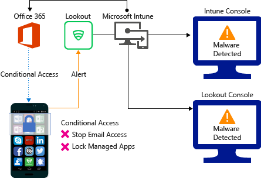
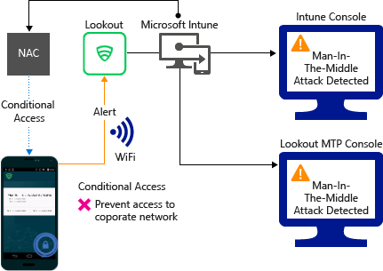
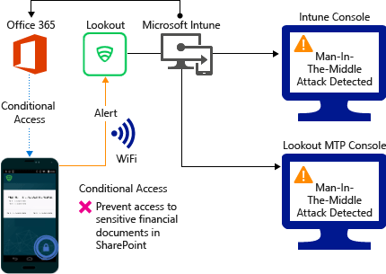
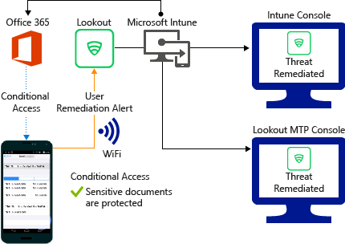

---
# required metadata

title: Lookout MTD connector with Microsoft Intune
titleSuffix: Microsoft Intune
description: Learn about integrating Intune with Lookout Mobile Threat Defense (MTD) to control mobile device access to your corporate resources.
keywords:
author: brenduns
ms.author: brenduns
manager: dougeby
ms.date: 02/21/2020
ms.topic: conceptual
ms.service: microsoft-intune
ms.subservice: protect
ms.localizationpriority: high
ms.technology:
ms.assetid: 3a730a5d-2a90-42b0-aa28-aadfc7a18788

# optional metadata

#ROBOTS:
#audience:

ms.reviewer: davera
ms.suite: ems
search.appverid: MET150
#ms.tgt_pltfrm:
ms.custom: intune-azure
ms.collection: M365-identity-device-management
---

# Lookout Mobile Endpoint Security connector with Intune

You can control mobile device access to corporate resources based on risk assessment conducted by Lookout, a Mobile Threat Defense solution integrated with Microsoft Intune. Risk is assessed based on telemetry collected from devices by the Lookout service including:
- Operating system vulnerabilities
- Malicious apps installed
- Malicious network profiles

You can configure Conditional Access policies based on Lookout's risk assessment enabled through Intune compliance policies for enrolled devices, which you can use to allow or block noncompliant devices to access corporate resources based on detected threats. For unenrolled devices, you can use app protection policies to enforce a block or selective wipe based on detected threats.

## How do Intune and Lookout Mobile Endpoint Security help protect company resources?
Lookout’s mobile app, **Lookout for work**, is installed and run on mobile devices. This app captures file system, network stack, and device and application telemetry where available, then sends it to the Lookout cloud service to assess the device's risk for mobile threats. You can change risk level classifications for threats in the Lookout console to suit your requirements.  

The compliance policy in Intune includes a rule for Lookout Mobile Threat Defense based on Lookout risk assessment. When this rule is enabled, Intune evaluates device compliance with the policy that you enabled.

If the device is found noncompliant, access to resources like Exchange Online and SharePoint Online can be blocked. Users on blocked devices receive steps to resolve the issue and regain access. Guidance is launched from the Lookout for work app.

## Supported platforms  
The following platforms are supported for Lookout when enrolled in Intune:
* **Android 4.1 and later**  
* **iOS 8 and later**  

For additional information about platform and language support, visit the [Lookout website](https://personal.support.lookout.com/hc/articles/114094140253).  

## Prerequisites
* Lookout Mobile Endpoint Security enterprise subscription  
* Microsoft Intune subscription
* Azure Active Directory Premium
* Enterprise Mobility and Security (EMS) E3 or E5, with licenses assigned to users.  

For more information, see [Lookout Mobile Endpoint Security](https://www.lookout.com/products/mobile-endpoint-security)

## Sample scenarios

Here are the common scenarios when using Mobile Endpoint Security with Intune.

### Control access based on threats from malicious apps
When malicious apps such as malware are detected on devices, you can block devices from the following until the threat is resolved:
* Connecting to corporate e-mail
* Syncing corporate files with the OneDrive for Work app
* Accessing company apps

**Block when malicious apps are detected:**

**Access granted on remediation:**

### Control access based on threat to network
Detect threats to your network such as man-in-the-middle attacks and protect access to WiFi networks based on the device risk.

**Block network access through WiFi:**

**Access granted on remediation:**

### Control access to SharePoint Online based on threat to network

Detect threats to your network such as Man-in-the-middle attacks, and prevent synchronization of corporate files based on the device risk.

**Block SharePoint Online when network threats are detected:**

**Access granted on remediation:**

## Next steps
Here are the main steps you must do to implement this solution:
- [Set up your Lookout integration](lookout-mtd-connector-integration.md)
- [Enable Mobile Endpoint Security in Intune](mtd-connector-enable.md)
- [Add and assign the Lookout for Work app](mtd-apps-ios-app-configuration-policy-add-assign.md)
- [Configure Lookout device compliance policy](mtd-device-compliance-policy-create.md)
- [Create an MTD app protection policy](mtd-app-protection-policy.md)

