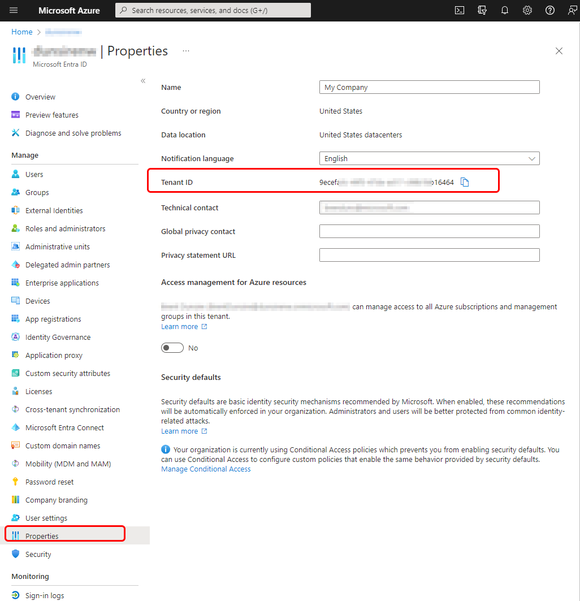
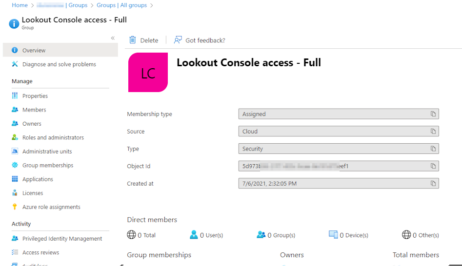

---
# required metadata

title: Setup Lookout Mobile Endpoint Security with Microsoft Intune
titleSuffix: Microsoft Intune
description: Learn about integrating Intune with Lookout Mobile Endpoint Security, as a Mobile Threat Defense solution, to control mobile device access to your corporate resources.
keywords:
author: brenduns
ms.author: brenduns
manager: dougeby
ms.date: 06/11/2019
ms.topic: how-to
ms.service: microsoft-intune
ms.subservice: protect
ms.localizationpriority: high
ms.technology:
ms.assetid: 5b0d7644-3183-45ba-a165-0d82d70cb71e

# optional metadata

#ROBOTS:
#audience:

ms.reviewer: aanavath
ms.suite: ems
search.appverid: MET150
#ms.tgt_pltfrm:
ms.custom: intune-azure
ms.collection:
- tier3
- M365-identity-device-management
---

# Set up Lookout Mobile Endpoint Security integration with Intune

With an environment that meets the [prerequisites](lookout-mobile-threat-defense-connector.md#prerequisites), you can integrate Lookout Mobile Endpoint Security with Intune. The information in this article will guide you in setting up integration and configuring important settings in Lookout for use with Intune.  

> [!IMPORTANT]
> An existing Lookout Mobile Endpoint Security tenant that is not already associated with your Azure AD tenant cannot be used for the integration with Azure AD and Intune. Contact Lookout support to create a new Lookout Mobile Endpoint Security tenant. Use the new tenant to onboard your Azure AD users.

## Collect Azure AD information  
To integrated Lookout with Intune, you associate your Lookout Mobility Endpoint Security tenant with your Azure Active Directory (AD) subscription.

To enable your Lookout Mobile Endpoint Security subscription integration with Intune, you provide the following information to Lookout support (enterprisesupport@lookout.com):  

- **Azure AD tenant Directory ID**  

- **Azure AD group Object ID** for the group with **full** Lookout Mobile Endpoint Security (MES) Console access.  
  You create this user group in Azure AD to contain the users that have *full access* to sign in to the **Lookout console**. Users must be members of this group, or the optional *restricted access* group, to sign in to the Lookout Console. 

- **Azure AD group Object ID** for the group with **restricted** Lookout MES Console access *(optional group)*. 
  You create this optional user group in Azure AD to contain users that shouldn't have access to several configuration and enrollment-related modules of the Lookout console. Instead, these users have read-only access to the **Security Policy** module of the Lookout console. Users must be members of this optional group, or the required *full access* group, to sign in to the Lookout Console.

 > [!TIP] 
 > For more details on the permissions, read [this article](https://personal.support.lookout.com/hc/articles/114094105653) on the Lookout website.

### Collect information from Azure AD 

1. Sign in to the [Azure portal](https://portal.azure.com) with a Global Administrator account.

2. Go to **Azure Active Directory** > **Properties** and locate your **Directory ID**. Use the *Copy* button to copy the Directory ID, and then save it in a text file.

     

3. Next, find the Azure AD Group ID for the accounts you use to grant Azure AD users access to the Lookout Console. One group is for *full access*, and the second group, for *restricted access* is optional. To get the *Object ID*, for each account:  
   1. Go to **Azure Active Directory** > **Groups** to open the *Groups - All groups* pane.  

   2. Select the group you created for *full access* to open its *Overview* pane.  

   3. Use the *Copy* button to copy the Object ID, and then save it in a text file.  

   4. Repeat the process for the *restricted access* group if you use that group.  

        

   After you gather this information, contact Lookout support (email: enterprisesupport@lookout.com). Lookout Support will work with your primary contact to onboard your subscription and create your Lookout Enterprise account, using the information that you provide.  

## Configure your Lookout subscription  

The following steps are to be completed in the Lookout Enterprise admin console and will enable a connection to Lookout's service for Intune enrolled devices (via device compliance) **and** unenrolled devices (via app protection policies).

After Lookout support creates your Lookout Enterprise account, Lookout support sends an email to the primary contact for your company with a link to the sign-in url: https://aad.lookout.com/les?action=consent. 

### Initial sign-in  
The first sign-in to the Lookout MES Console displays a consent page (https://aad.lookout.com/les?action=consent). An Azure AD Global Administrator just sign-in and **Accept**. Subsequent sign-in doesn't require the user to have this level of Azure AD privilege. 

 A consent page is displayed. Choose **Accept** to complete the registration. 
   

When you accept and consent, you're redirected to the Lookout Console.

After the initial sign-in and consent is complete, users that sign in from https://aad.lookout.com are redirected to the MES Console. If consent wasn't yet granted, all sign-in attempts result in a Bad Login Error.

### Configure the Intune Connector  
The following procedure assumes you've previously created a user group in Azure AD for testing your Lookout deployment. The best practice is to start with a small group of users to allow your Lookout and Intune admins to become familiar with the product integrations. After they're familiar, you can extend the enrollment to additional groups of users.

1. Sign in to the [Lookout MES Console](https://aad.lookout.com) and go to **System** > **Connectors**, and then select  **Add Connector**.  Select **Intune**.

   

2. On the *Microsoft Intune* pane, select **Connection Settings** and specify the **Heartbeat Frequency** in minutes. 

   

3. Select **Enrollment Management**, and for **Use the following Azure AD security groups to identify devices that should be enrolled in Lookout for Work**, specify the *Group name* of an Azure AD group to use with Lookout, and then select **Save changes**.

      

   **About the groups you use**:
   - As a best practice, start with an Azure AD security group that contains a small number of users to test Lookout integration.
   - The  **Group name** is case-sensitive as shown in the **Properties** of the security group in the Azure portal.  
   - The groups you specify for **Enrollment Management** define the set of users whose devices will be enrolled with Lookout. When a user is in an enrollment group, their devices in Azure AD are enrolled and eligible for activation in Lookout MES. The first time a user opens the *Lookout for Work* application on a supported device, they're prompted to activate it.

4. Select **State Sync** and ensure both *device status* and *threat status* are set to **On**.  Both are required for the Lookout Intune integration to work correctly.  

5. Select **Error Management**, specify the email address that should receive the error reports, and then select **Save changes**.
 
   

6. Select **Create connector** to complete configuration of the connector. Later, when you're satisfied with your results, you can extend enrollment to additional user groups.

## Configure Intune to use Lookout as a Mobile Threat Defense provider
After you configure Lookout MES, you must set up a connection to [Lookout in Intune](mtd-connector-enable.md).  

## Additional settings in the Lookout MES Console
The following are additional settings you can configure in the Lookout MES Console.  

### Configure Enrollment settings
In the Lookout MES Console, select **System** > **Manage Enrollment** > **Enrollment settings**.  

- For **Disconnected Status**, specify the number of days before an unconnected device is marked as disconnected.  

  Disconnected devices are considered as noncompliant and will be blocked from accessing your company applications based on the Intune conditional access policies. You can specify values between 1 and 90 days.

  

### Configure Email Notifications
To receive email alerts for threats, sign in to the [Lookout MES Console](https://aad.lookout.com) with the user account that should receive notifications.  

- Go to **Preferences** and then set the notifications you want to receive to **ON**, and then **Save** the changes.  

- If you no longer want to receive email notifications, set the notifications to **OFF** and save your changes.

  

## Configure threat classifications  
Lookout Mobile Endpoint Security  classifies mobile threats of various types. The Lookout threat classifications have default risk levels associated with them. The risk levels can be changed at any time to suit your company requirements.

For information about the threat level classifications, and how to manage the risk levels associated with them, see [Lookout Threat Reference](https://enterprise.support.lookout.com/hc/articles/360011812974).

>[!IMPORTANT]
> Risk levels are an important aspect of Mobile Endpoint Security because the Intune integration calculates device compliance according to these risk levels at runtime.  
> 
> The Intune administrator sets a rule in policy to identify a device as noncompliant if the device has an active threat with a minimum level of **High**, **Medium**, or **Low**. The threat classification policy in Lookout Mobile Endpoint Security directly drives the device compliance calculation in Intune.  

## Monitor enrollment
After setup is complete, Lookout Mobile Endpoint Security starts to poll Azure AD for devices that correspond to the specified enrollment groups.  You can find information about enrolled devices by going to **Devices** in the Lookout MES Console.  
- Initial status for devices is *pending*.  
- The device status updates after the *Lookout for Work* app is installed, opened, and activated on the device.

For details on how to get the *Lookout for Work* app deployed to a device, see [Add Lookout for work apps with Intune](mtd-apps-ios-app-configuration-policy-add-assign.md).

## Next steps

- [Set up Lookout apps for enrolled devices](mtd-apps-ios-app-configuration-policy-add-assign.md)
- [Set up Lookout apps for unenrolled devices](mtd-add-apps-unenrolled-devices.md)
