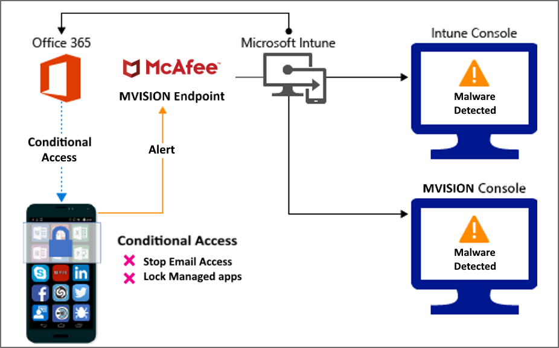
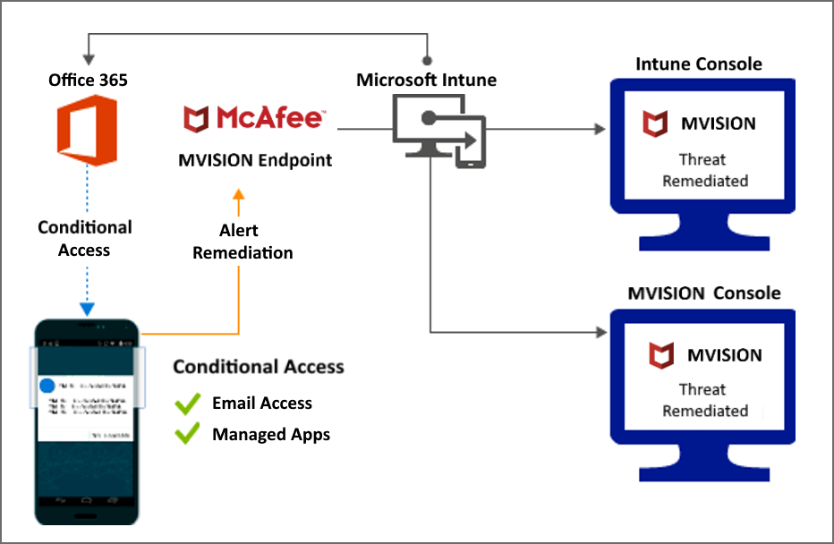
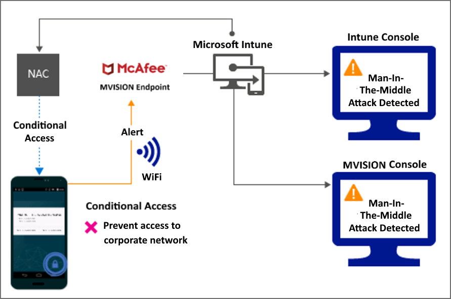
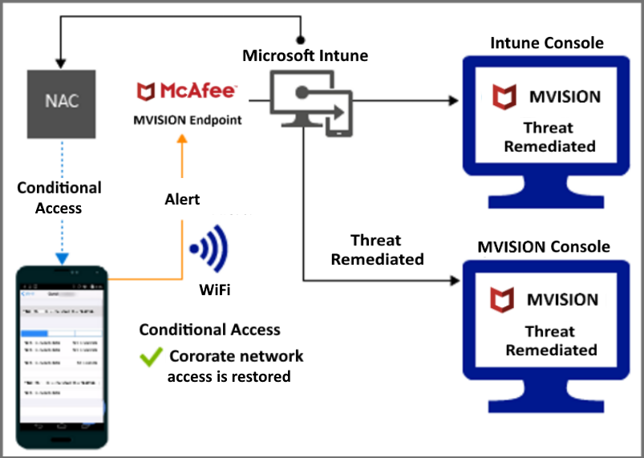
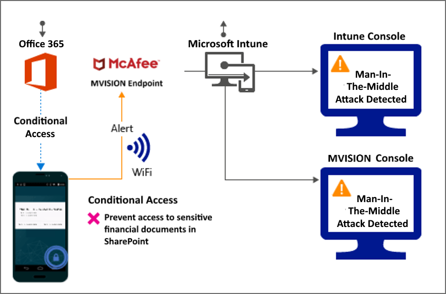
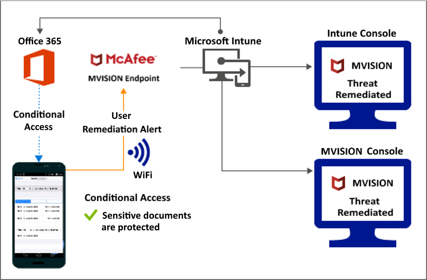
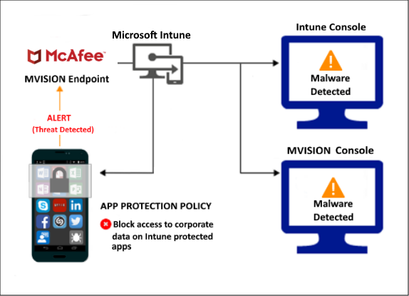
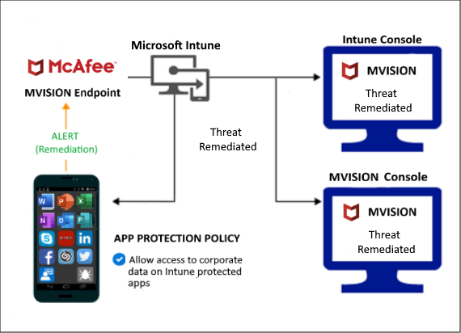

---
# required metadata

title: McAfee MVISION Mobile connector with Intune
titleSuffix: Intune on Azure
description: Learn about integrating Intune with McAfee MVISION Mobile to control mobile device access to your corporate resources.
keywords:
author: brenduns
ms.author: brenduns
manager: dougeby
ms.date: 01/29/2021
ms.topic: how-to
ms.service: microsoft-intune
ms.subservice: protect
ms.localizationpriority: high
ms.technology:
ms.assetid: 975d8d84-792a-41ad-925a-4a7f1ae4dcaf

# optional metadata

#ROBOTS:
#audience:
#ms.devlang:
ms.reviewer: aanavath
ms.suite: ems
search.appverid: MET150
#ms.tgt-pltfrm:
ms.custom: intune-azure
ms.collection: M365-identity-device-management
---

# Use MVISION Mobile with Intune

You can control mobile device access to corporate resources using Conditional Access based on risk assessment conducted by McAfee MVISION Mobile, a Mobile Threat Defense (MTD) solution that integrates with Microsoft Intune. Risk is assessed based on telemetry collected from devices running the MVISION Mobile app.

You can configure Conditional Access policies based on MVISION Mobile risk assessment enabled through Intune device compliance policies for enrolled devices, which you can use to allow or block noncompliant devices to access corporate resources based on detected threats. For unenrolled devices, you can use app protection policies to enforce a block or selective wipe based on detected threats.

## Supported platforms

- **Android 8.0 and later**

- **iOS 9 and later**

## Prerequisites

- Azure Active Directory Premium

- Microsoft Intune subscription

- MVISION Mobile subscription

For more information, see the documentation for McAfee MVISION Mobile.

## How do Intune and MVISION help protect your company resources?

The MVISION Mobile app for Android and iOS/iPadOS captures file system, network stack, device, and application telemetry where available, then sends the telemetry data to the MVISION Mobile cloud service to assess the device's risk for mobile threats.

- **Support for enrolled devices** - Intune device compliance policy includes a rule for Mobile Threat Defense (MTD), which can use risk assessment information from MVISION Mobile. When the MTD rule is enabled, Intune evaluates device compliance with the policy that you enabled. If the device is found noncompliant, users are blocked access to corporate resources like Exchange Online and SharePoint Online. Users also receive guidance from the MVISION Mobile app installed in their devices to resolve the issue and regain access to corporate resources. To support using MVISION Mobile with enrolled devices:
  - [Add MTD apps to devices](../protect/mtd-apps-ios-app-configuration-policy-add-assign.md)
  - [Create a device compliance policy that supports MTD](../protect/mtd-device-compliance-policy-create.md)
  - [Enable the MTD connector in Intune](../protect/mtd-connector-enable.md)

- **Support for unenrolled devices** - Intune can use the risk assessment data from the MVISION Mobile app on unenrolled devices when you use Intune app protection policies. Admins can use this combination to help protect corporate data within a Microsoft Intune protected app, Admins can also issue a block or selective wipe for corporate data on those unenrolled devices. To support using MVISION Mobile with unenrolled devices:

  - [Add the MTD app to unenrolled devices](../protect/mtd-add-apps-unenrolled-devices.md)
  - [Create a Mobile Threat Defense app protection policy](../protect/mtd-app-protection-policy.md)
  - [Enable the MTD connector in Intune for unenrolled devices](../protect/mtd-enable-unenrolled-devices.md)
  
## Sample scenarios

See below a few scenarios when integrating MVISION Mobile with Intune:

### Control access based on threats from malicious apps

When malicious apps such as malware are detected on devices, you can block devices until the threat is resolved:

- Connecting to corporate e-mail

- Syncing corporate files with the OneDrive for Work app

- Accessing company apps

*Block when malicious apps are detected:*

> [!div class="mx-imgBorder"]
> 

*Access granted on remediation:*

> [!div class="mx-imgBorder"]
> 

### Control access based on threat to network

Detect threats like **Man-in-the-middle** in network, and protect access to Wi-Fi networks based on the device risk.

*Block network access through Wi-Fi:*

> [!div class="mx-imgBorder"]
> 

*Access granted on remediation:*

> [!div class="mx-imgBorder"]
> 

### Control access to SharePoint Online based on threat to network

Detect threats like **Man-in-the-middle** in network, and prevent synchronization of corporate files based on the device risk.

*Block SharePoint Online when network threats are detected:*

> [!div class="mx-imgBorder"]
> 

*Access granted on remediation:*

> [!div class="mx-imgBorder"]
> 

### Control access on unenrolled devices based on threats from malicious apps

When the MVISION Mobile mobile threat defense solution considers a device to be infected:

> [!div class="mx-imgBorder"]
> 

Access is granted on remediation:

> [!div class="mx-imgBorder"]
> 

## Next steps

- [Integrate MVISION Mobile with Intune](mcafee-mtd-connector-integration.md)

- [Set up MVISION Mobile apps](mtd-apps-ios-app-configuration-policy-add-assign.md)

- [Create MVISION Mobile device compliance policy](mtd-device-compliance-policy-create.md)

- [Enable MVISION Mobile MTD connector](mtd-connector-enable.md)

- [Create an MTD app protection policy](../protect/mtd-app-protection-policy.md)
