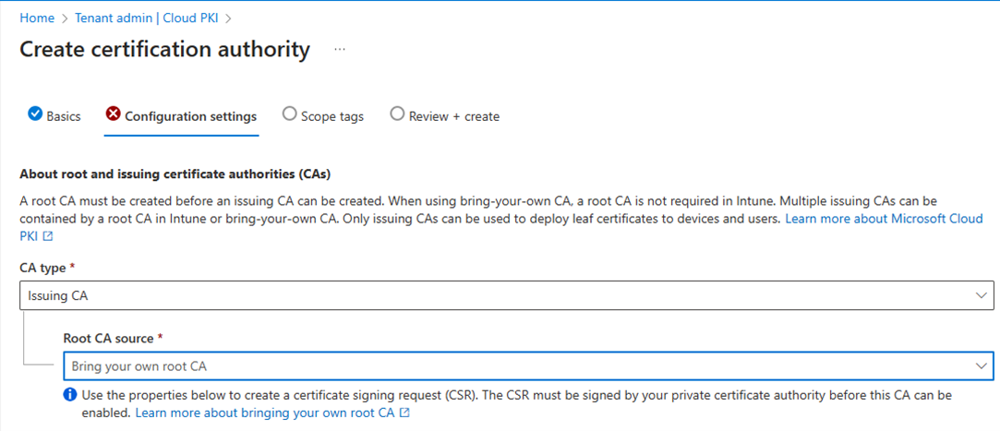
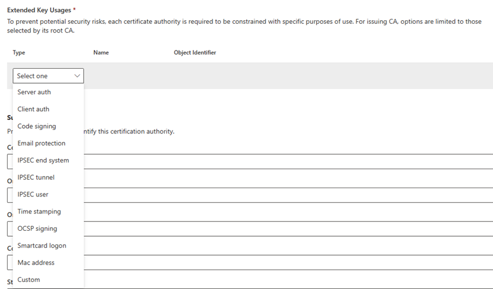
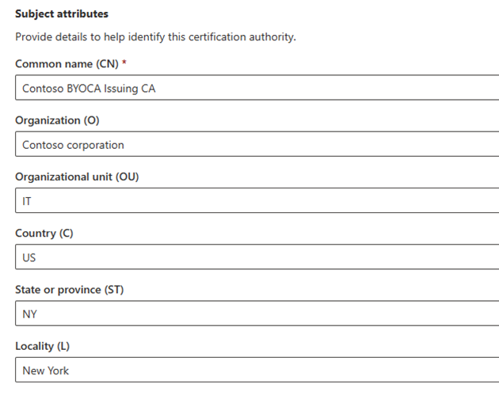
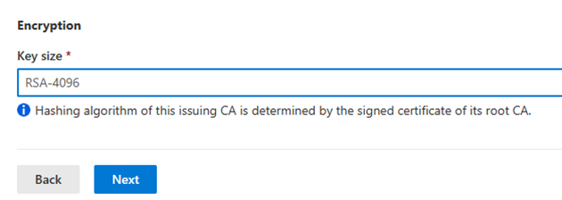
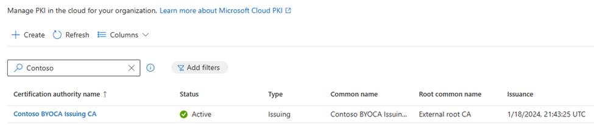

# Configure Microsoft Cloud PKI - Bring your own CA

This article describes how to configure Microsoft Cloud PKI for Intune with your own certification authority (CA). The Intune-supported *bring your own CA (BYOCA)* deployment model lets you create and anchor a private issuing CA in the cloud to your on-premises or private CA. The private CA can be made up of N+1 CA hierarchies.  

<!-- diagram needs to be redesigned > [!div class="mx-imgBorder"]
> ![Diagram of Cloud PKI, BYOCA workflow in Intune.] > -->  

## Prerequisites

For more information about how to prepare your tenant for Microsoft Cloud PKI, including key concepts and requirements, see:

- [Overview of Microsoft Cloud PKI for Intune](microsoft-cloud-pki-overview.md): Review the architecture, tenant requirements, a feature summary, and known issues and limitations.  

- [Deployment models](microsoft-cloud-pki-deployment.md): Review the Microsoft Cloud PKI deployment options.  

- [Fundamentals](microsoft-cloud-pki-fundamentals.md): Review the PKI fundamentals and concepts that are important to know prior to configuration and deployment.  

## Role based access control

The account you use to sign into the Microsoft Intune admin center must have permission to create a certification authority (CA). The Microsoft Entra Intune Administrator (also known as Intune service administrator) account has the appropriate built-in permissions to create CAs. Alternatively, you can assign Cloud PKI CA permissions to an admin user. For more information, see [Role-based access control (RBAC) with Microsoft Intune](../fundamentals/role-based-access-control.md). 

## Step 1: Create issuing CA and certificate signing request

Create an issuing CA in the Microsoft Intune admin center.

1. Go to **Tenant administration** > **Cloud PKI**, and then select **Create**.  

   > [!div class="mx-imgBorder"]
   > 

1. For **Basics**, enter the following properties:

   - **Name**: Enter a descriptive name for the CA object. Name it so you can easily identify it later. Example: *Contoso BYOCA issuing CA*
   - **Description**: Enter a description for the CA object. This setting is optional, but recommended. Example: *Cloud PKI issuing CA using bring-your-own-root-CA anchored to an on-premises ADCS issuing CA*

1. Select **Next** to continue to **Configuration settings**.
1. Select the CA type and root CA source.

   > [!div class="mx-imgBorder"]
   >   

   Configure the following settings for the issuing CA:  
   - **CA type**: Select **Issuing CA**.
   - **Root CA source**: Select **Bring your own root CA**. This setting specifies the root CA source anchoring the issuing CA.
1. Skip **Validity period**. This setting isn't available to configure. The CA you're using to sign the BYOCA certificate signing request determines the validity period.  
1. For **Extended Key Usages**, select how you intend to use the CA.  

   > [!div class="mx-imgBorder"]
   > 

   To prevent potential security risks, CAs are limited to select use. Your options:

   - **Type**: Select the purpose of the CA. The **Any Purpose (2.5.29.37.0)** extended key usage isn't for use, because it's overly permissive and a potential security risk. For more information, see [Edit overly permissive certificates template with privileged EKU](/defender-for-identity/security-assessment-edit-overly-permissive-template#what-is-an-overly-permissive-certificate-template-with-privileged-eku).
   - Alternatively, to create a custom extended key usage, enter the **Name** and **Object Identifier**.  

1. Under **Subject attributes**, enter a **Common name (CN)** for the issuing CA.  

   > [!div class="mx-imgBorder"]
   > 

   Optional attributes include:
   - Organization (O)  
   - Organizational unit (OU)
   - Country (C)  
   - State/province (ST)
   - Locality (L)  

   To adhere to PKI standards, Intune enforces a two-character limit for country/region.

1. Under **Encryption**, enter the **Key size**.

   > [!div class="mx-imgBorder"]
   >   

   Your options:  
     - **RSA-2048**  

     - **RSA-3072**

     - **RSA-4096**

     This setting enforces the upper bound key size that can be used when configuring a device configuration SCEP certificate profile in Intune. It enables you to select any key size up to what is set on the Cloud PKI issuing CA. Keep in mind a 1024 key size and SHA-1 hash isn't supported with Cloud PKI. However, you don't need to provide the hashing algorithm. The CA you're using to sign the CSR determines the hashing algorithm.

1. Select **Next** to continue to **Scope tags**.
1. Optionally, you can add scope tags to control visibility and access to this CA.
1. Select **Next** to continue to **Review + create**.
1. Review the summary provided. When you're ready to finalize everything, select **Create**.  

   >[!IMPORTANT]
   > You won't be able to edit these properties after you create the CA. Select **Back** to edit the settings and ensure they're correct and satisfy your PKI requirements. If later you need to add an EKU, you must create a new CA.  

1. Return to the Microsoft Cloud PKI CA list in the admin center. Select **Refresh** to see your new CA.  
1. Select the CA.  Under **Basics**, the status should read *Signing required*.
1. Go to **Properties**.
1. Select **Download CSR**. Wait while Intune downloads a REQ-formatted file with the name of the CA. For example: *Contoso BYOCA Issuing CA.req*

## Step 2: Sign certificate signing request

A private CA is required to sign the certificate signing request (CSR) file you downloaded. The signing CA can be a root or issuing CA from any tier of the private CA. There are two ways to sign:  

- Option 1: Use Certification Authority Web Enrollment, a feature of Active Directory Certificate Services (ADCS). This option provides a simple web interface that enables you to perform admin-specific tasks such as request and renew certificates.  

- Option 2: Use the Windows ADCS command line tool `certreq.exe` executable file.  

The following table lists the object identifiers (OID) supported for signing certificates used in BYOCA deployments.        

| Subject name property | Object identifier |
| --- | --- |
| Common name (CN) |  OID.2.5.4.3 |
| Organization (O) |  OID.2.5.4.10 |
| Organizational Unit (OU) |  OID.2.5.4.11 |
| Locality (L) |  OID.2.5.4.7 |
| State (ST) or Province |  OID.2.5.4.8 |
| Country (C) |  OID.2.5.4.6 |
| Title (T) |  OID.2.5.4.12 |
| Serial Number | OID.2.5.4.5 |
| Email (E) | OID.1.2.840.113549.1.9.1 |
| Domain Component (DC) | OID.0.9.2342.19200300.100.1.25 |
| Street | OID.2.5.4.9 |
| Given name | OID.2.5.4.42 |
| Initials | OID.2.5.4.43 |
| Postal Code | OID.2.5.4.17 |
| Distinguished Name Qualifier | OID.2.5.4.46 |

For more information about certificate signing, see the help documentation provided by your CA.  

### Option 1: Certification authority web enrollment

To complete these steps, use notepad.exe on a Windows device, or equivalent program on macOS.  

1. Open the REQ file you downloaded after you created the issuing CA. Copy (CTRL + C) the contents of the file.  

1. Open a browser on a device that has access to the web host running CA Web Enrollment. For example: `https://WebSrv_running_CAWebEnrollment/certsrv`  
1. Select **Request a certificate**.  
1. Select **advanced certificate request**.  
1. Paste the content you copied earlier in the **Saved Request** area.  
1. For **Certificate Template**, select **Subordinate Certification Authority**.  

   >[!NOTE]
   > The subordinate CA template must be published and available on the CA that's signing the certificate. Open **certsrv.msc – Certificate Authority management console** on your device to view available certificate templates.  

1. Select **Submit** to continue.  
1. Under **Certificate Issued**, choose **DER encoded** or **Base 4 encoded**. Cloud PKI supports both file formats. Then complete these steps:  
     1. Select **Download certificate**. The certificate file is downloaded and saved as *certnew.cer*.

     2. Select **Download certificate chain**. The signed certificate is downloaded, including the full certificate chain, root CA, and any intermediate or issuing CA certificates in the private CA hierarchy. The file saves as *certnew.p7b*.

   Intune requires both of these files to enable the issuing CA for Cloud PKI BYOCA.  

1. Continue to [Upload signed certificate to enable BYOCA issuing CA](#step-3-upload-signed-certificate-to-enable-byoca-issuing-ca) in this article.  

> [!NOTE]
> If you use the admin center and CA Web enrollment console from 2 different workstations, you will need to copy or have access to the 2 certification files from the admin center workstation.

### Option 2: Windows ADCS command line tool

Use the *certreq.exe* command-line tool to submit a certificate request to a CA, in which you can specify the certificate template and signing CA. The REQ file you previously downloaded must be on the Windows machine where you're running the command line tool.  

You can use the following syntax in the command line to submit a certificate request with your selected template and signing CA:  

`certreq -submit -attrib "CertificateTemplate:<template_name>" -config "<CA_server_name>\<CA_name>" <request_file> <response_file>`

Replace the variables in the command as follows:

1. Replace **<template_name>** with the name of the certificate template you want to use.  

1. Replace **<CA_server_name>\<CA_name>** with the name of the CA server and the name of the CA, respectively, that you want to use for signing the certificate request.  

No action is needed for **<request_file>** and **<response_file>**. They'll be replaced with the name of the file that contains the certificate request, and the name of the file that contains the response from the CA, respectively.

The following examples describe how to submit a certificate request using the subordinate CA template, and how to get it signed.  

- Example 1: The signing CA, *ContosoCA*, is running on a server named *CA-Server*. You can use the following command:  

  `certreq -submit -attrib "CertificateTemplate:SubCA" -config "CA-Server\ContosoCA" certreq.req certnew.cer`
- Example 2: The signing CA is named *CaleroCorp SubCA (US)* running on a server named *Win2k16-subCA*. You can use the following command:

  `certreq -submit -attrib "CertificateTemplate:SubCA" -config "Win2k16-subCA\CaleroCorp SubCA (US)" "c:\users\bill.CORP\Documents\CC BYORCA Issuing CA2.csr" c:\Users\bill.CORP\CC-BYOCA-IssuingCA-Signed.cer"`  

- Example 3: Alternatively, if you run `certreq.exe` without parameters, Windows prompts you to identify the REQ file first. This approach uses the Windows UI to guide you through the signing process.  

In addition to the signed certificate, you need the full key chain of the private CA. The full key chain includes the root CA and all intermediate, issuing, or subordinate CAs in the chain. Use the following syntax in the command line tool to export the full key chain to a P7B file:  

`certutil [options] -ca.chain OutCACertChainFile [Index]`  

Run the command from a Windows domain joined machine with network access to ADCS. For example:  

`certutil -ca.chain c:\temp\fullChain.p7b`  

To view the exported chain and verify that the export happened in Windows file explorer:

1. Go to the path location where the file was exported.  
1. Double-click the file to open it.  

Within the file, you should see the full chain, including root and intermediate CAs.

>[!NOTE]
> Alternatively, you can use `certmgr.msc` or `certlm.msc` to export the individual public key for each CA in the private CA chain.  Each of these files have a CER extension.

## Step 3: Upload signed certificate to enable BYOCA issuing CA  

To complete the BYOCA Cloud PKI issuing CA *signing required* process and enable the CA in the cloud to start issuing certificates for Intune managed devices, you must have:  

- A signed certificate for the BYOCA issuing CA.  
- The full chain of the private CA used to sign the certificate request.  

For information about how to complete these tasks, which are required to proceed, see [Step 2: Sign Certificate Signing Request](#step-2-sign-certificate-signing-request). The files must be available on the same machine where the Microsoft Intune admin center is running.  

1. Return to the Cloud PKI CA list in the admin center. Select a CA. Its status should read *Signing required*.
1. Go to **Properties**, and select **Upload signed certificate**.
1. The **Upload signed certificate** window opens.  Under **Upload signed certificate (.cer, .crt, or .pem) file**, select **Browse**. Choose the signed certificate file.

1. Under **Upload one or more chain of trust certificates (.cer, .crt .pem or .p7b)**, drag and drop the files or select **Browse** to search for the file on your computer.  
1. Select **Save** and wait while Intune uploads the certificate. It could take a few minutes.
1. Refresh the CA list. The status column for your CA should now appear as *Active*. The root common name appears as *External root CA*.

      > [!div class="mx-imgBorder"]
      >   

You can select the CA in the list to view available properties. Properties include:

- Certificate revocation list (CRL) distribution point URI.
- Authority information access (AIA) URI.
- The Cloud PKI issuing CA shows the SCEP URI. The SCEP URI must be copied into the SCEP configuration profile for every platform-issued certificate.

   When you're ready to download the CA trust public key, select **Download**.  

   >[!NOTE]
   > The AIA property for a BYOCA issuing CA is defined by the private CA, and contains the properties defined by the private CA's AIA configuration.  ADCS uses a default LDAP AIA location. If the private CA provides a HTTP AIA location, the BYOCA properties will show the HTTP AIA location.  

## Step 4: Create certificate trust profiles  

An Intune trusted certificate profile must be created for each CA certificate in the private CA hierarchy if you use a Cloud PKI BYOCA issuing CA that's anchored to a private CA. This step is a requirement for every platform (Windows, Android, iOS/iPad, macOS) that's issuing Cloud PKI SCEP certificates. It's necessary to establish trust with the Cloud PKI certificate registration authority supporting the SCEP protocol.  

For more information about how to create the profile, see [Trusted certificate profiles](certificates-trusted-root.md#to-create-a-trusted-certificate-profile).  

### Export certificates

The exported certificates are used to create a trusted certificate profile in Intune for each CA in the chain. If you're using a private CA, you must use their tools to export the CA keychain to a DER or Base 4-encoded format set of files with a CER extension. If ADCS is your private CA, you can use the Windows *certutil.exe* command line tool to export the full keychain of the CA to a .p7b file.  

Run the following command from a Windows domain joined machine with network access to ADCS.

`certutil [options] -ca.chain OutCACertChainFile [Index]`  

For example:

`certutil -ca.chain c:\temp\fullChain.p7b`  

You can use Windows file explorer to view the exported chain.  

1. Go to the path location where the .p7b file was exported and double-click the file. You should see the full chain, including root and intermediate CAs in the chain.  

1. Right-click on each certificate in the list.  

1. Select **All Tasks** > **Export**. Export the trusted certificate in DER format. We recommend naming the exported certificate file using the same Common Name of the CA shown under the **Issued To** column of the certmgr utility. The name makes it easier to find the root CA in the list because the common name under **Issued To** and **Issued By** will be the same.  

### Create trusted certificate profile for private root CA

Create a trusted certificate profile with the exported root CA file you downloaded. In the admin center, create a trusted certificate profile for each OS platform you're targeting that's using the private CA root certificate.  

### Create trusted certificate profiles for private subordinate CAs

Create a trusted certificate profile with the exported intermediate or issuing CA file you downloaded. In the admin center, create a trusted certificate profile for eachOS platform you're targeting that's using the issuing CA root certificate.  

### Create trusted certificate profile for issuing CA

> [!TIP]
> To find your BYOCA CAs in the CA list, look for CAs with the following values:

> - Type: **Issuing**
> - Root common name: **External root CA**

1. In the admin center, go to **Tenant administration** > **Cloud PKI**.  

1. Select the Cloud PKI BYOCA issuing CA.  

1. Go to **Properties**.  

1. Select **Download**. Wait while the public key for the issuing CA downloads.  

1. In the admin center, [create a trusted certificate profile](certificates-trusted-root.md#to-create-a-trusted-certificate-profile) for each OS platform you're targeting. When prompted to, enter the public key you downloaded.

The issuing CA certificate you downloaded for Cloud PKI BYOCA must be installed on all relying parties.  

The file name given to the downloaded public keys is based on the Common Names specified in the CA. Some browsers, like Microsoft Edge, show a warning if you download a file with a .cer or other well-known certificate extension. If you receive this warning, select **Keep**.

> [!div class="mx-imgBorder"]
> 

## Step 5: Create SCEP certificate profile

>[!NOTE]
> Only Cloud PKI issuing CAs and BYOCA issuing CAs can be used to issue SCEP certificates to Intune managed devices.  

Create an SCEP certificate profile for each OS platform you're targeting, like you did for the trusted certificate profiles. The SCEP certificate profile is used to request a leaf *client authentication* certificate from the issuing CA. This type of certificate is used in certificate based authentication scenarios, for things like Wi-Fi and VPN access.  

1. Return to **Tenant administration** > **Cloud PKI**.  

1. Select a CA that has an **Issuing** type.  

1. Go to **Properties**.  

1. Copy the **SCEP URI** to your clipboard.  

1. In the admin center, [create a SCEP certificate profile](certificates-profile-scep.md#create-a-scep-certificate-profile) for each OS platform you're targeting.

1. In the profile, under **Root Certificate**, link the trusted certificate profile. The trusted certificate you select must be the root CA certificate that the issuing CA is anchored to in the CA hierarchy.  

      > [!div class="mx-imgBorder"]
      >   

1. For **SCEP Server URLS**, paste the SCEP URI. It's important to leave the string `{{CloudPKIFQDN}}` as-is. Intune replaces this placeholder string with the appropriate FQDN when the profile is delivered to the device. The FQDN will appear within the *.manage.microsoft.com namespace, a core Intune endpoint. For more information about Intune endpoints, see [Network Endpoints for Microsoft Intune](../fundamentals/intune-endpoints.md).  
1. Configure the remaining settings, following these best practices:  

   - **Subject name format**: Ensure the variables specified are available on the user or device object in Microsoft Entra ID. For example, if the target user of this profile doesn't have an email address attribute but the email address in this profile is filled in, the certificate won't be issued. An error also appears in the SCEP certificate profile report.  

   - **Extended Key Usage**: Microsoft Cloud PKI doesn't support the **Any Purpose** option.

      > [!NOTE]
      > Make sure the EKU(s) you select is configured on the Cloud PKI issuing certificate authority (CA). If you select an EKU that isn't present on the Cloud PKI issuing CA, then an error occurs with the SCEP profile. And, a certificate isn't issued to the device.

   - **SCEP Server URLs**: Don't combine NDES/SCEP URLs with Microsoft Cloud PKI issuing CA SCEP URLs.  
1. Assign and review the profile. When you're ready to finalize everything, select **Create**.
