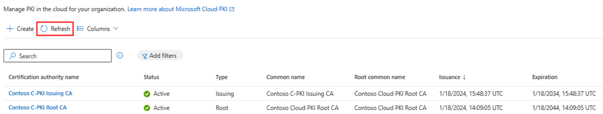

# Configure root and issuing CA for Microsoft Cloud PKI

This article describes how to create and deploy a Microsoft Cloud PKI root CA and issuing CA in Microsoft Intune. An issuing CA issues certificates to devices based on the certificate profiles you create in Intune.  

## Prerequisites

For more information about how to prepare your tenant for Microsoft Cloud PKI, including key concepts and requirements, see:

- [Overview of Microsoft Cloud PKI for Intune](microsoft-cloud-pki-overview.md): Review the architecture, tenant requirements, a feature summary, and known issues and limitations.

- [Deployment models](microsoft-cloud-pki-deployment.md): Review the Microsoft Cloud PKI deployment options.  

- [Fundamentals](microsoft-cloud-pki-fundamentals.md): Review the PKI fundamentals and concepts that are important to know prior to configuration and deployment.  

## Role based access control

The account you use to sign into the Microsoft Intune admin center must have permission to create a certification authority (CA). The Microsoft Entra Intune Administrator (also known as Intune service administrator) role has the built-in permissions to create CAs. Alternatively, you can assign Cloud PKI CA permissions to an admin user. For more information, see [Role-based access control (RBAC) with Microsoft Intune](../fundamentals/role-based-access-control.md). 

## Step 1: Create root CA in admin center

Before you can start to issue certificates to managed devices, you need to create a root CA in your tenant to act as the trust anchor. This section describes how to create the root CA. At least one root CA must be created before an issuing CA can be created.  

1. Sign in to the Microsoft Intune admin center.
1. Go to **Tenant administration** > **Cloud PKI**, and then select **Create**.

   > [!div class="mx-imgBorder"]
   >   

1. For **Basics**, enter the following properties:

   - **Name**: Enter a descriptive name for the CA object. Name it so you can easily identify it later. Example: *Contoso C-PKI Root CA*

   - **Description**: Enter a description for the CA object. This setting is optional, but recommended. Example: *Microsoft Cloud PKI root CA for Contoso corporation*

1. Select **Next** to continue to **Configuration settings**.
1. Configure the following settings for the root CA:  
   - **CA type**: Select **Root CA**.

   - **Validity period**: Select 5, 10, 15, 20, or 25 years. To create a root CA with a custom validity period, use [Microsoft Graph API](/graph/api/resources/intune-graph-overview) to create the CAs.

1. For **Extended Key Usages**, select how you intend to use the CA.  

   > [!div class="mx-imgBorder"]
   >   

   To prevent potential security risks, CAs are limited to select use. Your options:

   - **Type**: Select the purpose of the CA. The **Any Purpose (2.5.29.37.0)** EKU isn't for use, because it's overly permissive and a potential security risk. For more information, see [Edit overly permissive certificates template with privileged EKU](/defender-for-identity/security-assessment-edit-overly-permissive-template#what-is-an-overly-permissive-certificate-template-with-privileged-eku).  

   - Alternatively, to create a custom extended key usage, enter the **Name** and **Object Identifier**.

      > [!NOTE]
      > Keep in mind that root CA EKU/OID constraints are a superset of the issuing CA. This means that when you create an issuing CA, you can only select the EKUs defined for the root CA. If you don't define the EKU in the root CA, it won't show up as an EKU option for the issuing CA.

1. Under **Subject attributes** enter a **Common name (CN)** for the root CA. Optionally, you can enter other attributes including:
   - Organization (O)  
   - Country (C)  
   - State or province (ST)
   - Locality (L)  

   To adhere to PKI standards, Intune enforces a two-character limit for country/region.

1. Under **Encryption**, enter the **Key size and algorithm**. Your options:  

     - **RSA-2048 and SHA-256**  
     - **RSA-3096 and SHA-384**
     - **RSA-4096 and SHA-512**

      > [!div class="mx-imgBorder"]
      >   

   This setting enforces the upper bound key size and hash algorithm that can be used when configuring a device configuration SCEP certificate profile in Intune. It enables you to select any key size and hash up to what is set on the Cloud PKI issuing CA. Keep in mind a 1024 key size and SHA-1 hash isn't supported with Cloud PKI.
1. Select **Next** to continue to **Scope tags**.
1. Optionally, you can add scope tags to control visibility and access to this CA.
1. Select **Next** to continue to **Review + create**.
1. Review the summary provided. You won't be able to edit these properties after you create the CA. If needed, select **Back** to edit the settings and ensure they're correct and satisfy your PKI requirements. If later you need to add another EKU, you must create a new CA.  

1. When you're ready to finalize everything, select **Create**.
1. Return to the Cloud PKI CA list in the admin center. Select **Refresh** to see your new CA.  

      > [!div class="mx-imgBorder"]
      > 

## Step 2: Create issuing CA in admin center

An issuing CA is required to issue certificates for Intune-managed devices. Cloud PKI automatically provides a SCEP service that acts as a certificate registration authority. It requests certificates from the issuing CA on behalf of Intune-managed devices using a SCEP profile.

> [!NOTE]
> With Microsoft Cloud PKI, you don't need to:
>
> - Install and configure an NDES server.
> - Install and configure the Intune certificate connector.
> - Configure a proxy service to enable access to the NDES server URL.  

1. Return to **Tenant administration** > **Cloud PKI**.
1. Enter a **Name** and optional **Description** for so you can distinguish this CA from others in your tenant.
1. Select **Next** to continue to **Configuration settings**.
1. Select the CA type and root CA source.  

     > [!div class="mx-imgBorder"]
     >   

   Your options:  
   - **CA type**: Select **Issuing CA**. Then configure these additional settings:  

     - **Root CA source**: Select **Intune**. This setting determines the root CA source anchoring the issuing CA.  

     - **Root CA**: Select one of the root CAs you created in Intune to anchor against.

1. For **Validity period**, select 2, 4, 6, 8, or 10 years. The validity period of the issuing CA can't be longer than the root CA. To create an issuing CA with a custom validity period, use [Microsoft Graph API](/graph/use-the-api) to create the CAs.
1. For **Extended Key Usages**, select how you intend to use the CA. To prevent potential security risks, CAs are limited to specific types of use. Your options:  
   - **Type**:  select the purpose of the CA. The **Any Purpose (2.5.29.37.0)** EKU isn't for use, because it's overly permissive and a potential security risk.  
   - Alternatively, to create a custom EKU, enter the **Name** and **Object Identifier**.  

     > [!NOTE]
     > You can only select from EKUs defined in the root CA.  If you didn't define an EKU in the root CA, it won't show up as an EKU option here.

1. Under **Subject attributes** enter a **Common name (CN)** for the issuing CA.

      > [!div class="mx-imgBorder"]
      > 

   Optional attributes include:
     - Organization (O)  
     - Organizational unit (OU)
     - Country (C)  
     - State/province (ST)
     - Locality (L)  

     To adhere to PKI standards, Intune enforces a two-character limit for country/region.

1. Select **Next** to continue to **Scope tags**.  
1. Optionally, you can add scope tags to control visibility and access to this CA.
1. Select **Next** to continue to **Review + create**.
1. Review the summary provided. When you're ready to finalize everything, select **Create**.

   > [!TIP]
   > You won't be able to edit these properties after you create the CA. If needed, select **Back** to edit the settings and ensure they are correct and satisfy your PKI requirements. If later you require additional EKUs, you must create a new CA.

1. Return to the Microsoft Cloud PKI CA list in the admin center. Select **Refresh** to see your new issuing CA.  

      > [!div class="mx-imgBorder"]
      > 

To view the properties of root CAs and issuing CAs in your tenant, select the CA and then go to **Properties**.  Available properties include:  

- Certificate revocation list (CRL) distribution point URI
- Authority Information Access (AIA) URI
- SCEP URI - *issuing CA only*

Take note of these endpoint locations so you have them for later. Relying parties need network visibility to these endpoints. For example, you need to know the SCEP URI endpoint when you create SCEP profiles.

> [!NOTE]
> The CRL is valid for 7 days, and is refreshed and republished in the admin center every 3.5 days. A refresh also happens every time an end-entity certificate is revoked.

When you create the trusted certificate profile required for Cloud PKI, you must have the public keys for the root CA certificates and issuing CA certificates. The public keys establish a chain of trust between Intune managed devices and Cloud PKI when requesting a certificate using SCEP certificate profiles. Select **Download** to download the public keys for these certificates. Repeat this step for every CA you have. The root and issuing CA certificates are also required to be installed on any relying parties, or authentication endpoints, supporting certificate-based authentication.  

## Step 3: Create certificate profiles

To issue certificates, you must create a trusted certificate profile for your root and issuing CAs. The trusted certificate profile establishes trust with the Cloud PKI certificate registration authority supporting the SCEP protocol. A trusted certificate profile required for each platform (Windows, Android, iOS/iPad, macOS) that's issuing Cloud PKI SCEP certificates.

This step requires you to:

- Create a trusted certificate profile for the Cloud PKI root CA.
- Create a trusted certificate profile for a Cloud PKI issuing CA.
- Create an SCEP certificate profile for a Cloud PKI issuing CA.

### Create trusted certificate profile  

 In the admin center, [create a trusted certificate profile](certificates-trusted-root.md#to-create-a-trusted-certificate-profile) for each OS platform you're targeting. Create one trusted certificate profile for the root CA certificate and one for the issuing CA.

When prompted to, enter the public keys for the root CA and issuing CA. Complete the following steps to download the public keys for your CAs.  

For the root CA:  

1. Sign in to the Microsoft Intune admin center.
1. Go to **Tenant administration** > **Cloud PKI**.
1. Select a CA that has a root type.  
1. Go to **Properties**.
1. Select **Download**. Wait while the public key downloads.

For the issuing CA:  

1. Return to your **Cloud PKI** list.  
1. Select a CA that has an issuing type.  
1. Go to **Properties**.
1. Select **Download**. Wait while the public key downloads.

The Cloud PKI root CA and issuing CA you download must be installed on all relying parties.  

The file name given to the downloaded public keys is based on the Common Names specified in the CA. Some browsers, like Microsoft Edge, show a warning if you download a file with a .cer or other well-known certificate extension. If you receive this warning, select **Keep**.

 > [!div class="mx-imgBorder"]
 > 

### Create SCEP certificate profile  

> [!NOTE]
> Only Cloud PKI issuing CAs (including BYOCA issuing CA) can be used to issue SCEP certificates to Intune managed devices.  

Just like you did for the trusted certificate profiles, create an SCEP certificate profile for each OS platform you're targeting. The SCEP certificate profile is used to request a leaf *client authentication* certificate from the issuing CA. This type of certificate is used in certificate based authentication scenarios, for things like Wi-Fi and VPN access.

1. Return to **Tenant administration** > **Cloud PKI**.
1. Select a CA that has an **Issuing** type.  
1. Go to **Properties**.
1. Next to the SCEP URI property, select **Copy to clipboard**.  
1. In the admin center, [create a SCEP certificate profile](certificates-profile-scep.md#create-a-scep-certificate-profile) for each OS platform you're targeting.
1. In the profile, under **Root Certificate**, link the trusted certificate profile. The trusted certificate you select must be the root CA certificate that the issuing CA is anchored to in the CA hierarchy.  

      > [!div class="mx-imgBorder"]
      > 

1. For **SCEP Server URLS**, paste the SCEP URI. It's important to leave the string `{{CloudPKIFQDN}}` as-is. Intune replaces this placeholder string with the appropriate FQDN when the profile is delivered to the device. The FQDN will appear within the *.manage.microsoft.com namespace, a core Intune endpoint. For more information about Intune endpoints, see [Network Endpoints for Microsoft Intune](../fundamentals/intune-endpoints.md).  
1. Configure the remaining settings, following these best practices:  
   - **Subject name format**: Ensure the variables specified are available on the user or device object in Microsoft Entra ID. For example, if the target user of this profile doesn't have an email address attribute but the email address in this profile is filled in, the certificate won't be issued. An error also appears in the SCEP certificate profile report.  

   - **Extended Key Usage** (EKU): Microsoft Cloud PKI doesn't support the **Any Purpose** option.

      > [!NOTE]
      > Make sure the EKU(s) you select is configured on the Cloud PKI issuing certificate authority (CA). If you select an EKU that isn't present on the Cloud PKI issuing CA, then an error occurs with the SCEP profile. And, a certificate isn't issued to the device.

   - **SCEP Server URLs**: Don't combine NDES and SCEP URLs with Microsoft Cloud PKI issuing CA SCEP URLs.  

1. Assign and review the profile. When you're ready to finalize everything, select **Create**.  
