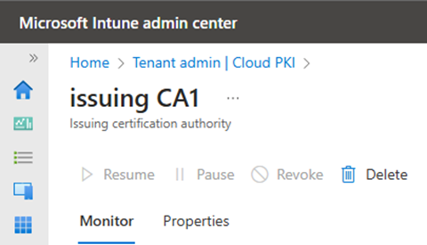
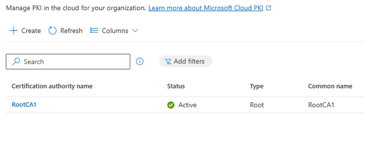
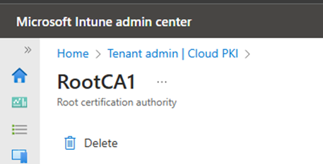

# Delete certification authority 
Delete an issuing and root certification authority (CA) from the Microsoft Cloud PKI service in Microsoft Intune. You can use the following actions in the Microsoft Intune admin center to manage existing CAs in you tenant: 

* Pause CA - Pause the CA to stop use of it. 
* Revoke CA - Revoke the CA and its active leaf certificates.   
* Delete CA - Delete and remove the CA from Microsoft Intune.  

A root CA can't be deleted until all anchored issuing CAs are deleted. If you change your mind after you pause a CA, you can unpause it to resume use. However, revoking and deleting a CA are permanent actions and can't be undone.  

This article describes how to delete an issuing CA and root CA from Microsoft Intune using the available actions in the admin center.  

## Role-based access requirements    
These administrator roles can delete CAs in the Microsoft Intune admin center:

- Intune Administrator, a built-in Microsoft Entra role  
- Custom Intune role, assigned the following Intune permissions:  
  - Read CAs  
  - Disable and reenable CAs  
  - Revoke issued leaf certificates  

## Delete issuing CA 
Permanently remove an issuing certificate from Microsoft Intune. If you're trying to delete a root CA, complete these steps first to delete the issuing CA anchored to it. 

1. Go to **Tenant administration** > **Cloud PKI**.  
1. Select an active issuing CA from the list of available CAs. Selecting a CA opens its available actions. 
1. Choose **Pause**. 

     

1. Select **Pause** again when prompted to confirm.   

   >[!NOTE]
   > When you pause an issuing CA: 
   > - It can't issue leaf certificates. 
   > - It continues to respond to certificate revocation list (CRL) requests and AIA requests.  

1. Go back to your list of CAs and choose **Refresh**. Then look under the **Status** column to confirm that the issuing CA is paused. 

      

1. Select the paused CA to open all available options again. Two new options appear: 
   - **Resume**: This option unpauses the CA and makes it active again. 
   - **Revoke**: This option revokes the issuing CA. For this action to work, all active leaf certificates belonging to the CA must already be revoked. For more information and steps, see [Revoke active leaf certificates](#revoke-active-leaf-certificates) in this article.   
1. Select **Revoke**. 

     

1. Select **Revoke** again when prompted to confirm.  

    >[!IMPORTANT]
    > For this action to work, all active leaf certificates belonging to the CA must already be revoked. For more information and steps, see [Revoke active leaf certificates](#revoke-active-leaf-certificates) in this article.
    > This action can't be undone. When you revoke an issuing CA: 
    > - It continues to respond to certificate revocation list (CRL) requests and AIA requests.
    > - It's no longer trusted to the relying parties performing a trust chain operation.
    > - The CRL of the root CA shows that the issuing CA cert is revoked. 
    > - All existing leaf certificates issued by the CA stop being authenticated.    

1. Go back to your list of CAs and choose **Refresh**. Then look under the **Status** column to confirm that the issuing CA is revoked.  

     

1. Select the revoked CA to open all available options again. The delete option should be available now.  
1. Select **Delete** to remove the CA from Microsoft Intune. 

     

1. Select **Delete** again when prompted to confirm.  

    >[!IMPORTANT]
    > This action can't be undone.  

1. Go back to your list of CAs and choose **Refresh**. Confirm that the issuing CA no longer appears in the list.  

     

## Delete root CA  
Permanently remove a root CA from Microsoft Intune. 

>[!TIP]
> Delete all anchored issuing CAs before you delete the root CA.  

1. Go to **Tenant administration** > **Cloud PKI**.  
1. Select a root CA from the list of available CAs. Selecting a CA opens its available actions.    

     

1. Select **Delete** to remove the CA from Microsoft Intune. 

     

1. Select **Delete** again when prompted to confirm.    

     

1. Go back to your list of CAs and choose **Refresh**. Confirm that the root CA no longer appears in the list. 

  <!-- > > [!div class="mx-imgBorder"]
   >  -->

   

## Revoke active leaf certificates  

When trying to revoke an issuing CA, it's important to revoke all of its active leaf certificates first. You can revoke one leaf certificate at a time from an issuing CA, or you can bulk revoke leaf certificates.  

### Revoke a leaf certificate  

1. In the Microsoft Intune admin center, go to **Tenant administration** > **Cloud PKI**.  
1. Select an issuing CA. 
1. Choose **View all certificates**. 
1. Select an active leaf certificate, and then choose **Revoke**. Repeat this step on every remaining leaf certificate.  

### Revoke all leaf certificates 

<!-- alternate if no repo
You can use the following Powershell script to revoke all leaf certificates belonging to a CA.  --->

You can use the sample PowerShell script below to revoke all leaf certificates belonging to a CA.  

 >[!CAUTION]
 > Use this script with caution. You can't undo the revoke action for any of the leaf certificates.

**Disclaimer**
The script sample below retrieves information from your Intune tenant Microsoft Cloud PKI, and will revoke leaf certificates for a specified Issuing Certification Authority in your Intune tenant.  Understand the impact of the sample script prior to running it; the sample script should be run using a non-production or "test" tenant account. 

Read through the script and understand the actions it is performing prior to running.

**Script overview:** 

Run the sample powershell script from an administrative workstation. The sample script requires specific permissions and information to run: 
- Request the Issuing CA ID.
  
 >[!NOTE]
   > The CA id will be required to run the script. This information can be found when using the Intune admin console.
   > Go to "Tenant administration > Cloud PKI" Select an Issuing CA, the browser URL will display the CA id.
   > The last part of the URL will be the CA id. In the example below the CA id is "f12345-acf1-12ab-1b2a-1a1234567a89"
   > Example: "https://intune.microsoft.com/#view/Microsoft_Intune_DeviceSettings/CaDetails.ReactView/id/f12345-acf1-12ab-1b2a-1a1234567a89" 

- The script will install the Microsoft powershell graph module - Microsoft.Graph .  This action requires administrative privileges on the device the script is running on.
- The Connect-MgGraph command requires an admin to login with permissions to revoke leaf certificates on the issuing CA. 
- The script will get all leaf certificates and perform a revoke on each.
- The script will prompt the admin to confirm the revoke of all leaf certificates.
- The script has a section that can be uncommented if you wish to prompt for each certificate prior to revoking.


 powershell script sample 

```powershell
 param (
	[string]$caId = $(Read-Host "Input CaId")
	)

Install-Module Microsoft.Graph

Connect-MgGraph -Scopes "DeviceManagementConfiguration.ReadWrite.All"

Start-Transcript -Path ".\RevokeAllLeafCerts_$($caId)_$(Get-Date -f 'yyyyMMdd-HHmmss').txt"

### Get all leaf certs
$leafCerts = Invoke-MgGraphRequest -Method GET -Uri "https://graph.microsoft.com/beta/devicemanagement/cloudCertificationAuthority/$caId/cloudCertificationAuthorityLeafCertificate"

# Prompt user to confirm data cleanup
$confirmAllDelete = $(Write-Host "Are you 100% sure you want to revoke all $($leafCerts.value.count) certificates for CA $($caId)?" -ForegroundColor Yellow; Write-Host '[Y] Yes' -NoNewline; Write-Host ' [N] No' -ForegroundColor Yellow -NoNewline;
Read-Host " ")

if ($confirmAllDelete.ToLower() -ne "y" -and $confirmAllDelete.ToLower() -ne "yes") {
	Write-Host "Aborted"
	Stop-Transcript
	exit
}

# Iterate on retrieved leaf certs and revoke
foreach ($leafCert in $leafCerts.value)
{
	Write-Host ""
	if ($leafCert.certificateStatus.ToLower() -eq "revoked") {
	 	Write-Host "LeafCert id: $($leafCert.id), thumbprint: $($leafCert.thumbprint) is already revoked. Skipping" 
	 	continue
	}
	
    Write-Host "Revoking leafCert id: $($leafCert.id), thumbprint: $($leafCert.thumbprint)" 
	
	# Uncomment next five lines to prompt for each cert
	# $confirmCertDelete = $(Write-Host "Are you sure you want to revoke leafCert id: $($leafCert.id), thumbprint: $($leafCert.thumbprint), $($leafCert.certificateStatus)?" -ForegroundColor Yellow; Write-Host '[Y] Yes' -NoNewline; Write-Host ' [N] No' -ForegroundColor Yellow -NoNewline; Read-Host " ")
	# if ($confirmCertDelete.ToLower() -ne "y" -and $confirmCertDelete.ToLower() -ne "yes") {
	# 	Write-Host "Skipping"
	# 	continue
	# }
	
	$currentCertId = $($leafCert.id)
	$revokeParams = @{ "leafCertificateId" = $($leafCert.id) }

	Invoke-MgGraphRequest -Method POST -Uri "https://graph.microsoft.com/beta/devicemanagement/cloudCertificationAuthority/$caId/revokeLeafCertificate" -Body ($revokeParams|ConvertTo-Json) -ContentType "application/json"
}

 ```powershell   
