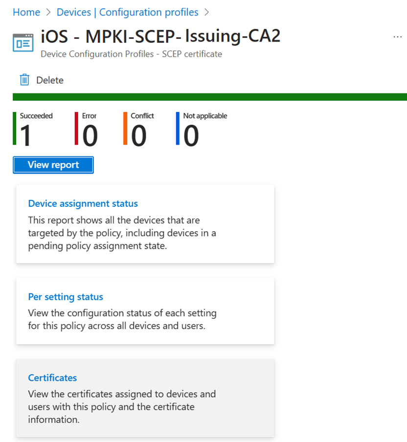

# Delete certification authority 
Delete an issuing CA and root CA from the Microsoft Cloud PKI service in Microsoft Intune. To delete a CA, you must take the following actions in the Microsoft Intune admin center:    

1. Pause CA: Pause the CA to stop the initial use of it. 
2. Revoke CA: Revoke the CA and its active leaf certificates.   
3. Delete CA: Delete and remove the CA from Microsoft Intune.  

All steps are required. You can resume use of a paused CA anytime. However, once you delete or revoke a CA, the action is permanent and can't be undone.    

## You should know 

### Delete  
A root CA can't be deleted until all anchored issuing CAs are deleted. 

### Pause  
A CA in a paused state can't issue leaf certificates. The paused CA continues to respond to certificate revocation list (CRL) requests and AIA requests. 

### Revoke 
The revoke action can't be undone. When you revoke an issuing CA:
 - All existing leaf certificates issued by the CA stop being authenticated. 
 - The CA is no longer trusted to the relying parties performing a trust chain operation. 
 - The CRL of the root CA shows that the issuing CA cert has been revoked.
 
The revoked CA continues to respond to certificate revocation list (CRL) requests and AIA requests.

## Role based access control for deleting a CA
The following roles can view CAs in the Intune admin center, pause a CA, and revoke issued leaf certificates:

- Intune Administrator, a built-in Microsoft Entra role  
- Custom Intune role assigned the following permissions: 
  - Read CAs  
  - Disable and reenable CAs  
  - Revoke issued leaf certificates  

## Delete issuing CA 
Complete the following steps to remove an issuing certificate from Microsoft Intune. 

> [!TIP]
> Want to delete a root CA? Complete these steps first to delete the issuing CA anchored to it. 

1. Go to **Tenant administration** > **Cloud PKI**.  
1. Select an active issuing CA from the list of available CAs. Selecting a CA opens its available actions. 
1. Choose **Pause**, and then select **Pause** again when prompted to confirm. 
1. Go back to your list of CAs and choose **Refresh**. Then look under the **Status** column to confirm that the issuing CA is paused. 
1. Select the paused CA to open all available options again. Two new options appear: 
   - Resume: This option unpauses the CA and makes it active again. 
   - Revoke: This option revokes the issuing CA certificate, and is required to eventually delete the CA.
1. Select **Revoke**, and then select **Revoke** again when prompted to confirm.  

    >[!IMPORTANT]
    > This action cannot be undone.

    Remember, for the revoke action to work, all active leaf certificates must first be revoked. For more information and steps, see [Revoke active leaf certificates](#revoke-active-leaf-certificates) in this article.    

1. Go back to your list of CAs and choose **Refresh**. Then look under the **Status** column to confirm that the issuing CA is revoked. 

1. Select the revoked CA to open all available options again. The delete option should be available now.  
1. Select **Delete** to remove the CA from Microsoft Intune. Then select **Delete** again when prompted to confirm.  

    >[!IMPORTANT]
    > This action cannot be undone.

1. Go back to your list of CAs and choose **Refresh**. Confirm that the issuing CA no longer appears in the list. 

## Delete root CA  
In to the Microsoft Intune admin center, go to **Tenant administration** > **Cloud PKI**.  

1. Go to **Tenant administration** > **Cloud PKI**.  
1. Select a Root CA from the list of CAs. Selecting a CA opens its available actions.    

2. Select the “Delete” button  

   A confirmation dialog will appear, click on the “Delete” button.  

3. Refresh the CA list, the deleted CA will no longer appear.  

   > [!div class="mx-imgBorder"]
   >   

## Revoke active leaf certificates  

You can revoke one leaf certificate at a time from an issuing CA, or you can bulk revoke leaf certificates.   

### Revoke each leaf certificate  

1. Select an issuing CA. 
2. Select **View all certificates**. 
3. Select an active leaf certificate, and then choose **Revoke**. Repeat this step until every active leaf certificate has been revoked. 

### Revoke all leaf certificates 

You can use the following Powershell script to revoke all leaf certificates belonging to a CA.  

 >[!CAUTION]
 > Use this script with caution. You can't undo the revoke action for any of the leaf certificates.  

## Monitor Cloud PKI issuing CA

Each Cloud PKI issuing CA has a monitoring dashboard. Select **View all certificates** to view all issued certificates. Certificate report details should be available within 24 hours of the certificate being successfully issued to the device.

   > [!div class="mx-imgBorder"]
   >   

From here, you can also manually revoke an issued leaf certificate.

 1. Select **View all certificates**.
 1. Select the **Subject name** of the certificate you want to revoke.  
 1. On the certificate's details page, select **Revoke**.  

> [!TIP]
> When you manually revoke a certificate from a user or device that has an active SCEP certificate profile assignment, then on the next device check-in a new certificate request is made by the device. A certificate is also issued.  If you don't want to reissue a certificate to the device, remove all SCEP policy assignments.  

## View SCEP certificate profile report

Go to **Devices** > **Manage devices** > **Configuration**. Select the SCEP profile, and then select **Certificates**.

   > [!div class="mx-imgBorder"]
   > 
