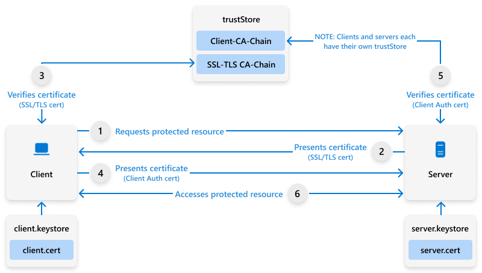

# Microsoft Cloud PKI fundamentals

*Microsoft Cloud PKI* is an Intune Suite feature that enables you as an IT pro to manage your public key infrastructure (PKI) in the cloud. You can create, configure, and manage your own certification authorities (CAs) and certificates without having to install and maintain on-premises infrastructure. The Microsoft Cloud PKI service integrates with Microsoft Entra ID and Microsoft Intune to provide identity and device management for your cloud-based devices and apps.  

This article describes the PKI fundamentals and concepts you  need to know when you configure Microsoft Cloud PKI. We recommend reviewing all information before you configure the Microsoft Cloud PKI service in your Intune tenant.

## Certification authority types  

A certification authority performs the following tasks:

- Verifies the identity of a certificate requestor
- Issues certificates to requestors
- Manages certificate revocation

Microsoft Cloud PKI supports these types of certificate authorities:  

- Root CA
- Issuing CA

## Root certification authority

A root certification authority (CA) is the topmost CA in a CA hierarchy. In a PKI, the root CA acts as the trust point for certificates issued by CAs in the hierarchy. The certificate is considered *trusted* if it can be traced up through the CA hierarchy to a root CA that is trusted by a user, computer, network device, or service.

A root CA is unique in that its certificate is *self-issued*, meaning that the certificate’s issuer name and subject name contain the same distinguished name. The only way to verify whether a root certificate is valid or not is to include the root CA certificate in a trusted root store. The trusted root store contains the actual root CA certificate to designate that the certificate is trusted.  

The root CA can issue certificates to other CAs or to users, computers, network devices, or services on the network. When the root CA issues a certificate to another entity, the root CA certificate signs the certificate with its private key. The signing protects against content modification and indicates that the root CA issued the certificate.

>[!IMPORTANT]
> Microsoft Cloud PKI only issues certificates to network devices that are MDM-enrolled.

### Issuing certification authority

>[!NOTE]
>The terms *intermediate*, *issuing*, and *subordinate* are all interchangeable labels used to refer to the same role within a CA structure. Microsoft Cloud PKI uses the term *issuing* to describe this type of CA.

An issuing CA is a CA that is subordinate to another CA and can either:

- Issue certificates to other CAs in the CA hierarchy.  
- Issue leaf certificates to an end-entity such as a server, service, client, or device.  

The issuing CA can exist at any level in the CA hierarchy, except at the root CA level.  

## Chaining

*Chaining* is the process of working out what the best trust path is for any given certificate needing to be verified and trusted. Each operating system or service performs this computational process generally referred to as the *certificate chain engine*.  

The chain building process consists of:

- Certificate discovery: Looking up the issuing CA certificate of an end-entity leaf certificate up to the trusting root CA certificate.
- Certificate validation: Creates all possible certificate chains. Validates every certificate in the chain with respect to various parameters such as name, time, signature, revocation, and potentially other defined constraints.
- Returns the best quality chain.

When a certificate is presented for verification, a certificate chain engine walks through its certification store and selects the intermediate and root certificate candidates. It could require more than one intermediate certificate to form a complete chain.

The certificate chain engine tries to select certificates using the subject key identifier (SKI) and authority key identifier (AKI). An end entity certificate issued by a Microsoft CA contains the AKI, so the certificate chain engine has to select an intermediate certificate with a matching SKI. The process repeats until a self-signed certificate is enumerated.

### Chain validation process

>[!NOTE]  
> Support for the certificate chain validation methods vary by OS platform. This section describes the methods supported on devices running Windows 10 or later.

On Windows, there are three chain validation processes: exact match, key match, and name match.

- Exact match: If the AKI extension contains the issuer’s subject, issuer serial number, and KeyID, only parent certificates that match with their subject, serial number, and KeyID are chosen in the chain-building process.

- Key match: If the AKI extension contains just the KeyID, only certificates that contain a matching KeyID in the Subject Key Identifier (SKI) extension are chosen as valid issuers.

- Name match: Name matching happens when no information exists in the AKI or if the AKI extension isn't in the certificate. In this case, the subject name of the issuer certificate must match the issuer attribute of the current certificate.

For certificates that don't contain SKI and AKI fields, the chaining engine tries to use name matching to build a chain. When you have two certificates with the same name, the newer one is selected.

*Certificate discovery* is initiated when the immediate parent isn't local on the computer. The client uses this process to retrieve missing parent certificates. The URLs shown in the authority information access field of the certificate are parsed and used to retrieve parent CA certificates. The process is similar to CRL downloading.

After the chain is built, the following checks are performed on each certificate in the chain:

- Check that it's properly formatted and signed. Perform a hash check of the certificate.  
- Check the **from** and **to** fields in the certificate to ensure that it's not expired.  
- Check whether the certificate is revoked.
- Check that the chain terminates in a certificate that's in the Trusted Root Store.  

The certificate and its chain are considered valid after all checks are complete, and come back successful.

A certificate chain with an ordered list of certificates enables the relying party to verify a sender is trustworthy. It works both ways, from client-to-server and server-to-client. 

The following diagram illustrates the *name matching* chain validation flow.  

> [!div class="mx-imgBorder"]
> 

### Ensure a chain of trust  

When you use certificates to perform certificate-based authentication, you must ensure that both relying parties have the CA certificate (public keys) trust chain. In this case, the *relying parties* are the Intune managed device and the authentication access point, such as Wi-Fi, VPN, or web service.

The root CA must be present. If the issuing CA certificate isn't present, then it can be requested by the relying party using the native certificate chain engine for the intended OS platform. The relying party can request the issuing CA certificate using the leaf certificate's *authority information access* property.  

> [!div class="mx-imgBorder"]
>   

## Certificate-based authentication  
This section provides a basic understanding of the various certificates being used when a client or device performs certificate-based authentication.  

The following steps describe the handshake that takes place between a client and a relying party service during certificate-based authentication.

1. The client issues some form of hello packet to the relying party.
2. The relying party responds, stating that it wishes to communicate over secure TLS/SSL. The client and relying party perform the SSL handshake and a secure channel is established.  
3. The relying party requests a certificate to be used for client authentication.  
4. The client presents its client authentication certificate to the relying party to authenticate.

> [!div class="mx-imgBorder"]
>   

In an environment without Microsoft Cloud PKI, a private CA is responsible for issuing both the TLS/SSL certificate used by the relying party, and the device client authentication certificate. Microsoft Cloud PKI can be used to issue the device client authentication certificate, effectively replacing the private CA for this specific task.  
