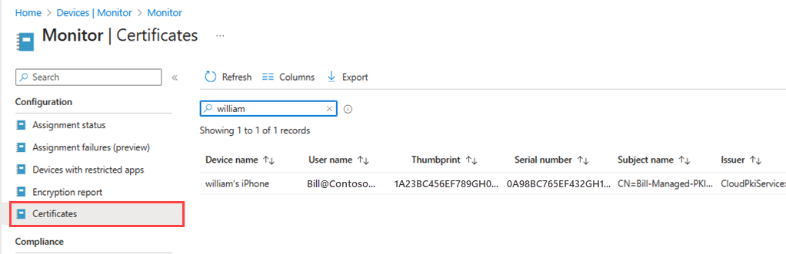
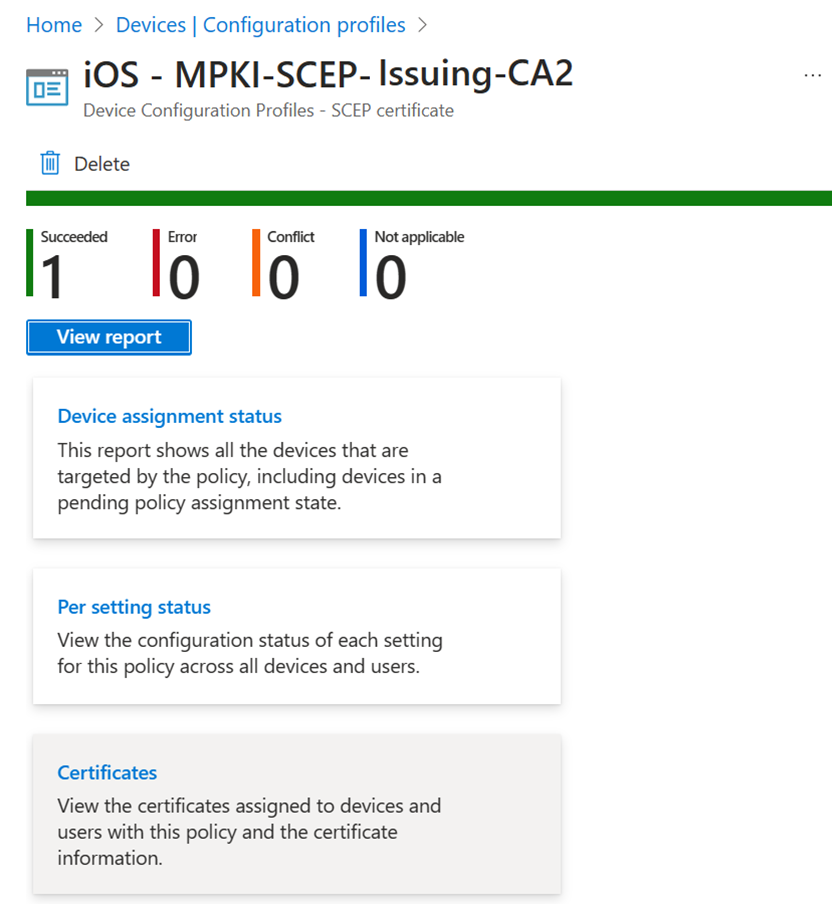

# Monitoring for Microsoft Cloud PKI

Monitor the certificates deployed to Intune-managed devices by the Microsoft Cloud PKI service. Every Microsoft Cloud PKI issuing CA has a dashboard that shows the number of deployed certificates, including:

- Active certificates
- Expired certificates
- Revoked certificates
- Total number of issued certificates

You can also view SCEP certificates issued by Cloud PKI.

This article describes how to monitor certificates, revoke certificates, and view SCEP certificate reports in the Microsoft Intune admin center.

## View issued certificates

To view issued certificates, go to **Devices** > **Monitor**, and then select **Certificates**.  

   > [!div class="mx-imgBorder"]
   > 

## Monitor Cloud PKI issuing CA

Each Cloud PKI issuing CA has a monitoring dashboard. Select **View all certificates** to view all issued certificates. Certificate report details should be available within 24 hours of the certificate being successfully issued to the device.

   > [!div class="mx-imgBorder"]
   >   

From here, you can also manually revoke an issued leaf certificate.

 1. Select **View all certificates**.
 1. Select the **Subject name** of the certificate you want to revoke.  
 1. On the certificate's details page, select **Revoke**.  

> [!TIP]
> When you manually revoke a certificate from a user or device that has an active SCEP certificate profile assignment, then on the next device check-in a new certificate request is made by the device. A certificate is also issued.  If you don't want to reissue a certificate to the device, remove all SCEP policy assignments.  

## View SCEP certificate profile report

Go to **Devices** > **Manage devices** > **Configuration**. Select the SCEP profile, and then select **Certificates**.

   > [!div class="mx-imgBorder"]
   > 
