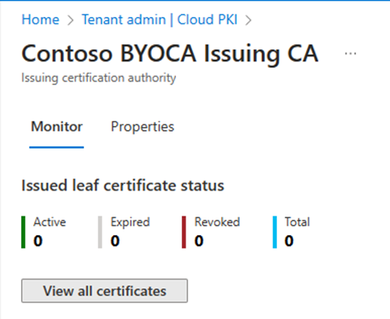

# Monitoring for Microsoft Cloud PKI  

Monitor the certificates deployed to Intune-managed devices by the Microsoft Cloud PKI service. Microsoft Cloud PKI issuing CAs have a dashboard that shows the number of deployed certificates, including:   
- Active certificates
- Expired certificates  
- Revoked certificates  
- Total number of issued certificates   

You can also view issued SCEP certificates by Cloud PKI. Details are available in the Microsoft Intune admin center in these areas:  
- Microsoft Cloud PKI Issuing CA monitoring page  
- **Device** > **Monitor** > **Certificates**    
- SCEP certificate profile > **View Report**  

This article describes how to monitor certificates, revoke certificates, and view SCEP certificate reports in the admin center.   

## Monitor Cloud PKI Issuing CA 
Each Cloud PKI Issuing CA has a Monitor page. Select **View all certificates** to view all issued certificates. Certificate report details should be available within a 24-hour period of the certificate being successfully issued to the device.  

   > [!div class="mx-imgBorder"]
   >   

### Manually revoke issued certificate  
Manually revoke an issued leaf certificate.  

1. In the admin center, select **View all certificate**.  
2. Select the **Subject name** of the certificate you want to revoke.  
3. On certificate details page, select **Revoke**.  

> [!TIP]
> When you manually revoke a certificate from a user or device that has an active SCEP certificate profile assignment, then on the next device check-in a new certificate request is made by the device. A certificate is also issued.  If you don't want to reissue a certificate to the device, remove all SCEP policy assignments.  

### Monitor certificates   

To view issued certificates, go to **Devices** > **Monitor**, and then select **Certificates**.  

   > [!div class="mx-imgBorder"]
   >   

### View SCEP certificate profile report  

In the admin center, go to **Devices** > **Configuration profiles**. Select the SCEP profile, and then select **Certificates**.  

   > [!div class="mx-imgBorder"]
   >   

