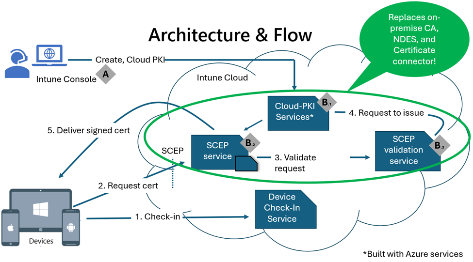

# Overview of Microsoft Cloud PKI for Microsoft Intune

**Applies to**:

* Windows  
* Android  
* iOS  
* macOS  

Use Microsoft Cloud PKI to issue certificates for Intune-managed devices. Microsoft Cloud PKI is a cloud-based service that simplifies and automates certificate lifecycle management for Intune-managed devices. It provides a dedicated public key infrastructure (PKI) for your organization, without requiring any on-premises servers, connectors, or hardware. It handles the certificate issuance, renewal, and revocation for all Intune supported platforms.  

This article provides an overview of Microsoft Cloud PKI for Intune, how it works, and its architecture.

## What is PKI?  

PKI is a system that uses digital certificates to authenticate and encrypt data between devices and services. PKI certificates are essential for securing various scenarios, such as VPN, Wi-Fi, email, web, and device identity. However, managing PKI certificates can be challenging, costly, and complex, especially for organizations that have a large number of devices and users. You can use Microsoft Cloud PKI to enhance the security and productivity of your devices and users, and to accelerate your digital transformation to a fully managed cloud PKI service. Additionally, you can utilize the Cloud PKI service in to reduce workloads for Active Directory Certificate Services (ADCS) or private on-premises certification authorities.  

## Manage Cloud PKI in Microsoft Intune admin center

Microsoft Cloud PKI objects are created and managed in the Microsoft Intune admin center. From there, you can:

* Set up and use Microsoft Cloud PKI for your organization.
* Enable Cloud PKI in your tenant.
* Create and assign certificate profiles to devices.  
* Monitor issued certificates.  

After you create a Cloud PKI issuing CA, you can start to issue certificates in minutes.

## Supported device platforms

You can use the Microsoft Cloud PKI service with these platforms:

* Android
* iOS/iPadOS
* macOS
* Windows  

Devices must be enrolled in Intune, and the platform must support the Intune device configuration SCEP certificate profile.  

## Overview of features

The following table lists the features and scenarios supported with Microsoft Cloud PKI and Microsoft Intune.  

| Feature | Overview |
| --- | --- |
| Create multiple CAs in an Intune tenant | Create two-tier PKI hierarchy with root and issuing CA in the cloud.  |
| Bring your own CA (BYOCA)  | Anchor an Intune Issuing CA to a private CA through Active Directory Certificate Services or a non-Microsoft certificate service. If you have an existing PKI infrastructure, you can maintain the same root CA and create an issuing CA that chains to your external root. This option includes support for external private CA N+ tier hierarchies.  |
| Signing and Encryption algorithms|  Intune supports RSA, key sizes 2048, 3072, and 4096. |
| Hash algorithms  | Intune supports SHA-256, SHA-384, and SHA-512.   |
|HSM keys (signing and encryption)|Keys are provisioned using [Azure Managed Hardware Security Module (Azure Managed HSM)](/azure/key-vault/managed-hsm/overview).    CAs created with a licensed Intune Suite or Cloud PKI Standalone Add-on automatically use HSM signing and encryption keys. No Azure subscription is required for Azure HSM.   |
|Software Keys (signing and encryption) |CAs created during a trial period of Intune Suite or Cloud PKI standalone Add-on use software-backed signing and encryption keys using `System.Security.Cryptography.RSA`. |
| Certificate registration authority  | Providing a Cloud Certificate Registration Authority supporting Simple Certificate Enrollment Protocol (SCEP) for each Cloud PKI Issuing CA.|
|Certificate Revocation List (CRL) distribution points | Intune hosts the CRL distribution point (CDP) for each CA.     The CRL validity period is seven days. Publishing and refresh happens every 3.5 days. The CRL is updated with every certificate revocation. |
|Authority Information Access (AIA) end points | Intune hosts the AIA endpoint for each Issuing CA. The AIA endpoint can be used by relying parties to retrieve parent certificates. |
| End-entity certificate issuance for users and devices |  Also referred to as *leaf certificate* issuance. Support is for the SCEP (PKCS#7) protocol and certification format, and Intune-MDM enrolled devices supporting the SCEP profile. |
| Certificate life-cycle management | Issue, renew, and revoke end-entity certificates. |
| Reporting dashboard |  Monitor active, expired, and revoked certificates from a dedicated dashboard in the Intune admin center. View reports for issued leaf certificates and other certificates, and revoke leaf certificates. Reports are updated every 24 hours. |
| Auditing | Audit admin activity such as create, revoke, and search actions in the Intune admin center. |
| Role-based access control (RBAC) permissions | Create custom roles with Microsoft Cloud PKI permissions. The available permissions enable you to read CAs, disable and reenable CAs, revoke issued leaf certificates, and create certificate authorities. |  
| Scope tags | Add scope tags to any CA you create in the admin center. Scope tags can be added, deleted, and edited.  |  

## Architecture  

Microsoft Cloud PKI is made up of several key components working together to simplify the complexity and management of a public key infrastructure; a Cloud PKI service for creating and hosting certification authorities, combined with a certificate registration authority to automatically service incoming certificate requests from Intune-enrolled devices. The registration authority supports the Simple Certificate Enrollment Protocol (SCEP).

> [!div class="mx-imgBorder"]
>   

**Components**:

* A - Microsoft Intune  
* B - Microsoft Cloud PKI services  
  * B.1 - Microsoft Cloud PKI service
  * B.2 - Microsoft Cloud PKI SCEP service
  * B.3 - Microsoft Cloud PKI SCEP validation service
  
  The *certificate registration authority* makes up B.2 and B.3 in the diagram.  

These components replace the need for an on-premises certificate authority, NDES, and Intune certificate connector.  

**Actions**:  

Before the device checks in to the Intune service, an Intune administrator or Intune role with permissions to manage the Microsoft Cloud PKI service must:  

* Create the required Cloud PKI certification authority for the root and issuing CAs in Microsoft Intune.  
* Create and assign the required trust certificate profiles for the root and issuing CAs. This flow isn't shown in the diagram.
* Create and assign the required platform-specific SCEP certificate profiles. This flow isn't shown in the diagram.  

> [!NOTE]
> A Cloud PKI Issuing Certification Authority is required to issue certificates for Intune managed devices.  Cloud PKI provides a SCEP service that acts as a Certificate Registration Authority. The service requests certificates from the Issuing CA on behalf of Intune-managed devices using a SCEP profile.  

1. A device checks in with the Intune service and receives the trusted certificate and SCEP profiles.  
2. Based on the SCEP profile, the device creates a certificate signing request (CSR). The private key is created on the device, and never leaves the device. The CSR and the SCEP challenge are sent to the SCEP service in the cloud (SCEP URI property in the SCEP profile). The SCEP challenge is encrypted and signed using the Intune SCEP RA keys.  
3. The SCEP validation service verifies the CSR against the SCEP challenge (*shown as B.3 in diagram*). Validation ensures the request comes from an enrolled and managed device. It also ensures the Challenge is untampered, and that it matches the expected values from the SCEP profile. If any of these checks fail, the certificate request is rejected.
4. After the CSR is validated, the SCEP validation service, also known as the *registration authority*, requests that the issuing CA signs the CSR (*shown as B.1 in diagram*).  
5. The signed certificate is delivered to the Intune MDM-enrolled device.

 >[!NOTE]
 > The SCEP challenge is encrypted and signed using the Intune SCEP registration authority keys.  

## Licensing requirements  

Microsoft Cloud PKI requires one of the following licenses:

* Microsoft Intune Suite license
* Microsoft Cloud PKI standalone Intune add-ons license  

For more information about licensing options, see [Microsoft Intune licensing](../fundamentals/licenses.md).  

## Role based access control

The following permissions are available to assign to custom Intune roles. These permissions enable users to view and manage CAs in the admin center.

* Read CAs: Any user assigned this permission can read the properties of a CA.  
* Create certificate authorities: Any user assigned this permission can create a root or issuing CA.
* Revoke issued leaf certificates: Any user assigned this permission has the ability to manually revoke a certificate issued by an issuing CA. This permission also requires the *read CA* permission.  

You can assign scope tags to the root and issuing CAs. For more information about how to create custom roles and scope tags, see [Role-based access control with Microsoft Intune](../fundamentals/scope-tags.md).  

## Try Microsoft Cloud PKI

You can try out the Microsoft Cloud PKI feature in the Intune admin center during a trial period. Available trials include:

* [Microsoft Intune Suite trial](https://www.microsoft.com/security/business/microsoft-intune-pricing)  
* [Standalone add-on trial](../fundamentals/intune-add-ons.md#try-or-buy-intune-add-ons)  

During the trial period, you can create up to six CAs in your tenant. Cloud PKI CAs created during the trial use software-backed keys, and use `System.Security.Cryptography.RSA` to generate and sign the keys. You can continue to use the CAs after purchasing a Cloud PKI license. However, the keys remain software-backed, and can't be converted to HSM backed keys. The Microsoft Intune service managed CA keys. No Azure subscription is required for Azure HSM capabilities.  

## CA configuration examples  

Two-tier Cloud PKI root & issuing CAs, and bring-your-own CAs can coexist in Intune.  You can use the following configurations, provided as examples, to create CAs in Microsoft Cloud PKI:

* One root CA with five issuing CAs
* Three root CAs with one issuing CA each  
* Two root CAs with one issuing CA each, and two bring-your-own CAs  
* Six bring-your-own CAs  

## Known issues and limitations

For the latest changes and additions, see [What's new in Microsoft Intune](../fundamentals/whats-new.md).  

* You can create up to six CAs in an Intune tenant.
  * Licensed Cloud PKI – A total of 6 CAs can be created using Azure mHSM keys.
  * Trial Cloud PKI - A total of 6 CAs can be created during a trial of Intune Suite or Cloud PKI standalone add-on.  
* The following CA types count toward the CA capacity:
  * Cloud PKI Root CA  
  * Cloud PKI Issuing CA  
  * BYOCA Issuing CA
* In the admin center, when you select **View all certificates** for an issuing CA, Intune only shows the first 1000 issued certificates. We're actively working to address this limitation. As a workaround, go to **Devices** > **Monitor**. Then select **Certificates** to view all issued certificates.  
