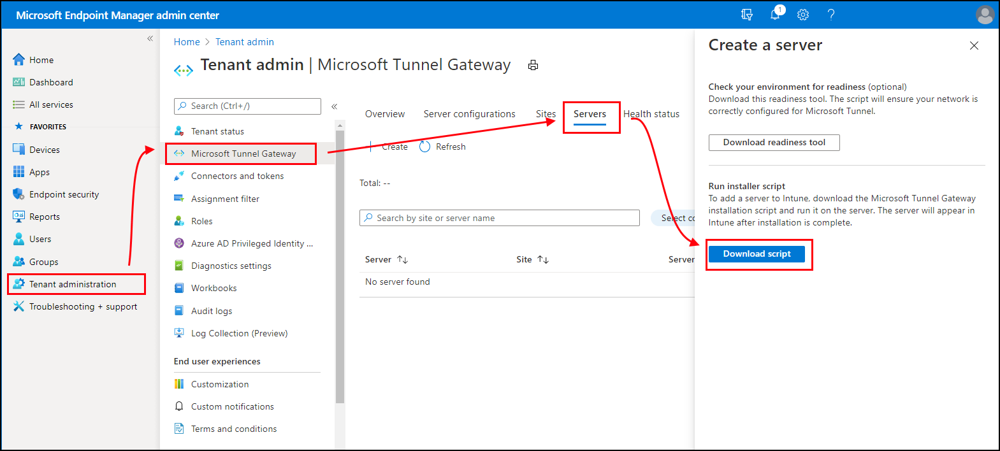

# Configure Microsoft Tunnel for Intune

Microsoft Tunnel Gateway installs to a container on a Linux server that runs either on-premises or in the cloud. Depending on your environment and infrastructure, additional configurations and software like Azure ExpressRoute might be needed.

Before you start the installation, be sure to complete the following tasks:

- Review and [Configure prerequisites for Microsoft Tunnel](microsoft-tunnel-prerequisites.md).
- Run the Microsoft Tunnel [readiness tool](microsoft-tunnel-prerequisites.md#run-the-readiness-tool) to confirm your environment is ready to support use of the tunnel.

After your prerequisites are ready, return to this article to begin installation and configuration of the tunnel.

## Create a Server configuration

Use of a *Server configuration* lets you create a configuration a single time and have that configuration used by multiple servers. The configuration includes IP address ranges, DNS servers, and split-tunneling rules. Later, you'll assign a Server configuration to a Site, which automatically applies that server configuration to each server that joins that Site.

### To create a Server configuration

1. Sign in to [Microsoft Intune admin center](https://go.microsoft.com/fwlink/?linkid=2109431) > **Tenant administration** > **Microsoft Tunnel Gateway** > *select the* **Server configurations** *tab* > **Create new**.

2. On the **Basics** tab, enter a *Name* and *Description* *(optional)* and select **Next**.

3. On the **Settings** tab, configure the following items:

   - **IP address range**: IP addresses within this range are leased to devices when they connect to Tunnel Gateway. The Tunnel Client IP address range specified must not conflict with an on-premises network range.
     - Consider using the Automatic Private IP Addressing (APIPA) range of 169.254.0.0/16, as this range avoids conflicts with other corporate networks.
     - If the client IP address range conflicts with the destination, it uses the loopback address and fails to communicate with the corporate network.
     - You can select any client IP address range you want to use if it doesn't conflict with your corporate network IP address ranges.

   - **Server port**: Enter the port that the server listens to for connections.

   - **DNS servers**: These servers are used when a DNS request comes from a device that connects to Tunnel Gateway.

   - **DNS suffix search** *(optional)*: This domain is provided to clients as the default domain when they connect to Tunnel Gateway.

   - **Disable UDP Connections** *(optional)*: When selected, clients only connect to the VPN server using TCP connections. Because the standalone tunnel client requires use of UDP, select the checkbox to disable UDP connections only after you configure your devices to use Microsoft Defender for Endpoint as the tunnel client app.

4. Also on the **Settings** tab, configure *Split tunneling rules*, which are optional.

   You can include or exclude addresses. Included addresses are routed to Tunnel Gateway. Excluded addresses aren't routed to Tunnel Gateway. For example, you might configure an include rule for *255.255.0.0* or *192.168.0.0/16*.

   Use the following options to include or exclude addresses:
   - **IP ranges to include**
   - **IP ranges to exclude**

   > [!NOTE]
   > Do not use an IP range that specifies 0.0.0.0 in any of the include or exclude addresses, Tunnel Gateway cannot route traffic when this range is used.

5. On the **Review + create** tab, review the configuration, and then select **Create** to save it.

   > [!NOTE]
   > By default, each VPN session will stay active for only 3,600 seconds (one hour) before it disconnects (a new session will be established immediately in case the client is set to use Always On VPN).
   > However, you can modify the session timeout value along with other server configuration settings using [graph calls (microsoftTunnelConfiguration)](/graph/api/resources/intune-mstunnel-microsofttunnelconfiguration).

## Create a Site

Sites are logical groups of servers that host Microsoft Tunnel. You assign a Server configuration to each Site you create. That configuration is applied to each server that joins the Site.

### To create a Site configuration

1. Sign in to [Microsoft Intune admin center](https://go.microsoft.com/fwlink/?linkid=2109431) > **Tenant administration** > **Microsoft Tunnel Gateway** > *select the* **Sites** *tab* > **Create**.

2. On the **Create a site** pane, specify the following properties:

   - **Name**: Enter a name for this Site.

   - **Description**: Optionally, you can specify a friendly description for the Site.

   - **Public IP address or FQDN**: Specify a public IP address or FQDN, which is the connection point for devices that use the tunnel. This IP address or FQDN can identify an individual server or a load-balancing server. The IP address or FQDN must be resolvable in public DNS and the resolved IP address must be publicly routable.

   - **Server configuration**: To select a server configuration to associate with this Site, use the drop-down.

   - **URL for internal network access check**: Specify an HTTP or HTTPS URL for a location on your internal network. Every five minutes, each server that's assigned to this site attempts to access the URL to confirm that it can access your internal network. Servers report the status of this check as *Internal network accessibility* on the servers [*Health check*](microsoft-tunnel-monitor.md#use-the-admin-center-ui) tab.

   - **Automatically upgrade servers at this site**: If *Yes*, servers upgrade automatically when an upgrade is available. If *No*, upgrade is manual and an administrator must approve an upgrade before it can start.

     For more information, see [Upgrade Microsoft Tunnel](microsoft-tunnel-upgrade.md).

   - **Limit server upgrades to maintenance window**: If *Yes*, server upgrades for this site can only start between the start time and end time specified. There must be at least an hour between the start time and end time. When set to *No*, there's no maintenance window and upgrades start as soon as possible depending on how *Automatically upgrade servers at this site* is configured.

     When set to *Yes*, configure the following options:

     - **Time zone** – The time zone you select determines when the maintenance window starts and ends on all servers in the site, regardless of the time zone of individual servers.
     - **Start time** – Specify the earliest time that the upgrade cycle can start, based on the time zone you selected.
     - **End time** - Specify the latest time that upgrade cycle can start, based on the time zone you selected. Upgrade cycles that start before this time will continue to run and can complete after this time.

     For more information, see [Upgrade Microsoft Tunnel](microsoft-tunnel-upgrade.md).

3. Select **Create** to save the Site.

## Install Microsoft Tunnel Gateway

Before installing Microsoft Tunnel Gateway on a Linux server, configure your tenant with at least one [Server configuration](#create-a-server-configuration), and then create a [Site](#create-a-site). Later, you'll specify the Site that a server joins when you install the tunnel on that server.

With a server configuration and a site, you can then use the [following procedure](#use-the-script-to-install-microsoft-tunnel) to install the Microsoft Tunnel Gateway.

However, if you plan to install the Microsoft Tunnel Gateway to a rootless Podman container, see [Use a rootless Podman container](#use-a-rootless-podman-container) before you begin your install. The linked section details additional prerequisite requirements and a modified command-line for the installation script. After the extra prerequisites are configured, you can return here to continue with the following installation procedure.

### Use the script to install Microsoft Tunnel

1. Download the Microsoft Tunnel installation script by using one of the following methods:

   - Download the tool directly by using a web browser. Go to <https://aka.ms/microsofttunneldownload> to download the file **mstunnel-setup**.

   - Sign in to [Microsoft Intune admin center](https://go.microsoft.com/fwlink/?linkid=2109431) > **Tenant administration** > **Microsoft Tunnel Gateway**, select the **Servers** tab,  select **Create** to open the *Create a server* pane, and then select **Download script**.

     

   - Use a Linux command to download the tunnel software directly. For example, on the server where you'll install the tunnel, you can use **wget** or **curl** to open the link [https://aka.ms/microsofttunneldownload](https://aka.ms/microsofttunneldownload).

      For example, to use **wget** and log details to *mstunnel-setup* during the download, run `wget --output-document=mstunnel-setup https://aka.ms/microsofttunneldownload`

2. To start the server installation, run the script as **root**. For example, you might use the following command line: `sudo ./mstunnel-setup`. The script always installs the [most recent version](microsoft-tunnel-upgrade.md#microsoft-tunnel-update-history) of Microsoft Tunnel.

   > [!IMPORTANT]
   >
   > If you are installing Tunnel to a [rootless Podman container](#use-a-rootless-podman-container), use the the following modified command-line to start the script: `mst_rootless_mode=1 ./mstunnel-setup`

   To see detailed console output during the tunnel and installation agent enrollment process:

   1. Run `export mst_verbose_log="true"` before you run the *./mstunnel-setup* script. To confirm verbose logging is enabled, run `export`.

   2. After setup completes, edit the environment file **/etc/mstunnel/env.sh** to add a new line: `mst_verbose_log="true"`. After adding the line, run `mst-cli server restart` to restart the server.

   > [!IMPORTANT]
   > **For the U.S. government cloud**, the command line must reference the government cloud environment. To do so, run the following commands to add *intune_env=FXP* to the command line:
   >
   > 1. Run `sudo ./mstunnel-setup`
   > 2. Run `sudo intune_env=FXP ./mstunnel-setup`

   > [!TIP]
   >
   > If you stop the installation and script, you can restart it by running the command line again. Installation continues from where you left off.

   When you start the script, it downloads container images from Microsoft Tunnel Gateway container images from the Intune service, and creates necessary folders and files on the server.

   During setup, the script prompts you to complete several admin tasks.

3. When prompted by the script, accept the license agreement (EULA).

4. Review and configure variables in the following files to support your environment.

   - Environment file: **/etc/mstunnel/env.sh**. For more information on these variables, see [Environment variables](microsoft-tunnel-reference.md#environment-variables) in the reference for Microsoft Tunnel article.

5. When prompted, copy the full chain of your Transport Layer Security (TLS) certificate file to the Linux server. The script displays the correct location to use on the Linux server.

   The TLS certificate secures the connection between the devices that use the tunnel and the Tunnel Gateway endpoint. The certificate must have the IP address or FQDN of the Tunnel Gateway server in its SAN.

   The private key remains available on the machine where you create the certificate signing request for the TLS certificate. This file must be exported with a name of **site.key**.

   Install the TLS certificate and private key. Use the following guidance that matches your file format:

   - **PFX**:
     - The certificate file name must be **site.pfx**. Copy the certificate file to **/etc/mstunnel/private/site.pfx**.

   - **PEM**:
     - The full chain (root, intermediate, end-entity) must be in a single file named **site.crt**. If your using a certificate issued by a public provider like Digicert, you have the option of downloading the complete chain as a single .pem file.

     - The certificate file name must be **site.crt*. Copy the full chain certificate into **/etc/mstunnel/certs/site.crt**. For example: `cp [full path to cert] /etc/mstunnel/certs/site.crt`

       Alternatively, create a link to the full chain cert in **/etc/mstunnel/certs/site.crt**. For example: `ln -s [full path to cert] /etc/mstunnel/certs/site.crt`

     - Copy the private key file into **/etc/mstunnel/private/site.key**. For example: `cp [full path to key] /etc/mstunnel/private/site.key`

       Alternatively, create a link to the private key file in **/etc/mstunnel/private/site.key**. For example: `ln -s [full path to key file] /etc/mstunnel/private/site.key` This key shouldn't be encrypted with a password. The private key file name must be **site.key**.

6. After setup installs the certificate and creates the Tunnel Gateway services, you're prompted to sign in and authenticate with Intune. The user account must be assigned permissions equivalent to the Intune Administrator. The account you use to complete the authentication must have an Intune license. The credentials of this account aren't saved and are only used for initial sign-in to Microsoft Entra ID. After successful authentication, Azure app IDs/secret keys are used for authentication between the Tunnel Gateway and Microsoft Entra.

   This authentication registers Tunnel Gateway with Microsoft Intune and your Intune tenant.

   1. Open a web browser to <https://Microsoft.com/devicelogin> and enter the device code that's provided by the installation script, and then sign in with your Intune admin credentials.

   2. After Microsoft Tunnel Gateway registers with Intune, the script gets information about your Sites and Server configurations from Intune. The script then prompts you to enter the GUID of the tunnel Site you want this server to join. The script presents you with a list of your available sites.

   3. After you select a Site, setup pulls the Server configuration for that Site from Intune, and applies it to your new server to complete the Microsoft Tunnel installation.

7. After the installation script finishes, you can navigate in Microsoft Intune admin center to the **Microsoft Tunnel Gateway** tab to view high-level status for the tunnel. You can also open the **Health status** tab to confirm that the server is online.

8. If you're using RHEL 8.4 or later, be sure to restart the Tunnel Gateway server by entering `mst-cli server restart` before you attempt to connect clients to it.

## Add trusted root certificates to Tunnel containers

Trusted root certificates must be added to the Tunnel containers when:

- The outgoing server traffic requires SSL proxy inspection.
- The endpoints accessed by the Tunnel containers are not exempt from proxy inspection.

**Steps:**

1. Copy the trusted root certificate(s) with .crt extension to /etc/mstunnel/ca-trust
2. Restart Tunnel containers using "mst-cli server restart" and "mst-cli agent restart"

## Deploy the Microsoft Tunnel client app

To use the Microsoft Tunnel, devices need access to a Microsoft Tunnel client app. Microsoft Tunnel uses Microsoft Defender for Endpoint as the Tunnel client app:

- **Android**: Download Microsoft Defender for Endpoint for use as the Microsoft Tunnel client app from the **Google Play** store. See [Add Android store apps to Microsoft Intune](../apps/apps-add.md).

  When you use Microsoft Defender for Endpoint as your tunnel client application and as a mobile threat defense (MTD) application, see [Use Microsoft Defender for Endpoint for MTD and as the Microsoft Tunnel client app](#use-custom-settings-for-microsoft-defender-for-endpoint) for important configuration guidance.

- **iOS/iPadOS**: Download Microsoft Defender for Endpoint for use as the Microsoft Tunnel client app from the Apple **App store**. See [Add iOS store apps to Microsoft Intune](../apps/store-apps-ios.md).

For more information on deploying apps with Intune, see [Add apps to Microsoft Intune](../apps/apps-add.md).

## Create a VPN profile

After the Microsoft Tunnel installs and devices install Microsoft Defender for Endpoint, you can deploy VPN profiles to direct devices to use the tunnel. To do so, create VPN profiles with a connection type of **Microsoft Tunnel**:

- **Android**: The Android platform supports routing of traffic through a per-app VPN and split tunneling rules independently, or at the same time.

- **iOS/iPadOS** The iOS platform supports routing traffic by either a per-app VPN or by split tunneling rules, but not both simultaneously. If you enable a per-app VPN for iOS, your split tunneling rules are ignored.

### Android

1. Sign in to [Microsoft Intune admin center](https://go.microsoft.com/fwlink/?linkid=2109431) > **Devices** > **Manage devices** > **Configuration** > on the *Policies* tab, select **Create**.

2. For *Platform*, select **Android Enterprise**. For *Profile* select **VPN** for either **Corporate-Owned Work Profile** or **Personally-Owned Work Profile**, and then select **Create**.

   > [!NOTE]
   >
   > *Android Enterprise dedicated* devices aren't supported by the Microsoft Tunnel.

3. On the **Basics** tab, enter a *Name* and *Description* *(optional)* and select **Next**.

4. For *Connection type* select **Microsoft Tunnel**, and then configure the following details:

   - **Base VPN**:
     - For *Connection name*, specify a name that will display to users.
     - For *Microsoft Tunnel Site*, select the Tunnel site that this VPN profile uses.

   - **Per-app VPN**:
     - Apps that are assigned in the per-app VPN profile send app traffic to the tunnel.
     - On Android, launching an app doesn't launch the per-app VPN. However, when the VPN has *Always-on VPN* set to *Enable*, the VPN is already connected and app traffic uses the active VPN. If the VPN isn't set to be *Always-on*, the user must manually start the VPN before it can be used.
     - If you're using the Defender for Endpoint app to connect to Tunnel, have web protection enabled, and are using per-app VPN, web protection only applies to the apps in the per-app VPN list. On devices with a work profile, in this scenario we recommend adding all web browsers in the work profile to the per-app VPN list to ensure all work profile web traffic is protected.
     - To enable a per-app VPN, select **Add** and then browse to the custom or public apps that have been imported to Intune.

   - **Always-on VPN**:
     - For *Always-on VPN*, select *Enable* to set the VPN client to automatically connect and reconnect to the VPN. Always-on VPN connections stay connected. If *Per-app VPN* is set to *Enable*, only the traffic from apps you select go through the tunnel.

   - **Proxy**:
     - Configure proxy server details for your environment.

       > [!NOTE]
       >
       > Proxy server configurations are not supported with versions of Android prior to version 10. For more information, see [VpnService.Builder](https://developer.android.com/reference/android/net/VpnService.Builder#setHttpProxy%28android.net.ProxyInfo%29) in that Android developer documentation.

   For more information about VPN settings, see [Android Enterprise device settings to configure VPN](../configuration/vpn-settings-android-enterprise.md)

   > [!IMPORTANT]
   >
   > For Android Enterprise devices that use Microsoft Defender for Endpoint as a Microsoft Tunnel client application and as a MTD app, you must use [**custom settings**](#use-custom-settings-for-microsoft-defender-for-endpoint) to configure Microsoft Defender for Endpoint instead of using a separate app configuration profile. If you do not intend to use any Defender for Endpoint functionality, including web protection, use [custom settings](microsoft-tunnel-configure.md#use-custom-settings-for-microsoft-defender-for-endpoint) in the VPN profile and set the **defendertoggle** setting to **0**.

5. On the **Assignments** tab, configure groups that will receive this profile.

6. On the **Review + create** tab, review the configuration, and then select **Create** to save it.

### iOS

1. Sign in to [Microsoft Intune admin center](https://go.microsoft.com/fwlink/?linkid=2109431) > **Devices** > **Manage devices** > **Configuration** > **Create**.

2. For *Platform*, select **iOS/iPadOS**, and then for *Profile* select **VPN**, and then **Create**.

3. On the **Basics** tab, enter a *Name* and *Description* *(optional)* and select **Next**.

4. For *Connection type*, select **Microsoft Tunnel** and then configure the following items:

   - **Base VPN**:
     - For *Connection name*, specify a name that will display to users.
     - For *Microsoft Tunnel Site*, select the tunnel Site that this VPN profile uses.

     > [!NOTE]
     >
     > When using both Microsoft Tunnel VPN connection and Defender Web Protection in combined mode on iOS devices, it is crucial to configure the 'On Demand' rules to activate the 'Disconnect on Sleep' setting effectively. Failing to do so will result in both the Tunnel VPN and Defender VPN being disconnected when the iOS device enters sleep mode, while the VPN is turned on.

   - **Per-app VPN**:  
     To enable a per-app VPN, select **Enable**. Extra configuration steps are required for iOS per-app VPNs. When the per-app VPN is configured, iOS ignores your split tunneling rules.

     For more information, see [Per-App VPN for iOS/iPadOS](../configuration/vpn-setting-configure-per-app.md).

   - **On-Demand VPN Rules**:  
     Define on-demand rules that allow use of the VPN when conditions are met for specific FQDNs or IP addresses.

     For more information, see [Automatic VPN settings](../configuration/vpn-settings-ios.md#automatic-vpn).

   - **Proxy**:  
     Configure proxy server details for your environment.

> [!NOTE]  
> When using both Microsoft Tunnel VPN connection and Defender Web Protection in combined mode on iOS devices, it is crucial to configure the 'On-Demand' rules to activate the 'Disconnect on Sleep' setting effectively. To configure the on-demand rule when configuring the Tunnel VPN profile:
>
> 1. On the Configuration setting page, expand the *On-Demand VPN Rules* section.
> 2. For *On-demand rules* select **Add** to open the *Add Row* pane.
> 3. On the *Add Row* pane, set *I want to do the following* to **Connect VPN**, and then for *I want to restrict* select a restriction, like **All domains**.
> 4. Optionally, you can add a URL to the *But only if this URL probe succeeds* field.
> 5. Select **Save**.
>
> :::image type="content" source="./media/microsoft-tunnel-configure/on-demand-vpn-rule.png" alt-text="Screen shot of the Add Row pane where you configure the on-demand rule.":::

### Use a proxy exclusion list for Android Enterprise

When you use a single direct proxy server in your environment, you can use a proxy exclusion list in your Microsoft Tunnel VPN profiles for Android Enterprise. Proxy exclusion lists are supported for Microsoft Tunnel and Microsoft Tunnel for MAM.

> [!IMPORTANT]
>
> The proxy exclusion list is supported only when you use a single proxy direct proxy server. They are not supported in environments where multiple proxy servers are in use.

The proxy exclusion list in the VPN profile supports entry of specific domains that are then excluded from your direct proxy configuration for devices that receive and use the profile.

The following are supported formats for exclusion list entries:

- Full URLs with exact subdomain match. For example, `sub.contoso.com`
- A leading wildcard in URLs. For example, using the full URL example, we can replace the leading sub domain name (sub) with an asterisk to expand support to include all subdomains of contso.com: `*.contoso.com`
- IPv4 and IPv6 addresses

Unsupported formats include:

- Internal wildcards. For example: `con*oso.com`, `contos*.com`, and `contoso.*`

#### Configure the proxy exclusion list

You can configure the exclusion list when you edit or create a [Microsoft Tunnel VPN Profile](microsoft-tunnel-configure.md#android) for the Android Enterprise platform.

While on the Configuration settings page after you set the Connection type to Microsoft Tunnel:

1. Expand **Proxy**, and then for *Proxy exclusion list*, select **Manage proxy exclusions**.
2. On the *Proxy exclusion list* pane:
   - In the text entry box, specify a single URL or IP address. Each time you add an entry, a new text entry box is provided for more entries.
   - Select **Import** to open the *Import proxy exclusions* pane, where you can then import a list that is in CSV file format.
   - Select **Export** to export the current exclusion list from this profile, in CSV file format.
3. Select **OK** to save your proxy exclusion list configuration, and continue editing the VPN profile.

   :::image type="content" source="./media/microsoft-tunnel-configure/proxy-exclusions.png" alt-text="Screen shot of the proxy exclusion list pane in the Intune admin center.":::

## Use custom settings for Microsoft Defender for Endpoint

Intune supports Microsoft Defender for Endpoint as both an MTD app and as the Microsoft Tunnel client application on Android Enterprise devices. If you use Defender for Endpoint for both the Microsoft Tunnel client application and as an MTD app, you can use *custom settings* in your VPN profile for Microsoft Tunnel to simplify your configurations. Use of custom settings in the VPN profile replaces the need to use a separate app configuration profile.

For devices [enrolled](../fundamentals/deployment-guide-enrollment-android.md) as *Android Enterprise personally owned work profile* that use Defender for Endpoint for both purposes, you must use custom settings instead of an app configuration profile. On these devices, the app configuration profile for Defender for Endpoint conflicts with Microsoft Tunnel and can prevent the device from connecting to Microsoft Tunnel.

If you use Microsoft Defender for Endpoint for Microsoft Tunnel but not MTD, then you continue to use the app tunnel configuration profile to configure Microsoft Defender for Endpoint as a Tunnel Client.

### Add app configuration support for Microsoft Defender for Endpoint to a VPN profile for Microsoft Tunnel

Use the following information to configure the custom settings in a VPN profile to configure Microsoft Defender for Endpoint [in place of a separate app configuration profile](advanced-threat-protection-manage-android.md). Available settings vary by platform.

**For Android Enterprise devices**:

| Configuration key | Value type | Configuration value | Description |
|-----------------------|------------------|------------|--------------|
| vpn               | Integer | Options:   1 - Enable (default)   0 - Disable | Set to *Enable* to allow the Microsoft Defender for Endpoint anti-phishing capability to use a local VPN.   |
| antiphishing      | Integer | Options:   1 - Enable (default)   0 - Disable | Set to *Enable* to turn on Microsoft Defender for Endpoint anti-phishing. When disabled, the anti-phishing capability is turned off.   |
| defendertoggle    | Integer | Options:   1 - Enable (default)   0 - Disable | Set to *Enable* to use Microsoft Defender for Endpoint. When disabled, no Microsoft Defender for Endpoint functionality is available.   |

:::image type="content" source="./media/microsoft-tunnel-configure/custom-settings.png" alt-text="Configure custom settings in the VPN profile for Microsoft Defender for Endpoint":::

**For iOS/iPad devices**:

| Configuration key | Values         |    Description   |
|-------------------|----------------|------------------|
| TunnelOnly        | **True** – All Defender for Endpoint functionality is disabled. This setting should be used if you're using the app only for Tunnel capabilities.    **False** *(default)* - Defender for Endpoint functionality is enabled.   | Determines whether the Defender app is limited to only Microsoft Tunnel, or if the app also supports the full set of Defender for Endpoint capabilities. |
| WebProtection     | **True** *(default)* – Web Protection is enabled, and users can see the web protection tab in the Defender for Endpoint app.    **False** – Web Protection is disabled. If a Tunnel VPN profile is deployed, users can only see the Dashboard and Tunnel tabs in the Defender for Endpoint app.  |Determines whether Defender for Endpoint Web Protection (anti-phishing functionality) is enabled for the app. By default, this functionality is on. |
| AutoOnboard       | **True** – If Web Protection is enabled, the Defender for Endpoint app is automatically granted permissions for adding VPN connections without prompting the user. A "Connect VPN" On-Demand rule is required. For more information about On-Demand rules, see Automatic VPN settings.    **False** *(default)* – If Web Protection is enabled, the user is prompted to allow the Defender for Endpoint app to add VPN configurations.  | Determines whether Defender for Endpoint Web Protection is enabled without prompting the user to add a VPN connection (because a local VPN is needed for Web Protection functionality). This setting only applies if *WebProtection* is set to **True**.   |

## Configure TunnelOnly mode to comply with the European Union Data Boundary

By end of calendar year 2022, all personal data, including customer Content (CC), EUII, EUPI, and Support Data must be stored and processed in the European Union (EU) for EU tenants.

The Microsoft Tunnel VPN feature in Defender for Endpoint is European Union Data Boundary (EUDB) compliant. However, while the Defender for Endpoint threat protection components related to logging are not yet EUDB compliant, Defender for Endpoint is part of the [Data Protection Addendum](https://www.microsoft.com/licensing/docs/view/Microsoft-Products-and-Services-Data-Protection-Addendum-DPA) (DPA) and is compliant with the General Data Protection Regulation (GDPR).

In the meantime, Microsoft Tunnel customers with EU tenants can enable *TunnelOnly* mode in the Defender for Endpoint Client app. To configure this, use the following steps:

1. Follow the steps found in [Install and configure Microsoft Tunnel VPN solution for Microsoft Intune | Microsoft Learn](#add-app-configuration-support-for-microsoft-defender-for-endpoint-to-a-vpn-profile-for-microsoft-tunnel) to create an app configuration policy, which disables Defender for Endpoint functionality.

2. Create a key called **TunnelOnly** and set the value to **True**.

By configuring TunnelOnly mode, all Defender for Endpoint functionality is disabled while Tunnel functionality remains available for use in the app.

Guest accounts and Microsoft Accounts (MSA) that are not specific to your organization's tenant are not supported for cross-tenant access using Microsoft Tunnel VPN. This means that these types of accounts cannot be used to access internal resources securely through the VPN. It is important to keep this limitation in mind when setting up secure access to internal resources using Microsoft Tunnel VPN.

For more information about the EU Data Boundary, see [EU Data Boundary for the Microsoft Cloud | Frequently Asked Questions](https://techcommunity.microsoft.com/t5/security-compliance-and-identity/eu-data-boundary-for-the-microsoft-cloud-frequently-asked/ba-p/2329098) on the Microsoft security and compliance blog.

## Upgrade Microsoft Tunnel

Intune periodically releases updates to the Microsoft Tunnel server. To stay in support, tunnel servers must run the most recent release, or at most be one version behind.

By default, after a new upgrade is available Intune automatically starts the upgrade of tunnel servers as soon as possible, at each of your tunnel sites. To help you manage upgrades, you can configure options that manage the upgrade process:

- You can allow automatic upgrade of servers at a site, or require admin approval before upgrades being.
- You can configure a maintenance window, which limits when upgrades at a site can start.

For more information about upgrades for Microsoft Tunnel, including how to view tunnel status and configure upgrade options, see [Upgrade Microsoft Tunnel](microsoft-tunnel-upgrade.md).

## Update the TLS certificate on the Linux server

You can use the **./mst-cli** command-line tool to update the TLS certificate on the server:

**PFX**:

1. Copy the certificate file to **/etc/mstunnel/private/site.pfx**
2. Run: `mst-cli import_cert`
3. Run: `mst-cli server restart`

**PEM**:

1. Copy the new certificate to **/etc/mstunnel/certs/site.crt**
2. Copy the private key to **/etc/mstunnel/private/site.key**
3. Run: `mst-cli import_cert`
4. Run: `mst-cli server restart`

 > [!NOTE]
 > The "import-cert" command with an additional parameter called "delay." This parameter allows you to specify the delay in minutes before the imported certificate is utilized.
 > Example:  mst-cli import_cert delay 10080

For more information about *mst-cli*, see [Reference for Microsoft Tunnel](microsoft-tunnel-reference.md).

## Use a rootless Podman container

When you use Red Hat Linux with Podman containers to host your Microsoft Tunnel, you can configure the container as a rootless container.

Use of a rootless container can help to limit impact from a container escape, with all the files in and below the **/etc/mstunnel** folder on the server being owned by a nonprivileged user service account. The account name on the Linux server that runs Tunnel is unchanged from a standard installation, but is created without root user permissions.

To successfully use a rootless Podman container, you must:

- [Configure additional prerequisites](#additional-prerequisites-for-rootless-podman-containers) outlined in the following section.
- [Modify the script command-line](#modified-installation-command-line-for-rootless-podman-containers) when starting the Microsoft Tunnel installation.

With prerequisites in place, you can then use the [installation script procedure](#use-the-script-to-install-microsoft-tunnel) to first download the installation script, and then run the install by using the modified script command-line.

### Additional prerequisites for rootless Podman containers

Use of a rootless Podman container requires your environment meet the following prerequisites, which are in *addition* to the default [Microsoft Tunnel prerequisites](microsoft-tunnel-prerequisites.md):

**Supported platform**:

- The Linux server must run Red Hat (RHEL) 8.8 or later.
- The container must run Podman 4.6.1 or later. *Rootless containers are not supported with Docker*.

- The rootless container must be installed under the **/home** folder.
- The **/home** folder must have a minimum of 10 GB of free space.

**Throughput**:

- The peak throughput should not exceed 230Mbps

**Network**:

The following network settings, which are not available in a rootless namespace, must be set in **/etc/sysctl.conf**:

- `net.core.somaxconn=8192`
- `net.netfilter.nf_conntrack_acct=1`
- `net.netfilter.nf_conntrack_timestamp=1`

In addition, if you bind the rootless Tunnel Gateway to a port that is smaller than 1024, you must also add the following setting in **/etc/sysctl.conf** and set it equal to the port you use:

- `net.ipv4.ip_unprivileged_port_start`

For example, to specify port 443, use the following entry: `net.ipv4.ip_unprivileged_port_start=443`

After editing **sysctl.conf**, you must reboot the Linux server before the new configurations take effect.

**Outbound proxy for the rootless user**:

To support an outbound proxy for the rootless user, edit **/etc/profile.d/http_proxy.sh** and add the following two lines. In the following lines, *10.10.10.1:3128* is an example *address:port* entry. When you add these lines, replace *10.10.10.1:3128* with the values for your proxy IP address and port:

- `export http_proxy=http://10.10.10.1:3128`
- `export https_proxy=http://10.10.10.1:3128`

### Modified installation command-line for rootless Podman containers

To install Microsoft Tunnel to a rootless Podman container, use the following command line to begin the installation script. This command line sets **mst_rootless_mode** as an environment variable and replaces use of the default installation command line during *step 2* of the [installation procedure](#use-the-script-to-install-microsoft-tunnel):

- `mst_rootless_mode=1 ./mstunnel-setup`

## Uninstall the Microsoft Tunnel

To uninstall the product, run **mst-cli uninstall** from the Linux server as root. This will also remove the server from the Intune admin center.

## Related content

[Use Conditional Access with the Microsoft Tunnel](microsoft-tunnel-conditional-access.md)  
[Monitor Microsoft Tunnel](microsoft-tunnel-monitor.md)
