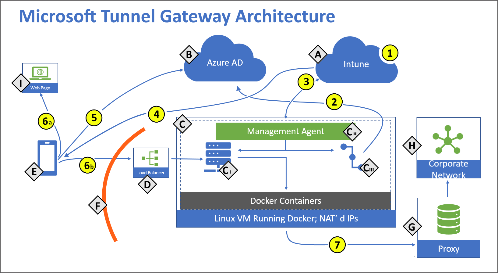

# Microsoft Tunnel for Microsoft Intune

Microsoft Tunnel is a VPN gateway solution for Microsoft Intune that runs in a container on Linux and allows access to on-premises resources from iOS/iPadOS and Android Enterprise devices using modern authentication and Conditional Access.

This article introduces the tunnel, how it works, and its architecture.

If you're ready to deploy the Microsoft Tunnel, see [Prerequisites for the Microsoft Tunnel](microsoft-tunnel-prerequisites.md), and then [Configure the Microsoft Tunnel](microsoft-tunnel-configure.md).

> [!TIP]
> Download the Microsoft Tunnel Deployment Guide v2 from the [*Microsoft Download Center*](https://www.microsoft.com/download/details.aspx?id=102274).

## Overview of Microsoft Tunnel

Microsoft Tunnel Gateway installs onto a container that runs on a Linux server. The Linux server can be a physical box in your on-premises environment or a virtual machine that runs on-premises or in the cloud. You'll deploy a Microsoft Defender for Endpoint as the Microsoft Tunnel client app and Intune VPN profiles to your iOS and Android devices to enable them to use the tunnel to connect to corporate resources. When the tunnel is hosted in the cloud, you’ll need to use a solution like Azure ExpressRoute to extend your on-premises network to the cloud.

Through the Microsoft Endpoint Manager admin center, you’ll:

- Download the Microsoft Tunnel installation script that you’ll run on the Linux servers.
- Configure aspects of Microsoft Tunnel Gateway like IP addresses, DNS servers, and ports.
- Deploy VPN profiles to devices to direct them to use the tunnel.
- Deploy the Microsoft Tunnel client apps to your devices.

Through the Defender for Endpoint app, iOS/iPadOS and Android Enterprise devices:

- Use Azure Active Directory (Azure AD) to authenticate to the tunnel.
- Use Active Directory Federation Services (AD FS) to authenticate to the tunnel.
- Are evaluated against your Conditional Access policies. If the device isn’t compliant, then it won’t have access to your VPN server or your on-premises network.

You can install multiple Linux servers to support Microsoft Tunnel, and combine servers into logical groups called *Sites*. Each server can join a single Site. When you configure a Site, you’re defining a connection point for devices to use when they access the tunnel. Sites require a *Server configuration* that you’ll define and assign to the Site. The Server configuration is applied to each server you add to that Site, simplifying the configuration of more servers.

To direct devices to use the tunnel, you create and deploy a VPN policy for Microsoft Tunnel. This policy is a device configuration VPN profile that uses Microsoft Tunnel for its connection type.

  > [!Important]
  > Prior to support for using Microsoft Defender for Endpoint as the tunnel client app on Android and iOS devices, a standalone tunnel client app was available in preview and used a connection type of **Microsoft Tunnel (standalone client)(preview)**.
  > 
  > For Android:  
  > - As of June 14 2021, both the standalone tunnel app and standalone client connection type are deprecated and drop from support after January 31, 2022.
  >
  > For iOS/iPadOS:  
  > - On April 29, 2022 both the *Microsoft Tunnel* connection type and *Microsoft Defender for Endpoint* as the tunnel client app became generally available. With this general availability, the use of the *Microsoft Tunnel (standalone client)(preview)* connection type and the standalone tunnel client app are deprecated and soon will drop from support.  
  >   - On July 29, 2022, the  standalone tunnel client app will no longer be available for download. Only the generally available version of *Microsoft Defender for Endpoint* will be available as the tunnel client app.  
  >   - On August 1, 2022, the *Microsoft Tunnel (standalone client) (preview)* connection type will cease to connect to Microsoft Tunnel.  
  >
  >   To avoid a disruption in service for Microsoft Tunnel, plan to migrate your use of the deprecated tunnel client app and connection type to those that are now generally available.

Features of the VPN profiles for the tunnel include:

- A friendly name for the VPN connection that your end users will see.
- The site that the VPN client connects to.
- Per-app VPN configurations that define which apps the VPN profile is used for, and if it's always-on or not. When always-on, the VPN will automatically connect and is used only for the apps you define. If no apps are defined, the always-on connection provides tunnel access for all network traffic from the device.
- Manual connections to the tunnel when a user launches the VPN and selects *Connect*.
- On-demand VPN rules that allow use of the VPN when conditions are met for specific FQDNs or IP addresses. (iOS/iPadOS)
- Proxy support (iOS/iPadOS, Android 10+)

Server configurations include:

- IP address range – The IP addresses that are assigned to devices that connect to a Microsoft Tunnel.
- DNS servers – The DNS server devices should use when they connect to the server.
- DNS suffix search.
- Split tunneling rules – Up to 500 rules shared across include and exclude routes. For example, if you create 300 include rules, you can then have up to 200 exclude rules.
- Port – The port that Microsoft Tunnel Gateway listens on.

Site configuration includes:

- A public IP address or FQDN, which is the connection point for devices that use the tunnel. This address can be for an individual server or the IP or FQDN of a load-balancing server.
- The Server configuration that is applied to each server in the Site.

You assign a server to a Site at the time you install the tunnel software on the Linux server. The installation uses a script that you can download from within the admin center. After starting the script, you’ll be prompted to configure its operation for your environment, which includes specifying the Site the server will join.

To use the Microsoft Tunnel, devices will need to install the Microsoft Defender for Endpoint app. You get the applicable app from the iOS/iPadOS or Android app stores and deploy it to users.

## Architecture

The Microsoft Tunnel Gateway runs in containers that run on Linux servers.  

  
**Components**:  
- **A** – Microsoft Intune.
- **B**- Azure Active Directory (AD).
- **C** – Linux server with Podman or Docker CE (See the [Linux server](../protect/microsoft-tunnel-prerequisites.md#linux-server) requirements for details about which versions require Podman or Docker) 
  - **C.1** - Microsoft Tunnel Gateway.
  - **C.2** – Management Agent.
  - **C.3** – Authentication plugin – Authorization plugin, which authenticates with Azure AD.
- **D** – Public facing IP or FQDN of the Microsoft Tunnel, which can represent a load balancer.
- **E** – Mobile Device Management (MDM) enrolled device.
- **F** – Firewall
- **G** – Internal Proxy Server (optional).
- **H** – Corporate Network.
- **I** – Public internet.

**Actions**:  
- **1** - Intune administrator configures *Server configurations* and *Sites*, Server configurations are associated with Sites.
- **2** - Intune administrator installs Microsoft Tunnel Gateway and the authentication plugin authenticates Microsoft Tunnel Gateway with Azure AD. Microsoft Tunnel Gateway server is assigned to a site.
- **3** - Management Agent communicates to Intune to retrieve your server configuration policies, and to send telemetry logs to Intune.  
- **4** - Intune administrator creates and deploys VPN profiles and the Defender app to devices.  
- **5** - Device authenticates to Azure AD. Conditional Access policies are evaluated.  
- **6** - With split tunnel:  
  - **6.a** - Some traffic goes directly to the public internet.  
  - **6.b** - Some traffic goes to your public facing IP address for the Tunnel. The VPN channel will use TCP, TLS, UDP, and DTLS over port 443. This requires inbound and outbound [Firewall ports](../protect/microsoft-tunnel-prerequisites.md#firewall) to be open
- **7** - The Tunnel routes traffic to your internal proxy (optional) and/or your corporate network. IT Admins must ensure that traffic from the Tunnel Gateway server internal interface can successfully route to internal corporate resource (IP address ranges and ports).

> [!NOTE]  
>
> - Tunnel gateway maintains two channels with the client. A control channel is established over TCP, and TLS. This also serves as a backup data channel. It then looks to establish a UDP channel using DTLS (Datagram TLS, an implementation of TLS over UDP) that serves as the main data channel. If the UDP channel fails to establish or is temporarily unavailable, the backup channel over TCP/TLS is used. By default port 443 is used for both TCP and UDP, but this can be customized via the Intune Server Configuration - [*Server port* setting](../protect/microsoft-tunnel-configure.md#create-a-server-configuration). If changing the default port (443) ensure your inbound firewall rules are adjusted to the custom port.
>
> - The assigned client IP addresses (the *IP address range* setting in a [Server configuration](../protect/microsoft-tunnel-configure.md#to-create-a-server-configuration) for Tunnel) are not visible to other devices on the network. Microsoft Tunnel Gateway uses port address translation (PAT). PAT is a type of network address translation (NAT) where multiple private IP addresses from the Server configuration are mapped into a single IP (many-to-one) by using ports. Client traffic will have the source IP address of the Linux server host.

**Break and inspect**:

Many enterprise networks enforce network security for internet traffic using technologies like proxy servers, firewalls, SSL break and inspect, deep packet inspection, and data loss prevention systems. These technologies provide important risk mitigation for generic internet requests but can dramatically reduce performance, scalability, and the quality of end user experience when applied to Microsoft Tunnel Gateway and Intune service endpoints.

The following outlines where break and inspect is not supported and where it is supported with Microsoft Tunnel Gateway. References are to the architecture diagram from the preceding section.

- **Break and inspect is not supported in the following areas**:

  - Tunnel Gateway does not support SSL break and inspect, TLS break and inspect, or deep packet inspection for client connections.
  - The Use of firewalls, proxies, load balancers, or any technology that terminates and inspects the client sessions that go into the Tunnel Gateway is not supported and will cause clients connections to fail. (Refer to **F**, **D**, and **C** in the Architecture diagram).
  - If Tunnel Gateway uses an outbound proxy for internet access, the proxy server cannot perform break and inspect. This is because Tunnel Gateway Management Agent uses TLS mutual authentication when connecting to Intune (Refer to **3** in the Architecture diagram above). If break and inspect is enabled on the proxy server, network admins that manage the proxy server must add the Tunnel Gateway server IP address and Fully Qualified Domain Name (FQDN) to an approve-list to these [Intune endpoints](../fundamentals/intune-endpoints.md#access-for-managed-devices).

- **Break and inspect is supported in the following area**:

  The Microsoft Tunnel [client VPN profile](../protect/microsoft-tunnel-configure.md#create-a-vpn-profile) that gets delivered to mobile clients supports a proxy configuration. If using this setting, the proxy (Refer to **G** in the Architecture diagram) specified can use “Break and Inspect” on the client traffic routed out (refer to **7** in the Architecture diagram) of the Tunnel Gateway server to the corporate network.

**Additional details**:

- Conditional Access is done in the VPN client and based on the cloud app *Microsoft Tunnel Gateway*. Non-compliant devices won’t receive an access token from Azure AD and can't access the VPN server. For more information about using Conditional Access with Microsoft Tunnel, see [Use Conditional Access with the Microsoft Tunnel](microsoft-tunnel-conditional-access.md).

- The Management Agent is authorized against Azure AD using Azure app ID/secret keys.

## Next steps

[Prerequisites for the Microsoft Tunnel in Intune](microsoft-tunnel-prerequisites.md)
