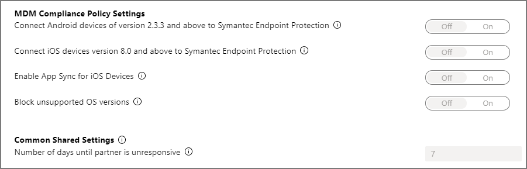

---
# required metadata

title: Enable Mobile Threat Defense connector in Microsoft Intune
titleSuffix: Microsoft Intune
description: Enable the connector between your Mobile Threat Defense (MTD) partner and Microsoft Intune.
keywords:
author: brenduns
ms.author: brenduns
manager: dougeby
ms.date: 11/19/2019
ms.topic: conceptual
ms.service: microsoft-intune
ms.subservice: protect
ms.localizationpriority: high
ms.technology:
ms.assetid: dbb6a37e-ba47-4b69-922c-d25e66c279f6

# optional metadata

#ROBOTS:
#audience:
#ms.devlang:
ms.reviewer: davidra
ms.suite: ems
search.appverid: MET150
#ms.tgt_pltfrm:
ms.custom: intune-azure
ms.collection: M365-identity-device-management
---

# Enable the Mobile Threat Defense connector in Intune

During Mobile Threat Defense (MTD) setup, you've configured a policy for classifying threats in your Mobile Threat Defense partner console and you've created the device compliance policy in Intune. If you've already configured the Intune connector in the MTD partner console, you can now enable the MTD connection for MTD partner applications.

> [!NOTE]
> This topic applies to all Mobile Threat Defense partners.

## Classic conditional access policies for MTD apps

When you integrate a new application to Intune Mobile Threat Defense and enable the connection to Intune, Intune creates a classic conditional access policy in Azure Active Directory. Each MTD app you integrate, including [Defender ATP](advanced-threat-protection.md) or any of our additional [MTD partners](mobile-threat-defense.md#mobile-threat-defense-partners), creates a new classic conditional access policy. These policies can be ignored, but shouldn't be edited, deleted, or disabled.

If the classic policy is deleted, you'll need to delete the connection to Intune that was responsible for its creation, and then set it up again. This process recreates the classic policy. It's not supported to migrate classic policies for MTD apps to the new policy type for conditional access.

Classic conditional access policies for MTD apps:

- Are used by Intune MTD to require that devices are registered in Azure AD so that they have a device ID before communicating to MTD partners. The ID is required so that devices and can successfully report their status to Intune.

- Have no effect on any other Cloud apps or Resources.

- Are distinct from conditional access policies you might create to help manage MTD.

- By default, don’t interact with other conditional access policies you use for evaluation.

To view classic conditional access policies, in [Azure](https://portal.azure.com/#home), go to **Azure Active Directory** > **Conditional Access** > **Classic policies**.

## To enable the Mobile Threat Defense connector

1. Sign in to the [Microsoft Endpoint Manager Admin Center](https://go.microsoft.com/fwlink/?linkid=2109431).

2. Select **Tenant administration** > **Connectors and tokens** > **Mobile Threat Defense**.

3. On the **Mobile Threat Defense** pane, select **Add**.

4. For **Mobile Threat Defense connector to setup**, select your MTD solution from the drop-down list.

5. Enable the toggle options according to your organization's requirements. Toggle options visible will vary depending on the MTD partner.  For example, the following image shows the options that are available for Symantec Endpoint Protection:

   

## Mobile Threat Defense toggle options

You can decide which MTD toggle options you need to enable according to your organization's requirements. Not all of the following options are supported by all Mobile Thread Defense partners:

**MDM Compliance Policy Settings**

- **Connect Android devices of version _\<supported versions>_ to _\<MTD partner name>_**: When you enable this option, you can have Android 4.1+ devices reporting security risk back to Intune.

- **Connect iOS devices version _\<supported versions>_ to _\<MTD partner name>_**: When you enable this option, you can have iOS 8.0+ devices reporting security risk back to Intune.

- **Enable App Sync for iOS Devices**: Allows this Mobile Threat Defense partner to request metadata of iOS applications from Intune to use for threat analysis purposes.

- **Block unsupported OS versions**: Block if the device is running an operating system less than the minimum supported version.

**App Protection Policy Settings**

- **Connect Android devices of version *\<supported versions>* to *\<MTD partner name>* for app protection policy evaluation**: When you enable this option, app protection policies using the Device Threat Level rule will evaluate devices including data from this connector.

- **Connect iOS devices version *\<supported versions>* to *\<MTD partner name>* for app protection policy evaluation**: When you enable this option, app protection policies using the Device Threat Level rule will evaluate devices including data from this connector.

To learn more about using Mobile Threat Defense connectors for Intune App Protection Policy evaluation, see [Set up Mobile Threat Defense for unenrolled devices](~/protect/mtd-enable-unenrolled-devices.md).

**Common Shared Settings**

- **Number of days until partner is unresponsive**: Number of days of inactivity before Intune considers the partner to be unresponsive because the connection is lost. Intune ignores compliance state for unresponsive MTD partners.

> [!IMPORTANT]
> When possible, we recommend that you add and assign the MTD apps before creating the device compliance and the Conditional Access policy rules. This helps ensures that the MTD app is ready and available for end users to install before they can get access to email or other company resources.

> [!TIP]
> You can see the **Connection status** and the **Last synchronized** time between Intune and the MTD partner from the Mobile Threat Defense pane.

## Next steps

- [Create Mobile Threat Defense (MTD) app protection policy with Intune](~/protect/mtd-app-protection-policy.md).
