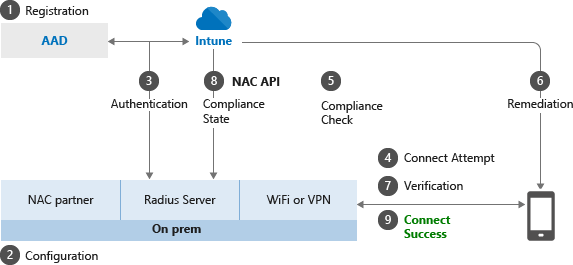

---
# required metadata

title: Network access control integration with Microsoft Intune
description: Network access control (NAC) solutions check enrollment and compliance for devices with Intune. NAC includes certain behaviors and works with Conditional Access. See the steps to get onboarded, and get a list of partner solutions.
keywords:
author: brenduns
ms.author: brenduns
manager: dougeby
ms.date: 08/15/2022
ms.topic: how-to
ms.service: microsoft-intune
ms.subservice: protect
ms.localizationpriority: high
ms.technology:
ms.assetid: aa7ecff7-8579-4009-8fd6-e17074df67de

# optional metadata

#ROBOTS:
#audience:

ms.reviewer: tycast
ms.suite: ems
search.appverid: MET150
#ms.tgt_pltfrm:
ms.custom: intune-azure
ms.collection: 
- M365-identity-device-management
- tier3
---

# Network access control (NAC) integration with Intune

Intune integrates with network access control (NAC) partners to help organizations secure corporate data when devices try to access on-premises resources.

>[!NOTE]
> A new NAC service was released in July 2021 and many of our NAC partners are transitioning to this new service. Currently, the following NAC partner product supports the new NAC service:
>
> - Cisco ISE 3.1 and later
> - Citrix Gateway 13.0-84.11 and later
> - Citrix Gateway 13.1-12.50 and later
> - F5 BIG-IP Access Policy Manager 14.1.5.2 and later
> - F5 BIG-IP Access Policy Manager 15.1.7 and later
> - F5 BIG-IP Access Policy Manager 16.1.3.1 and later
> - F5 BIG-IP Access Policy Manager 17.0 and later
> - Ivanti Connect Secure 9.1R16 and later
>
> Contact your NAC partner if you have questions on the impact of this transition. For more information, see our [blog post on the new compliance retrieval service](https://aka.ms/new-compliance-retrieval-api/).

## How do Intune and NAC solutions help protect your organization resources?

NAC solutions check the device enrollment and compliance state with Intune to make access control decisions. If the device isn't enrolled, or is enrolled and not compliant with Intune device compliance policies, then the device should be redirected to Intune for enrollment, or for a device compliance check.

### Example

If the device is enrolled and compliant with Intune, the NAC solution should allow the device access to corporate resources. For example, users can be allowed or denied access when trying to access corporate Wi-Fi or VPN resources.

## Feature behaviors

Devices that are actively syncing to Intune can't move from **Compliant** / **Noncompliant** to **Not Synced** (or **Unknown**). The **Unknown** state is reserved for newly enrolled devices that haven't been evaluated for compliance yet.

For devices that are blocked from access to resources, the blocking service should redirect all users to the [management portal](https://portal.manage.microsoft.com) to determine why the device is blocked.  If the users visit this page, their devices are synchronously reevaluated for compliance.

## NAC and Conditional Access

NAC works with Conditional Access to provide access control decisions. For more information, see [Common ways to use Conditional Access with Intune](conditional-access-intune-common-ways-use.md).

## How the NAC integration works

The following list is an overview on how NAC integration works when integrated with Intune. The first three steps, 1-3, explain the onboarding process. Once the NAC solution is integrated with Intune, steps 4-9 describe the ongoing operation.

1. Register the NAC partner solution with Azure Active Directory (Azure AD), and grant delegated permissions to the Intune NAC API.
2. Configure the NAC partner solution with the appropriate settings including the Intune discovery URL.
3. Configure the NAC partner solution for certificate authentication.
4. User connects to corporate Wi-Fi access point or makes a VPN connection request.
5. NAC partner solution forwards the device information to Intune, and asks Intune about the device enrollment and compliance state.
6. If the device isn't compliant or isn't enrolled, the NAC partner solution instructs the user to enroll or fix the device compliance.
7. The device tries to reverify its compliance and enrollment state when applicable.
8. Once the device is enrolled and compliant, NAC partner solution gets the state from Intune.
9. Connection is successfully established which allows the device access to corporate resources.

> [!NOTE] 
> NAC partner solutions will typically make two different types of query to Intune to ask about device compliance state:
> 
> - Queries filtering based on a known property value of a single device such as its IMEI or Wi-Fi MAC address
> - Broad, unfiltered queries for all non-compliant devices.
>
> NAC Solutions are permitted to make as many of the device-specific queries as required.  However the broad unfiltered queries may be throttled. The NAC solution should be configured to only submit the *all non-compliant devices* queries, at most, once every four hours. Queries made more frequently will receive an http 503 error from the Intune service.

## Enable NAC

To enable use of NAC and the *compliance retrieval service* that became available in July 2021, reference your NAC product's most recent documentation for enabling NAC integration with Intune. This integration might require you to make changes after you upgrade to their new NAC product or version.

The compliance retrieval service requires certificate-based authentication and the use of the *Intune device ID* as the subject alternative name of the certificates. For Simple Certificate Enrollment Protocol (SCEP) and Private and public key pair (PKCS) certificates, you can add an attribute of the **URI** type with a value defined by your NAC provider. For example, your NAC provider's instructions might say to include `IntuneDeviceId://{{DeviceID}}`as the **Subject alternative name**.

Other NAC products might require you include a device ID when using NAC with iOS VPN profiles.

To learn more about certificate profiles, see: [Use SCEP certificate profiles with Microsoft Intune](../protect/certificates-profile-scep.md) and [Use a PKCS certificate profile to provision devices with certificates in Microsoft Intune](../protect/certificates-pfx-configure.md)

## Data shared with NAC partners

The specific device properties that are shared with NAC partners depend on the version of the NAC API the NAC product uses. Contact your NAC partner for more information on which version of the NAC or Compliance Retrieval API your NAC product uses.

Also, the data returned will be limited if:
- The device isn't enrolled in Intune. In this case, no information other than that the device isn't managed by Intune will be shared with the NAC product.
- The OS prevents the specific device property from being shared with Microsoft. Intune will share empty values back to the NAC product for data properties not shared with Intune by the OS.

| Device property | Available in NAC 1.0 | Available in NAC 1.1 | Available in NAC 1.3 | Available in Compliance Retrieval/NAC 2.0 |
|--|--|--|--|--|
| Compliance state | Yes | Yes | Yes | Yes |
| Managed by Intune | Yes | Yes | Yes | Yes |
| Personal or corporate ownership | No | Yes | Yes | No |
| MAC address | Yes | Yes | Yes | No |
| Serial number | Yes | Yes | Yes | No |
| IMEI | Yes | Yes | Yes | No |
| UDID | Yes | Yes | Yes | No |
| MEID | Yes | Yes | Yes | No |
| OS version | Yes | Yes | Yes | No |
| Device model | Yes | Yes | Yes | No |
| Manufacturer | Yes | Yes | Yes | No |
| Azure Active Directory device ID | Yes | Yes | Yes | No |
| Last contact time with Intune | Yes | Yes | Yes | No |
| Intune device ID | No | No | No | Yes |

## Next steps

- [Integrate Cisco ISE with Intune](https://www.cisco.com/c/en/us/td/docs/security/ise/UEM-MDM-Server-Integration/b_MDM_UEM_Servers_CiscoISE/chapter.html#task_og1_5zx_cqb)
- [Integrate Citrix Gateway with Intune](https://docs.citrix.com/en-us/citrix-gateway/current-release/microsoft-intune-integration/configuring-network-access-control-device-check-for-citrix-gateway-virtual-server-for-single-factor-authentication-deployment.html)
- [Integrate F5 BIG-IP Access Policy Manager with Intune](https://techdocs.f5.com/en-us/edge-client-7-1-8/big-ip-access-policy-manager-edge-client-and-application-configuration-7-1-8/configuring-access-policy-manager-for-mdm-applications.html)
- [Integrate HP Aruba ClearPass with Intune](https://support.arubanetworks.com/Documentation/tabid/77/DMXModule/512/Command/Core_Download/Default.aspx?EntryId=31271)
- [Integrate Squadra security Removable Media Manager (secRMM) with Intune](https://www.squadratechnologies.com/StaticContent/ProductDownload/secRMM/9.10.0.0/secRMMIntune.pdf)
