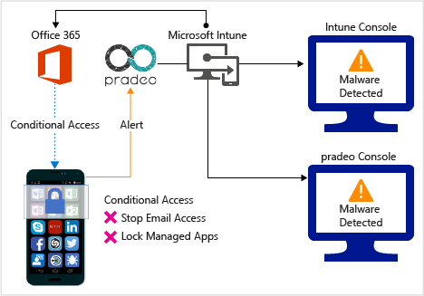
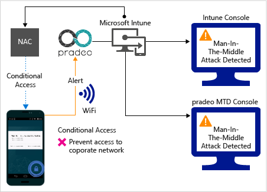
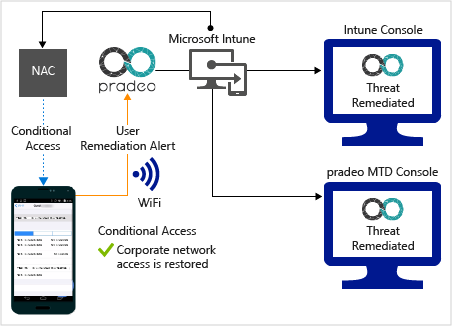
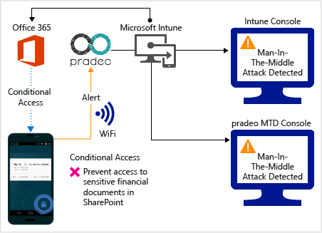
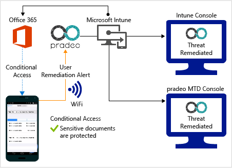
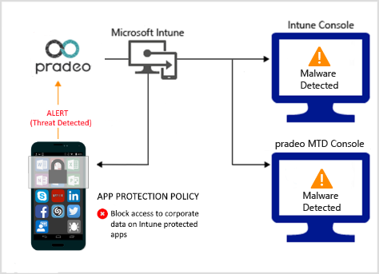
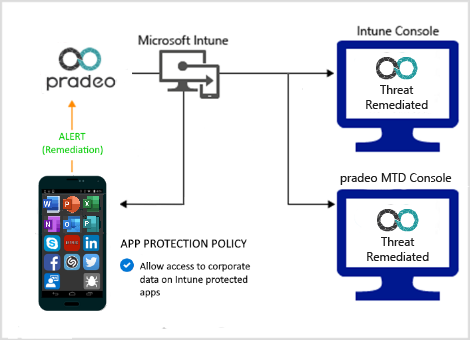

---
# required metadata

title: Pradeo Mobile Threat Defense connector with Intune
titleSuffix: Intune on Azure
description: Learn how to integrate Intune with Pradeo Mobile Threat Defense connector to control mobile device access to your corporate resources.
keywords:
author: brenduns
ms.author: brenduns
manager: dougeby
ms.date: 03/09/2020
ms.topic: how-to
ms.service: microsoft-intune
ms.subservice: protect
ms.localizationpriority: high
ms.technology:
ms.assetid: cde4d389-1770-4226-85a3-a2f3b3fb92a3

# optional metadata

#ROBOTS:
#audience:
#ms.devlang:
ms.reviewer: aanavath
#ms.suite: ems
search.appverid: MET150
#ms.tgt_pltfrm:
#ms.custom:
ms.collection: M365-identity-device-management
---

# Pradeo Mobile Threat Defense connector with Intune

You can control mobile device access to corporate resources using Conditional Access based on risk assessment conducted by Pradeo, a Mobile Threat Defense (MTD) solution that integrates with Microsoft Intune. Risk is assessed based on telemetry collected from devices running the Pradeo app.

You can configure Conditional Access policies based on Pradeo risk assessment enabled through Intune device compliance policies, which you can use to allow or block noncompliant devices to access corporate resources based on detected threats.

> [!NOTE]
> This Mobile Threat Defense vendor is not supported for unenrolled devices.

## Supported platforms

- **Android 4.0.3 and later**

- **iOS 7 and later**

## Prerequisites

- Azure Active Directory Premium

- Microsoft Intune subscription

- Pradeo Security for Mobile Threat Defense subscription

  - For more information, see the [Pradeo website](https://www.pradeo.com/en-US/mobile-threat-protection).

## How do Intune and Pradeo help protect your company resources?

Pradeo app for Android and iOS/iPadOS captures file system, network stack, device, and application telemetry where available, and then sends the telemetry data to the Pradeo cloud service to assess the device's risk for mobile threats.

The Intune device compliance policy includes a rule for Pradeo Mobile Threat Defense, which is based on the Pradeo risk assessment. When this rule is enabled, Intune evaluates device compliance with the policy that you enabled. If the device is found noncompliant, users are blocked access to corporate resources like Exchange Online and SharePoint Online. Users also receive guidance from the Pradeo app installed in their devices to resolve the issue and regain access to corporate resources.

## Sample scenarios

Here are some common scenarios.

### Control access based on threats from malicious apps

When malicious apps such as malware are detected on devices, you can block devices from the following actions until the threat is resolved:

- Connecting to corporate e-mail

- Syncing corporate files with the OneDrive for Work app

- Accessing company apps

*Block when malicious apps are detected:*

*Access granted on remediation:*

### Control access based on threat to network

Detect threats to your network like **Man-in-the-middle** attacks, and protect access to Wi-Fi networks based on the device risk.

*Block network access through Wi-Fi:*

*Access granted on remediation:*

### Control access to SharePoint Online based on threat to network

Detect threats to your network like **Man-in-the-middle** attacks, and prevent synchronization of corporate files based on the device risk.

*Block SharePoint Online when network threats are detected:*

*Access granted on remediation:*

<!-- 
### Control access on unenrolled devices based on threats from malicious apps

When the Pradeo Mobile Threat Defense solution considers a device to be infected:

Access is granted on remediation:

-->

## Next steps

- [Integrate Pradeo with Intune](pradeo-mtd-connector-integration.md)

- [Set up Pradeo apps](mtd-apps-ios-app-configuration-policy-add-assign.md)

- [Create Pradeo device compliance policy](mtd-device-compliance-policy-create.md)

- [Enable Pradeo MTD connector](mtd-connector-enable.md)
